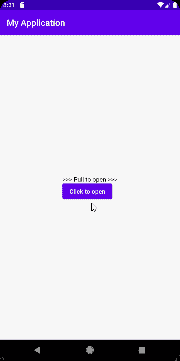
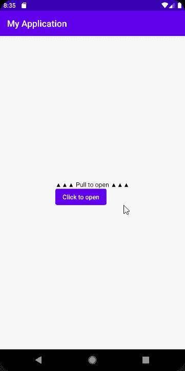
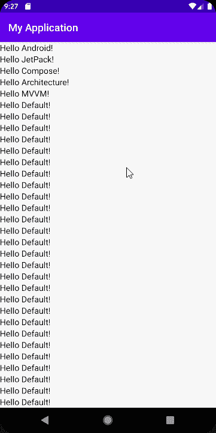
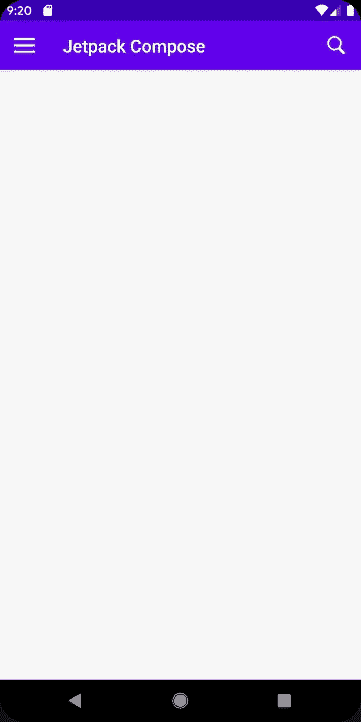

# 来自 Jetpack Compose 的有趣更新

> 原文：<https://betterprogramming.pub/interesting-updates-from-jetpack-compose-48b79e7d2d8a>

## 与我一起在 Jetpack 中开发


由[openclipbart-Vectors](https://pixabay.com/users/openclipart-vectors-30363/)在 [Pixabay](https://www.needpix.com/photo/93659/jetpack-fly-man-science-free-vector-graphics) 上插画

> “Jetpack Compose 是一个用于构建原生 Android UI 的现代工具包。Jetpack Compose 以更少的代码、强大的工具和直观的 Kotlin APIs 简化并加速了 Android 上的 UI 开发。”— [安卓开发者](https://developer.android.com/jetpack/compose/tutorial)

最近，我有时间尝试 Jetpack Compose 的一些新功能。它还没有准备好投入生产，但它在每个版本中都有所改进。使用 Kotlin 开发 ui 比我想象的要有趣得多。最近发布了 Jetpack Compose 的新版本(0 . 1 . 0-dev 04)；这里可以看到详细的(Compose)这里可以看到(Compose UI)。

Jetpack Compose 是一个广阔的宇宙，所以我们不能在一篇文章中写所有的内容。这是我探索 Jetpack Compose 系列的第三篇文章。我强烈推荐你阅读以下文章。这不是强制性的，但会有帮助。

[](https://medium.com/better-programming/jetpack-compose-a-new-and-simple-way-to-create-material-ui-in-android-f49c6fcb448b) [## jetpack Compose——一种在 Android 中创建材质界面的简单新方法

### 了解如何创建没有任何 XML 文件的用户界面

medium.com](https://medium.com/better-programming/jetpack-compose-a-new-and-simple-way-to-create-material-ui-in-android-f49c6fcb448b) [](https://medium.com/better-programming/deep-dive-into-jetpack-compose-b09713760019) [## 深入了解 Jetpack Compose

### 设计 Kotlin-first UI 套件

medium.com](https://medium.com/better-programming/deep-dive-into-jetpack-compose-b09713760019) 

介绍到此为止，让我们进入正题吧。

在本文中，我们将学习如何在 Jetpack Compose 中实现以下功能:

1.  点击事件
2.  导航抽屉
3.  可滚动列表(垂直和水平)
4.  AppBars

由于 Compose 仍处于开发版本，我们应该利用这一点，从头开始学习。这样，当它可以生产时，我们就可以很容易地创建定制视图，并在架构级开发中使用它。

# 1.点击事件

在我们目前的生态系统(XML 和类文件)中，处理点击事件是一项简单的任务，Jetpack Compose 也是如此。但是我们的主要目的是了解事物内部是如何工作的。

要知道这一点，首先我们应该探究一下点击事件的方法签名(`Clickable`)。看一看:

第一个问题:我们已经有了`onClick`，为什么还要用`clickable`？在 Compose 中，只有一些组件，比如按钮，可以进行点击事件访问——至少目前是这样。首先，让我们看看如何在按钮上执行点击事件。看一看:

执行一个点击事件非常容易，但是并非所有的组件都是如此。例如，`TextView`不能访问点击事件。这就是我们上面提到的`clickable`有用的地方。

`Clickable`仅提供点击事件，与触摸事件无关。为了观察触摸事件，我们应该将`Clickable`包装在`Ripple`组件中，并且还需要将`consumeDownOnStart`改为`false`。现在回到`Clickable`，我们必须写下在`clickable` 组件的`onClick` 功能下点击时需要发生什么。

看一看:

使用`Clickable`，我们可以在 Jetpack Compose 中的任何组件上执行点击事件。当您在定制视图上工作时，这对于实现点击事件是很方便的。

# 2.导航抽屉

此时，JetPack Compose 有三个抽屉:`ModalDrawerLayout`、`BottomDrawerLayout`和`StaticDrawer`用于平板电脑(就像平板电脑上 Gmail 应用程序中连续打开的那个)。

## ModalDrawerLayout

`ModalDrawerLayout`用于实现一个标准的导航抽屉。首先，我们来看看函数签名。

我们来看看参数:`drawerState`表示导航抽屉的状态(`open` / `close`)。

`onStateChange`是一个 lambda，指示何时请求改变抽屉状态，如刷卡。

`gesturesEnabled`用于查看是否可以通过手势进入抽屉。

`drawerContent`和`bodyContent`是两个可组合的函数，用来表示抽屉中的用户界面。现在，让我们看看如何使用它。

看看基本布局的输出:



## BottomDrawerLayout

`BottomDrawerLayout`用于实现底板。首先，我们来看看函数签名。

我们可以看到`ModalDrawerLayout`和`BottomDrawerLayout`都有相同的签名。毕竟，两者的核心都代表抽屉。我们来看看`BottomDrawerLayout`的用法。

现在，让我们看看输出。



## 静态抽屉

正如我所说的，`StaticDrawer`没有滑动动作；是静态布局。所以函数签名很简单。看一看:

```
@Composable
fun StaticDrawer(
    drawerContent: @Composable() () -> Unit
)
```

用法也非常简单。看一看:

首先，我们使用`row`来划分抽屉和应用程序其余部分的屏幕。然后，我们在左边使用了`StaticDrawer`,并在抽屉和应用程序的其余部分之间使用了一个分隔线。

# 3.可滚动列表(垂直和水平)

Jetpack Compose 团队在保持简单性方面做得很好。我们都知道如何用 XML 实现`scrollview`。它只是一个带有所有可滚动视图的标签和根布局。

使用 Jetpack Compose，实现可滚动视图更加简单。首先，我们来看看函数签名。

像任何其他带有`modifier`的组件一样，我们更新 UI，并且我们还可以使用`isScrollable`标志控制它是否可以滚动。然后，我们可以添加子视图。看一看:

是不是很酷？现在来看看输出。



我们还可以使用`HorizontalScroller`组件实现水平滚动。

# 4.AppBars

Compose 中有两个 app bars:`TopAppBar`和`BotttomAppBar`。`TopAppBar`就像 Android 中的`Toolbar`，`BottomAppBar`是我们现在生态系统中使用的底栏。

## TopAppBar

工具栏是当前 Android UI 生态系统中的重要组件之一，我们可以使用`TopAppBar`在 Compose 中实现它。在 Compose 中，实现与在 XML 中非常相似。让我们看看`TopAppBar`的函数签名。

`title`和`color`参数分别用于设置工具栏的标题和背景颜色。

`navigationIcon`用来设置工具栏的左侧图标，大多用来表示汉堡菜单。

`actionData`是像菜单一样在工具栏右侧用图标表示的图像列表；如果列表多于两个，那么它会收缩。Compose 中尚未实现菜单选项，但我们现在可以使用`actionData`在右侧设置两个图标。

现在，让我们看看实现部分。

很酷，对吧？现在，该看输出了。



## BottomAppBar

是当前构建 ui 的生态系统中使用最多的组件之一。它可以在用户的指尖显示所有选项，不需要任何额外的点击。在 Compose 中，我们使用`BottomAppBar`来实现`BottomBar`。

让我们看看方法签名:

正如我们所看到的，方法签名非常类似于`TopAppBar` — ，带有`color`、`navigationIcon`、`actionData`和`action`。

但是`BottomAppBar`比`TopAppBar`有更多的功能，包括显示 fab 图标的能力，我们可以指定剪切形状。

以下是如何在撰写中创建底部栏的简单示例:

# 结论

感谢阅读。