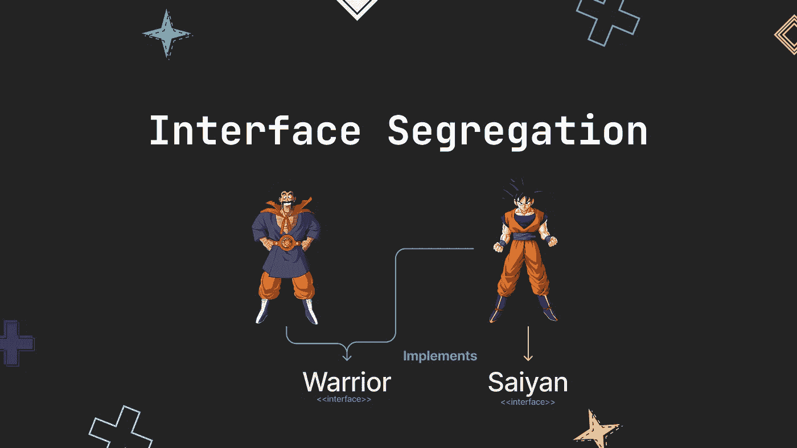
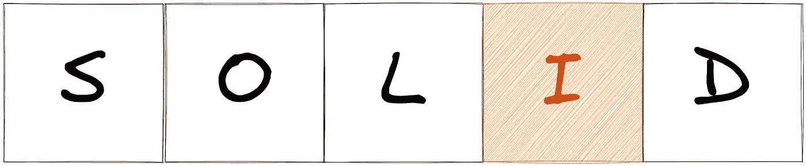
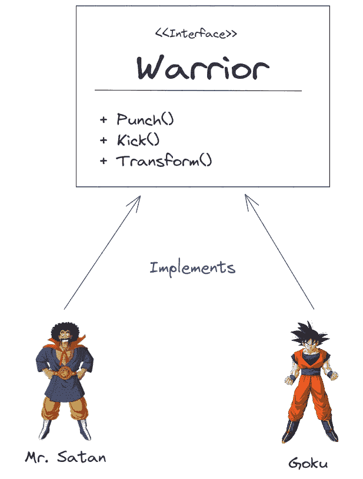
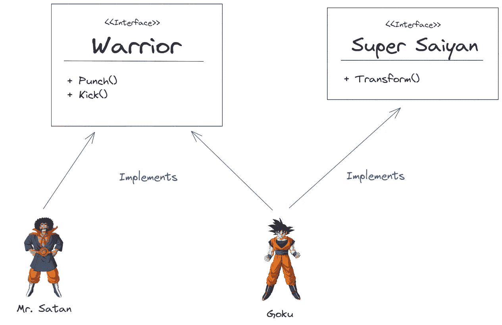

# 围棋的界面分离原理——用龙珠解释

> 原文：<https://betterprogramming.pub/interface-segregation-principle-in-golang-using-dragon-ball-example-43a26f367225>

## 了解从代码中的接口客户端移除不必要责任的原则



涉及

# 为什么

当使用接口时，你可能会发现你有一个由不同客户端实现的接口，但是我们并不是所有的客户端都需要实现接口的所有方法。这是不好的，因为你在强迫客户实现他们不需要的方法，留下这样的空方法:

```
func (c Client) MethodTheClientDontNeed() {  
    panic("implement me") 
}
```

# 什么

接口分离是坚实原则的一部分，它说的是接口的客户必须只实现他们需要的方法，否则你必须把你的接口分成更具体的接口，这样客户只实现他们需要的方法。



界面分离原理

# 怎么做

为了向您介绍这一原则，我将使用龙珠作为参考，所以让我们想象我们正在开发一个新的龙珠游戏，所以我们所做的是创建一个战士界面，该界面将由动画中的所有角色实现，在本例中是撒旦先生和小悟空:



Warrior 界面

如我们所见，撒旦先生和悟空都实现了`Warrior`接口，但如果你看过动漫，就知道悟空可以实现三种方法，但撒旦先生没有，因为他不能`Transform`。

所以在这个例子中，他将实现一个他不需要的方法——在这个例子中，这个方法将是空的。

为了避免这种情况，我们将利用隔离原则，因此我们将创建一个`Super Saiyan`接口，该接口将具有仅由悟空实现的`Transform`方法，因此我们将以如下内容结束:



现在，撒旦先生，只是实现了他需要的方法，这要感谢我们创造的新界面`Super Saiyan`，它只由小悟空实现。

正如你所看到的，最后至少有一个接口将被所有客户端实现，这个接口将作为引用我们角色的类型。

# 代码时间！

现在让我们将这些引用带入 Golang，看看代码会是什么样子。但在此之前，让我们看看如果没有这个原则会是什么样子:

定义接口`Warrior`:

```
package main

type Warrior interface {
   Kick()
   Punch()
   Transform()
}

type Warriors []Warrior

func executeWithoutISP(warriors Warriors) {
   for _, warrior := range warriors {
      warrior.Kick()
      warrior.Punch()
      warrior.Transform()
   }
}
```

添加将实现`Warrior`接口的客户端:

```
package main

type MRSatan struct{}

func NewMRSatan() *MRSatan {
   return &MRSatan{}
}

func (m MRSatan) Kick() {
   println("MRSatan kicks")
}

func (m MRSatan) Punch() {
   println("MRSatan punches")
}

// The empty method that we want to avoid
func (m MRSatan) Transform() {
   // do nothing
}
```

```
package main

type Goku struct{}

func NewGoku() *Goku {
   return &Goku{}
}

func (g Goku) Kick() {
   println("Goku kicks")
}

func (g Goku) Punch() {
   println("Goku punches")
}

func (g Goku) Transform() {
   println("Goku transforms into a Super Saiyan")  
}
```

我们发挥每个客户的能力:

```
package main

func main() {
   var warriors = Warriors{}
   warriors = append(warriors, NewMRSatan())
   warriors = append(warriors, NewGoku())

   executeWithoutISP(warriors)
}
```

当我们运行程序时，我们得到以下输出:


[https://asciinema.org/a/536786](https://asciinema.org/a/536786)

一切都运行良好，撒旦先生拳打脚踢，小悟空拳打脚踢，拳打脚踢，然后变身，但是底层代码并不尽如人意，因为撒旦先生的客户正在实现一个他并不需要的方法:

```
// The empty method that we want to avoid
func (m MRSatan) Transform() {
 // do nothing
}
```

让我们通过应用接口分离原理来解决这个问题:

现在，我们创建了`SuperSaiyan`接口，而不是只有一个接口，所以它只能由`Goku`实现:

```
package main

type Warrior interface {
   Kick()
   Punch()
}

type SuperSaiyan interface {
   Transform()
}

type Warriors []Warrior

func executeWithISP(warriors Warriors) {
   for _, warrior := range warriors {
      warrior.Kick()
      warrior.Punch()

      // For each Warrior, we check if it is a SuperSaiyan
      if superSaiyan, ok := warrior.(SuperSaiyan); ok {
         superSaiyan.Transform()
      }
   }
}
```

现在，我们的`MR. Satan`客户端将只实现`Kick`和`Pucnh`方法:

```
package main

type MRSatan struct{}

func NewMRSatan() *MRSatan {
   return &MRSatan{}
}

func (m MRSatan) Kick() {
   println("MRSatan kicks")
}

func (m MRSatan) Punch() {
   println("MRSatan punches")
}
```

我们的`Goku`客户端仍然会实现这三个方法:

```
package main

type Goku struct{}

func NewGoku() *Goku {
   return &Goku{}
}

func (g Goku) Kick() {
   println("Goku kicks")
}

func (g Goku) Punch() {
   println("Goku punches")
}

func (g Goku) Transform() {
   println("Goku transforms into a Super Saiyan")
}
```

我们的主文件和以前一样:

```
func main() {
   var warriors = Warriors{}
   warriors = append(warriors, NewMRSatan())
   warriors = append(warriors, NewGoku())

   executeWithISP(warriors)
}
```

如果我们运行这个程序，我们仍然会得到相同的响应，但是使用了更好的底层代码:


[https://asciinema.org/a/536787](https://asciinema.org/a/536787)

# 结论

ISP 是一个简单的原则，它可以帮助您在实现各种客户端使用的大型接口时，免除客户端不必要的责任，但这可能会导致您拥有无数个接口，具体取决于您要拆分的主接口有多大。在这方面，我非常小心，以我的经验来看，我只是用最多 10 种方法来分离接口，以最多 3 个对我很有效的接口结束。

# 参考

1.  [深入设计模式](https://refactoring.guru/design-patterns/book)
2.  [asci NEMA](https://asciinema.org/)记录我的终端
3.  [Excalidraw](https://excalidraw.com/) 和 [Figma](https://figma.com/) 查看图示
4.  [储存库](https://github.com/hernanhrm/interface-segregation-principal)