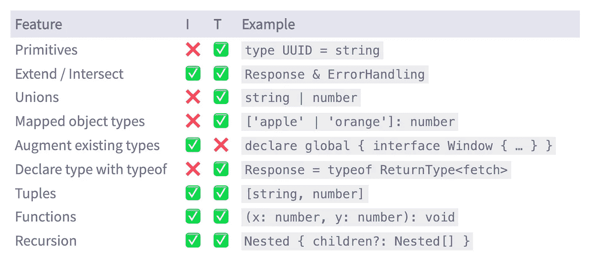
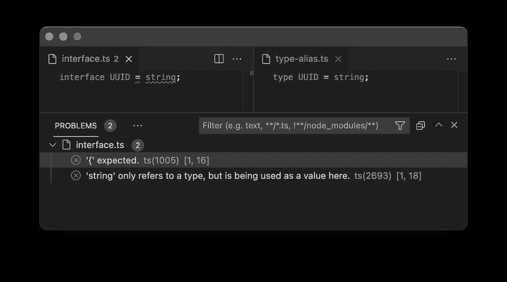
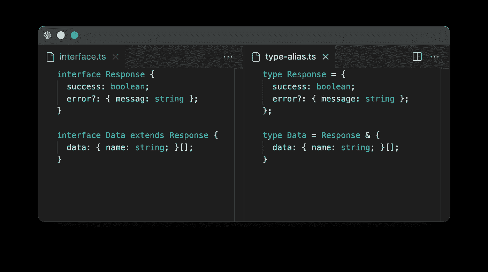
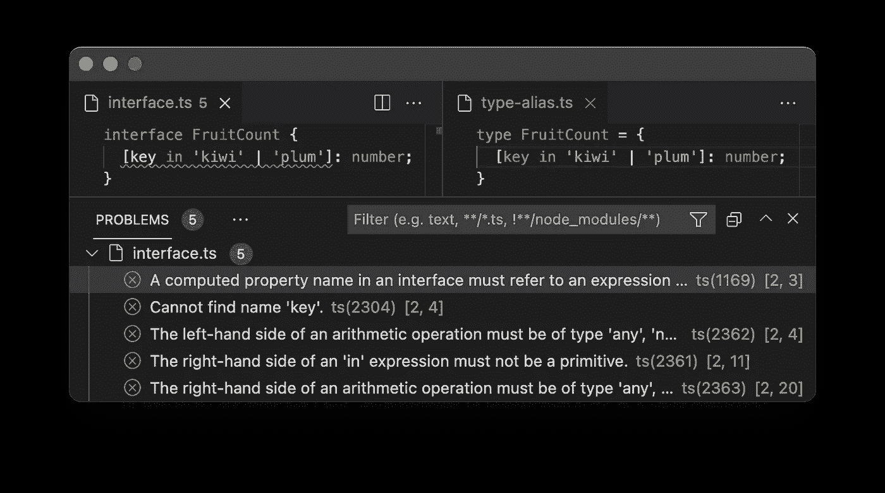
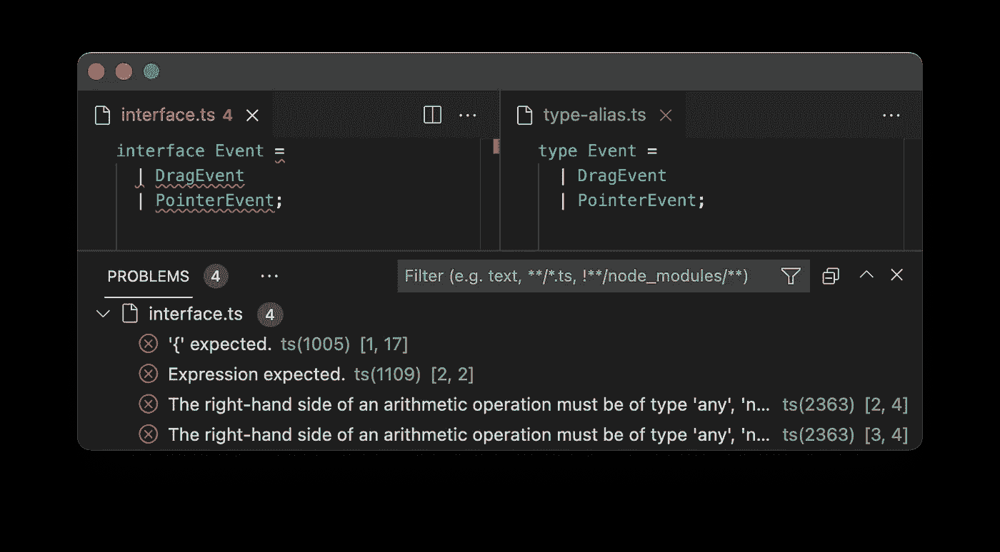
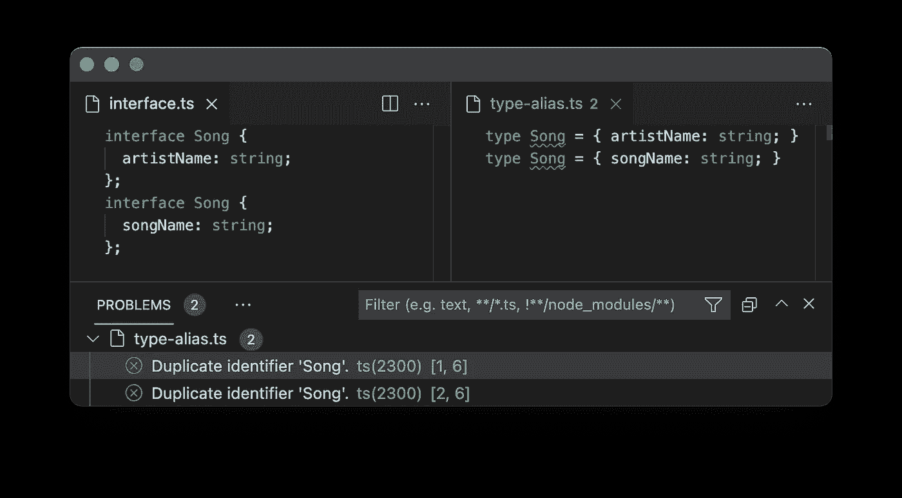
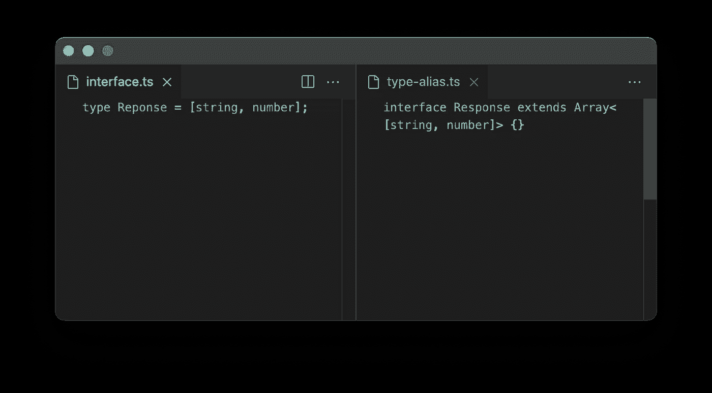
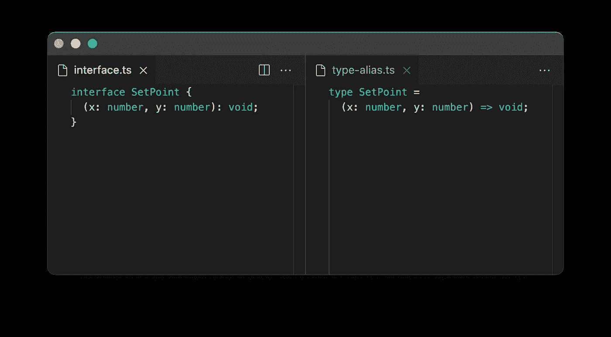
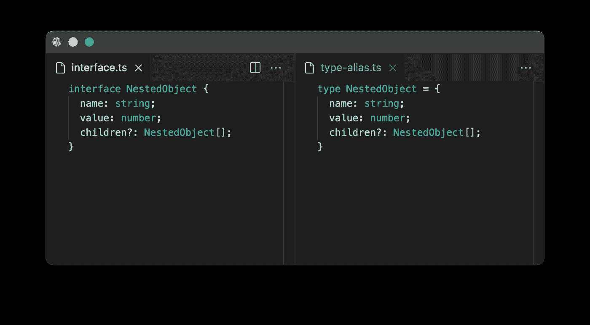

# 接口与类型脚本中的类型别名—快速比较

> 原文：<https://betterprogramming.pub/interface-vs-type-alias-in-typescript-quick-comparison-9b356fae8389>

## 概述使用类型别名和接口可以或不可以键入的 TypeScript 功能

免版税图标。作者编辑

这可能会让任何使用 TypeScript 的人——初学者或经验丰富的程序员——感到困惑。两种方式都可以覆盖类似的需求。

在这篇文章中，您将很快看到什么样的 TypeScript 特性可以实现为类型别名或接口。我保持了简短和辛辣，给了这篇文章一个概述性的特征。

👉TLDR: 你不在乎彼此的不同？你应该用什么？

> 使用`interface`直到你需要`type` — [或](https://twitter.com/orta/status/1356129195835973632)

# 概述:接口(I)与类型别名(T)

作者图片

# 基元

❌:接口
✅:式别名

`string`、`number`和`boolean`组成了 TypeScript 中的原语。

# 延伸或相交

✅:接口
✅:式别名

虽然 intersect 和 extend 对于 interface 和 type alias 来说并不是 100%相同，但是在这个例子中我把它们放在了一起。

当类型键同时出现在您希望扩展或相交的两种类型中时，就会产生差异。

因此，如果扩展键或相交键的类型不同:

*   类型别名允许您这样做，但会将该类型更改为`never`
*   接口抛出类型不兼容的错误

# 映射的对象类型

❌:接口
✅:式别名

用这个在你的对象中键入键。以下是一些有用的应用:

*   `[key: string]`:只允许字符串作为关键字
*   `[key: number]`:只允许数字作为密钥
*   `[key in keyof T as `get${Capitalize<string & key>}`]`:仅允许以`get...`开头的键，例如在 Getter 对象中看到的键

# 联合

❌:接口
✅:式别名

TypeScript 相当于`OR`:类型可以是`x`或`y`或`z`或者任意多个。

# 扩充现有类型

✅:接口
❌:式别名

您可以向现有类型添加字段。在现有类型(如`window`)上添加新字段(如`jQuery`自动完成库)时，这很有用。

# 元组

✅:接口
✅:式别名

如果您在 react 中使用过钩子，那么您就会知道元组的用处。

一个单一的函数调用可以返回一个数组的值和函数，这些值和函数是析构的，可以用作完全类型化的变量:`const [name, setName] = useState('')`

# 功能

✅:接口
✅:式别名

函数可以用参数类型和返回类型来注释。

# 递归

✅:接口
✅:式别名

递归很容易使用。确保将可选的`?`添加到递归属性中。否则，TS 编译器会在搜索无限递归时抛出一个错误。

# 更多资源

*   [打字操场](https://www.typescriptlang.org/play)
*   [react 中的类型或接口](https://github.com/typescript-cheatsheets/react#types-or-interfaces)
*   [接口 vs 类型脚本](https://stackoverflow.com/a/65948871/825444)中的类型
*   Leonardo Maldonado 的 TypeScript 中的类型与接口
*   [Martin Hochel 的 TypeScript 2.7](https://medium.com/@martin_hotell/interface-vs-type-alias-in-typescript-2-7-2a8f1777af4c) 中的接口与类型别名

觉得这个帖子有意思？看看我的推特: