# 国际化您的 Lightning Web 组件(LWC)

> 原文：<https://betterprogramming.pub/internationalizing-your-lightning-web-component-lwc-707d448c9297>

## 即使你的 LWC 现在不要求国际化，遵循 i18n 模式，保持干巴巴的合规性也无妨


Artem Beliaikin 在 [Unsplash](https://unsplash.com?utm_source=medium&utm_medium=referral) 上拍摄的照片

说每个人都至少有一个讨厌的东西并不夸张。几年前，当我看“[70 年代秀](https://en.wikipedia.org/wiki/That_'70s_Show)”的时候，我觉得这个红色福尔曼角色有点过火，他的观点，他的坏脾气，以及那些似乎毫无征兆地激怒他的事情。


现在，几十年过去了，旧版本的我可以和他的智慧珍珠联系起来。嗯，可能是一两颗珍珠。

我最讨厌的事情之一是当我看到任何硬编码到应用程序源代码中的东西。虽然程序代码风格的扫描器和 linters 在保持开发人员诚实方面做得很好，避免了像幻数和表示层项目(如表单标签和文本)这样的事情，但它们经常会进入源代码存储库。

早在 2015 年，当我在几个多语言应用程序上工作后接受了一份新工作时，我就注意到了这一点。想象一下，当我在代码中找不到任何资源文件，并最终在 Angular 应用程序的 HTML 模板中直接找到所有硬编码(英文)的文本时，我是如何挣扎的。

当我问一位 QA 分析师为什么会这样时，他告诉我“我们只支持英语。”有趣的是，就在我离开那份工作之前，一个新出现的优先事项是打击功能团队:支持法裔加拿大用户。事实证明，英语不再是他们的应用程序需要支持的唯一语言。

在这里，我将通过一个例子来说明用一个 Lightning Web 组件(LWC)实现这一点是多么容易。

# 国际化的重要性(i18n)

国际化(i18n)将应用程序的自然语言方面具体化，包括如下内容:

*   信息文本
*   帮助
*   标签
*   选项和值

考虑下面的 HTML:

```
<html>
  <body>
    <h1>Welcome</h1>
    <p>This is welcome text</p>
  </body>
</html>
```

使用 i18n，它将如下所示:

```
<html>
  <body>
    <h1>{{ welcomeHeader }}</h1>
    <p>{{ welcomeMessage }}</p>
  </body>
</html>
```

由于这种变化，显示的文本可以很容易地替换为大多数其他语言。(从右向左的语言是一个例外，可以作为另一篇文章的主题。)

使用 i18n 的另一个好处是应用程序的基于语言的内容是从源代码中提取出来的。这意味着产品所有者可以选择经常更改语言，而不需要部署应用程序。

# 包括 LWC 的 i18n

让我们为我们的 LWC 假设以下用例:

*   欢迎标题
*   欢迎文本
*   文本字段的字段标签(`Name`)
*   货币的数字字段(`Amount Due`)
*   日期字段(`Due Date`)
*   下拉列表选项(`Favorite Season`)
*   支持三种语言(英语、西班牙语和法语)

# 将 Salesforce 用于自定义标签和翻译

对于 i18n，有许多不同的方法可以将应用程序的元素外部化。由于我们将使用 LWC，在 Salesforce 中使用自定义标签是一个内置的解决方案。

如果您还没有可以使用的 Salesforce 组织，只需使用以下 URL 开始:

[https://developer.salesforce.com/signup](https://developer.salesforce.com/signup)

接下来，我们需要访问设置|翻译部分，确保所有三种语言都已配置，如下所示:

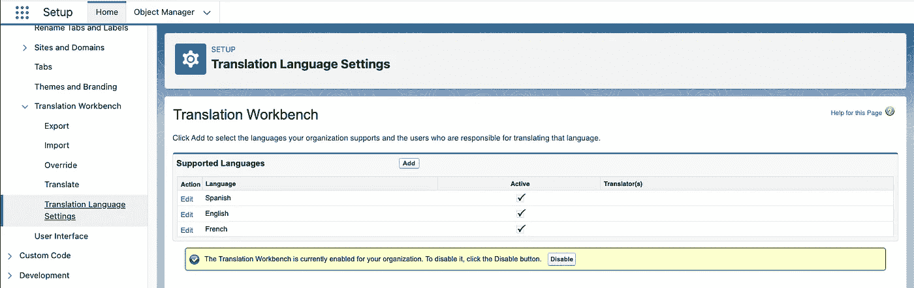

启用英语、西班牙语和法语后，我们现在可以访问 Setup | Custom Labels 部分来创建表格，如下所示:

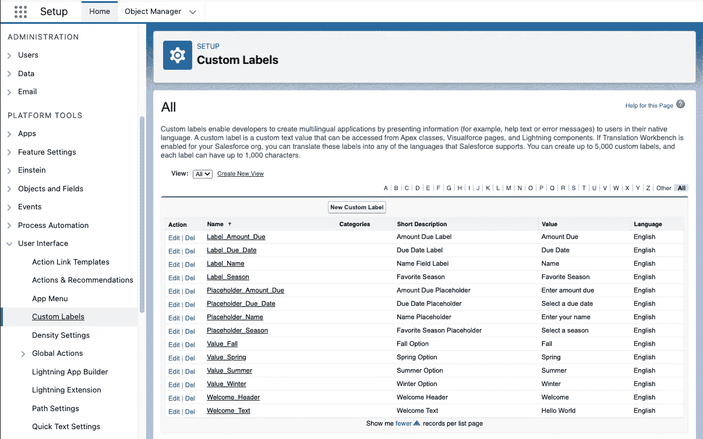

下表总结了我们需要配置的标签和值:

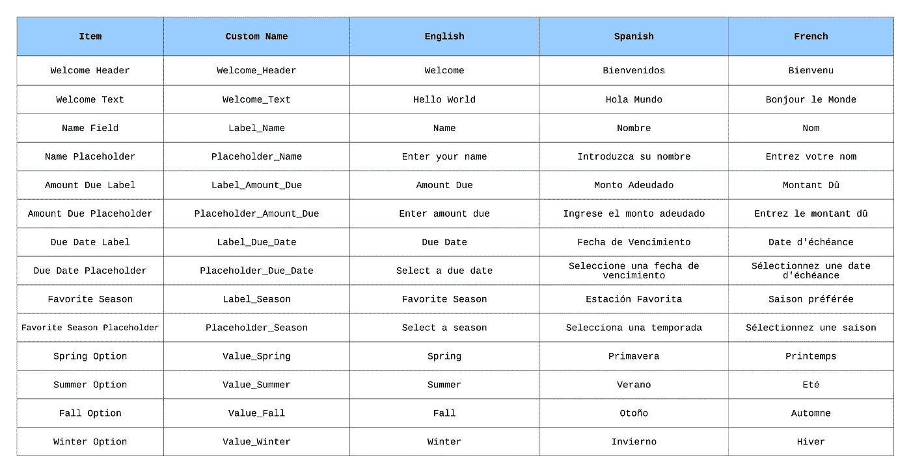

现在我们已经做好了一切准备，是时候在新组件中使用外部化元素了。

# 使用 VS 代码进行 LWC 开发

有关使用 Visual Studio (VS)代码创建新 LWC 的更多详细说明，请查看以下出版物:

[向 Salesforce 移动应用程序添加条形码支持](/adding-barcode-support-to-a-salesforce-mobile-application-7ddebfb4c5ae)

运行 VS 代码并安装 Salesforce 扩展包后，开始使用 i18n 示例应用程序就像使用 Cmd+Shift+P(在我的 MacBook Pro 上)或 Ctrl+Shift+P(在 Windows 机器上)并键入以下命令一样简单:

`SFDX: Create Project`

为了快速简便，我选择了标准选项，并将我的项目命名为“LWCi18n”:

接下来，我们需要连接到上面使用的 Salesforce 组织。使用以下 Cmd+Shift+P/Ctrl+Shift+P 命令将 VS 代码连接到该组织:

`SFDX: Authorize an Org`

VS 代码将提示一个登录 URL 选项。我选择了项目默认选项。当一个浏览器窗口出现时，我登录到我的沙盒组织。VS 代码现在已经连接到我的沙箱，我们已经准备好开始使用 LWCi18n 组件了。

# 从 Salesforce 检索标签

现有的对象和配置可以很容易地下载到 VS 代码中，只需点击左边工具栏上的云图标。在本例中，我找到了自定义标签部分并下载了所有内容:

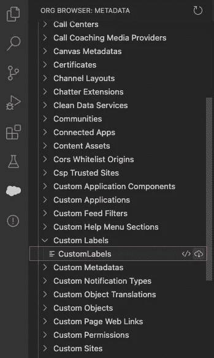

我也用同样的方法检索了所有的译文。

# 创建 i18n 示例组件

我们可以使用下面的 Cmd+Shift+P/Ctrl+Shift+P 命令来创建 i18n 示例 Lightning Web 组件:

`SFDX: Create Lightning Web Component`

我们需要做的第一件事是更新`i18nExample.js-meta.xml`，使这个组件可以在 Lightning 页面上使用:

接下来，我们需要更新`i18nExample.js`，如下所示:

上面的代码完成了以下任务:

*   导入对在 Salesforce 中创建的所有自定义标签的引用
*   建立`label`、`placeholder`和`option`对象来存放自定义标签。
*   为组件将使用的四个表单字段创建变量:`name`、`amountDue`、`dueDate`和`season`
*   为季节字段的下拉选项列表创建一个季节数组

*请注意:为了保持对国际化的关注，我有意在 Salesforce 中没有链接到此表单的对象。这只是一个高级示例，根据用户的地区显示适当的信息。*

接下来，我们更新`i18nExample.html`模板，如下所示:

如您所见，模板中没有一个硬编码的项目。相反，自定义标签是根据用户的地区信息引用和返回的。

现在，我们准备将应用程序部署到 Salesforce。

# 部署到 Salesforce

将我的所有代码从本地机器推送到 Salesforce 很简单。我需要做的就是在导航器中右键单击 force-app/main/default，然后选择 SFDX: Deploy Source to Org 选项。

完成后，我们准备将 Lightning Web 组件添加到 Salesforce 中的新应用程序。

我切换到浏览器选项卡，登录到我的 Salesforce 组织并打开设置透视图。接下来，我导航到应用程序|应用程序管理器页面，并单击新的 Lightning 应用程序按钮。

我决定将新的应用程序命名为“i18n Example ”,甚至还找到了一个好用的小图标。除了最后一个屏幕，我使用了向导中的其余默认设置，在最后一个屏幕中，我授予所有用户对该应用程序的访问权限。

然后，我导航到用户界面| Lightning App Builder 屏幕。在这里，我创建了一个名为“i18n Example”的新 Lightning 应用程序页面，它被设计为一个具有单个区域的应用程序页面。

在屏幕左侧，我可以看到我的 i18n 示例 LWC 在自定义部分。我所要做的就是将该组件拖放到基于 Lightning 的页面的单个区域中。

保存组件后，我使用激活过程向客户展示 Lightning 页面。

在激活阶段，我将应用程序名称设置为“i18n Example ”,并在列表中找到了最佳图标。对于移动导航，我添加了 i18n 示例照明应用程序，并确保它在列表的顶部附近。

点击保存按钮后，i18n 示例应用程序就可以使用了。

# 验证 i18n 示例组件

使用 Salesforce，我打开了 i18n 示例应用程序，它按预期显示了标签和占位符:

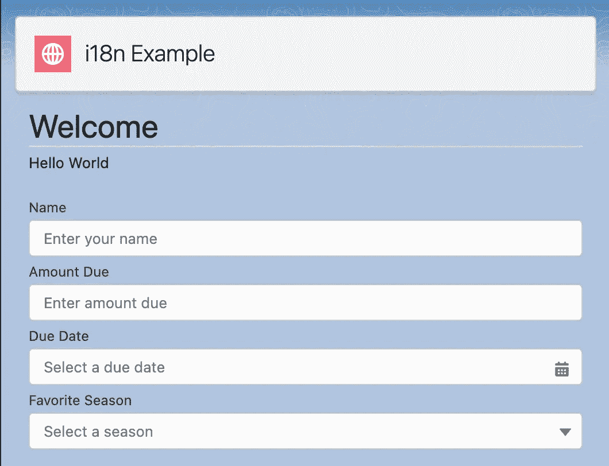

就连最喜欢的季节下拉选项也正好出现在我需要的地方:

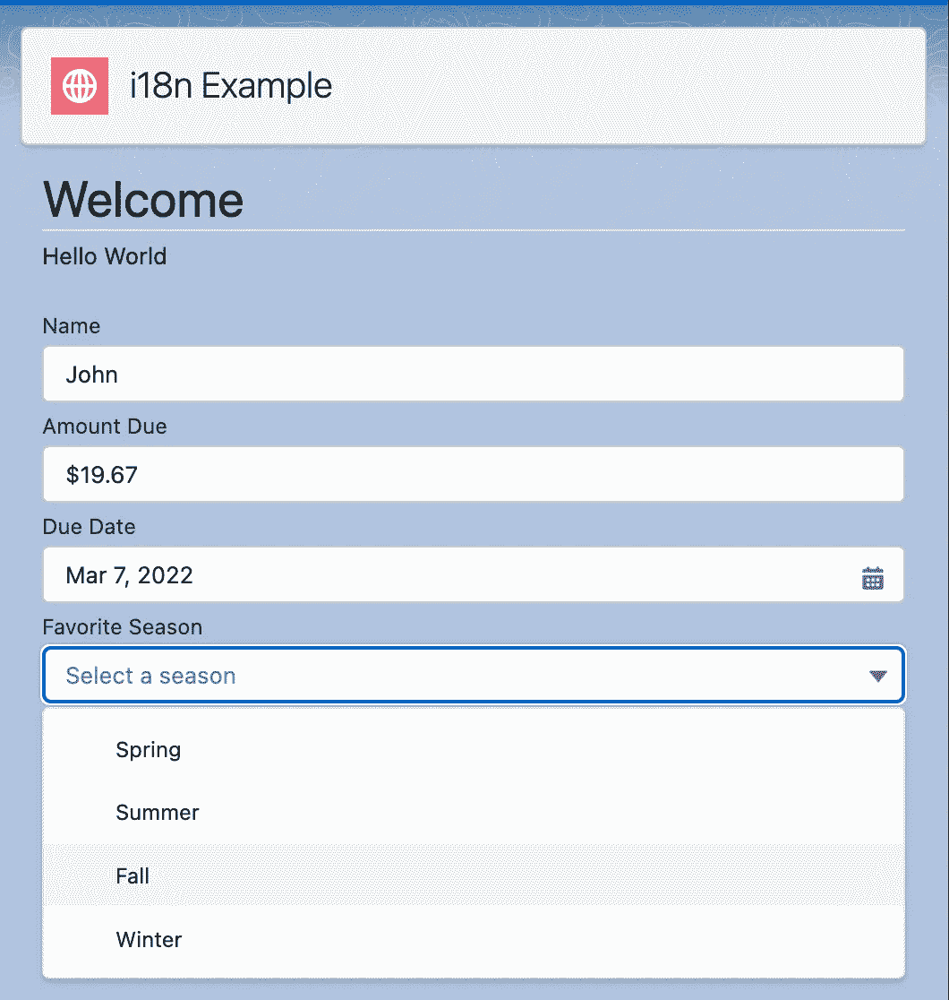

使用移动应用程序，我打开了 i18n 示例应用程序，并填充了如下所示的表单:

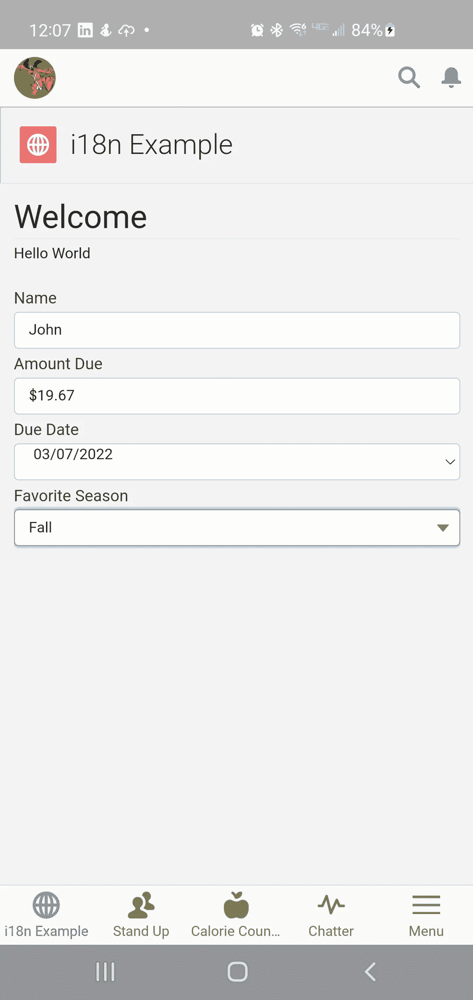

我更新了我的 Salesforce 个人资料，将我的语言更改为西班牙语，并在 Salesforce 中重新加载了应用程序，它显示了正确的标签和值:

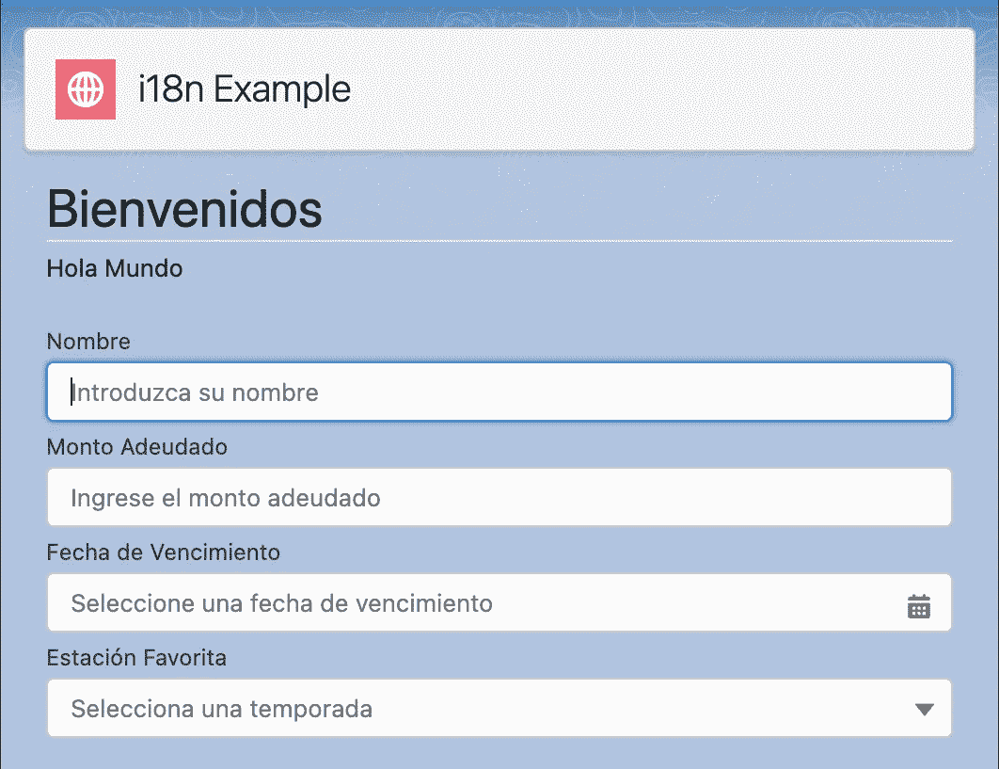

下面是示例数据和下拉列表项正确显示的相同表单:

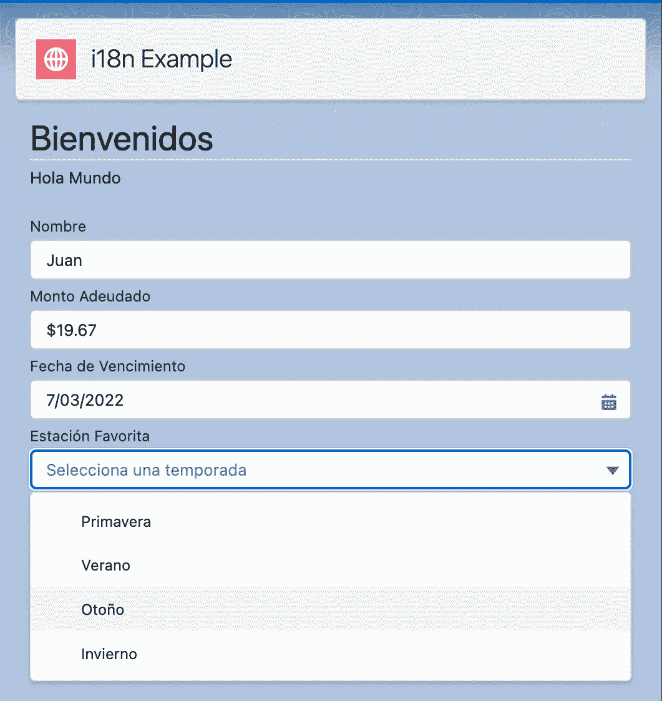

然后，我将语言更改为法语，并再次重新加载应用程序，这显示了我的应用程序的法语版本:

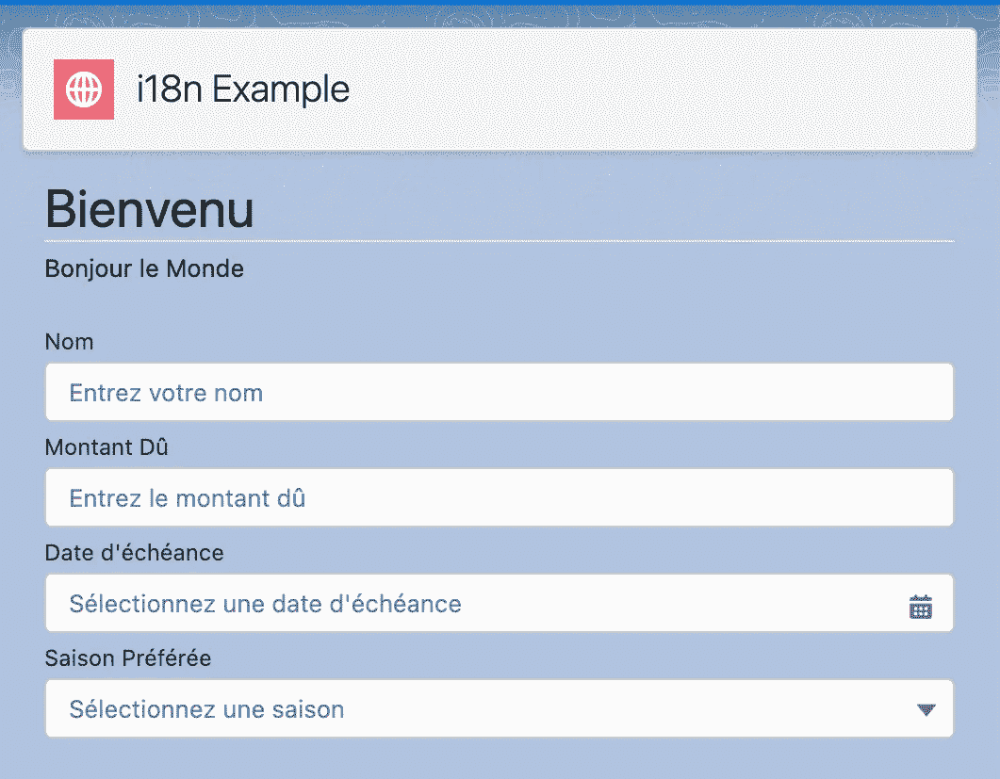

这里还调整了货币和日期格式，以及下拉列表选项:

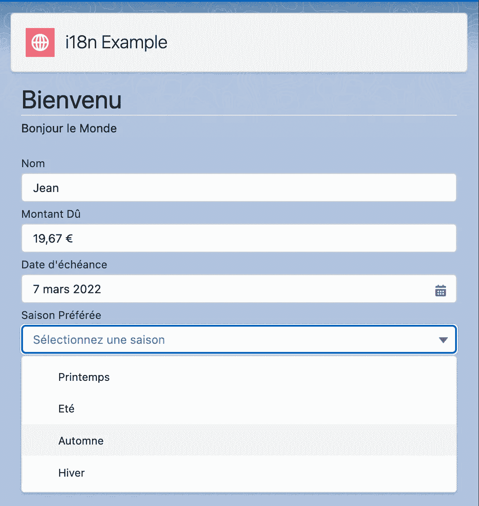

包含对 Lightning Web 组件的 i18n 支持的真正酷之处在于，Salesforce 已经被设计为容纳必要的外部化标签和值。

今后，无需代码更改或部署，即可在 Salesforce 中进行更新。

# 结论

从 2021 年开始，我一直努力按照以下使命宣言生活，我觉得这可以适用于任何 IT 专业人士:

> “将您的时间集中在提供扩展您知识产权价值的特性/功能上。将框架、产品和服务用于其他一切。”
> 
> —j·维斯特

通过引入将应用程序的自然语言方面具体化的能力，您实际上是在坚持我的个人使命陈述。Salesforce 平台允许 Lightning Web Components 轻松采用这种方法的事实，展示了 Salesforce 如何坚持我的使命陈述的另一个例子。

我最近向我的大儿子表达的一件事是，你永远不会后悔第一次以正确的方式做事情。我的大儿子再过几周就要完成计算机科学的大学学位了。如果有机会，您分配给适当规划的额外时间将会在您所生产的任何产品的长期可支持性方面获得巨大回报。

虽然用您的主要语言或框架简单地开始向表示层添加文本和标签是快速而容易的，但是转换成外部化模型的技术债务对于每个被迫参与这项工作的人来说都是痛苦的。

想象一下，这就像用 Fix-A-Flat 修理你的汽车轮胎一样。虽然这罐溶液可以提供足够的空气让你恢复正常运行，但你雇来清理轮胎内部垃圾的机械师肯定会向你收取额外的费用，以“正确”的方式修理轮胎。

如果您对本出版物的源代码感兴趣，可以在 GitLab 上找到，地址如下:

[https://gitlab.com/johnjvester/lwc-i18n](https://gitlab.com/johnjvester/lwc-i18n)

祝你今天过得愉快！