# 互联网是如何在幕后运作的

> 原文：<https://betterprogramming.pub/internet-mechanics-c77f998e7853>

## 互联网机制

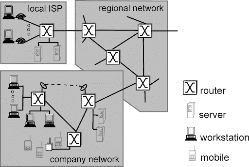

网络的网络图(来源:Kurose 和 Ross 的[计算机网络](https://www.net.t-labs.tu-berlin.de/teaching/computer_networking/01.01.htm)

简而言之，互联网是子网的*网络*。这些子网通过路由器相互通信，我将在本文**稍后解释这一点。**

**网络**:为了传输数据而连接的两个或多个设备。

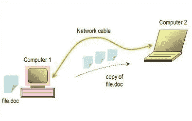

网络可以归结为两台互相交换数据的设备。当然，网络已经变得比这复杂得多。随着网络复杂性的增加，数据只需要发送到网络上的某些计算机，图中这样简单的配置不再实用。

例如，将四台设备直接连接到网络将导致以下配置:

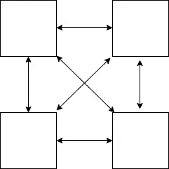

四台设备局域网:直接连接

那还不算太糟。每个设备都直接连接到另一个设备，在中心形成交叉连接。每个设备都能够通过一个 *MAC 地址*引用另一个设备。

**MAC 地址**:是*媒体访问控制地址*的首字母缩写——别名*物理地址*，是一个十六进制数字“烧入”到网络接口控制器(NIC)的六位地址。该地址没有等级之分，因此数字序列不能给出该设备与其它设备之间关系的信息。例如:30–65-EC-6F-C4–58。

然而，随着我们向局域网添加更多的设备，这种系统变得不切实际:

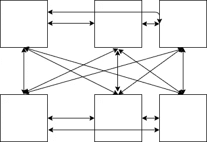

六设备局域网:直接连接

当只向网络中添加两台设备时，网络的复杂性会急剧增加。当您将它与一个 8 台设备的网络进行比较时，就很明显为什么需要一个新的策略了:

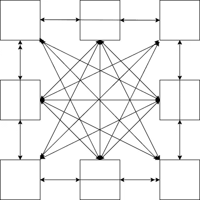

八台设备局域网:直接连接

这就是*中枢*发挥作用的地方。集线器作为网络的*节点*，在*数据包转发*中发挥着关键作用。

**包转发**:通过节点将网段从一个网段中继到另一个网段

**节点**:重分发点或通信端点

**Hub** :通过端口将多个以太网设备连接在一起的网络设备。当数据包到达某个端口时，该端口会将数据包转发到集线器的所有其它端口。

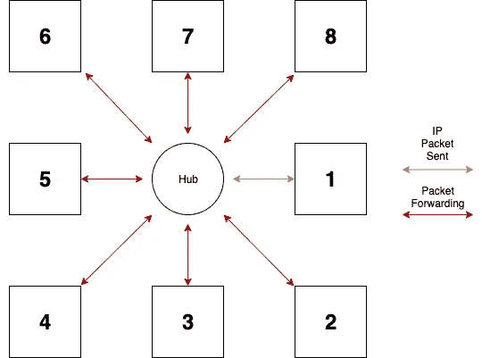

具有数据包转发功能的以集线器为中心的局域网

集线器将数据包分发给连接到其端口的所有设备。这意味着设备 1，即发送网络数据包的设备(数据包的来源)，将数据包发送到集线器，每个设备都将接收数据包。当数据只针对单个特定设备时，这就产生了问题。*来源*和*目的地报头*就是这个问题的解决方案。

源头:这是最初发送数据包的计算机的 MAC 地址。如果发送数据包的计算机的 MAC 地址为 30–65-EC-6F-C4–58，则发送的数据包将包含 30–65-EC-6F-C4–58 的源报头。

**目的地报头**:这是数据包要发送到的计算机的 MAC 地址。如果数据包需要发送到的计算机的 MAC 地址是 00:1B:44:11:3A:B7，则数据包的目的报头是 00:1B:44:11:3A:B7。

发送数据包时，元数据以**报头**的形式附加。

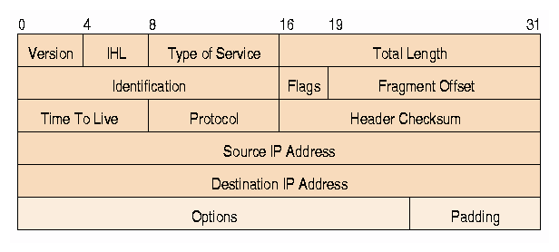

IP 数据包报头(来源: [Quora](https://www.quora.com/What-is-ip-packet) )

暂时忽略额外的字段，注意数据包底部的源和目的地报头。这些是任何数据包都需要的组件。

请注意标题名称中的 IP 地址。我将在本文的稍后部分解释这种用法，但是现在，我使用 MAC 地址来演示本地区域和网络间通信环境中的 MAC 和 IP 地址功能。

当带有源/目的地报头的数据包被发送到集线器时，该数据包仍然由集线器分发给集线器端口上的所有设备。然而，每个设备将遵循一个*协议* ，告诉它如果目的地报头与设备地址不匹配，则忽略数据包。

**协议**:管理数据传输的一组规则

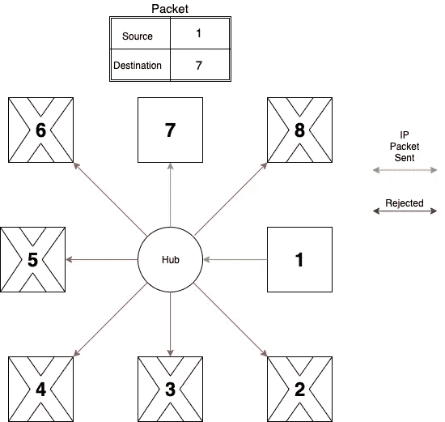

带源/目的地接头的八设备局域网

一个更优雅的解决方案从集线器发展而来:*交换机。*

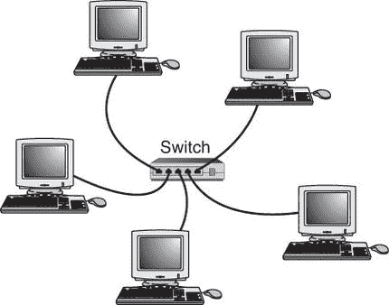

局域网:用以太网电缆和交换机连接的计算机

**交换机:**一个使用目的地址转发数据包的网络桥接设备。交换机将拥有连接到其端口的所有设备的 MAC 地址，并将给定的数据包转发到匹配目的地址的端口。

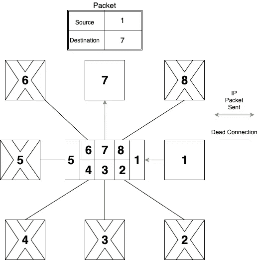

带交换机的八台设备局域网

在此图中，交换机从设备 1 收到一个数据包。该分组包含目的地报头 7。交换机将获取目的报头，并搜索地址为 7 的设备。当找到一个设备时，数据包将从对应于目的设备的端口发送出去。

在本例中，目的设备是 7，因此数据包从连接到设备 7 的端口发出。网络上的其他设备不会收到数据包，它们所占用的网段也不会受到影响。

到目前为止，我们已经了解了使用物理网络电缆连接的网络设备。由于使用网络电缆的限制，这些设备通常在地理上也很接近。网络电缆的使用和设备的近距离是局域网(LAN)的一个特征。

互联网比这要大得多，在下面的章节中，我将描述用来创建现在的现代互联网的网络策略。

家庭和办公室中的设备在局域网(LAN)内连接。这就是该网络中的设备相互连接和通信的方式。但是，这些设备如何与不同网络中的另一台设备通信呢？这是网络间通信，也是互联网最常见的功能。

为了实现网络间通信，一个新的设备被添加到这个难题中:一个*路由器*。

**路由器**:用于连接两个或多个网络的网络桥接设备

路由器是一个网络与外部网络/设备通信的桥梁。

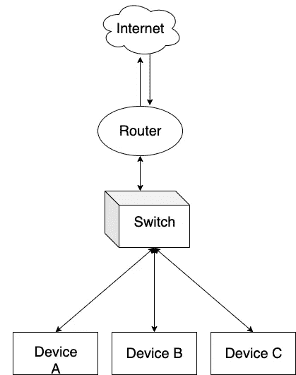

带路由器的局域网

本地网络设备现在可以向不同网络上的设备发送数据包。数据包被发送到交换机，交换机将数据转发到路由器，然后路由器将流量路由到另一台路由器。将数据包转发到互联网上的另一个路由器被认为是一个*网络跳*。

一个数据包要经过几跳才能沿着不同的互联网路由器到达目的地。

**网络中继段:**一段数据在到达目的地的途中，从一个互联网节点到另一个互联网节点所需的时间。

互联网非常繁忙，有时这些路由器会因试图通过它的大量数据而不堪重负。当路由器不堪重负时(当它的缓冲区已满时)，它将丢弃它收到的所有传入数据包，直到缓冲区中的足够数据得到处理，为传入数据包腾出空间。

此外，数据包还包含另一个字段，即 TTL(生存时间)。此字段指定数据包在被其中一个互联网路由器丢弃之前，允许在互联网上停留多长时间。每个网络跃点都将该值减 1。如果 TTL 字段达到 0，则认为数据包闲置时间过长，因此会被丢弃。

这让互联网变得极其不可靠。这就是为什么已经采用协议来说明这种不可靠的性质。

*TCP(传输控制协议)* 就是这样一种协议，大多数软件工程师选择的协议。

**(TCP)传输控制协议:**面向连接的协议，为网络的周围环境提供各种服务，确保:

*   数据包没有被复制
*   所有数据包都已到达目的地
*   这些包没有被篡改过
*   网络上没有太多网络无法处理的数据。(*拥堵回避)*
*   发送者不会用太多的数据淹没接收者。(*流量控制*)
*   数据包的顺序正确。

**面向连接:**在交换数据之前，必须建立一个安全的连接。

TCP 使用*三次握手创建安全连接。*

**三次握手:**TCP 用于建立安全客户端-服务器连接的三步方法。交换具有标志 SYN、SYN-ACK 和 ACK 的数据分组)。此方法在任何数据交换发生之前执行。

第一步。SYN:客户端向服务器发送一条消息，表示要开始消息交换。

第二步。SYN + ACK:服务器向客户端发送一条消息，表明它已经收到请求，准备接收数据。

第三步。ACK:客户端发送一个数据包，表示它即将发送数据。已经建立了连接。

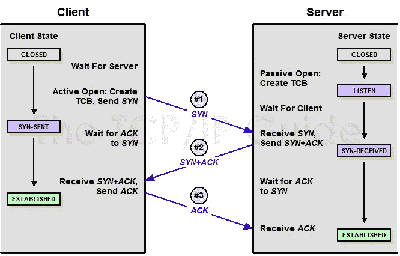

TCP 握手的事件序列

由于 TCP 提供了许多具有移动部分的功能，它极大地增加了网络的*延迟*。

**延迟**:数据包从一个位置传输到另一个位置所需的时间。

换句话说，TCP 让事情变得更慢，为了安全牺牲了速度。

有些应用程序不需要 TCP 的所有功能，这会降低数据传输速率。这种应用的一个例子是苹果的 FaceTime 应用:


苹果的 FaceTime 视频聊天应用

特别是有了新的群组视频聊天功能，当客户需要通过互联网以实时视频流的形式快速发送数据时，视频流的视频中断中的一些小故障是可以接受的。

这就是像 *UDP(用户数据报协议)*这样的协议发挥作用的地方。与 TCP 之类的协议相比，UDP 去掉了许多功能。

**(UDP)用户数据报协议**不保证:

*   数据已经到达目的地
*   数据是有序的
*   接收器不会被数据淹没
*   网络不会被过多的数据淹没

在 UDP 中，数据可能会被丢弃。

由于功能较少，UDP 比 TCP 更快、更灵活。UDP 是优先考虑快速传输不敏感数据的应用程序的首选协议。实施拥塞避免来防止高流量期间的大量数据丢失仍然被认为是最佳实践。

一旦建立了协议，并且执行了 TCP 握手(如果适用),就可以进行数据交换了。

然而，在继续之前，重要的是要知道是什么启动了这种数据交换。

客户端通常是一个 web 浏览器。在这个网络浏览器上，用户可以输入一个 URL，浏览器将*解析*。

**解析 URL** :将一个 URL 分成

*   scheme:告诉客户端如何访问资源
*   主机:指定资源(域名)的位置(服务器)
*   路径:资源在主机中的位置

在解析过程中，会遇到主机名。这是对互联网上某处服务器的引用。服务器通过 IP 地址来识别，但是大多数 URL 都有一个格式为`www.apple.com`的主机名。

有没有地址为`www.apple.com`的服务器？不尽然——这就是 *DNS* ( *域名系统*)进入竞争领域的地方。

**(DNS)域名系统:**用于将人类可读的域名翻译成 IP 地址的分层命名系统。DNS 服务器将接受客户端发送给它的域名，并返回该服务器的 IP 地址。

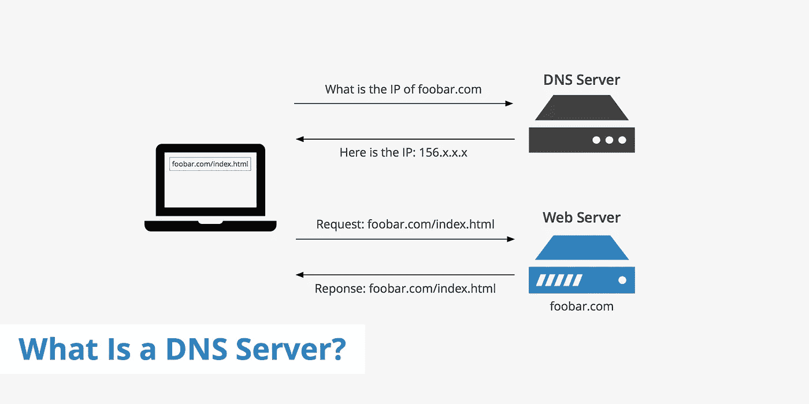

当从 DNS 服务器中检索到 IP 地址时，客户端会将 IP 地址和端口号结合起来，创建一个*套接字* **(** IP 地址+端口号=套接字 **)** 。

套接字是一个逻辑通信端点，它使用 IP 地址和端口号的组合来声明数据的目的地。端口号定义了设备内要发送的数据的位置。与 IP 地址相比，IP 地址定义了设备在网络中的位置。

**Socket:** 结合 IP 地址和端口号形成的应用程序的逻辑通信端点。例如:66.249.75.195:83

**端口:**设备内待发送数据的逻辑端点。端口号与 web 浏览器和其他互联网通信 web 应用程序相关联。

然后套接字被传递到*传输层* **、**，在那里它将经历数据封装。请注意，以下过程发生在网络设备中。

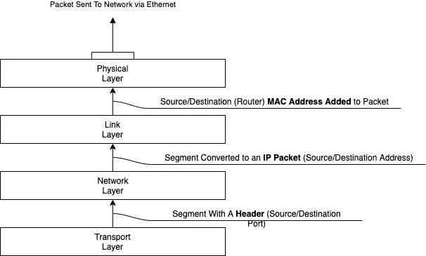

套接字从段->包->传输转换的过程

回到 TCP 握手的完成，根据 URL 的方案，可能需要进行另一次交换。如果方案指定了`https`协议，那么必须发生 *TLS 握手* 。

**TLS 握手:**客户端和服务器的方法:

*   就要使用的 TLS 版本达成一致
*   同意在*密码套件*中使用*密码*
*   对称加密的交换密钥
*   验证主机证书的有效性

**密码**:执行加密和解密的一组步骤

**密码套件**:一组密码

该方法执行以下步骤:

*   第一步。`ClientHello`:客户端指定其支持的 TLS 版本和密码套件，然后发送给服务器。
*   第二步。`ServerHello`:服务器验证可以使用指定的 TLS 版本和密码套件。它提供它的证书和公钥，然后发送`ServerHelloDone`。
*   第三步。密钥交换:客户端和服务器交换对称加密的密钥数据。

在 TLS 握手之后(如果 URL 方案是`https`)，从浏览器发送一个 HTTP 请求:

```
GET /home HTTP/1.1
Host: [www.amazon.com](http://www.amazon.com)
```

在上面的请求中，GET 请求包含以下组件:

*   **方法** : GET(告诉服务器要执行什么动作)
*   **路径:** /home(所需资源的位置)
*   **主机:**[www.amazon.com](http://www.amazon.com/)(表示应用服务器的位置)

服务器在处理完 HTTP 请求后，将发送 HTTP 响应:

```
HTTP/1.1 200 OK
Connection: close
```

该请求包含以下内容:

*   **版本:** HTTP/1.1
*   **状态代码:** 200(必需组件)
*   **连接:**显示连接的状态

由于 HTTP 是一个无状态协议，连接将在响应后关闭。

**无状态:**请求/响应周期完全相互独立。每个周期与之前的请求/响应没有关联。

例如，当一个请求是针对一个网页时，响应通常会包含一个*正文* **。**正文包含浏览器可以用来显示网页的 HTML 代码。

HTTP 请求/响应中可以包含各种其他可选的头，但是我试图突出显示在处理 HTTP 请求/响应时最常见的头。