# 用数据、异常检测和时间序列解释 135 个夜晚的睡眠

> 原文：<https://betterprogramming.pub/interpreting-135-nights-of-sleep-with-data-anomaly-detection-and-time-series-f6ee04625260>

## 在 Fitbit 的睡眠数据中寻找模式


人生中有三件事是确定的:死亡、纳税和睡觉。在这里，我们将谈论这些的最后。

每天晚上，我们人类在地球上漫游了一整天后，都会被修普诺斯的吻问候并慢慢入睡。在这样做的时候，我们的大脑会恢复、愈合，如果我们幸运的话，还会邀请我们通过梦境来体验最狂野的冒险。或者在噩梦中，我们希望我们可以忘记。但是你知道还会发生什么吗？我们生成**数据—** 或者至少我是这样做的。

*这不适用于学生或上三班的人。


不是这个 Hypno。来源 https://www.pokemon.com/us/pokedex/hypno

你有没有想过你的睡眠模式？关于你的睡眠行为的精确的、细微的、难以察觉的事实？比如，有多少次，不知不觉中，你醒来了？或者哪一天睡得多？这些都是让我夜不能寐的问题(哈！).

给你一些语境，在写这句话的时候，距离我开始背包探险已经 150 天了。我提起这件事是因为，不像过去我过着“正常”的生活，现在，我不再受日常事务的束缚。你知道我在说什么；在 X 点醒来，在 Y 点到达办公室，在 Z 点睡觉(除非你想第二天感觉很糟糕)。然而，每天晚上，我还是会把自己塞进一张温馨舒适的(取决于旅馆)床上。但是我有套路吗？我不知道，但我想弄清楚。

作为一个对数据好奇的人，我开始了一次冒险，去发现我新的睡眠规律和模式(如果有的话)。在这篇文章中，我展示了结果。


照片由[克里斯多夫·乔利](https://unsplash.com/@chris_jolly?utm_source=medium&utm_medium=referral)在 [Unsplash](https://unsplash.com?utm_source=medium&utm_medium=referral) 拍摄

# 介绍

这个实验是关于睡眠和数据的。在这里，我想调查一下自从我差不多六个月前开始我的冒险以来，我是如何睡觉的。总的来说，我想学习我的**睡眠时间**，它的**趋势**，以及我每晚**的不安宁时间**，应用诸如**描述性统计**、**时间序列分析**和**异常检测**等技术。因此，我想出了以下几个关键问题来尝试回答:

*   我什么时候睡觉，什么时候醒来？
*   我花多少时间睡觉？
*   在床上的时间和睡觉的时间有关联吗？
*   平均来说，我每晚有多少“不安分”的时刻？
*   我每晚花多少时间熬夜？
*   我的睡眠模式是如何演变的？我每周的例行工作是什么？整体趋势如何？
*   哪些起止时间是异常值？

让我们解决他们！

# 数据

我用来回答这些存在性问题的所有数据都来自我的 Fitbit 手表。这个神奇的设备，我几乎一周 7 天 24 小时都戴着，每晚都在不停地追踪我要分析的信息。总的来说，我的数据集由 135 行组成，或者说睡眠时间，在 5 月 28 日(我开始背包旅行的那一天)之后庆祝。数据集的要素包含睡眠开始时间、结束时间和唤醒后的分钟数等信息。尽管如此，我想澄清一下，在我看来，Fitbit 计算的许多指标都没有得到很好的记录，所以我不知道该设备是如何得出这些指标的。不过，我不会质疑这些值，并假设它们是准确的。

最后，我必须提到，由于技术问题，如 Android sync 失败，或者因为我让设备整夜充电，所以有一些日期错过了。此外，每一行都对应着一天的“主要”睡眠，这意味着我不包括午睡。

# 工具

这个实验使用了 R 和 Python。对于 R，我进行了探索性的数据分析，并画出了大部分的图。另一方面，Python 使用 [Prophet](https://facebook.github.io/prophet/) 包处理时间序列分析，并使用流行的 [scikit-learn](https://scikit-learn.org/) 进行异常检测。


照片由[凯特·斯通·马西森](https://unsplash.com/@kstonematheson?utm_source=medium&utm_medium=referral)在 [Unsplash](https://unsplash.com?utm_source=medium&utm_medium=referral) 上拍摄

# 获取数据

与大多数与数据相关的问题一样，这个问题从收集数据开始。为了得到它，我通过 Python 包 [python-fitbit](https://python-fitbit.readthedocs.io/en/latest/) 使用了 Fitbit 的 API。更具体地说，我使用了“[**Get Sleep Logs by Date**](https://dev.fitbit.com/build/reference/web-api/sleep/)”端点，这是一种将日期作为输入并返回当天的睡眠会话及其附带的所有信息的方法。下面的代码展示了我是如何做到的。

```
import fitbit
import os
import argparse
import datetime
import pandas as pd

parser = argparse.ArgumentParser()
parser.add_argument('--base_date', '-bd', help="Starting date", type=str,
                    default='2019-05-28')
args = parser.parse_args()

def run():
    # use Germany locale so the units are in the metric system
    client = fitbit.Fitbit(os.environ['FITBIT_KEY'],
                           os.environ['FITBIT_SECRET'],
                           access_token=os.environ['ACCESS_TOKEN'],
                           refresh_token=os.environ['REFRESH_TOKEN'],
                           system='en_DE')
    base_date = args.base_date
    df = get_sleep_data(client, base_date)
    df.to_csv('data/df.csv', index=False, encoding='utf-8')

def get_sleep_data(client, base_date):
    """
    This function retrieves sleep data, from base_date until today
    """
    # get sleep data
    start = datetime.datetime.strptime(base_date, '%Y-%m-%d')
    delta = datetime.datetime.today() - start
    dates = [start + datetime.timedelta(days=i) for i in range(delta.days + 1)]
    sleep_data = []

    for date in dates:
        single_day_sleep = client.get_sleep(date.date())
        stages = single_day_sleep.get('summary').get('stages')
        for sleep_activity in single_day_sleep.get('sleep'):
            # ignore naps
            if not sleep_activity.get('isMainSleep'):
                continue
            sleep_data.append((sleep_activity.get('dateOfSleep'),
                               sleep_activity.get('efficiency'),
                               sleep_activity.get('startTime'),
                               sleep_activity.get('endTime'),
                               sleep_activity.get('timeInBed'),
                               sleep_activity.get('minutesAsleep'),
                               sleep_activity.get('restlessCount'),
                               sleep_activity.get('minutesAfterWakeup'),
                               sleep_activity.get('minutesToFallAsleep'),
                               sleep_activity.get('minutesAwake'),
                               sleep_activity.get('restlessDuration'),
                               stages.get('deep'),
                               stages.get('light'),
                               stages.get('rem'),
                               stages.get('wake')))

    return pd.DataFrame(sleep_data, columns=['date', 'efficiency', 'startTime',
                                             'endTime', 'timeInBed',
                                             'minutesAsleep',
                                             'restlessCount',
                                             'minutesAfterWakeup',
                                             'minutesToFallAsleep',
                                             'minutesAwake',
                                             'restlessDuration', 'deep',
                                             'light', 'rem', 'wake'])

if __name__ == "__main__":
    print('Starting....')
    run()
```

该脚本将基准日期或我们希望收集数据的日期作为参数。然后，我们创建 Fitbit 客户端，它需要 Fitbit 密钥、秘密、访问令牌和刷新令牌。要获得这些，你必须创建一个 [Fitbit 开发账户](https://dev.fitbit.com/getting-started/)并注册一个应用程序。在创建客户机时，您还可以指定语言(一些 API 响应包括适合显示的文本)和地区(或国家，尽管列表非常有限)。更改此参数会影响各种 API 响应和单位系统中包含的一些文本字段的语言。在我的例子中，我使用了`en_DE`,因为我想要英文文本和公制单位。

现在有了数据，是时候借鉴了！

# 睡眠时间

我将从我的睡眠开始和结束时间开始讨论。平均下来(用中位数)，我一般都是凌晨 1 点睡觉。早上 9 点醒来。，正好给我推荐的八个小时。然而，我们很快就会看到，这不是*即*正确。接下来的两个直方图显示了小时的分布(黑色垂直线表示中间值)。

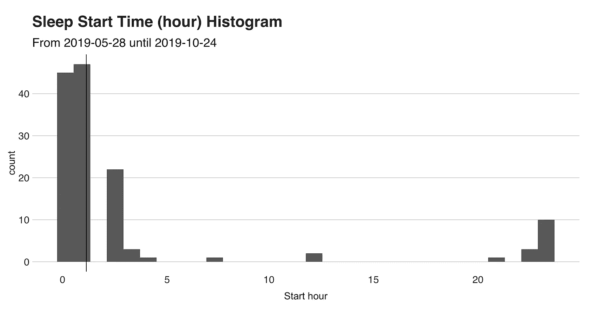

睡眠开始时间(垂直线表示中间值)

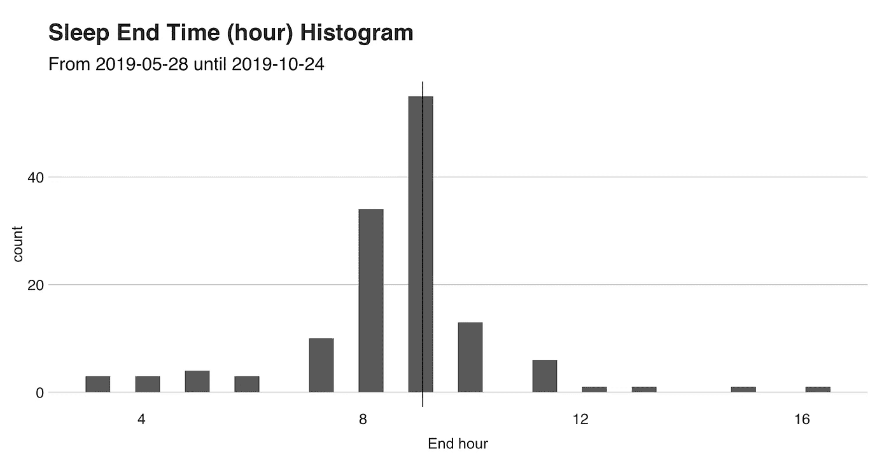

睡眠结束时间(垂直线表示中间值)

现在，为了更精确的观察，这是另一个实际时间的图表。

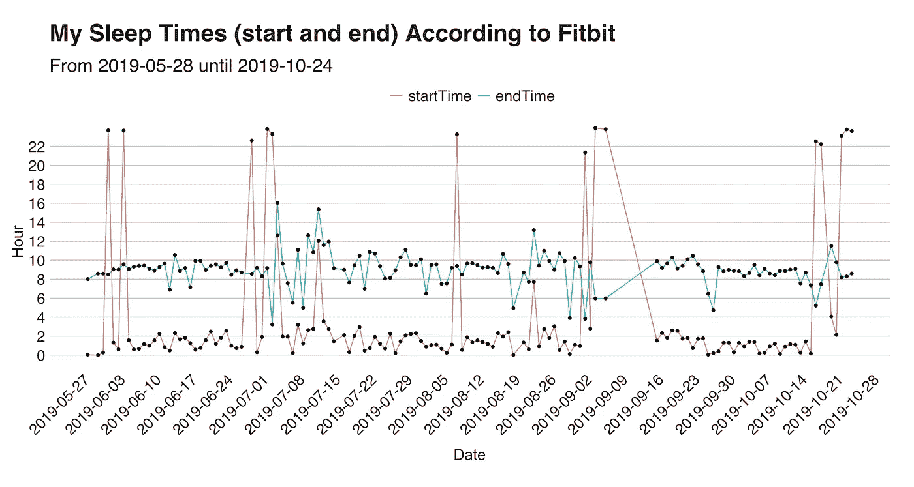

红线表示开始时间，蓝线表示幸福睡眠的悲伤结束。如前所述,“开始时间”和“结束时间”的中间值分别是凌晨 1 点。上午 9 点。，这个事实我们从字里行间就能看出来。除此之外，图表显示，在 135 个晚上中，只有 **17** (13%)我在午夜前睡觉，最极端的情况是在 8 月 23 日，我在**7:44**am 睡觉。(从泰国清迈坐了 11 个小时的火车到大城府)。为了补充这些信息，我将给出两个可视化的例子来显示我的睡眠状态。

下面的是每晚睡眠时间的折线图，在图中你会更好地欣赏(我没有)那些我几乎没有休息的日子；那可能是我搬到一个新地方的夜晚(感谢夜间巴士！).

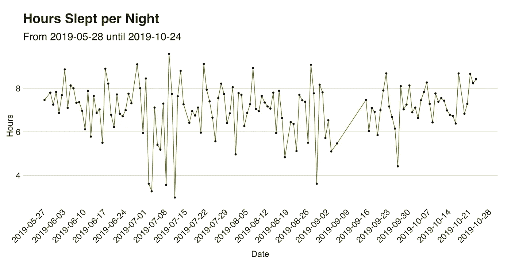

然后，是第二个可视化，它显示了`timeAsleep`(以分钟为单位)的特征分布。这种分布是左偏的，这意味着变量的平均值——**422.61**分钟(垂直虚线)或 **7.04** 小时——小于中位数——**430**或 **7.16** 小时——并且小于众数，众数在连续随机变量(如本例)的情况下是值的最大数——**575**分钟或 **9.58 但是这一切到底有什么意义呢？所有这些花里胡哨的话只是意味着我没睡的那些夜晚降低了平均水平。**

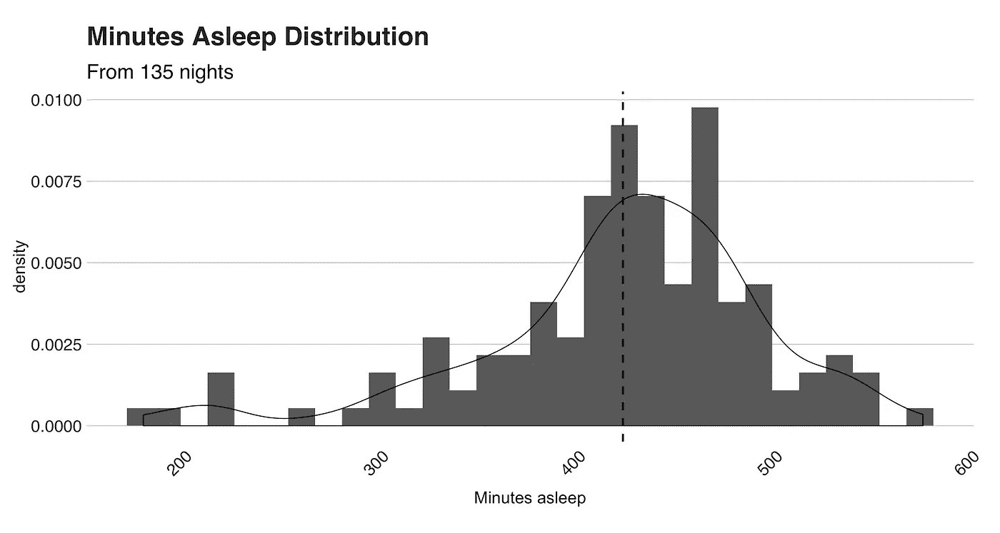

睡眠分钟分布

总而言之，我的结论是，平均而言，或者说“中值”，我通常每晚睡 **7** 个小时，这个分数位于每晚推荐时间的低端[。](https://www.sleephealthjournal.org/article/S2352-7218(15)00015-7/fulltext)

但是等一下！我在这里展示的一切只是我与修普诺斯牵手度过的时光。然而，花在床上的总时间是多少呢？尤其是在我们最终入睡之前的那几分钟——大部分时间用来思考生命的意义和明天的早餐？

# 躁动的时光

承认吧。你的身体一碰到床，你就永远不会睡着。在躺下和入睡之间的这段时间里，我们只是*在那里*，在地狱边缘，试图穿过大门进入*睡眠城*(或者像一个朋友喜欢说的那样*睡眠城*)。Fitbit 计算这个“徘徊”时间，在这里我将提出我的。

我要介绍的指标是 Fitbit 的`minutesAwake` stat。顾名思义，这个指标测量你晚上花了多少时间，包括最终入睡前的几分钟。根据我的观察，Fitbit 在你躺在床上试图入睡时开始计算后者(它可能使用你心脏的 bpm 和运动)，而不是你在床上度过的总时间。否则，我的时间会在十亿分钟左右，因为床是我写作、编码，当然还有网飞的首选之地。下面，你会发现统计的直方图。

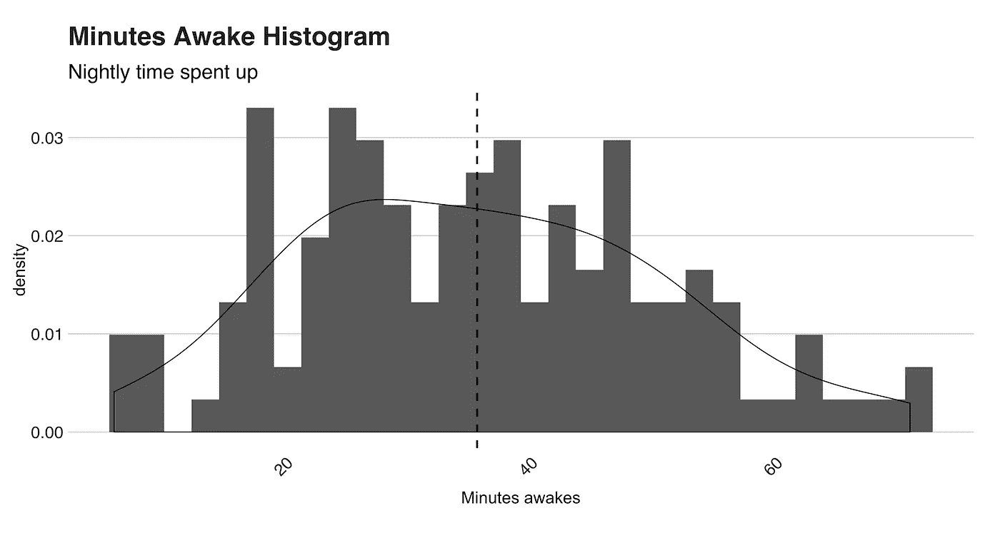

多搞笑的分布啊！这里发生了几件事。对于新手来说，均值是 **35.64** (分钟，记住)，中位数 **35** ，标准差 **14.79 —** 这里没什么奇怪的。然而，看看曲线的形状。特别是尾巴有多细，铃铛有多宽。这两个特殊性是**峰度**分布的特征，这是一种具有低峰度(小于 3)值的统计分布。像这样的分布包含很少甚至没有极端异常值(稍后会有更多关于异常值和异常值的内容)，在这种情况下，这是成立的。

查看以下箱线图:

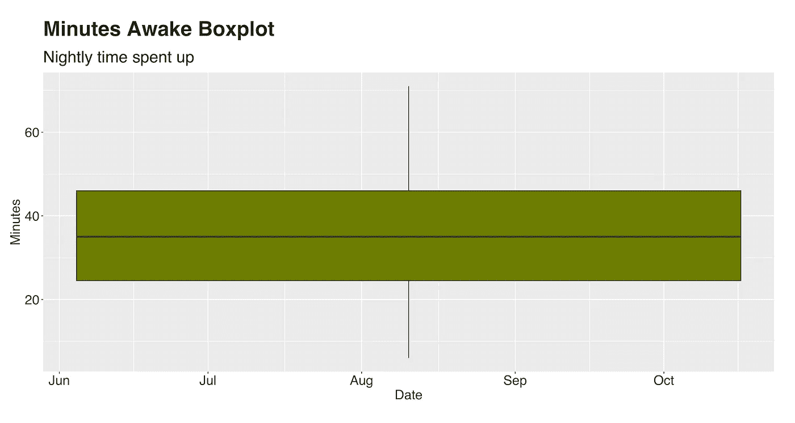

分钟清醒箱线图

看到了吗？盒子外没有值，所以我们可以说没有极端的异常值。现在，总结一下，回答这个问题，“我一个晚上要花多少时间？”我会说，在一个典型的夜晚，我花 20 到 45 分钟。这个界限很少改变。

Fitbit 的数据提供了另一个衡量一个人夜间不安行为的功能，称为`restlessCount`，这是一个记录你在某个晚上经历了多少次这种时刻的计数器。这些事件可能长到上一次厕所，也可能短到第二天早上你都不记得了。

平均来说，我每晚有 19.53 个不安宁的时刻。然而，这个数字说明不了什么，因为夜晚的长度不是恒定的。但我可以说，这些不想要的插曲与整个睡眠时段成正比。例如，“*躁动计数*”与“*分钟睡眠*”的相关性为 0.55，而“*躁动计数*”与“*分钟睡眠*”的相关性为 0.82。事后看来，这些数据是意料之中的——你不安的时刻越多，你睡的时间就越长。尽管如此，我对此很好奇！


照片由[马太·亨利](https://unsplash.com/@matthewhenry?utm_source=medium&utm_medium=referral)在 [Unsplash](https://unsplash.com?utm_source=medium&utm_medium=referral) 上拍摄

# 异常检测的开始和结束时间

当我展示“开始睡眠”和“结束睡眠”图表时，我没有指出它的许多特性，除了我早上 7 点上床睡觉的那一天。该点是一个异常值，一个与其他数据显著不同的数据观察，但它是这两个图表中唯一的异常值吗？我不知道，但我们可以找到答案！

检测这些数据点的最简单的方法是将它们绘制在箱线图中，并将盒子外的点归类为异常值-如果您的数据是一维的，这是一种有效的解决方案。然而，对于这种情况，我想添加一个额外的特性，**星期几**，并用它和`startSleep`一起找出我在异常时间睡觉的晚上。这项调查需要异常检测。

我选择用来检测我的异常夜晚的算法是[一类 SVM](https://scikit-learn.org/stable/modules/generated/sklearn.svm.OneClassSVM.html) ，这是著名的监督学习方法支持向量机(SVM)的一种变体。与它著名的对应物不同，一类 SVM 采用无监督的方法来学习决策边界，将我们的数据集分成非离群值和离群值。它被称为“一个类”，因为在障碍内的所有东西应该(理论上)与其余的东西属于同一个类，或者至少非常相似，而边界外的数据点是不相似的(也称为异常值)。

在直接跳到算法的输出之前，我想给你看一张数据集的图像，看看你能否指出异常值，然后是具有已知边界的异常值。

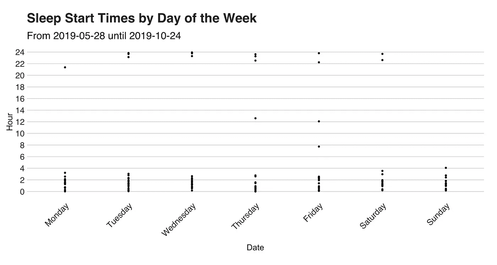

一周中每天的睡眠开始时间

X 轴表示一周中的每一天，Y 轴表示时间。你看到了什么？你注意到有什么异常吗？

现在，将您的结果与算法的响应进行比较:

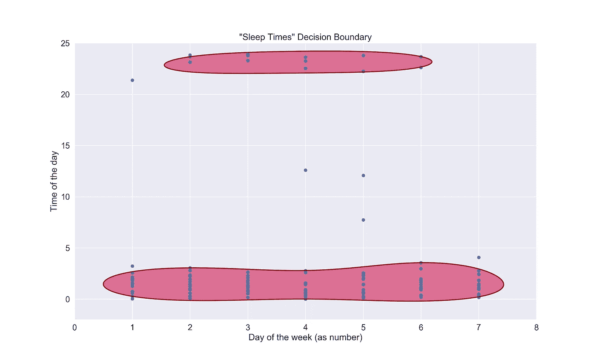

SVM 说过:这两个红色的斑点代表了我选择睡觉的“共同”时间的界限。上面的一个包含了我称之为午夜前一天的几个晚上，而下面的第二个是褪黑激素直到很晚才达到的那些晚上。

然后有六个孤独的记录指的是不正常的夜晚。一次是在晚上 9 点，两次是在中午 12 点，一次是在早上 7 点，最后一次几乎是在凌晨 4 点。所以我们可以说，在晚上 10 点之前和凌晨 3 点之后睡觉通常是不正常的。关于一周中的某一天，异常条目和工作日之间没有显著的相关性。下面的代码片段展示了我如何适应这个模型:

```
"""
This script fits a One Class SVM
Code for plotting the decision function was taken from:
https://scikit-learn.org/stable/auto_examples/svm/plot_oneclass.html#sphx-glr-auto-examples-svm-plot-oneclass-py
"""

from sklearn.svm import OneClassSVM
import pandas as pd
import matplotlib.pyplot as plt
import numpy as np
import seaborn as sns

# setting the Seaborn aesthetics.
sns.set(font_scale=1.5)

df = pd.read_csv('data/start_times.csv', encoding='utf-8')
X_train = df[['weekday', 'time']]

clf = OneClassSVM(nu=0.1, kernel="rbf", gamma=0.1)
clf.fit(X_train)

# plot of the decision frontier
xx, yy = np.meshgrid(np.linspace(0, 8, 500), np.linspace(-2, 25, 500))
Z = clf.decision_function(np.c_[xx.ravel(), yy.ravel()])
Z = Z.reshape(xx.shape)
plt.title("\"Sleep Times\" Decision Boundary")
# comment out the next line to see the "ripples" of the boundary
# plt.contourf(xx, yy, Z, levels=np.linspace(Z.min(), 0, 7), cmap=plt.cm.PuBu)
a = plt.contour(xx, yy, Z, levels=[0], linewidths=2, colors='darkred')
plt.contourf(xx, yy, Z, levels=[0, Z.max()], colors='palevioletred')
b1 = plt.scatter(X_train.iloc[:, 0], X_train.iloc[:, 1])
plt.xlabel('Day of the week (as number)')
plt.ylabel('Time of the day')
plt.grid(True)
plt.show()
```

代码做的第一件事是设置 Seaborn 美学，使情节更漂亮一点。

然后，我们加载数据，创建模型，拟合它，最后，绘制边界。

注意模型定义中的伽马超参数？默认情况下，其值为`1/num_features`。如果我一直保持这种方式，我的模型将会过于适合我的喜好。你可能需要调整它，直到你达到最佳状态，但是要小心——你也可能会吃不饱！

下面，您会发现一个过度拟合模型(gamma 设定为自动)和一个欠拟合模型(gamma 设定为 0.01)的示例:


过分修饰的版本

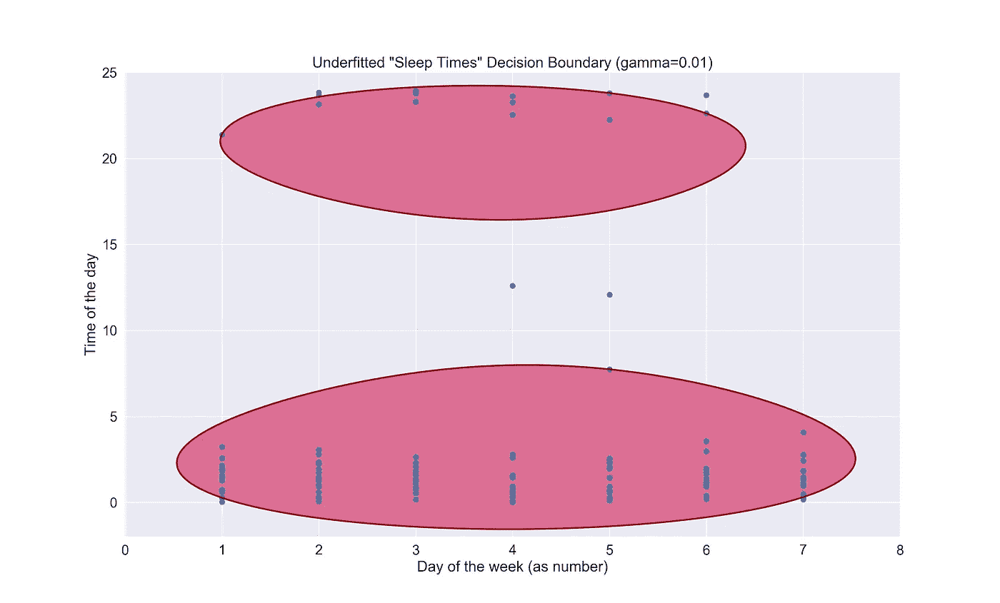

不充足的版本

# 时间序列的睡眠趋势

我有一种感觉，自从我开始背包旅行以来，我在床上的时间已经改变了。一开始，我在奥地利的山区呆了大约一个月。我在那里没做什么——只是徒步旅行、玩开关和休息(很多！)

但是后来，我到了亚洲，故事发生了变化。在最初的几天里，我几乎没有睡觉。看到和吃掉所有东西的兴奋和渴望让我一直坚持到凌晨。然后，一个月后，我终于厌倦了，在马来西亚北部的海滩和泰国南部的海滩，我休息了。但不会太久。


皮皮岛(泰国)。照片由 [me](https://www.instagram.com/juandesr/) 拍摄。

我想说明的一点是，在这五个月里，我的睡眠模式发生了变化，或者说我相信是这样。为了证实这个想法，我求助于时间序列分析和图书馆预言家来拟合我的睡眠时间，看看是否确实有明显的变化。特别是，我想知道**总体趋势**和**每周季节性**。

在进入剧情之前，我想解释一下这里会发生什么，以及我写的用来分析这个系列的代码。我上面提到的一般趋势描述了时间序列的整体演变，而每周季节性解释了时间序列在一周七天内的行为。

在 Prophet 中拟合时间序列只需四行代码。首先，我们必须调用`Prophet()`函数，使用期望的数据集作为参数。该输入必须是具有两列的数据帧:`ds`和`y`。`ds`列代表*日期戳*，应该是日期(`YYYY-MM-DD`)或者时间戳(`YYYY-MM-DD HH:MM:SS`)。第二列`y`是我们想要预测的数值——睡眠时间(以分钟为单位)。现在，有了一个整洁的数据集，让我们继续拟合我们的模型，预测预报，并绘制季节性。下面的代码片段展示了如何在 Python 中实现这一点。

```
"""
This script fits a time series model using my Fitbit steps data.
"""
import matplotlib.pyplot as plt
import pandas as pd
import seaborn as sns
from fbprophet import Prophet

# setting the Seaborn aesthetics.
sns.set()

df = pd.read_csv('data/time_in_bed.csv')

m = Prophet(changepoint_prior_scale=0.5)
m.fit(df)
forecast = m.predict(df)
fig = m.plot_components(forecast)
# this plot shows the trend, weekly and daily seasonality
# but for this case, the daily doesn't make any sense
plt.show()
```

与前面的代码类似，这里我们也从设置 Seaborn plots 样式和加载数据集开始。然后，我们创建 Prophet 对象并拟合模型。一旦完成，我们将调用`model.predict(df)`来获得我们的预测。然后我们需要调用`model.plot_components(forecast)`，使用新获得的预测作为参数来创建趋势和季节性组件图。最后，我们需要`plt.show()`来绘制它们。它们看起来像这样:

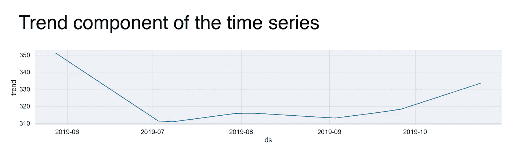

一般趋势

这张图是拟合的趋势线，描述了我睡眠时间的演变。让我解释一下图中 y 轴上的数字背后的含义。这些值*是* *而不是*我那天睡觉的实际分钟数。相反，我们可以把它们解释为季节性因素对 *y* 的增量效应(如这里所说的)。例如，不要过分溺爱，如果你看看下面的图表，你会发现第一天的值，大约是 350，这意味着这一天对 *y* 有+350 的影响。回去吧。

正如我所怀疑的，变量开始强大，伴随着许多甜蜜的睡眠。然后，在 7 月份，在到达美丽的、与世隔绝的新加坡后，我花在毯子下的时间明显减少，并保持了近一个月(有趣的时间！)直到我到达下一个目的地。它就在那里，在泰国兰达岛一个可爱的红色吊床上，我在那里休息，重新获得了我身体渴望的睡眠。那是你在八月初看到的小突起。

我的新吊床生活没有持续多久！向庇护我的舒适小屋挥手告别后，我去了繁忙的城市清迈，在繁忙的曼谷呆了几个星期后。趋势再次下降。

那时，在三周内游览了五个城市后，我感到有点疲倦。于是，从八月的第二周开始，我的日常就变成了玩火徽:三栋房子，写作，编码，保证每天至少睡七个小时。


巴厘岛的日落。照片由 [me](https://www.instagram.com/juandesr/) 拍摄。

我要展示的下一个组成部分是时间序列每周季节性或每周睡眠模式。该图说明了在一周的前四天(或者最后一天和前三天，取决于你在哪里！)，我睡觉的时间也大都差不多。到了周五，整个事情都发生了变化，这意味着我的睡眠在这个备受赞誉的日子里受到了影响，这是一个真正的惊喜，因为在某种意义上，我所有的日子都是周五——我猜有些事情永远不会改变！

此外，我很确定这适用于我们大多数人，周六晚上是最长的。

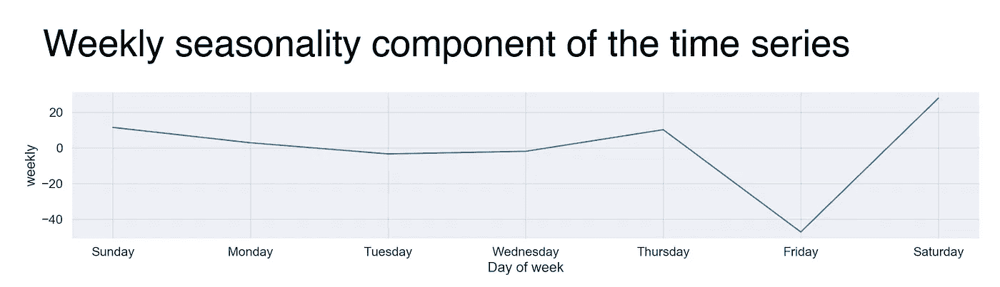

每周趋势

# 总结和结论

睡觉。这种奇妙的精神状态让我们离梦想更近，让我们的身体重新充满活力，让我们迎来新的一天。然而，尽管这很自然，经常发生，但我几乎不知道我是如何进行这种舒缓活动的。在这篇文章中，我展示了我如何通过可靠的 Fitbit 的睡眠数据来了解我的睡眠模式。

在这个唤醒实验中，我们了解到我最喜欢的睡觉时间是凌晨 1 点，我晚上花 20 到 45 分钟，睡 7 个小时左右。除此之外，我们已经看到异常检测如何揭示那些由于旅行或因为是星期五，我们比平时睡得更晚(或更早)的狂野夜晚。最后，我们用睡眠开始时间进行了时间序列分析，发现在一个月的短时间睡眠后，我现在正试图恢复所有失去的瞌睡！

对于未来的工作，我想探索我的睡眠阶段，并将数据与其他来源相关联，如天气数据或我在网飞或任天堂 Switch 的活动。但首先，我需要找到一种方法来获得这些数据(有什么想法吗？).

就是这样！感谢阅读。欣赏一首我最喜欢的与睡眠有关(其实不是)的歌曲！

那么，你怎么睡觉呢？

完整的代码可在[https://github . com/juandes/wander data-scripts/tree/master/fitbit-sleep](https://github.com/juandes/wanderdata-scripts/tree/master/fitbit-sleep)获得