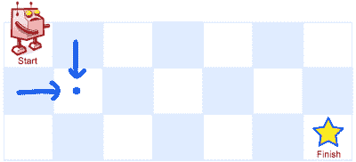

# 动态编程面试问题:独特的路径

> 原文：<https://betterprogramming.pub/interview-questions-unique-paths-d2bbeed53017>

## 有多少条通往目标的独特道路？

乔治·巴科斯在 [Unsplash](https://unsplash.com?utm_source=medium&utm_medium=referral) 上的照片

我们来看看一个好玩的小问题。

一个机器人位于一个 m x n 网格的左上角，在下图中标有“开始”。

机器人在任一时刻只能向下或向右移动。机器人正试图到达网格的右下角，下图中标有“完成”。

有多少条可能的唯一路径？

上面是一个 7 x 3 的网格。有多少条可能的唯一路径？

## 示例 1

*   输入:m = 3，n = 2
*   输出:3
*   说明:从左上角开始，总共有三种方法可以到达右下角:

1.  右->右->下
2.  右->下->右
3.  向下->向右->向右示例 2:

*   输入:m = 7，n = 3
*   产量:28
*   约束:1 <= m, n <= 100 It’s guaranteed that the answer will be less than or equal to 2 * 10 ^ 9.

Like our previous problem, we immediately know that we should use the bottom-up approach to solve this since we’re required to find *所有*可能的唯一路径。

# 基础案例

在任何自下而上的方法中，我们都需要首先建立一些基础案例。我认为基础案例是不能进一步分解的案例——它们是子问题的最简单形式。如果我可以一步计算它们，*独立于任何先前的结果*，那么它一定是一个基本情况。通常，寻找基础案例的良好开端是查看问题的最小输入大小(即，边缘案例)。在我们的例子中，这将是 m=1 和 n=1。那么如果 m=1，n=1，有多少条唯一的路径。它只会是 1。

好——我们已经建立了一个基本案例。*还有吗？*

请记住，机器人在任何时候都只能向下或向右移动。这意味着如果 m=1，n 的值并不重要——只有一条唯一的路径可以到达那里。类似地，如果 n=1，m 的值并不重要——同样，只有一条唯一的路径。

哇！这个基础案例甚至比我们建立的第一个案例更有洞察力，第一个案例仅仅是这个基础案例的一个子集！

*这个故事的寓意:在努力向上爬之前，尽可能多地寻找基本案例*

# 一路向上

对于 m>1 或 n>1 的情况，我们如何从我们的基本情况和以前的结果计算可能的唯一路径？希望这部分对你来说是直观的，就像对我一样。因为对我来说，很明显，我们可以通过将前面两个结果的解相加来计算它——可能的唯一路径来自左边，可能的唯一路径来自上面。

本质上，对于所有 n，m > 1，解[n][m]=解[n-1][m] +解[n][m-1]。

# 用 Python 实现

现在我们知道该做什么了。让我们用 Python 实现我们的解决方案。

太好了，我们已经完成了这个动态规划问题！你觉得你找到窍门了吗？