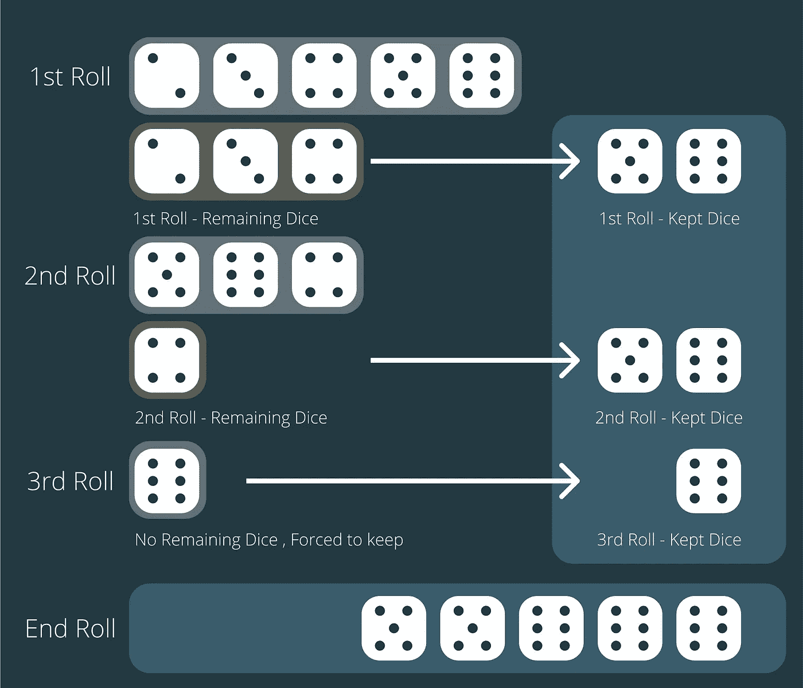
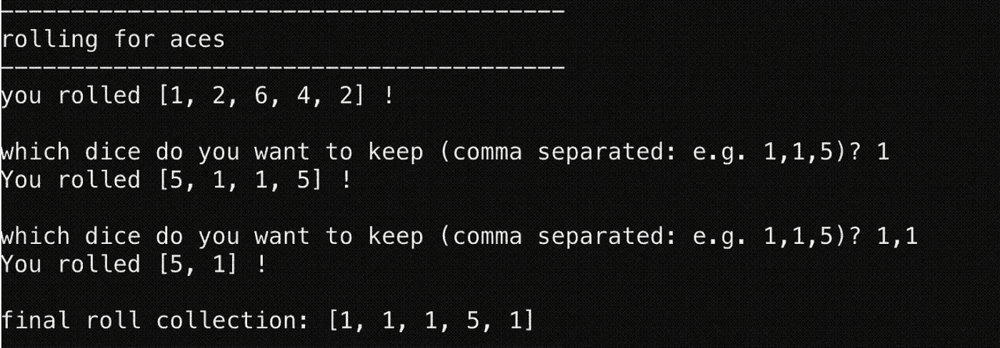
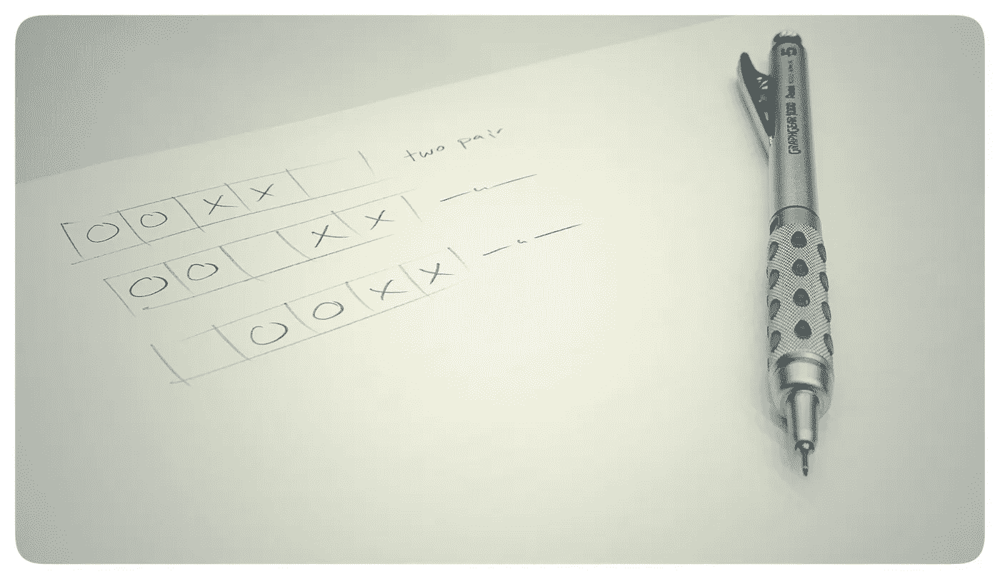
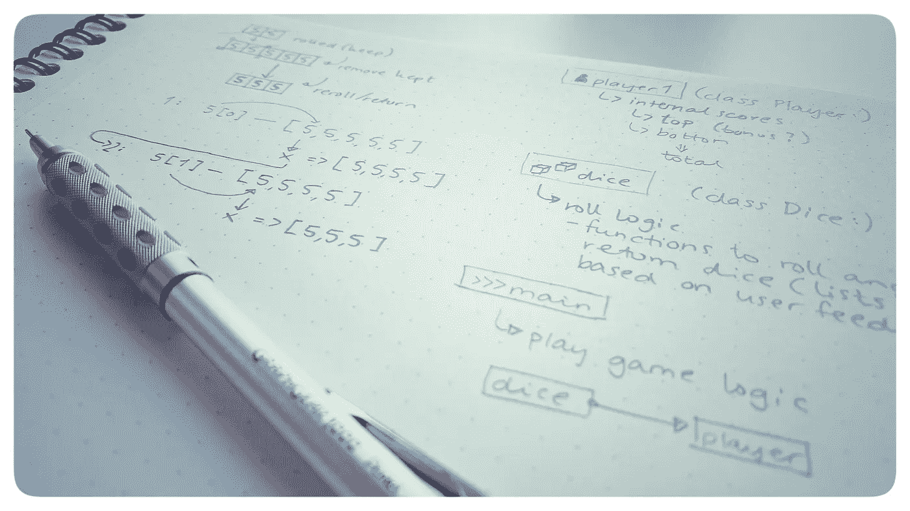

# 面试问题:用 Python 写 Yahtzee

> 原文：<https://betterprogramming.pub/interview-questions-write-yahtzee-in-python-72695550d84e>

## 随机掷骰子的游戏


在 [Unsplash](https://unsplash.com?utm_source=medium&utm_medium=referral) 上由 [hidde schalm](https://unsplash.com/@hdsfotografie95?utm_source=medium&utm_medium=referral) 拍摄的照片

也许你发现这个作品是因为你在学校做作业。在 Yahtzee 中检查骰子的结果是 Python 类的一个流行任务。这也是一个非常有趣的事情，因为有很多不同的事情需要检查。

在本文中，我将指导您完成构建功能性 Yahtzee 游戏所需的大部分代码。我们要用 Python 写完整个东西。用户在终端的键盘上与游戏互动。

我开始研究 Yahtzee，发现了一些有趣的信息。显然，世界各地的玩法都不一样。

令我惊讶的是，我们班有几个学生从未玩过 Yahtzee。所以下面简单介绍一下这个游戏。

游戏是这样的:

1.  掷出五个骰子。
2.  留下你想要的。
3.  掷出你决定*不*保留的那些。这是你的第二卷。
4.  从第二次掷骰子中保留你想要的，并将它们添加到保留堆中。
5.  最后摇一次。这是你的第三次掷骰子，你必须保留这些骰子。
6.  现在你有了最后一叠骰子，你检查它是否有效。然后，通过计算骰子上的所有点数，将您的总分数添加到该字段中。假设你掷出一个“满堂彩”(3 + 2) 6，6，6，5，5，然后在“满堂彩”区域加上 28。

这里有一个更直观的表示:



# 记分牌

记分板分为两部分。第一部分是关于收集*a(1)、二、三、四、五、*和*六*。如果你掷出三个 2，你就在你的 2 部分的记分牌上加上数值 6。

如果您在第一部分的总分≥ 63 分，您将获得 50 分的额外奖励。

下半部分有更多有趣的组合:

*   1 对
*   2 对
*   三个一类
*   一式 4 个
*   满堂红(3+2)
*   低直线度(范围从 1 到 5)
*   高直线度(范围从 2 到 6)
*   Yahtzee(所有骰子都一样，无论骰子值多少都是 50 分)
*   机会(任何骰子，只要把总数加起来。这是你什么都没得到时的安全网)

在挪威我们没有 Yahtzee 奖金。有些地方我看到过，但我不会把它包括在这个节目里。

# 我们来编码吧！


下一届学院在 [Unsplash](https://unsplash.com?utm_source=medium&utm_medium=referral) 上拍摄的照片

以下是我在写任何代码之前的想法:

*   分数将是一个包含所有值的字典。
*   我们将创建函数，检查您在一个`Roll`类中滚动了什么，然后使用它来填充字典。
*   我们希望与用户进行以下互动:



我们将以相反的顺序来做这件事。让我们从创建检查骰子是否符合任何类别的函数开始。

## 卷

下面是类`Roll`的当前 shell(到目前为止，我们只是关注于寻找掷骰子的结果，而不是骰子的滚动实际上是如何工作的):

## def check_yatzy()

让我们从 Yahtzee 开始。这个其实挺简单的。我们传递一个列表作为参数，我们知道列表中的所有条目都有完全相同的值。

如果你不熟悉集合，你可能会想你可以简单地遍历列表，检查下一项是否与上一项相同。你可以——但是使用集合要简单得多。看一看:

```
def check_yatzy(self, dice_list): if len(set(dice_list)) == 1:
        return True
    return False
```

就是这样！在一个集合中，你不能有任何相同的物品，所以，如果他们都一样，你最后只有一个物品。如果集合的长度是 1，你就有了 Yahtzee。恭喜你！

## 检查您的代码

不要忘记在编写代码时检查代码。如果你等到一切都完成了，再去修正错误会很痛苦。我用两种不同的方式检查我的代码:视觉上，使用`print`:

```
dices = Roll()
print (f'is it Yatzy? {dices.check_yatzy([1,1,1,1,1])}')
```

或者，用`assert`的幕后方式:

```
dices = Roll()
assert dices.check_yatzy([1,1,1,1,1]) == True
assert dices.check_yatzy([1,1,1,2,1]) == False
```

有了`print`,你可以写一个合适的文本，这样你阅读测试就更容易了。用`assert`你会得到一个实际的误差。挑一个你最喜欢的。

您可能还想加入一个故意的错误:

```
assert dices.check_yatzy([1,1,1,2,5]) == True
```

## def check_full_house()

“满堂红”也适用于组合，但有一些额外的步骤可以确保我们不会将其误认为四个一类:

这里发生了一些聪明的事情:

*   通过对列表进行排序，我们可以更好地控制项目。这样我们可以从一些检查中排除循环。
*   因为我们需要 3+2 来制作一个完整的房子，所以使用与 Yatzy 相同的代码并询问集合中是否有两个项目可能很有诱惑力。然而，四个一类也将具有集合长度 2(因为它具有 4+1)。
*   我们可以选择掷出满堂彩的三种不同方式(XX000，X000X，000XX ),或者我们可以询问这两种方式是否是*而不是*,您可以掷出四张相同的牌(XXXX0，0XXXX)

对于这些练习，画出可能的场景是个好主意。我去年学到的一点是，检查可能出现的情况比检查可能出现的情况更明智。当然，这是一个个案决定。



## def check_high_straight()

高顺直度的范围是从 2 到 6。(2,3,4,5,6).这意味着，再一次，我们可以用一个集合来检查是否有一个长度为 5 的集合。如果集合长度为 5，说明我们没有等值的骰子。

我们唯一要做的就是检查它是低顺子还是高顺子。如果我们对列表进行排序，我们有许多方法来检查这一点。我选择检查列表中的最后一项和第一项。

```
def check_high_straight(self, dice_list):dice_list.sort()
        if len(set(dice_list)) == 5 and dice_list[4] == 6 and dice_list[0] == 2:
            return True
    return False
```

像这样写代码，你要考虑的一件事是你希望代码被“锁定”到什么程度。如果我们按照下面的思路写一些东西:

`dice_list[len(dice_list)-1]`而不是`dice_list[4]`，我们确保我们也能支持游戏 Maxi Yahtzee(在 Maxi Yahtzee 中，你有六个骰子，而不是五个。)

我们不会在这里这样做，但是考虑如何在尽可能多的设置中使用代码是一个很好的实践。

## def check_low_straight()

你可以简单地通过改变前面的函数，算出我们是怎么做的。

## def check_four_kind()

对于这个例子，再次使用`set`来检查集合长度是否为 2 可能很有诱惑力。然而，如果玩家掷出 Yahtzee，那就排除了四张同类型的牌。如果你掷骰子，你也有四张同花。

有两种方法可以掷出四点:XXXX0 和 0XXXX。在对列表排序后，我要检查的就是[0]和[3]是否相同，或者[1]和[4]是否相同。

```
def check_four_kind(self, dice_list): dice_list.sort()
    if dice_list[0] == dice_list[3] or dice_list[1] == dice_list[4]:
        return True
    return False
```

## def check_three_kind()

检查三个同类使用我们已经提到的方法。

我们正在对列表进行排序，以便我们更容易地工作，然后我们检查我们可以获得三个同类的所有方法(00XXX，0XXX0，XXX00)。你能看到分类是如何帮助我们的吗？我们不用担心这样的事情:X0X0X 或者 0XX0X。

```
def check_three_kind(self, dice_list):

    dice_list.sort()
    if dice_list[0] == dice_list[2] or dice_list[1] == dice_list[3] or dice_list[2] == dice_list[4]:
        return True
    return False
```

## 检查两对()

如果我们再次对列表排序，有三种方法可以掷出两对。XXYY0，XXYY，0XXYY。这意味着我们必须检查三种可能的状态。

```
def check_two_pairs(self, dice_list):

    dice_list.sort()
    if (dice_list[0] == dice_list[1] and dice_list[2] == dice_list[3]) or (dice_list[0] == dice_list[1] and dice_list[3] == dice_list[4]) or (dice_list[1] == dice_list[2] and dice_list[3] == dice_list[4]):
        return True
    return False
```

## 检查一对()

这是另一个我要让你自己想出来的问题！

## 定义检查单值(自我，骰子列表，检查值)

还记得游戏的第一部分吗？你掷出 a，2，等等。当你在不同的项目上做相同的动作时，这暗示你可以创建一个方法函数来处理任何输入。

对于这个函数，我们将`dice_list`作为一个参数，并引入另一个叫做`check_value`的参数。

这意味着我们可以以`dice_list`的形式传递一个列表，然后告诉这个方法我们在寻找什么数字。

```
def single_values(self,dice_list,check_value):
    roll_score = 0
        for die in dice_list:
            if die == check_value:
                roll_score +=die
    return roll_score
```

这两个:

```
print (f'score for aces? {dices1.single_values([1,1,1,1,1],1)}')
print (f'score for twos? {dices1.single_values([1,2,4,4,2],2)}')
```

将打印以下内容:

```
score for aces? 5
score for twos? 4
```

## 与方法交互

现在我们有了这些方法，就可以开始使用了。如果我们建立一个强制设置，我们知道游戏的顺序:

1.  从 a 开始，然后是二，三，四，五，六。
2.  得到总分
3.  是奖金吗？
4.  一对，两对，三条同花，四条同花，满堂红，运气，运气。
5.  总计。

# 游戏逻辑

在玩这个游戏之前，我们需要做几件事情。


照片由 [Jukan Tateisi](https://unsplash.com/@tateisimikito?utm_source=medium&utm_medium=referral) 在 [Unsplash](https://unsplash.com?utm_source=medium&utm_medium=referral) 上拍摄

我们有两个班:`Player`和`Roll`。然后我们有`main`，在那里我们做所有的游戏。

我们已经做好了所有的检查，现在开始研究骰子的逻辑。这是外壳:

## 定义掷骰子(自我)

第一次掷骰子时，我们知道有五个骰子，数值从 1 到 6 不等。有很多方法可以做到这一点，但我将使用我最喜欢的方法之一——列出理解:

```
def roll_dice(self):
    self._current_kept_dice.clear()
    **self._current_dice_list = [random.randint(1,6) for die in range(0,5)]**
    print (f'you rolled {self._current_dice_list} ! \n') 
    return self._current_dice_list
```

该函数需要做两件事:创建列表，然后返回它。这里的`print`是可选的，但是玩家能够立即看到他们掷出了什么是很好的。

我清除保留列表的原因是，如果我们在做`roll`，我们知道这是第一次掷骰子，没有骰子可以保留。这是一轮的开始。如果我们不清除它，我们将把它带到下一轮，保留列表将继续增长。

## def keep_dice(self)

这是一个大的。我们询问用户他们想要保留哪个骰子，然后将其添加到保留的骰子堆中，并返回初始掷骰子减去他们决定保留的骰子。首先，让我们看看输入:

```
keep_input = input('which dice do you want to keep (comma separated: e.g. 1,1,5)? ')
split_input = keep_input.split(',')#if the user types nothing, keep all:
if keep_input == '':
    return self._current_dice_listsplit_input_int = [int(item) for item in split_input]for die in split_input_int:
    self._current_kept_dice.append(die)
```

一定要确保用户可以一直输入值，直到他们输入正确为止。在我的关于输入的文章[中阅读更多关于如何做到这一点的内容。](https://medium.com/better-programming/how-you-make-sure-input-is-the-type-you-want-it-to-be-in-python-521f3565a66d)

上面的代码允许用户键入他们想要保留的内容。如果他们投[1，3，4，5，6]，他们可以输入`1, 5`，例如，如果他想保留这两个。如果他什么都没打，我们就把它们都留到下一轮。

如你所见，变量`self._current_dice_roll`是在所有滚动动作中被处理的变量。

我们拆分输入，并将它们作为整数添加到一个列表中，以备将来使用。

函数中的其余代码处理分割掷出的骰子和我们想要保留的骰子。

我们循环输入并检查它是否也在当前骰子列表中。如果是，我们从当前的骰子列表中杀死它，并返回剩余的骰子以进行下一次掷骰。我们还确保选择被传递给变量`self._current_kept_dice`:

```
for die in split_input_int:
    self._current_kept_dice.append(die)#cycle through list user wants to keep
for value in split_input_int:
    if value in self._current_dice_list:
        self._current_dice_list.remove(value)return self._current_dice_list
```

我必须画一些草图，以确保我能理解这一切——尤其是从另一个列表中删除列表。



## def 重掷 _ 骰子(self，dice_list)

就像 roll 一样，它创建一个介于 1 和 6 之间的随机值，并返回一个包含这些值的列表。唯一的区别是，它是基于用户保留一些骰子后原始的剩余部分:

```
def reroll_dice(self, dice_list):
    self._current_dice_list = [random.randint(1,6) for die in range(0,(len(dice_list)))]
  print (f'You rolled {self._current_dice_list} ! \n')
  return self._current_dice_list
```

## def get_current_dice(self)和 def get _ keeped _ dice(self)

我们有几个函数来获取一些信息。这两个函数将返回我们设置的不同的变量来存储骰子。

```
def get_current_dice(self):
    return self._current_dice_listdef get_kept_dice(self):
    return self._current_kept_dice
```

## def forced_keep(self，dice_list)

该功能将强制将骰子添加到保存的骰子列表中。这是在你第三次掷骰子后使用的。

## 把所有这些放在一起玩游戏

我们想要的交互看起来像这样:


是我们实际掷骰子的游戏。我们可以将它分成两部分:一部分用于顶部，一部分用于底部。现在让我们把注意力集中在顶部。

```
def main():
    game_list_top = ['aces' , 'twos' , 'threes' , 'fours' , 'fives' , 'sixes']
    game_list_top_values = [1,2,3,4,5,6]
```

第一个列表包含我们想要检查的可读名称。这些值是我们正在检查的值。我们想用“ace”来填充玩家字典:如果他们掷 1，1，1，就得到三分。

代码文件中的注释应该能为你解释游戏的玩法。以下是最新和最棒的代码要点:

## 玩家等级

大多数玩家类只是保存分数，并拥有可以存储这些值的模块。

## main.py

## 滚动类

# 完成我们开始的事情


照片由 [Jeffrey F Lin](https://unsplash.com/@jeffreyflin?utm_source=medium&utm_medium=referral) 在 [Unsplash](https://unsplash.com?utm_source=medium&utm_medium=referral) 上拍摄

我现在要你做的是写游戏的剩余部分。

首先，您需要包装检查骰子列表所需的函数。我们已经做了很多。

然后你需要想办法把游戏的底层部分加入到游戏性中。我可能会把滚动写到一个函数中，而不是直接放在`main()`中。

你已经得到了最高分和奖金。当你完成了底部的部分，你就可以循环通过`dict`并加上`sum`。

*提示:我们已经用 print 编写了一个方法来实现这一点。*

该代码不考虑用户错误。尽情享受吧！

感谢阅读！