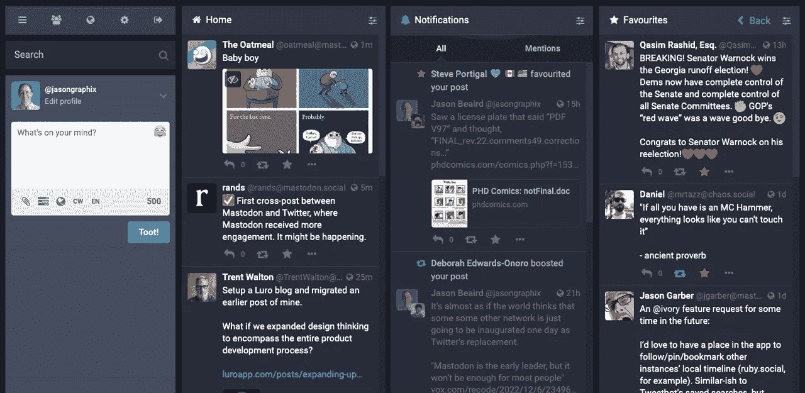
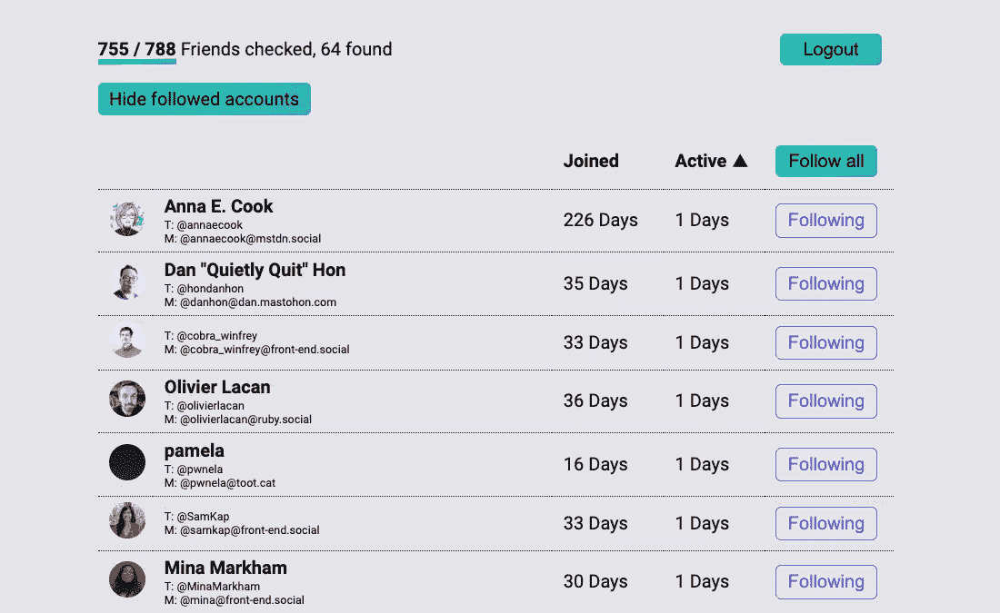
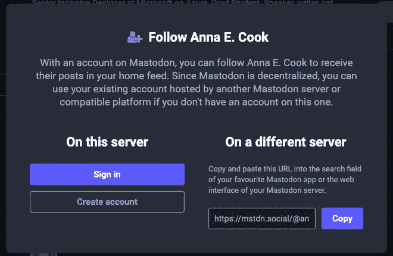

# 走进 fevariety:乳齿象入门

> 原文：<https://betterprogramming.pub/into-the-fediverse-getting-started-with-mastodon-f15f9b70eb24>

## 知道有什么不同吗

就像掉在水泥地上的大瓷水槽一样，Twitter 的用户群已经支离破碎。不，这不是另一篇关于马斯克勋爵和他本周编造的任何追逐影响力的标题的观点文章。这是我到目前为止所了解到的关于联合社交网络的总结，在这个庞大的 Twitter 社区中，相当大的一部分已经找到了避难所。

# 回首

很容易认为 Twitter 是最早的社交网络之一，但在最初几年，大多数人并不使用这个平台。我是在 2007 年 1 月加入的，一个月前第一版[美丽网页设计的原则](https://amzn.to/3VMn4CC)出版了，两个月前我去奥斯汀参加 SXSW Interactive，这是我参加的许多会议中的第一个。我已经通过 RSS 和各种即时通讯平台与业内同行建立了联系。即使我们笨拙地用第三人称通过短信向 40404 发推文，Twitter 的第一波采用来自已经知道如何在线分享的用户，以及分享对早期网络社区的重要性。

忘掉那些垃圾帖子、机器人和政治姿态吧，早期的 Twitter 是博客文化的延伸。链接到有趣的文章或关于写作的内容——就像这个关于[hCard 微格式](https://jasongraphix.com/journal/hcard-mapping/)的链接——是一种常态。

# 为什么是乳齿象？为什么是现在？

虽然我不喜欢 Twitter 的发展方向，但我不认为它会彻底崩溃。我也不打算在短期内删除我 15 年前的 Twitter 账户。那么，为什么要花时间去了解乳齿象呢？

我肯定不需要另一个社交档案来为没有发帖而感到内疚，这些年来我已经看到足够多的社交网络倒闭，尝试了所有的 Twitter 替代品。不过乳齿象和[驱动它的 ActivityPub 协议](https://www.w3.org/TR/activitypub/)自 2016 年以来一直在稳步发展，远远早于所有#birdsite 戏剧。

 [## 象牙(@ivory@tapbots.social)

### 附:1 图片你好 Fe diversity 的人！你们中的一些人可能已经听说了乳齿象的新客户，象牙，在…

社交机器人](https://tapbots.social/@ivory/109433914793802708) 

*Tapbots(推特机器人背后的团队)* [*最近在乳齿象*](https://tapbots.social/@ivory/109433914793802708) *上宣布他们正在开发乳齿象客户端。*

对我来说，加入乳齿象是一个个人研究项目。说实话，这也有点专业。我管理着一个产品设计师团队，他们在一个软件平台上工作，帮助人们和品牌在社交媒体上建立联系。因此，尽管这里的所有观点都是我自己的，但了解社会的未来肯定会影响我的生计。

# 创建帐户

我试着创建了几次乳齿象档案，但就是过不了选择服务器这一步。如果你也在纠结这个，深呼吸。这就像选择电子邮件提供商一样。您可以在任何服务器上关注用户并与之互动。如果你愿意，你甚至可以把你的账户转移到另一个账户。与 Twitter 不同，每个服务器(通常也称为实例)都有自己的规则和审核策略。只要你符合这些标准，我建议你选择一个有大量用户的通用服务器。

一些网站，如[mastosdon . social](https://mastodon.social/about)，已经停止接受新注册，但还有一些流行的通用服务器选项，如:

*   [home.social](https://home.social/about)
*   [mstdn.social](https://mstdn.social/about)
*   [mas.to](https://mas.to/about)
*   [techhub.social](https://techhub.social/about)
*   [universeodon.com](https://universeodon.com/about)

我…没有走那条路。在谷歌搜索专注于 UX 的乳齿象服务器时，我偶然发现了 [uxd.social](https://uxd.social/about) ，一个“UX 和用户界面设计师之家”。除了标语和标志，没有任何内容，只有 112 个用户。然而，我喜欢这个域名，服务器也接受注册，所以我在 11 月 27 日建立了[@ jasongrafix @ uxd . social](https://uxd.social/@jasongraphix)并直接进入了。

 [## 杰森·伯德(@jasongraphix@uxd.social)

### 目前为止对乳齿象很感兴趣。为了减少我设计的每个产品中的摩擦，我付出了如此大的努力，服务器…

uxd .社交](https://uxd.social/web/@jasongraphix/109427692279469808) 

虽然到目前为止我对我的服务器选择很满意，但是使用较小的实例也有不利的一面。搜索结果通常是有限的，性能可能较慢，软件版本可能不是最新的，并且在您自己的实例上更容易发现用户。

不过，值得一提的是，[运行自己的乳齿象服务器](https://docs.joinmastodon.org/user/run-your-own/)也是一种选择。我还没陷得那么深，但是像[伊森·马科特](https://follow.ethanmarcotte.com/@beep)这样的个人和[欧盟委员会](https://social.network.europa.eu/@EU_Commission)、[德克萨斯观察家](https://texasobserver.social/@TexasObserver)和 [TapBots](https://tapbots.social/explore) 这样的组织都在他们自己的服务器上发帖。一些公司，比如 Thoughtworks，允许所有员工在他们的乳齿象实例上创建账户，类似于公司的电子邮件地址。我认为在接下来的几年里，我们将会看到更多的组织跟随 Thoughtworks 的脚步。

# 寻找可追随的客户

就像在 Twitter 上一样，你保持活跃的几率，以及你对乳齿象的整体体验取决于你与谁互动。你可以通过添加你当前在其他社交网络上关注的任何人来快速启动。有很多工具可以帮助你在乳齿象上找到你的 Twitter 好友。我发现的最好的一个叫做 [Movetodon](https://www.movetodon.org/) 。

如果你够幸运(或者有点书呆子气)，你可能会发现你的社区中有相当比例的人已经有了乳齿象档案。不过，现在有很多休眠账户，所以我建议先按活跃账户分类。在那里，你可以关注你朋友推荐的有趣的账户(类似于转发)，或者看看他们的关注列表。

从乳齿象开始追踪报道的过程目前有点复杂。鉴于他们在我上面的 Movetodon 截图的顶部，假设你想关注[@ annaecook @ mstnd . social](https://mstdn.social/@annaecook)。如果您的个人资料碰巧也在`mstdn.social`上，您只需点击关注即可。如果你不在那个服务器上，你会进入他们的个人资料页面，点击关注，就会看到这个可爱的模型。

然后，您需要点击复制，导航回您的个人资料，点击搜索，粘贴完整的个人资料地址，返回一个结果，然后从那里继续。我厌倦了这种工作流程，开始寻找简化它的方法。还记得书签吗？嗯，如果你将[乳齿象关注书签](https://kvnco.github.io/mastodon-follow-bookmarklet/)添加到你的收藏夹，你可以从任何个人资料中点击它，从你的实例中获得一个弹出窗口来关注该用户。省了一堆点击。

# 好吧，那还有什么不同呢？

在很大程度上，我的乳齿象主页感觉很像早期的 Twitter。没有任何算法或付费推广，它只是我关注的账户中按时间顺序排列的帖子列表。尽管有一些细微的差别。我注意到我的一个老朋友从 2017 年开始有了一个账号，所以我想问一些小技巧。他是这么说的:

*   大量使用[内容警告](https://docs.joinmastodon.org/user/posting/#cw)！这些会把你的文章隐藏在“窗帘”后面，读者可以点击进入。您设置警告的文本。我见过这种方法被用于各种场合，从食物照片等相当温和的东西到暴力描写等等。
*   大量使用[标签](https://docs.joinmastodon.org/entities/Tag/)，并为其命名以方便访问(用 foobarbiz 代替 FooBarBiz)
*   DMs 并不是真正的 DMs ，但看起来更像是用户之间的半公开帖子。你可以通过提及他人来将他们标记到 DM 中。因此，相对于许多其他实现，这是一个奇怪的特性。我倾向于不使用它们，可能只是偶然使用它们。绝对不要期望它们是私有的。他们不是。
*   如果你要把一堆帖子串在一起，惯例似乎是把回复帖子设置为[某种可见性，而不是“公开”](https://docs.joinmastodon.org/user/posting/#privacy)。
*   您的实例的[本地时间线](https://docs.joinmastodon.org/user/network/#timelines)可能会出现一些有趣的内容(特别是如果您在一个特定的以亲缘关系为中心的实例上)。给它一个卷轴，看看会出现什么！

对我来说，乳齿象社区最美好的事情是那里的每个人都想帮助别人成功。关于乳齿象入门，我推荐关注 [@feditips@mstnd.social](https://mstdn.social/@feditips) 和[@乳齿象迁移@乳齿象网上](https://mastodon.online/@mastodonmigration)。

快乐̶ [t̶o̶o̶t̶i̶n̶'出版](https://gizmodo.com/mastodon-toot-retired-twitter-tweet-equivalent-1849786221)如果你有任何问题，请随时联系。