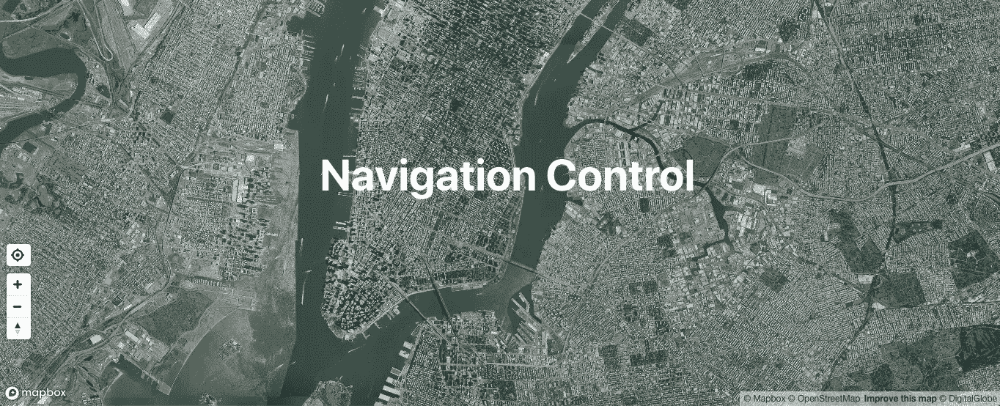
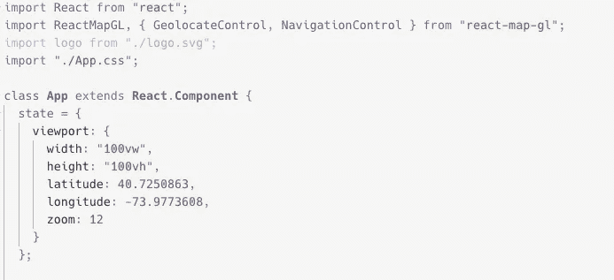
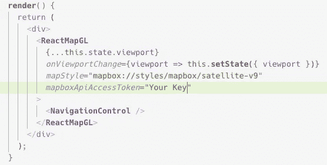
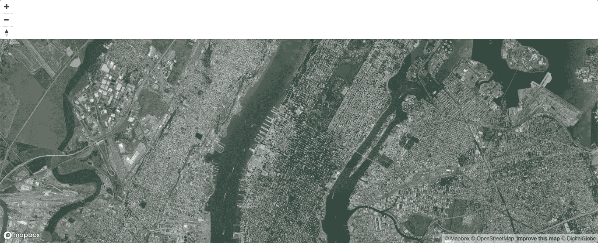
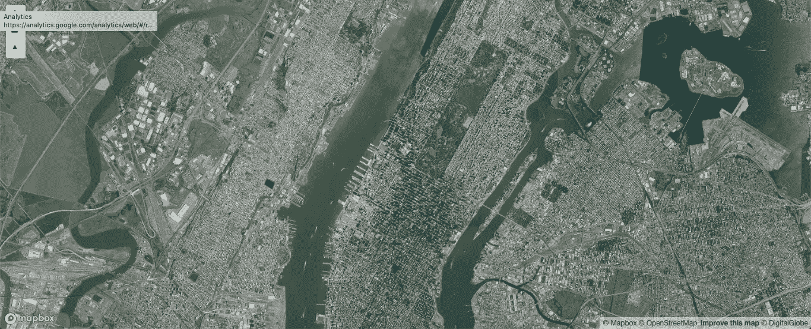
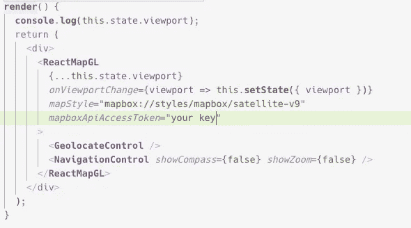
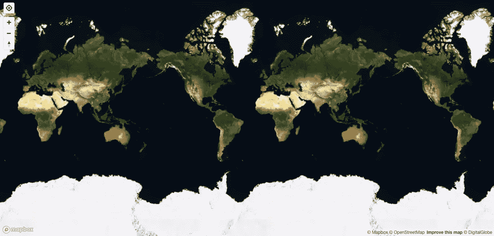
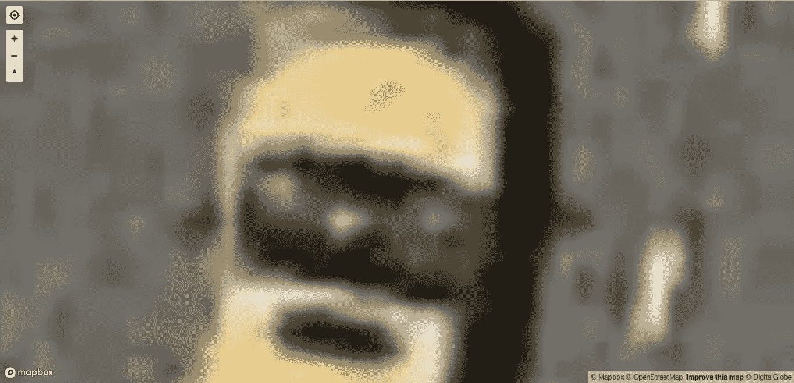

# React 地图框 GL JS 简介

> 原文：<https://betterprogramming.pub/into-to-react-mapbox-gl-js-b7d827f7d7d6>

## 导航控制、缩放和指南针入门



# 第一

如果您对有关 React [MapBox](https://docs.mapbox.com/mapbox-gl-js/api/) 和如何操作的其他文章感兴趣，请参见“[React MapBox GL JS 入门—使用 GeolocateControl](https://medium.com/better-programming/react-mapbox-gl-js-getting-started-with-geolocatecontrol-18c08a5410d) ”、“[MapBox GL JS 入门:使用地理定位的用户位置](https://medium.com/better-programming/getting-started-with-mapbox-gl-js-user-location-with-geolocation-f32c3e323526)”和“[React 和 MapBox GL JS 入门—使用弹出组件](https://medium.com/better-programming/getting-started-with-react-and-mapbox-gl-js-using-popup-component-with-marker-d76c72824423)”

# 导航控制

React MapBox 为您提供了使用标准功能制作地图的一切。地图用户体验的很大一部分是以最佳方式导航地图的能力。你会注意到谷歌地图和大多数地图通常都有放大和缩小按钮，以及一个用于用户定位的指南针。NavigationControl 做到了这一点，而且实现起来超级简单。

# 步伐

如果您还没有一个 React Map GL 项目，请启动一个。

使用命令行:

1.  (或者随便你怎么称呼它)
2.  `create-react-app map`(也随你怎么称呼。我选择了地图。)
3.  `cd map`然后在你的文本编辑器中打开它
4.  `npm start`现在，您将看到经典的 React 应用程序登录页面

因为我们使用的是 Mapbox GL JS 库，所以我们也需要安装它。

`npm install react-map-gl`(这将库下载到您的应用程序中)

否则，您只需将它导入到地图组件中，如下所示:



然后你要做的就是在你的`ReactMapGL`组件中调用它。



继续前进，看看我们有什么。



所以导航看起来不太好。我们换个风格吧。

App.css。

```
.mapboxgl-ctrl-group {
    width: 30px;
    margin: 10px 0 0 10px;
}
```

为什么这是地图的风格，我不知道。这样好多了。



测试一下。

# 选择

`NavigationControl` 组件接受多个选项。这里有一些关于它们的 GitHub 文档。

但是我们需要知道的是，显示缩放按钮和指南针是默认的。如果出于某种原因您不想显示它们，您可以将它们设置为`false`。



这使得我们所做的一切都变得毫无用处。


# 一款云视频会议软件

所以我们的地图有最小的缩放比例。如果你在我们的渲染下(见上图)玩地图，你会看到按钮是如何影响缩放的。

## 最小缩放

如果你把我们的地图一直缩小(打开你的 inspect，这样你就可以看到用 console.log 打印的我们的状态对象)，你会看到你能缩放的最小值是`0.359749446955114`。它展示了整个世界的一面。



## 最大缩放

如果你一直放大到某个地方(我会放大到纽约)，你会看到最大放大倍数是`24`。下面的照片是纽约出租车的前端。变焦能力是疯狂的！



## 小跟班

`+`和`—`按钮简单地增加和减少变焦 1 倍。

## 指南针

你会注意到你可以旋转地图，让它指向你想要的任何方向。

您可以通过按住 shift 键并单击和拖动地图来完成此操作。如果您单击指南针按钮，地图会重新定向到标准的南北方向。

# 结论

又一个免费的工具让我们实现，这给了我们的地图基础。我不能强调使用 React MapBox GL 创建一个基本地图是多么容易和快捷。您可以在五分钟内拥有多种地图样式的基本地图功能。加载标记和使用弹出窗口也非常简单。带上你的地图！