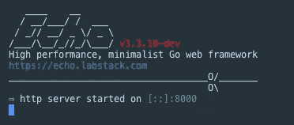
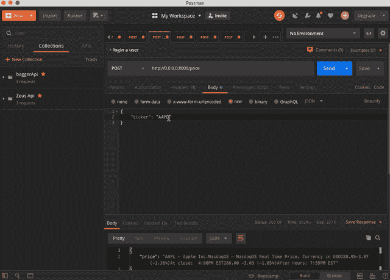

# 用 Echo 框架构建 Golang RESTful Stock API

> 原文：<https://betterprogramming.pub/intro-77f65f73f6d3>

## 创建一个速度惊人的股票 API


马库斯·斯皮斯克在 [Unsplash](https://unsplash.com/s/photos/stocks?utm_source=unsplash&utm_medium=referral&utm_content=creditCopyText) 上拍摄的照片

本文描述了如何使用一个从 Yahoo Finance 返回股票数据的框架来构建一个 Golang restful API



回声服务器

# 回声框架

> *用于 Go (Golang)的快速且不常见的 HTTP 服务器框架。比其他产品快 10 倍。*
> 
> *-回声*

Echo 使得构建 web 应用程序和 Restful APIs 变得非常简单。如果你有 Python 背景，你可能会发现类似 Flask 的框架。Echo 没有附带电池，没有像 Django 这样的框架生成器，除了你自己，没有人能构建你的应用程序！

# Web 应用程序结构

首先，您需要考虑项目的文件夹和文件结构。我想遵循 MVC 架构，所以我们应该有模型、视图和控制器。对于这个 Restful API 示例，我们不需要视图或模型。

我的文件夹将遵循以下结构:

*—控制器
— server.go*

# server.go

这是您的应用程序的入口点。您可以将其重命名，但该文件应该是您的应用程序的主包。

在围棋编程中，包很重要。Go 程序只能从主包(`package main`)开始:

[https://gist . github . com/better programming/f 99 ebbc 60 b 163 ab 531634 ad 4a 46 e 11 c 4 . js](https://gist.github.com/BetterProgramming/f99ebbc60b163ab531634ad4a46e11c4.js)

`server.go`应该包括主函数(`func main`)，这是 Go 程序的入口点。我导入了两个包到`server.go`:

*   `github.com/labstack/echo` : echo 包是使用 echo 框架
*   `github.com/labstack/echo/middleware`:来自中间件 echo 的子包。

在主函数中，我用下面的代码初始化了`echo`对象:

```
e := echo.New()
```

下面的代码在我们的应用程序中使用了中间件。我使用三个中间件:

恢复中间件从链中任何地方的混乱中恢复，打印堆栈跟踪，并将控制交给集中式`[HTTPErrorHandler](https://echo.labstack.com/guide/customization#http-error-handler)`。

*   记录器用于服务器日志。
*   CORS 为 web 服务器提供跨域访问控制，从而实现安全的跨域数据传输。

我在端口 8000 上启动了 echo web 服务器。(您可以选择任何您喜欢的开放端口)我还将启动功能封装在一个记录器中，以捕捉任何致命错误。

```
e.Logger.Fatal(e.Start(":8000"))
```

现在，app 在`localhost:8000`和`0.0.0.0:8000`运行。但是您可能看不到任何东西，因为您没有处理程序方法来管理请求。

让我们在`server.go` **:** 中创建一个 handler 方法

现在，如果你去`localhost:8000`，你会看到带有“你好，Word”的 HTML 页面。

之后，我将为应用程序创建一个控制器。这个控制器用于从雅虎财经抓取股票数据。Echo 不需要您为处理程序创建单独的文件。然而，将每个处理程序方法放在一个文件中是混乱的，并且从长远来看是不可维护的。我们希望我们的功能和测试有一个集中的位置。这是大多数 Go 开发人员采用的一种风格指南，以产生干净和可维护的代码，使程序更加模块化，使下一个开发人员更容易阅读。

我首先为控制器创建一个名为`controllers`的新包。让我们在控制器下创建`price.go` rest 控制器文件。

*控制器
| price.go*

您可能会在这个文件中看到一些额外的流恢复代码。我不想过多地解释我为什么要这样做，但是我从 Aldo Giambelluca 那里找到了一个有用的解释，解释了为什么它如此重要:

> 想想木卫一。像水龙头一样关闭:你可以得到水，但一旦它出来了，它就出来了。
> 
> *-阿尔多·詹贝鲁卡*

 [## Golang:从 io 读取。ReadWriter 而不丢失其内容

### 这里的场景是:你有一些在你的控制器动作之前运行的代码，读取请求的主体，做一些事情…

medium.com](https://medium.com/@xoen/golang-read-from-an-io-readwriter-without-loosing-its-content-2c6911805361) 

# **Price.go**

现在我们可以如下使用`server.go`中的`price controller`方法:

在 Echo 框架中，每个控制器都有一个独立的结构。不能在整个包中创建同名的方法。

# 演示

我在演示中使用了 Postman，但是您也可以使用任何工具发送一个正文中包含 JSON 数据的 HTTP 请求。

我们从运行服务器开始:

`go run server.go`


启动 Echo 服务器

然后我们在`Postman`中创建一个请求。在我们的代码中，我们创建了`ticker:name`作为请求体的键值对。以下是一些示例几何体:

```
## Amazon ticker{ 
"ticker" : "AMZN" 
} ## Apple ticker{ 
"ticker" : "AAPL" 
} ## Tesla ticker{ 
"ticker" : "TSLA" 
}
```



耶！

# **结论**

我们用 MVC 架构在 Echo 中创建了一个 Rest API！

我们现在理解了为什么我们以某种结构组织我们的文件——为其他开发人员增加可读性和可维护性。我们也知道如何用更模块化的代码在我们的服务器上创建其他端点。

要查看该项目的源代码，您可以访问我的 Github repo。

我希望这能帮助你建立有趣的项目！