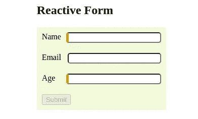
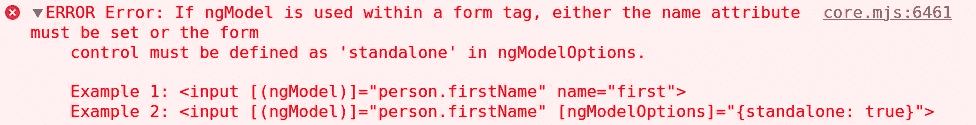

# 角反应形式介绍

> 原文：<https://betterprogramming.pub/intro-to-angular-reactive-forms-fc5cd636ce1f>

## [棱角分明的](https://medium.com/@lorenzozar/list/angular-5496c492a185)

## 通过一步一步地建立一个简单的形式来探索角反应形式


照片由[帕里什·弗里曼](https://unsplash.com/@parrish?utm_source=medium&utm_medium=referral)在 [Unsplash](https://unsplash.com?utm_source=medium&utm_medium=referral) 上拍摄

Angular 提供了两种通过表单处理用户输入的主要方法:反应式和模板驱动式。这两种方法都建立在通用表单 API 之上。

在这篇文章中，我将按照反应式方法构建一个表单，也称为模型驱动表单。



带有验证器的简单反应形式

我写了一篇[介绍 Angular 模板驱动的表单](/introduction-to-angular-template-driven-forms-cd3a1b10380a)，其中我使用模板驱动的方法构建了相同的表单。

我发现使用这两种方法构建相同的表单有助于更好地理解差异。

# 反应式方法概述

根据[文档](https://angular.io/guide/forms-overview#choosing-an-approach)，反应式表单“提供对底层表单对象模型的直接、明确的访问。

如果表单是应用程序的关键部分，或者你已经在使用反应式模式构建应用程序，那么就使用反应式表单。”

此外，他们补充说，反应式表单比模板驱动的表单更健壮:它们更具可伸缩性、可重用性和可测试性。

## 不要认为这是板上钉钉的事

关于最佳方法的争论可能永远不会有结果。

你更喜欢模板驱动的表单还是反应式表单？

在 Angular Plus 秀播客中，他们给了谷歌 Angular 开发者专家、IdeaBlade 总裁兼联合创始人沃德·贝尔空间。

Ward Bell 多年来一直使用模板驱动的表单，并且是该领域最好的专家之一。

确保你听了这一集来形成(lol)你的观点。

# FormsModule 和两个指令

首先，我们需要记住导入 [ReactiveFormsModule](https://angular.io/api/forms/ReactiveFormsModule) ，因为它“导出了反应式表单所需的基础设施和指令。”

因此，我们在`app.module.ts`中导入`ReactiveFormsModule`。

```
import { ReactiveFormsModule } from '@angular/forms';
```

并在`@NgModule.`的进口报关

```
imports: [BrowserModule, FormsModule, ReactiveFormsModule],
```

注意，`FormsModule`在那里是因为同一个应用程序在另一个组件中使用了模板驱动的表单。

如果我们两个都需要，我们应该两个都进口。

然而，`FormsModule`很重要，因为`NgModel`和`NgForm`指令都是从`FormsModule`导出的。

# 构建表单元素

理论上，我们可以从类或者模板开始。

然而，“反应式表单提供了一种模型驱动的方法来处理值随时间变化的表单输入。”

在反应式表单中，从类开始更自然，尽管有些人可能更喜欢从模板开始，这完全没问题。

由于介绍了角度模板驱动的表单，我从一个通用的表单元素开始；我将遵循这种方法来说明一些事情是相同的。

# 通用表单元素

角度形状中的一般形状元素可能如下所示:

```
<div>
  <label for="email">Email</label>
  <input type="email" id="email" [formControl]="email" />
</div>
```

再一次，这是非常普通的 HTML，除了`[formControl]=”email"`。

`formControl`绑定来自`FormControlDirective`，后者来自我们上面导入的`ReactiveFormsModule` 。

如果您熟悉角度语法，这并不新鲜，因为它看起来类似于属性绑定。

## 它绑定到什么？

它绑定到类中的 email 属性。

导入`FormControl`后，我们可以给`email`分配一个新的`FormControl`实例。`FormControl`“跟踪单个表单控件的值和验证状态，” [angular.io](https://angular.io/api/forms/FormControl#formcontrol) 。

```
import { Component } from '@angular/core';
import { FormControl } from '@angular/forms';...
export class ReactiveFormComponent {
  email = new FormControl('');
}
```

在这种情况下，通过使用`new FormControl('')`，我们将`email`的初始值设置为空字符串。

多亏了`FormControl`，我们可以监听、更新和验证表单元素的状态。

您可以获得双向绑定的所有好处，甚至更多，比如验证。

我们将很快进行验证。

## 显示表单控件值

您可以通过使用插值和模板中的`value`属性轻松显示该值，如下所示:

```
<p>Value: {{ email.value }}</p>
```

第二种方式是“通过`valueChanges` observable，您可以使用 AsyncPipe 监听模板中表单值的变化，或者使用 subscribe()方法监听组件类中表单值的变化”， [angular.io](https://angular.io/guide/reactive-forms#displaying-a-form-control-value) 。

# 从一种元素到一种形式

从上面的通用元素开始，我们可以创建以下形式:

```
import { Component } from '@angular/core';
import { FormGroup, FormControl } from '@angular/forms';...
reactiveForm = new FormGroup({
    name: new FormControl(''),
    email: new FormControl(''),
    age: new FormControl(''),
});
```

注意，我们必须从@angular/forms 导入每个组件中的`FormGroup`,在那里我们要创建一个新的`FormGroup`实例。

我们在类中创建了一个`FormGroup`实例。FormGroup”跟踪一组 FormControl 实例的值和有效性状态。

然后，我们需要使用属性绑定将模板中的`FormGroup`模型和视图关联起来。

至于模板驱动的表单，我们希望有一种方法将表单作为一个整体来处理，而不是处理每个元素。

初始反应形式

## 一阶差分

我们可以在`form`标签中看到模板驱动表单的第一个区别。我们不再使用参考变量了。

## 第二个区别

第二个区别是`formControlName`。

由`FormControlName`指令提供的`formControlName`输入将每个单独的输入绑定到`FormGroup`、 [angular.io](https://angular.io/guide/reactive-forms#grouping-form-controls) 中定义的表单控件。

但是，表单组实例为模型值提供了真实的来源。

## 第三个区别

第三个区别是我们不需要在输入标签中使用 name 属性。

你的应用不会崩溃，但是你会在你的控制台上看到一个难看的错误。



当我们忘记模板驱动的表单中的 name 属性时，控制台中的错误。

顺便提一下，你也可以通过使用一个[表单数组](https://angular.io/guide/reactive-forms#grouping-form-controls)将控件分组到一个表单中。本帖不讨论这个。

# 确认

目前，我们还没有确认。

反应式表单通过称为验证器的特殊函数来处理验证。Angular 提供了[内置的验证器](https://angular.io/api/forms/Validators)，您可以使用现成的验证器。

使用验证器最简单的方法是将它们作为第二个参数传递给`FormControl`。

```
reactiveForm = new FormGroup({
    name: new FormControl('', Validators.required),
    email: new FormControl(''),
    age: new FormControl('', [
      Validators.required,
      Validators.max(99),
      Validators.min(18),
    ]),
});
```

在代码片段中，我添加了两个验证器。第一个使`name`成为必需。第二个验证器检查`age`是否在 18 和 99 之间。

通过更新“提交”按钮，如下所示:

```
<button type="submit" [disabled]="reactiveForm.invalid">Submit</button>
```

我们确保只有当表单有效时，按钮才是活动的，例如，满足验证器中的条件。

当内置验证器不够用时，我们甚至可以为更复杂的情况创建[定制验证器](https://angular.io/guide/form-validation#defining-custom-validators)。

# 快速小结

Angular 提供了两种主要的构建表单的方法:反应式和模板驱动式。在这篇文章中，我们探讨了反应式方法。

这两种方法都建立在通用表单 API 之上。

1.  在`app.module.ts`中导入`ReactiveFormsModule`
2.  使用`new FormControl()`实例化一个表单控件
3.  使用`new FormGroup()`创建一组表单控件
4.  通过属性绑定`[FormGroup]="myFormGroupName"`将类中的`FormGroup`模型与视图绑定
5.  导入`ReactiveFormsModule`后`<form>`标签默认实现`NgForm`

可以随意看看 GitHub 上的[代码。](https://github.com/lorenzojkrl/formication/tree/main/src/app/components/reactive-form)