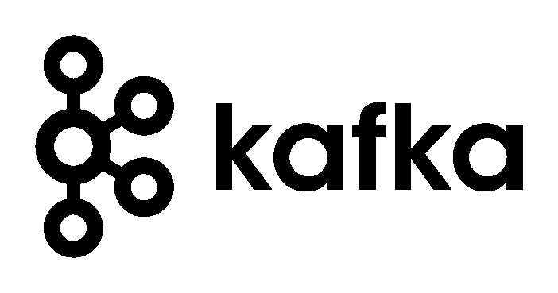
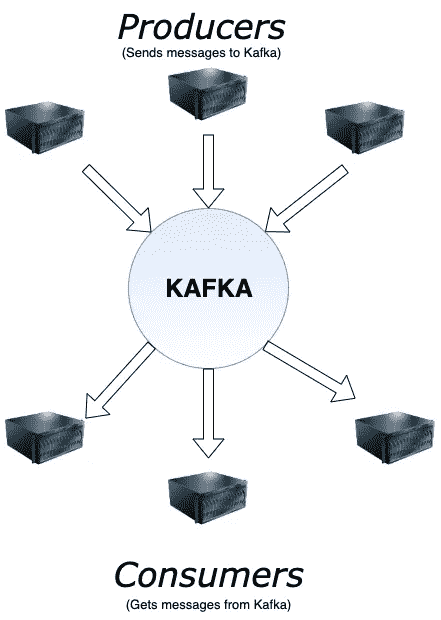
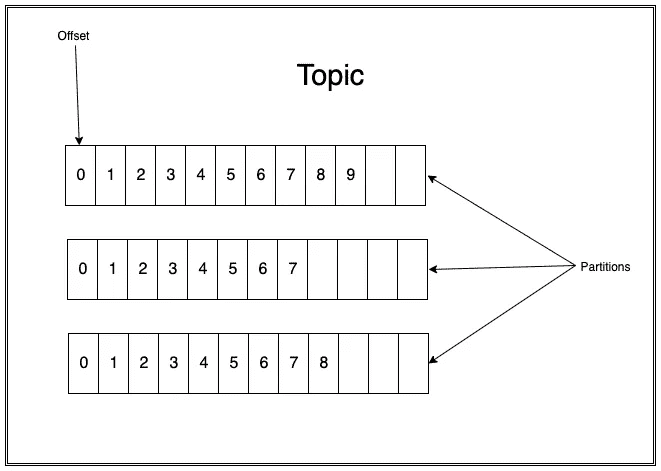
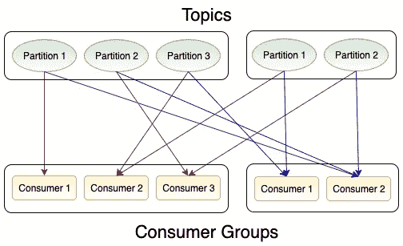
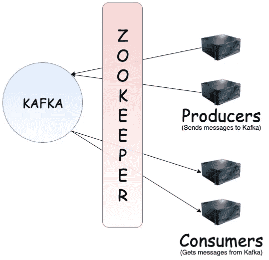

# 阿帕奇卡夫卡简介

> 原文：<https://betterprogramming.pub/intro-to-apache-kafka-72bb3cb43d2e>

## 了解流行的消息系统

阿帕奇卡夫卡标志

这篇文章是关于一个被称为 Kafka 的流行信息系统。如果你不知道卡夫卡是什么，那你来对地方了。

如果您熟悉一种编程语言而不熟悉另一种，您不必担心，因为这是独立于语言的。我们将讲述基础知识，它是如何工作的，以及系统中组件的术语。

# 卡夫卡是什么？

Kafka 是一个分布式信息系统。它遵循发布-订阅模式。

在发布-订阅模式中，被称为*发布者的发送者*在接收者不知情的情况下将消息发布到队列或类中。*接收者被称为订阅者或消费者，在发送者/发布者不知情的情况下订阅某一类别的消息。*

*使用 Kafka，我们可以在进程、应用程序、服务等之间发送消息。在 Kafka 中，发布者将消息推入队列，而消费者通过保持偏移量来收听消息。偏移量通常是递增的。消息会在队列中保留一段配置中定义的时间，因此订户可以重置偏移量并再次读取之前的消息。*

*卡夫卡的一个重要特点是容错。它跨数据中心维护队列中消息的多个副本。*

**

*图 1:卡夫卡系统的基本示意图*

# *消息的组成部分*

*该消息也被一些网站称为*记录*。该信息由三个主要部分组成:*

1.  ***时间戳**:消息的时间戳。*
2.  ***Key** :这是一个可选参数，包含关于分区的信息(我们将在下一段详细讨论)。*
3.  ***值**:这是实际要传输的消息。数据是字节数组的形式，所以可以包含任何对象。*

# *主题和分区*

*卡夫卡的信息可以分为多个类别，称为*主题*。所有信息都被组织成主题。发布者将消息推送到一个或多个主题，消费者从他们想要收听的一个或多个主题中消费消息。*

*每个主题又进一步划分为*个分区。*每个分区包含的消息顺序不变。分区内的每条消息都由唯一的偏移量来分配和标识。一个主题中的多个分区允许多个使用者并行使用来自单个主题的消息。生产者还可以在消息中发送分区信息，即消息应该被分配到的分区。*

**

*图 2:卡夫卡的主题*

# *消费者群体*

*消费者可以从任何偏移量开始读取消息，因此他们可以随时加入 Kafka 集群。消费者也可以成为消费者群体的一部分。组中的每个消费者可以从特定分区读取消息，Kafka 确保一条消息只被组中的一个消费者读取。*

*这在需要监听 Kafka 的服务有多个服务器的情况下很有帮助，并且它还提高了性能，因为单个主题的多个分区被并行读取。*

**

*图 3:消费者群体*

# *经纪人*

*Kafka *代理*是 Kafka 服务器的同义词。*

*Kafka 集群由一个或多个 Kafka 代理组成。每个代理包含来自一个或多个主题的分区。*

*它从生成器接收的消息通过分配一个偏移量存储在分区中。它允许消费者通过偏移量和主题来阅读消息。*

# *动物园管理员*

**动物园管理员*是最重要的组成部分之一，充当着经纪人和消费者之间的一层中介。*

*对于代理，它存储关于每个代理可以处理多少请求的信息，并基于此将请求路由到代理。它还维护每个代理的状态——即它是否活动。除此之外，它还保持每个主题的副本同步。*

*对于使用者，它存储每个使用者的偏移量，即每个使用者使用了多少条消息。*

**

*图 4:动物园管理员*

# *结论*

*卡夫卡有很多优点。它提供高吞吐量、低延迟和容错能力。除此之外，它还具有可扩展性，因为添加新的代理/节点非常容易。它还允许以高并发性读取和写入消息。*

*对于像微服务这样的东西，Kafka 是一个非常好的架构选择，在微服务中有许多应用程序/服务需要相互交互。*