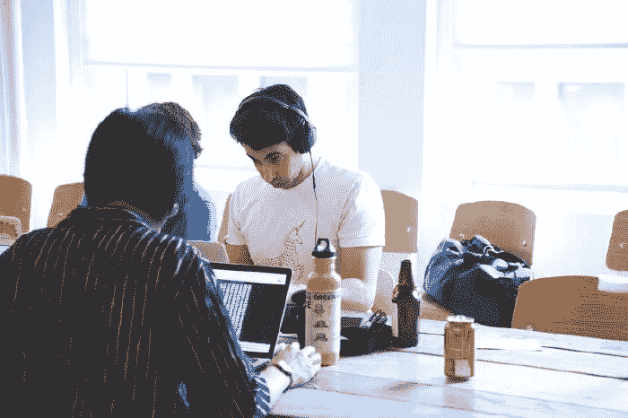
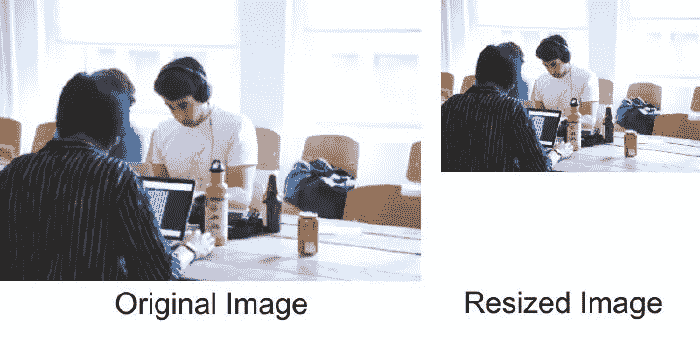
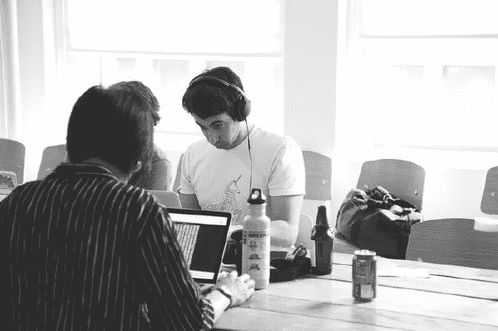
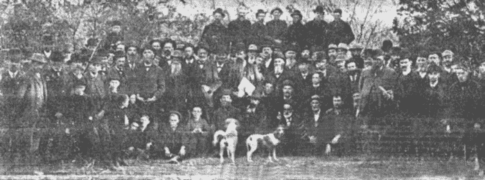
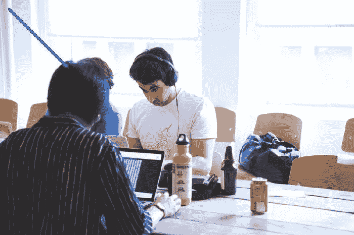
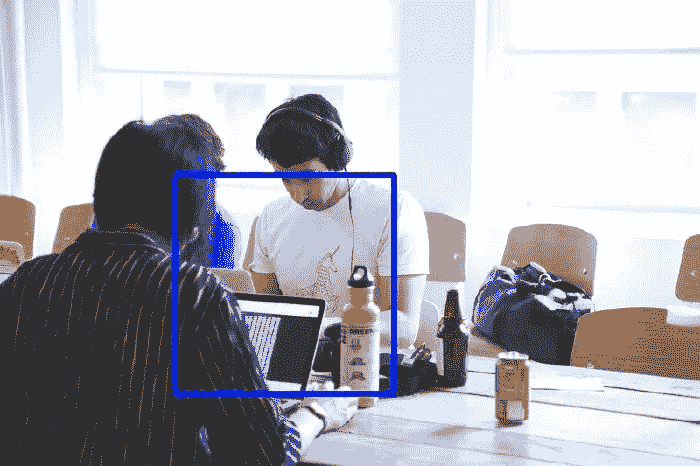

# 计算机视觉介绍:使用 OpenCV for Python 迈出第一步

> 原文：<https://betterprogramming.pub/intro-to-computer-vision-take-your-first-steps-with-opencv-for-python-cd481a9b30e>

## 了解用于 Python 的图像处理和计算机视觉的主库


[Zoltan·塔斯](https://unsplash.com/@zoltantasi?utm_source=medium&utm_medium=referral)在 [Unsplash](https://unsplash.com?utm_source=medium&utm_medium=referral) 上的照片

无论你是想为自动驾驶汽车建立一个复杂的深度学习模型，一个实时人脸识别程序，还是为你的研究生项目开发自己的图像处理软件，你都必须在这个过程中学习 [OpenCV](https://opencv.org/) 。

OpenCV 是一个巨大的图像和视频处理库，设计用于许多语言，如 Python、C/C++、Java 等等。它如此流行和强大，以至于它是你所知道的许多处理图像处理的应用程序的基础。

开始使用 OpenCV 可能很有挑战性，尤其是如果你依赖于它的官方文档——众所周知，它很麻烦，很难理解。

今天我们将学习如何使用 OpenCV，我将尽我所能保持简单。

# 安装 OpenCV

现在是时候使用一个简单的命令安装 OpenCV 了:

```
pip3 install opencv-python
```

# 导入简单图像

您需要学习的第一件事是如何导入一个简单的图像并使用 OpenCV 显示它。

代码很简单:

```
import cv2# Read the image
img = cv2.imread("image.jpg")# Display the image
cv2.imshow("Image", img)# Wait for a keypress
cv2.waitKey(0)# Clean up
cv2.destroyAllWindows()
```



阅读我们的第一张图片

读完代码后，如果你认为我们做的不仅仅是加载图像，那你就对了。毕竟，用 OpenCV 加载图像只需要一行 Python 代码:

```
img = cv2.imread("image.jpg")
```

那么剩下的呢？嗯，我们要做的第一件事是导入库。只有这样，我们才能使用`imread`方法读取图像，并将图像的路径作为唯一的参数传递。

如果我们现在停止程序，我们已经加载了图像，但没有对它做任何事情，因此，相反，让我们至少在一个新窗口中显示图像，以便用户可以看到结果。为此，我们将使用`cv2.imshow`并将窗口名称和图像作为参数传递。

最后，我们将 Python 化，直到我们按下一个键或关闭窗口才退出程序。然后我们通过摧毁所有打开的窗户来清理一切。

# 加载视频

OpenCV 不仅擅长处理图像，也擅长处理视频。视频流可以从视频文件加载，也可以直接从网络摄像头等视频源加载。

在下一个示例中，我们将从网络摄像头加载视频，并在新窗口中呈现:

```
import cv2# Load the video stream
video = cv2.VideoCapture(0)while(True):
   # Capture each frame as an image
   ret, frame = video.read() # show the image on the screen
   cv2.imshow('frame', frame)

   # Stop the playback when pressing ‘q’
   if cv2.waitKey(1) == ord('q'):
       Break# Release the video from memory
video.release() # Clean up
cv2.destroyAllWindows()
```

代码是不言自明的，但是让我们详细回顾一下。我们使用方法`VideoCapture`来加载视频资源。第一个参数定义了我们正在读取的输入。通过传递一个`0`，我们指的是主摄像头(如果存在的话)。如果您有多个网络摄像头连接，您可以使用`1`、`2`等。如果您的视频被捕获并保存在一个文件中，您可以传递一个带有文件路径的字符串。

接下来，我们开始一个循环，这个循环只在用户命令时结束，但稍后会更多地结束。这里重要的是循环内部发生了什么。我们要做的第一件事是让我们的`VideoCapture`读一帧视频。对于摄像机，它将是摄像机当时的快照，对于视频文件，它将是当前的视频帧。

我们从视频负载中读取的每一帧都像读取图像一样至关重要，因为这意味着我们在处理视频时拥有整个 OpenCV 函数库。

例如，用`read`捕获的帧输出可以传递给方法`imshow`，就像我们在前面处理图像的例子中所做的一样。

漂亮！

现在视频正在播放，但是没有办法跳出`while`循环，所以让我们通过检测`q`键是否被按下来建立一个退出策略。如果有，那么我们退出清理活动的循环。

我们有一个额外的清理步骤，释放相机或视频文件，因为即使我们不再读取任何帧，我们仍然有对象在内存中打开。我们可以通过使用来自`VideoCapture`对象的方法`release`来做到这一点。

# 调整图像大小

改变图像尺寸有着广泛的应用，从优化尺寸、缩放，甚至输入神经网络来执行一些魔术。如果调整图像大小是你想要的，OpenCV 可以满足你。

现在让我们看一个如何调整图像大小的例子:

```
import cv2
img = cv2.imread("image.jpg")
scale = 60
width = int(img.shape[1] * scale / 100)
height = int(img.shape[0] * scale / 100)
dim = (width, height)
resized_img = cv2.resize(img, dim, cv2.INTER_AREA)
cv2.imshow("Resized_Image", resized_img)
cv2.waitKey(0)
cv2.destroyAllWindows()
```



调整图像大小

这非常简单，所以我们给它添加了一些味道，我们不是简单地将图像调整到特定的大小，而是将图像缩小了一个系数 *x* (在我们的例子中是 60%)。注意，如果我们针对特定的维度，代码会更简单。

方法`resize`期望至少两个参数:要调整大小的图像和新的尺寸(在 *x* 和 *y* 中作为一个元组)。可选地，我们可以传递第三个参数来定义插值，如 [resize 函数文档](https://docs.opencv.org/4.3.0/da/d54/group__imgproc__transform.html#ga47a974309e9102f5f08231edc7e7529d)中所述。

# 切换色彩空间

当我们使用 OpenCV 读取图像时，我们将颜色视为通道或图像数组的深度，其中每个通道或维度对应一种颜色。最常见的颜色空间，也是您可能已经知道的颜色空间，是 RGB，由三个通道组成:红色、绿色和蓝色。

但其他系统可以在图像上表示颜色，如 LAB、YCrCb、HLS 和 HSV 等。他们每个人都有不同的特点值得研究和学习。

设置图像颜色的一个更流行的选项是灰度，其中只有一个通道定义每个像素。让我们看一个如何将彩色图像转换成灰度图像的例子。

```
import cv2
img = cv2.imread("image.jpg")
gray = cv2.cvtColor(img, cv2.COLOR_BGR2GRAY)
cv2.imshow("Gray", gray)
cv2.waitKey(0)
cv2.destroyAllWindows()
```



灰度图像

奇迹发生的函数是`cvtColor`，它需要两个参数，图像和颜色空间，并在不改变原始图像的情况下返回新图像。幸运的是，OpenCV 已经为每个已知的颜色空间转换定义了值。在我们的例子中，我们使用`COLOR_BGR2GRAY`，它将 BGR 转换为灰色。

那么 BGR 是什么？这是 OpenCV 加载图像的默认方式。

# 保存图像

我们经常需要在处理图像后保存图像结果，可能是在改变其颜色空间、进行图像变换或对图像进行任何其他操作后。

以下代码显示了如何在将图像的颜色更改为灰度后保存图像:

```
import cv2
img = cv2.imread("image.jpg")
gray = cv2.cvtColor(img, cv2.COLOR_BGR2GRAY)
cv2.imshow("Gray", gray)
cv2.imwrite("image_gray.jpg", gray)
cv2.waitKey(0)
cv2.destroyAllWindows()
```

你可以看到我们使用了一个名为`imwrite`的函数，它负责在为新保存的图像指定路径后，将灰色图像保存在我们的计算机上。在本例中，我们需要保存的实际图像是变量 gray。

# 图像平滑

OpenCV 提供了使图像更平滑的工具，并有助于减少图像上的噪声。这一过程是完全自动化的，其工作原理的所有复杂性都为我们封装在一个简单易用的功能中。

平滑图像是为了提高图像的质量，虽然并不完美，但在某些情况下，这可能是一个实质性的变化，也是在进一步处理中使用图像的关键。

以下是如何对图像使用平滑的示例:

```
import cv2 as cv
img = cv2.imread("early_1800.jpg")
blur = cv2.blur(img, (5, 5))
cv2.imshow("Blur", blur)
cv2.waitKey(0)
cv2.destroyAllWindows()
```


原象



平滑图像

图像看起来好多了，但是这一切是如何工作的呢？这是通过 OpenCV 库中的方法`blur`完成的，该方法期望图像和内核大小作为参数，内核大小是一个元组来反映 *x* 和 *y* 轴。请注意， *x* 和 *y* 的不同值会导致不同的输出，因此您必须为您的图像调整这些值。

内核大小的工作原理是取一个小的像素区域(在我们的例子中是 5x5)，取这些像素的平均值，然后替换真实的像素以获得新的小噪声图像。

还有其他方法来平滑图像，例如使用`gaussianBlur`或`medianBlur`——两者的工作原理相似。

# 在图像上绘图

到目前为止，我们一直在玩图像，没有给它们添加任何新的东西。是时候改变这种状况了。OpenCV 不仅允许我们对图像进行变换和特效，还允许我们对图像进行修改或绘制。

例如，如果您试图开发一个对象跟踪程序或人脸识别程序，并希望在其中绘制一个正方形或形状来突出显示已识别的对象，那么在图像上绘图会非常有用。

让我们在图像上画几个几何图形来说明它是如何工作的。

# 画一条线

我们将尝试使用`line`功能在图像上画一条线:

```
import cv2
img = cv2.imread("image.jpg")
line = cv2.line(img, (20, 20), (150, 150), (255, 0, 0), 5)
cv2.imshow("Line", line)
cv2.waitKey(0)
cv2.destroyAllWindows()
```



画一条线

`line`函数需要图像和另外四个参数:在 *(x1，y1)* 中的线的起点，在 *(x2，y2)* 中的线的终点，线的颜色(在我们的图像中是 BGR)，以及它的像素粗细。

# 画一个矩形

我认为矩形是最常用的形状，至少在人工智能世界中，因为它们通常用于跟踪图像上的物体，如人脸、汽车或交通标志。它们也非常容易使用。这里有一个例子:

```
import cv2
img = cv2.imread("image.jpg")
rectangle = cv2.rectangle(img, (200, 200), (450, 450), (255, 0, 0), 5)
cv2.imshow("Rectangle", rectangle)
cv2.waitKey(0)
cv2.destroyAllWindows()
```



画一个矩形

`rectangle`功能与`line`功能非常相似。它需要图像和另外四个参数:矩形的左上角在 *(x1，y1)* ，矩形的右下角在 *(x2，y2)* ，线条的颜色(在我们的图像中是 BGR)，以及它的像素粗细。

# 画一个圆

我们最后要画的是图像上的一个小圆圈，当你在追踪一个像球一样的圆形物体时，这个小圆圈会很有用。

```
import cv2
img = cv2.imread("image.jpg")
circle = cv2.circle(img, (300, 300), 50, (255, 0, 0), 5)
cv2.imshow("Circle", circle)
cv2.waitKey(0)
cv2.destroyAllWindows()
```


画一个圆

同样，所有这些功能都非常相似。为了在图像上呈现一个圆，我们使用了`circle`函数，该函数需要图像和另外四个参数:圆在 *(x，y)中的中心点、*以像素为单位的半径、颜色和线条粗细。

# 结论

OpenCV 是一个处理图像和视频的令人兴奋的强大的库。它的广泛用途从作为一个简单的助手库到执行图像操作到实现最先进的计算机视觉算法。

今天我们只讨论了这个库的一小部分功能。如果你喜欢这篇文章，我推荐你也阅读我的关于基本 OpenCV 函数的文章，这将进一步扩展你的库知识。

计算机视觉是一个令我着迷的话题，未来我会写更多关于 OpenCV 的内容——敬请期待。

感谢阅读！