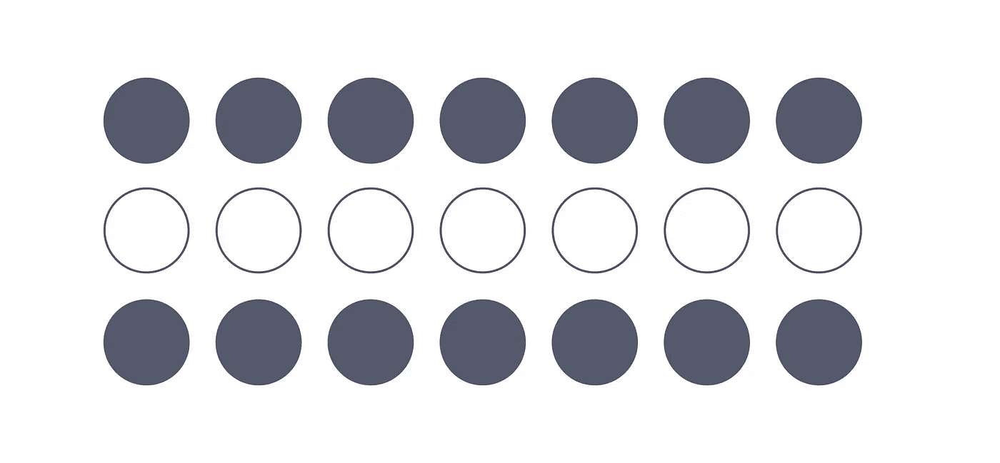
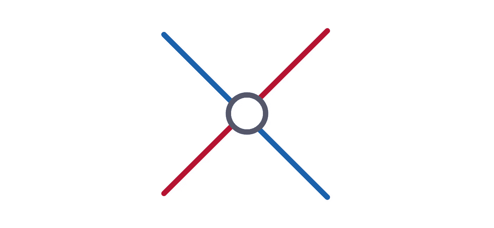
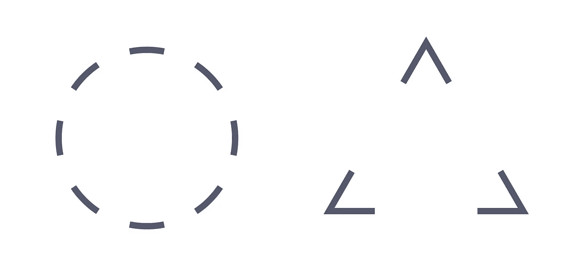
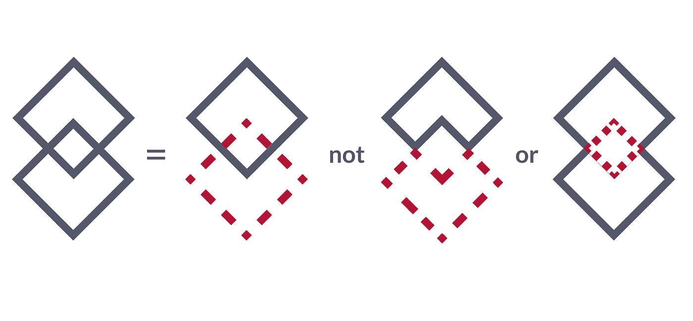
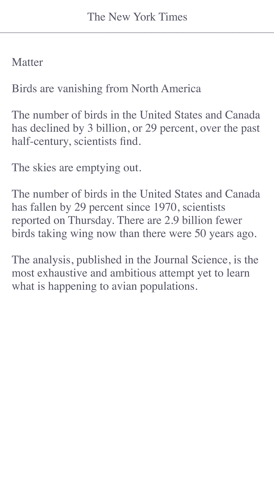
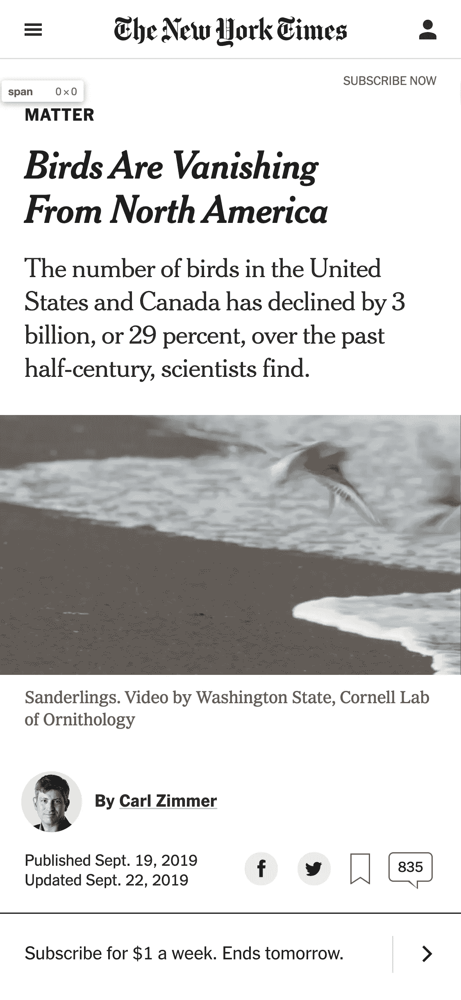
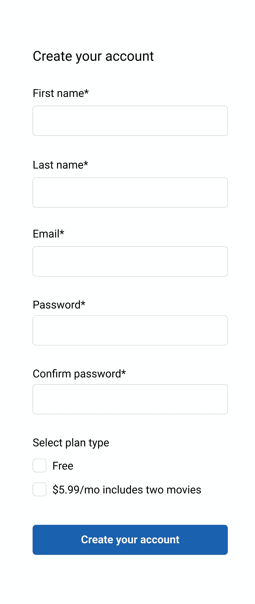
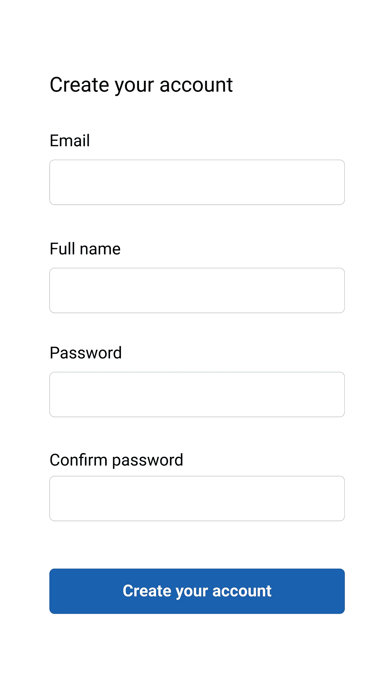
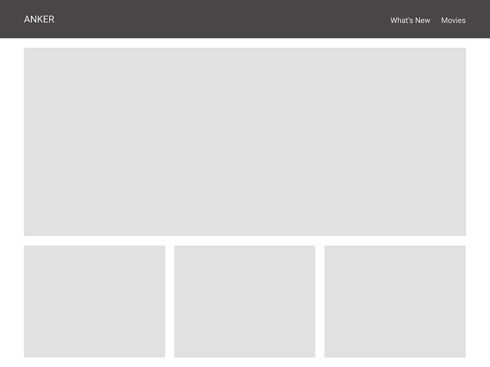
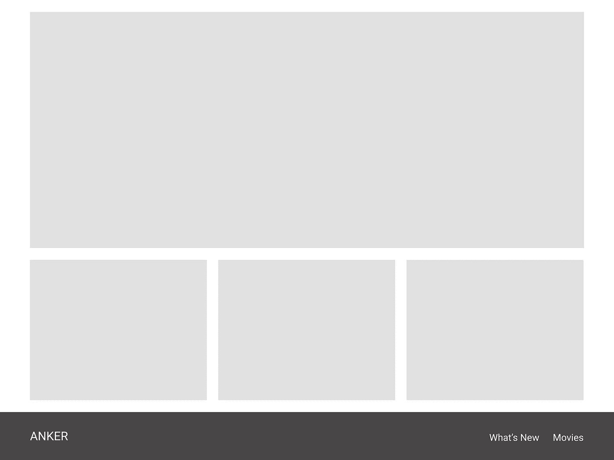

# 程序员的设计原则

> 原文：<https://betterprogramming.pub/intro-to-designing-for-the-human-mind-4106ce7c291>

## 为人类思维而设计导论

哈尔·盖特伍德在 [Unsplash](https://unsplash.com/s/photos/website-design?utm_source=unsplash&utm_medium=referral&utm_content=creditCopyText) 上拍摄的照片

今天有许多不同的用户界面指南，但是它们都有一个共同点:它们都基于人类心理学。人类心理学帮助我们理解人们是如何学习、记忆、感知和反应的。尽管我们的技术正在快速变化，但理解人类如何对欲望、情感和动机做出反应仍然是永恒的，而且我们可以在工作中利用一些通用的设计原则。今天有许多心理学原理，但是我们讨论的以下几条将作为创建用户界面的指南。

在这篇文章的最后，你应该能够解释什么是格式塔原则，以及我们如何在设计时使用它们。

# 格式塔原则

格式塔原则是德国心理学家在二十世纪初提出的一套准则，描述了人类如何感知世界。每天，我们的大脑都在不断创造捷径来理解我们周围的一切。我们认为我们用眼睛看到的实际上是大脑在解释的。我们可以用七个格式塔原则作为用户界面设计的指导方针。它们是接近性、相似性、连续性、封闭性、对称性、图形/背景和共同命运。

## 接近度

自然地，我们的眼睛和大脑想要创造模式。根据杰夫·强森的《[设计时要牢记在心](https://books.google.ca/books?id=5K07AgAAQBAJ&printsec=frontcover&dq=designing+with+the+mind+in+mind&hl=en&sa=X&ved=0ahUKEwjhrcm3j6LmAhWvl-AKHXJjAHYQ6AEIODAC#v=onepage&q=designing%20with%20the%20mind%20in%20mind&f=false)》(这篇文章中的定义和许多例子都来自于此)，邻近原则表明“彼此靠近的物体(相对于其他物体而言)看起来是成组的，而那些相距较远的物体则不是。”

在这个例子中，我们看到两组圆。在左边，我们看到四列圆圈，而在右边，我们看到三列圆圈。这些图案对我们来说是显而易见的，因为这些圆彼此之间很接近。

你可以想象，邻近对我们如何设计布局有明显的影响。我们可以简单地通过将元素和信息放在一起，在视觉上将它们组合在一起。这使得我们可以不再使用像线和框这样的分隔符，因为太多的细节会使界面变得混乱。

如果我们不考虑邻近性，我们的设计间距很小，用户将很难感觉到它们是相关的。因此，我们的软件将更难学习、记忆和解释。遵循邻近原则将极大地提高我们设计的可用性。

## 类似

相似性表示“在所有其他条件相同的情况下，看起来相似的物体是成组的。”正如我们在图像中看到的，相对于其他圆，带边框的圆被视为一组。

在我们的设计中，当我们设计表单、控件和其他元素时，我们可以使用相似性来对相关项目进行分组。通过保持元素的一致性，我们可以帮助用户理解它们之间的联系，因此他们可以开始建立一个关于应该如何与它们交互的心智模型。

## 连续性

虽然前两个格式塔原则涵盖了我们将元素组织成组的倾向，但其他一些原则描述了我们如何解决歧义或缺失数据，以便我们可以感知整个对象。第一个是连续性原则，它指出“我们的视觉感知偏向于感知连续的形式，而不是不连续的片段。”

在这张图片中，我们可以看到行动的连续性。下面，我们看到蓝色和红色的线交叉。我们并不认为它们是四条不同的线或者几个蓝红相间的 V 字形。相反，我们认为它们在圆圈下面连接。

## 关闭

与连续性相关的是封闭的格式塔原理，它指出*“*我们的视觉系统会自动尝试封闭开放的图形，以便它们被视为完整的对象，而不是单独的片段。”

在这张图片中，我们的大脑将左边不相连的弧线组合在一起形成一个圆。在右边，我们将中间的空白区域解释为一个三角形，尽管只有三个 V 形。

## 对称

接下来，我们有对称原理。它指出“我们倾向于以降低复杂性的方式解析复杂的场景。我们视野中的数据通常有不止一种可能的解释，但我们的视觉会自动组织和解释数据，以便简化它，并赋予它对称性。”

在图像中，我们将左边的复杂形状解释为两个重叠的钻石，而不是两个接触的角砖或中心有一个正方形的缩腰八面体。这是因为重叠的钻石比其他两种解释更简单，因为它的边更少，更对称。

如果你曾经在纸上创建过三维立方体，那么你已经熟悉了对称的作用。在设计中，我们会经常使用对称来表示二维平面上的三维物体。

## 图/地

图形/背景原则有助于描述我们如何组织我们接收到的数据。它指出“我们的大脑将视野分为图形(前景)和背景(背景)。前景由场景中我们主要关注的对象组成，而背景则是其他一切。图形/背景原则还规定，视觉系统将场景解析为图形和背景受场景特征的影响。”

也就是说，对图形和背景的感知也取决于观察者的注意力。荷兰艺术家 M. C .埃舍尔因使用这种技术创造模糊的图像而闻名，在这种图像中，随着我们注意力的转移，[人物和背景会发生变化](https://en.wikipedia.org/wiki/Sky_and_Water_I)。

在 UI 设计中，我们通常会使用图形/背景来分层元素，并创建深度感。我们可以把它用于品牌和美学的目的，或者我们也可以在功能上使用它，比如当我们使用模态的时候。

## 共同命运

虽然以前的格式塔原则适用于静态物体的感知，但《共同命运》侧重于运动。“共同命运原则与邻近性和相似性原则有关:和它们一样，它影响我们是否感知物体是成组的。共同命运原则指出，一起运动的物体被认为是成组的或相关的。”

我们在制作界面动画时会经常使用 common fate。例如，在绘制 ui 图表时，我们通常会以类似的方式将相关数据制成动画来表示分组。

# 如何运用心理学设计原理塑造设计

## 组块

认知心理学家乔治·米勒的研究表明，短期记忆中能够储存的项目数量是有限的。这是“神奇的数字七，加减二”，指的是五和九项。

后来的研究表明，这一估计过高，呈现给人们记忆的项目可以被*分块*(意思是将相关概念分组在一起)，这样信息更容易处理。这个新的限制表明，在短期记忆中可以被分块的项目的最大数量是 4，加或减 1，也就是 3 到 5 个项目。

一个常见的分块例子是电话号码。

正如我们在第二个例子中看到的，打破这些数字的长文本使用户更容易消化。通过大块呈现内容，这使得我们的眼睛更容易浏览。它还帮助用户可视化不同的内容。

在设计布局时，我们也可以应用这种分块原则。

如果没有组块，我们的视觉结构看起来会很混乱，不容易被眼睛看到。它将包含文本行，使用户很难理解整个屏幕。

这是摘自《纽约时报》的一篇文章。

让我们看看应用组块原理会发生什么。

如果我们将信息重组为块，我们会发现我们的眼睛被吸引到布局中的特定部分。此时，我们可以清楚地定义标题，并发现副标题与下图相关。

如果你看看第一张和第二张图片之间内容布局的区别，你会发现第二张图片更容易浏览。我们还发现，格式塔的邻近原则被用来保持相关的事物彼此靠近。我们还发现大小、对比度、空白和其他视觉原则有助于定义这些独立的块。

## 希克定律

希克定律(也被称为希克-海曼定律)告诉我们，根据选择的数量，我们完成一项任务所需的时间会更长。

这个原理是由威廉·埃德蒙·希克和雷·海曼创造的，他们都研究了刺激数量和个体对任何给定刺激的反应时间之间的关系。他们发现可供选择的刺激越多，用户做决定的时间就越长。

希克定律的一个很好的例子可以应用于表单设计。我们来看两个例子。

记住希克定律的原理，我们如何比较第一个例子和第二个例子？

通过应用希克定律，我们可以帮助用户减少认知负荷。认知负荷是操作一个系统所需的心理处理能力的数量。例如，不要问不必要的问题或者可以在以后问的问题。呈现简单的任务，让用户可以轻松地采取行动。

## 雅各布定律

雅各布·尼尔森提出的雅各布定律(也被称为互联网 UX 的雅各布定律)指出，用户将大部分时间花在其他网站上。这意味着用户更喜欢你的网站像他们已经知道的其他网站一样工作。

虽然探索如何解决某些 UX 问题的替代方案是好的，但当涉及到在通用设计模式上重新发明轮子时，我们应该谨慎。

例如，第一次访问您的网站的用户会希望看到一个导航，其中包含指向网站其他区域的链接。如果我们重新构建这个导航模式并把它移到页面的底部，你可能会发现你的用户会迷路并感到困惑。因此，他们可能会离开你的网页，因为他们无法找到他们所寻找的。

我们必须考虑用户的心理模型。正如 Jakob Nielsen 所定义的，“心智模型是用户对手边系统的看法。”每个人基于之前的经历都有不同的心智模式。

看待这个问题的另一种方式是确保我们遵循外部一致性。当多个产品的设计一致时，就实现了外部一致性。理解这个核心原则，即其他用户希望你的网站和他们访问过的其他网站一样工作，会让你的用户更容易理解你的界面。

下面是一个遵循外部一致性的网站:

这里有一个不遵循外部一致性的网站:

# 资源

*   [感知即相信:心理学速成班](http://youtube.com/watch?v=n46umYA_4dM)
*   [UX 定律— 19 条心理设计原则](https://www.youtube.com/watch?v=fYs2Mdyasuc)
*   [格式塔原则|初学者基础知识](https://www.youtube.com/watch?v=FryaH599ec0)
*   [感知的格式塔原理](https://www.youtube.com/watch?v=RWJSC1HU32c)
*   [设计原则|格式塔十二定律](https://www.youtube.com/watch?v=qn8oxWEtJE4)
*   [为什么分块内容很重要](https://www.youtube.com/watch?v=-UUMGGoHiJ0)
*   [希克斯定律:设计长菜单列表](https://www.youtube.com/watch?v=pbbTOzArcWQ)
*   [互联网用户体验的雅各布定律](https://www.youtube.com/watch?v=wzb4mK9DiHM)

# 后续步骤

*   [色彩理论介绍](https://levelup.gitconnected.com/intro-to-color-theory-dce1a63fba01?)
*   [排版介绍](https://medium.com/@iampika/intro-to-typography-74ed63303f1e)