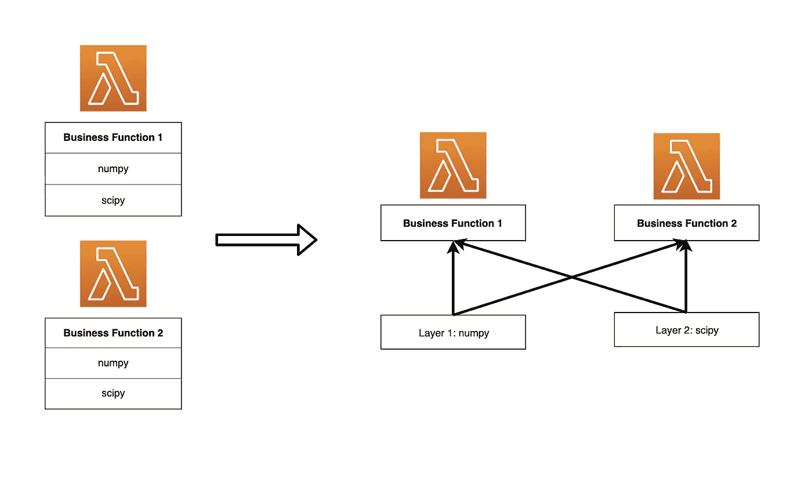
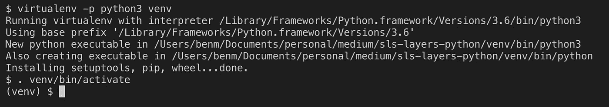
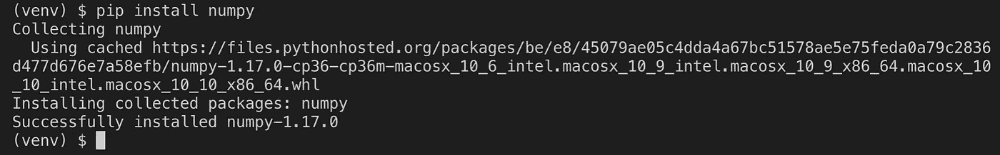
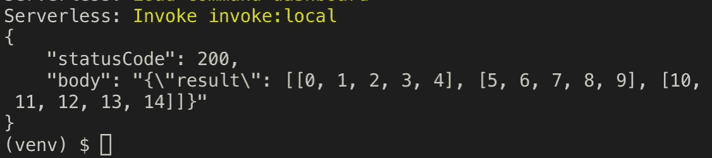
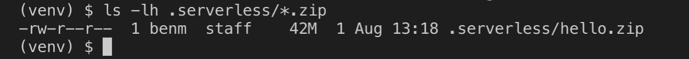
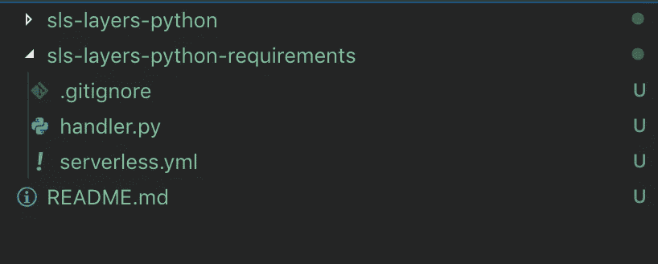
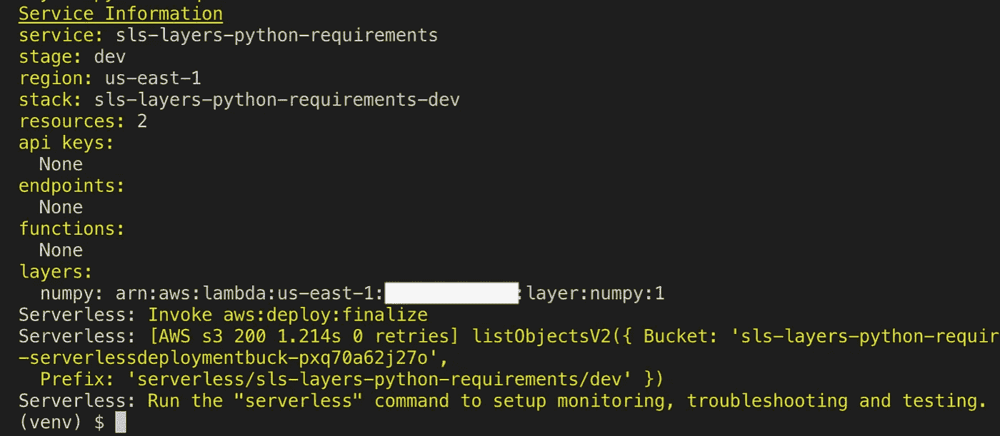
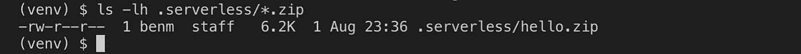
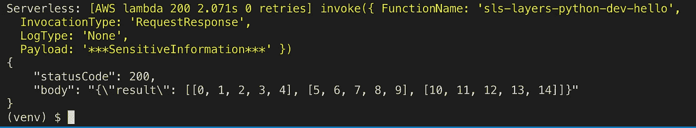

# Python 中 Lambda 图层简介

> 原文：<https://betterprogramming.pub/intro-to-lambda-layers-in-python-95e092198c97>

## 在 Python 中设置一个简单的 Lambda 层


[大卫·克洛德](https://unsplash.com/@davidclode?utm_source=medium&utm_medium=referral)在 [Unsplash](https://unsplash.com?utm_source=medium&utm_medium=referral) 上的照片

# 前提

我在 Python 3 中使用无服务器框架已经有一段时间了，并且从中获得了很多乐趣。它设置快速，易于部署，并且有越来越多的文档和教程。

然而，尽管有这么多的乐趣，一个主要的烦恼是部署非常大的 zip 文件。Python 包可以变得非常大！

你说多大才算大？

假设您需要使用 NumPy，这是下载量最大的 Python 包之一。这个包解压后大约有 85 MB。


压缩和部署利用这个包的函数可能会非常庞大和耗时，这会大大降低部署和开发时间。

# 解决方案:分层

2018 年 11 月底，AWS 发布了 Lambda Layers，以解决这个问题以及更多问题。Lambda Layers 是一种将可重用代码分割成独立组件的方式。通过这种方式，您可以只对业务逻辑 lambda 函数进行修改，而将其他很少修改的、更常见的代码(例如 NumPy 库)放在单独的层中。

下面是一个层如何在 lambda 函数中拆分公共代码的示例:



# 示例时间！

TL；dr: [参见 github 上的一个工作示例](https://github.com/benmcp/python-lambda-layers-example)。

下面是如何使用 Lambda Layer 建立一个工作示例的分步指南。

## 设置一个简单的无服务器 Python 函数

创建一个 python 3 无服务器服务并创建一个虚拟环境:

```
sls create -t aws-python3 -p sls-layers-python
cd sls-layers-python
virtualenv -p python3 venv
. venv/bin/activate
```



安装`numpy`:

```
pip install numpy
```



使用`handler.py`文件中的`numpy`创建一个简单的 hello 函数:

在本地测试:

```
sls invoke local -f hello
```



部署时间！

现在，在我们部署之前，让我们检查一下我们的 zip 文件有多大，这样我们就有了一个比较的基线。运行无服务器包，首先在本地压缩该函数，然后检查我们将部署的 zip 文件的大小:

```
sls package
ls -lh .serverless/*.zip
```



从这里我们可以看到当前的 zip 文件将是 42MB。

我们把这个功能拆分一下吧！

在我们开始之前，先了解一下背景。在撰写本文时，无服务器框架[实际上不能单独部署层](https://serverless.com/blog/publish-aws-lambda-layers-serverless-framework/#some-tips-on-working-with-layers)。这是由于云的形成受到限制。如链接文章中所述:

> 处理这个问题的最好方法是把你的层和你的函数放在不同的堆栈中。

因此，当前的最佳实践是按如下方式分割我们的代码。

停用虚拟环境并改回根目录。然后，创建另一个无服务器堆栈，这次称为`sls-layers-python-requirements`:

```
deactivate
cd ..
sls create -t aws-python3 -p sls-layers-python-requirements
cd sls-layers-python-requirements
```

这将创建以下目录结构:



然后，重新初始化并重新安装`numpy`包:

```
virtualenv -p python3 venv
. venv/bin/activate
pip install numpy
pip freeze > requirements.txt
```

现在，我们需要确保 Python 包被捆绑在我们的部署包中。让我们安装以下插件，`serverless-python-requirements`:

```
yarn add serverless-python-requirements --save-dev
```

然后，将`serverless.yml`更新为以下内容:

并部署:

```
sls deploy
```

这将需要一段时间，但完成后，您应该会看到以下内容:



在上面，我们可以看到一个λ层的输出。让我们复制它，并在我们原来的`sls-layers-python`堆栈中使用它。在目录中，将`serverless.yaml`文件更新为以下内容:

然后，像以前一样，让我们确保我们的无服务器包在部署时仍然可以引用 NumPy Python 包:

```
yarn add serverless-python-requirements --save-dev
pip freeze > requirements.txt
```

现在，在等待另一个 41 MB 部署之前，让我们检查一下这个新包的大小。运行以下命令:

```
sls package
ls -lh .serverless/*.zip
```



6.2 KB 好多了！

让我们使用以下命令部署这个包:

```
sls deploy
```


现在我们已经部署了 NumPy 和 Python 业务逻辑，我们可以通过运行以下代码来测试这一点:

```
sls invoke -f hello
```



快乐的日子！！

# 存在哪些局限性？

尽管这是无服务器开发中的一个巨大进步，但仍有一些需要注意的地方。根据我的经验，主要有以下几点:

*   整个部署包的大小(Lambda 层和业务逻辑)解压缩后不能超过 250 MB。
*   每个函数最多只能使用五个 Lambda 层。

# 奖励回合！

一个额外的功能是能够从其他 AWS 帐户引用图层。因此，许多个人和组织已经向公众开放了特定的 Lambda 图层，供每个人使用！

AWS Lambda 层的列表[可以在这里找到](https://github.com/mthenw/awesome-layers)。

下一步是什么？

如果你对以上有任何疑问，请在下面的评论中或者在本文链接的 [GitHub repo 中提出问题！](https://github.com/benmcp/python-lambda-layers-example)

大家编码快乐！