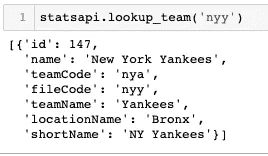
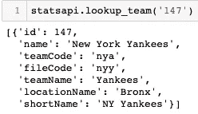
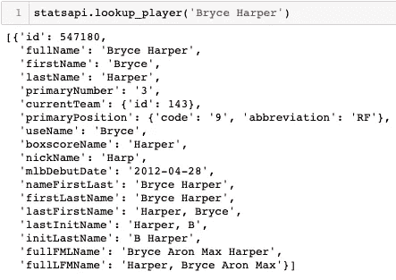
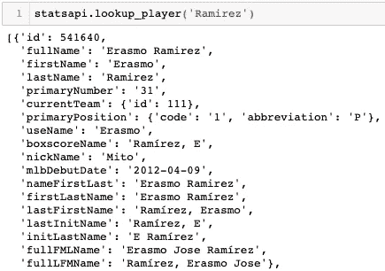
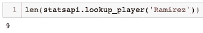
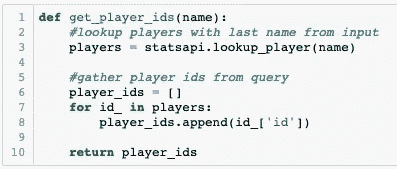
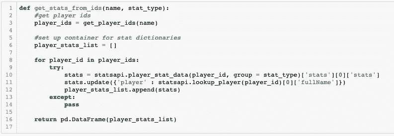
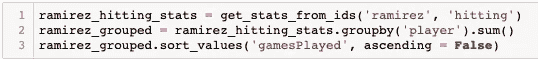
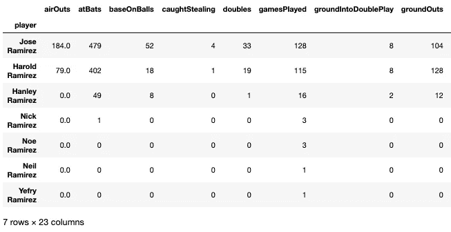

# MLB-StatsAPI 简介—第二部分

> 原文：<https://betterprogramming.pub/intro-to-mlb-stats-api-part-2-f47564651d01>

## 向您展示了如何使用几个新的 API 调用

上图:克利夫兰印第安人队三垒手何塞·拉米雷斯

上周，我给了大家一些关于使用 [MLB-StatsAPI](https://pypi.org/project/MLB-StatsAPI/) 收集每日最新棒球数据的见解。

通过这样做，我对使用这个给我带来麻烦已经有一段时间了的 API 变得更加适应了。有趣的是，在深入研究这些查询后，我意识到这并不像看起来那么难。

一旦你熟悉了一些球队/球员的参数，你就可以直观地理解剩下的了。因为我非常喜欢使用这个 API，所以我决定开始为我使用该 API 的不同功能和查询编写一份每周操作指南。

如果你还没有读过我在这个系列中的第一篇博客 [*使用 MLB-StatsAPI 获取每日数据*](https://medium.com/better-programming/using-the-mlb-stats-api-to-get-daily-data-88f48266656c) ，请随意查看，给你一点入门知识。

上周，我向您展示了如何编写查询来提取数据，如联盟领先的击球手，以及现场分区和外卡排名。

本周，我将向您展示如何使用几个新的 API 调用，您将在下面看到。如果您需要帮助安装包或实例化类，请参考我的上一篇博客。

# statsapi.lookup_team()

这将返回给定输入的团队数据。返回的数据将包括:`id`、`teamCode`、`fileCode`、`teamName`、`locationName`、`shortName`。看看下面纽约扬基队的例子。

它看起来不多，但在这个输出中有相当数量的价值。

使用和理解团队 ID 将为您在 API 中打开新的大门。举个简单的例子，你也可以只根据他们的 ID 来查找团队，如下所示。

# **statsapi . lookup _ player()**

这种查找与上面的类似，除了您可以更深入地查看单个球员的数据。看看下面 Bryce Harper 的球员数据输出。

如您所见，在这个输出字典中有大量可用的键值对。再次强调,`id`键非常有用。

不过这种查找有多种用途。假设我们想从每个姓 Ramirez 的活跃玩家那里获取玩家数据。

姓氏为“拉米雷斯”的玩家的输出预览

上面，您可以从 Bryce Harper 查询中看到类似的预期输出。

因为这篇博文的输出太大，所以我简单地检查了返回的词典列表的长度。如你所见，MLB 有九个叫 Ramirez 的活跃玩家。

# 用这些可以做什么？

这是博客的要点，人们可能会问:“那么，我们可以收集单个球员和球队的数据，现在怎么办？”

答案取决于你。在此基础上，你决定自己的创造力。但是为了帮助你开动脑筋，我给你举个小例子。

看看这个赛季哪个叫拉米雷斯的球员最活跃。为此，我编写了几个助手函数。第一个是收集给定名字的每个玩家的玩家 id。

输出是与输入名称相关联的玩家 id 的方便列表。见下文。

第二个辅助函数使用`get_player_ids`函数从给定玩家的 ID 中找到相关的统计数据(您可以选择击球、投球或防守)，然后将每个输出字典放入一个列表中。

最后，我返回了一个[熊猫](https://pandas.pydata.org/)数据帧，它将所有数据组合成一个很好的可用格式。

# 最终输出

看最后的输出，似乎何塞和哈罗德·拉米雷斯是拉米雷斯组中仅有的两个 2019 日常首发。

需要注意的是，在这个最终输出中只有七个玩家。如果你还没有猜到，这是由于两名名叫拉米雷斯的球员没有 2019 年的击球统计数据，所以他们没有被包括在输出中。

# 结论

这就结束了本周的博客，解释了 MLB-StatsAPI 的几个额外用途。

我真心希望你能在本周学到一些新技术，并把这些带到你的下一个项目中。下周当我深入探究使用 API 的复杂性时，请务必回来查看。

一如既往，任何反馈都是受欢迎的，我喜欢收到读者的反馈！