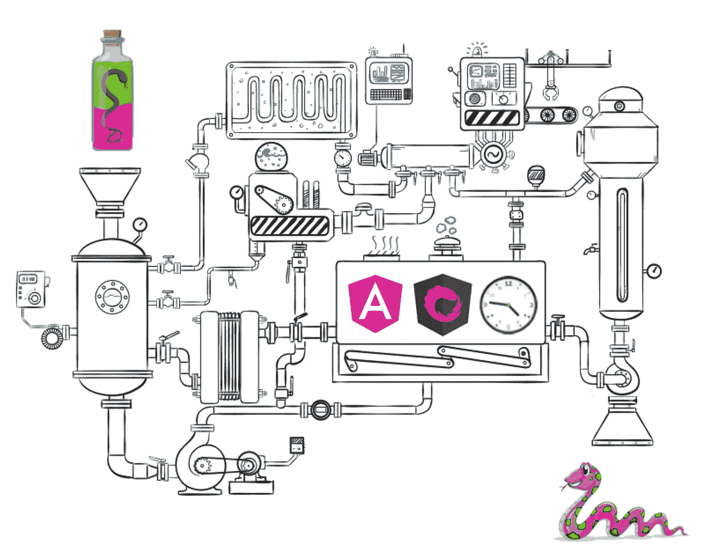
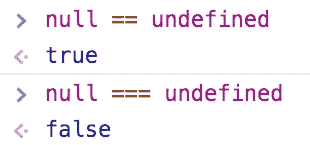
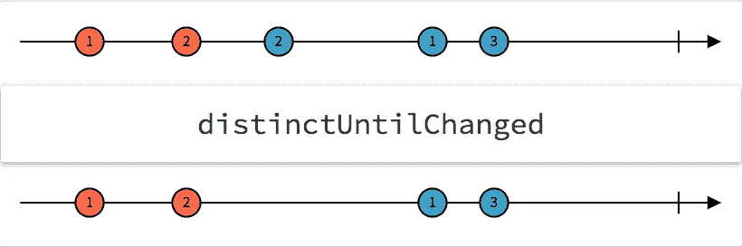
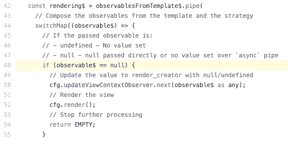
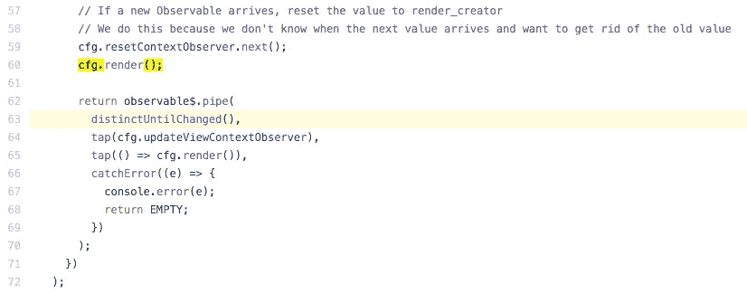
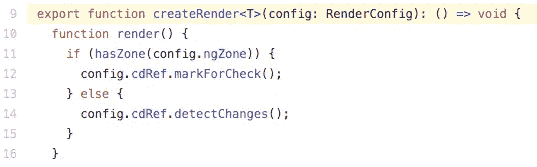
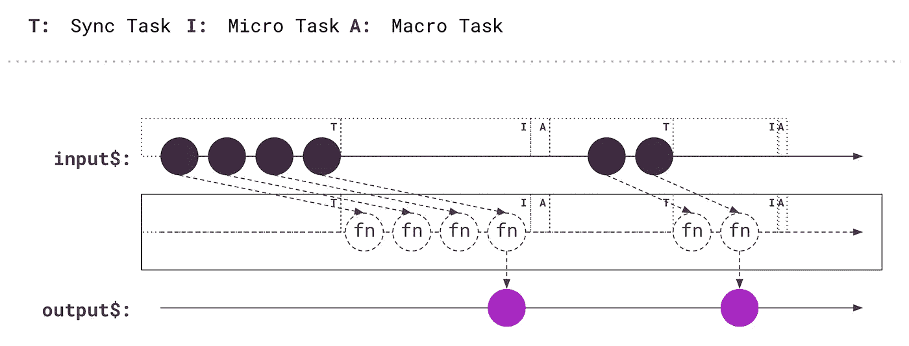

# @ngrx/component 简介

> 原文：<https://betterprogramming.pub/intro-to-ngrx-component-15c0dfd9b44a>

## 改进 NGRX 项目的综合指南(第 2 部分)



图片由作者提供。

新特性正在进入 NGRX，其中之一是 [ngrx/component](https://ngrx.io/guide/component) 。它带来了大量的机会使我们的编程更容易更快。显然，它的出现帮助我们摆脱了模板中的`[async](https://angular.io/api/common/AsyncPipe)`管道。而且，在引擎盖下，它最大限度地利用了角度生命周期。

我们将简单地探讨一下，同时，您将看到一些概念的基础，从而理解我们为什么要使用它。最后，我们将把它应用到一个用 NGRX 完成的简单项目中，从这个特性中获益。

# 使用案例

用例是用 Angular 和 NGRX superpower 构建的一个简单的待办事项列表，我们已经在第 1 部分中看到并改进了它。

[](https://medium.com/better-programming/refactoring-reducers-states-for-a-better-store-cdb355632fbf) [## 重构归约器和状态以获得更好的存储

### 改进 NGRX 项目的综合指南(第 1 部分)

medium.com](https://medium.com/better-programming/refactoring-reducers-states-for-a-better-store-cdb355632fbf) 

# 介绍

@ngrx/components 是什么？

来自文档:

> 组件是一组基本的反应式帮助器，用于支持完全反应式、完全无区域的应用程序。它们对渲染提供了更多的控制，并为角度应用提供了进一步的反应。

用简单的英语说:

> 指令和管道消除了区域的使用，并改进了角度模板中可观察对象的处理。

目前，有两个:

*   * [ngrxLet](https://ngrx.io/guide/component/let)
*   [ngrxPush](https://ngrx.io/guide/component/push)

但在我们深入研究之前，让我们先澄清一下为什么需要更换`async`管道:

> 问题是`async`管道只是将组件及其所有祖先标记为脏。它需要 zone.js 微任务队列耗尽，直到调用`[ApplicationRef.tick](https://angular.io/api/core/ApplicationRef)`渲染所有脏的标记组件。
> 
> 大量的动态和交互式用户界面受到区域变化检测的影响，可能会导致性能下降，甚至无法使用应用程序，但是`async`管道在无区域模式下不工作。

# 关键概念

## 1.NgZone

总之，感谢`[NgZone](https://angular.io/guide/zone)` Angular 让我们能够自动检测组件的变化，目的是更新我们的 HTMLs。很明显，在 CPU 处理方面是有成本的。

检测用户事件、请求和定时器发生的变化的问题与异步有共同之处。尽管如此，我们使用`Observable`的任何时候，都知道正确的时间来检测变化并呈现在我们的 UI 中。这改变了一切。

让我们看一些例子，这样我们可以澄清所有这些关于更新 HTMLs 的概念。

**普通/普通 javascript:**

如果您想检测普通/普通 javascript 中的变化，您应该这样做。

**角度，默认配置:**

使用 Angular 的默认配置，我们不需要做任何与变化检测相关的事情。

**有角度，无 NgZone:**

角度禁用区

1.  `polyfills.ts`中的`zone.js`行注释:

```
//'zone.js/dist/zone';
```

2.在`src/main.ts`的`noop`区域中的自举角度:

```
platformBrowserDynamic().bootstrapModule(AppModule,{ ngZone:'noop'})
```

现在`NgZone`不再使用，所以检测不是自动的。

3.但是，我们可以手动触发它，它将正常工作，`src/click-me/click-me.component.ts`:

```
 ...constructor(private changeDetector: ChangeDetectorRef) {} ...onClickMe() {
  this.clickMessage = ‘You are the best!’;
  this.changeDetector.detectChanges();
}
```

没有 Angular 中的 NgZone，我们需要为检测变化而变魔术。

后端的计算量更少是主要优势。另一方面，停用部分内核让我们负责 Angular 的变化检测(这一点都不容易)。

如果你想更深入，这里有一些非常好的读物。

[](https://medium.com/better-programming/zone-js-for-angular-devs-573d89bbb890) [## 每个 Angular 开发人员都应该知道的关于 Zone.js 的 10 件事

### 每个开发人员都应该了解 Zone.js 的基础知识

medium.com](https://medium.com/better-programming/zone-js-for-angular-devs-573d89bbb890) [](https://indepth.dev/do-you-still-think-that-ngzone-zone-js-is-required-for-change-detection-in-angular/) [## 你还认为 Angular 中的变化检测需要 NgZone (zone.js)吗？

### 我看到的大多数文章都将 Zone( zone.js)和 NgZone 与 Angular 中的变化检测紧密地联系在一起。虽然…

深度开发](https://indepth.dev/do-you-still-think-that-ngzone-zone-js-is-required-for-change-detection-in-angular/) 

## 2.Null 和 undefined 是相同的，但不完全相同



清楚这一点很重要，对吗？

## 3.RxJS 中的运算符 DistinctUntilChanged

`distinctUntilChanged()`运算符忽略重复的连续发射。



快速看一下它的大理石雕像是什么样子的。文档在此，[https://rxjs-dev . firebase app . com/API/operators/distinctUntilChanged](https://rxjs-dev.firebaseapp.com/api/operators/distinctUntilChanged)

# 使用 ngrxLet

[这个](https://ngrx.io/guide/component/let)指令提供了一种将 observables 绑定到视图上下文(dom 元素范围)的便捷方式。

## 在我们的项目中使用

`todo-list.component.ts`

```
<ng-container *ngrxLet=”todos$ as todos”><todo *ngFor=”let todo of todos” [todo]=”todo” (onRemoveTodo)=”removeTodo($event)”
(onToggleTodo)=”toggleTodo($event)”>
</todo></ng-container>
```

[技术特征](https://ngrx.io/guide/component/let#included-features):

*   去掉了`async`或`ngrxPush`管的多种用途。

已核实。

*   统一了 null 和 undefined 的处理方式。



[来源](https://github.com/ngrx/platform/blob/5353343d5996dbff5ba5359071d8f7afc8ab4b7c/modules/component/src/core/cd-aware/cd-aware_creator.ts#L48)

*   一行中不同的相同值(`distinctUntilChanged`运算符)



[来源](https://github.com/ngrx/platform/blob/5353343d5996dbff5ba5359071d8f7afc8ab4b7c/modules/component/src/core/cd-aware/cd-aware_creator.ts#L63)

*   无论`zone.js`是否出现(`detectChanges`或`markForCheck`)，都会触发不同的变化检测。



[来源](https://github.com/ngrx/platform/blob/5353343d5996dbff5ba5359071d8f7afc8ab4b7c/modules/component/src/core/cd-aware/creator_render.ts#L9)

# 使用 ngrxPush

[这根](https://ngrx.io/guide/component/push)管是`async`管的替代物。它包含变更检测的智能处理，使我们能够在全区域和无区域模式下运行，而无需对代码进行任何更改。

## **在我们项目中使用**

`todo-list.component.html`

```
<todo *ngFor=”let todo of todos$ | ngrxPush” [todo]=”todo” (onRemoveTodo)=”removeTodo($event)” (onToggleTodo)=”toggleTodo($event)”>
</todo>
```

[技术特征](https://ngrx.io/guide/component/let#included-features):

*   Observables & promises 检索它们的值并将其呈现给模板。

这里都正确。

注意:这个管子只有在我们使用`[Store](https://ngrx.io/guide/store)`时才起作用。万一你出于什么原因想用它而不使用 NGRX，那就不行了。

我用代码给你解释一下。

`todo-list.component.ts`

```
ngOnInit() {// this.todos$ = this.store.select(selectTodos);this.todos$ = **of**([{ id: “123”, text: “new task”, todo: true }]);
```

它仍然是一个可观察的列表，但是如果你不通过选择器来做，那么它就不会处理你的模板中的待办事项列表。

*   如果`zone.js`存在或不存在(`detectChanges`或`markForCheck`)，则`unify null`和`undefined`的值和触发变化检测不同，以提高性能。

和 ngrxLet 一样，他们甚至共享那部分代码。

*   合并变更检测调用以提高性能

为了本文的简单起见，您必须将它视为一种聚合变更检测的方式，以使它更快。



图片由作者提供。

# 而现在，两个*** ngrxLet**&**ngrxPush**

`src/main.ts`:

```
platformBrowserDynamic().bootstrapModule(AppModule,{ ngZone:'noop'})
```

它没有区域也能工作！

注意:在我写这篇文章的时候，这个包是一个实验性的包，还在开发中，所以它可能会有一些变化。您可能需要停用`[AOT](https://angular.io/guide/aot-compiler)`编译，它将适用于 Angular 8 . x 版本。此外，Angular/components 行为会因视图引擎或 Ivy 的不同而略有不同。

作者提供的截图。

*此时回购(*[*stack blitz*](https://stackblitz.com/edit/ngrx-custom-reducers-todo-list)*on branch feature/ngrx _ components _ stack blitz 或*[*GitHub*](https://github.com/ackuser/ngrx-custom-reducers-todo-list/tree/feature/ngrx_components)*on branch feature/ngrx _ components)*

# 结论

我希望你现在已经知道了基本知识和一些关键概念来理解" *@ngrx/component。此外，它的重要性以及我们取消使用`async`管道的原因，这大大减少了幕后操作。*

此外，不管 Angular 是否使用 zone，关注点的分离对于性能和改进执行时间都是非常重要的。如果我们在无区域模式下，能够分析和衡量性能提升了多少，那就太好了。尝试将您的项目与 NGRX 的未来保持一致！

我们将很快讨论 NGRX 的其他有趣主题，敬请关注！！！

我鼓励你看看更多的阅读材料:

[](https://medium.com/ngconf/a-first-look-at-ngrx-component-f7fcbf83669a) [## @ngrx/component 的第一印象

### 先看看最新的 NgRx 库，它重新思考了角度变化检测和可观察处理…

medium.com](https://medium.com/ngconf/a-first-look-at-ngrx-component-f7fcbf83669a) [](https://christiankohler.net/reactive-angular-with-ngrx-component) [## 有 ngrx/分量的无功角度

### 角度变化检测依赖于 Zone.js，它在大多数情况下工作良好，但很难调试，可能会导致…

christiankohler.net](https://christiankohler.net/reactive-angular-with-ngrx-component)