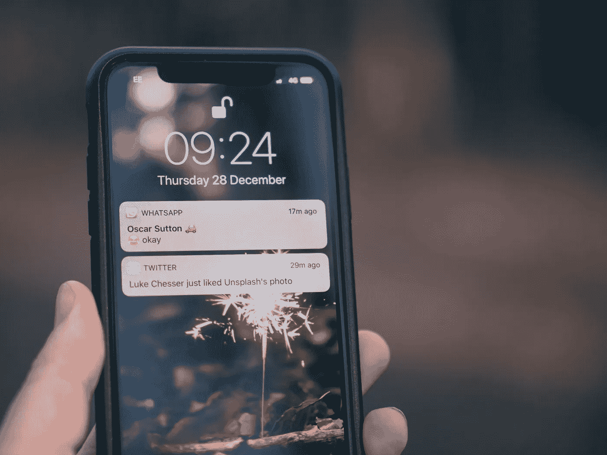
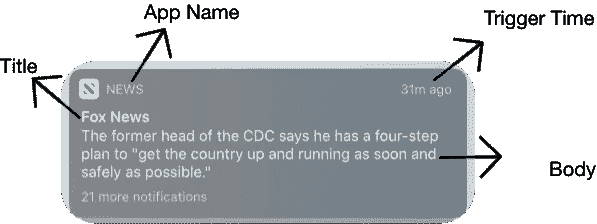
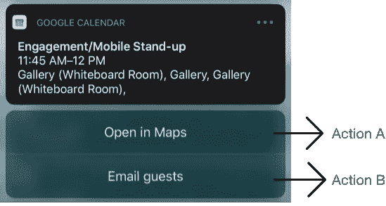

# 推送通知在 iOS 中如何工作

> 原文：<https://betterprogramming.pub/intro-to-push-notification-in-swift-b2c5e21a07cf>

## 将推送通知添加到您的应用程序

照片由[杰米街](https://unsplash.com/@jamie452?utm_source=unsplash&utm_medium=referral&utm_content=creditCopyText)在 [Unsplash](https://unsplash.com/s/photos/notification?utm_source=unsplash&utm_medium=referral&utm_content=creditCopyText)

# 概观

在本文中，我将带你了解如何创建推送通知，并将其集成到你的应用中。我们将主要讨论:

*   推送通知的重要性
*   推送通知的组件
*   推送通知的类型
*   处理通知点击

# 推送通知的重要性

推送通知就是让你的用户在有事情发生时在你的应用中采取行动。想想像 Instagram 或 Medium 这样的应用程序，每当有人喜欢你的照片或对你最近的文章发表评论时，你都会收到通知。但最重要的是，这就是为什么作为软件/产品工程师，您应该关心它:

## 参与+保留

你希望你的应用对你的用户来说是互动的和有趣的。为了让你保持这种兴趣，你可以整理一个好内容的列表，并通过推送通知发送出去(不要发垃圾邮件！)让用户再次使用你的应用。你不希望他们只用一次就离开。

# 推送通知的组件

现在，我们来看看 Swift 中构成推送通知的不同组件。

## 用户通知框架

其核心是`[UserNotifications](https://developer.apple.com/documentation/usernotifications)`框架，它直接与操作系统级别的时钟和设置一起工作，以协调设备内不同应用程序的所有推送通知。

## 内容

如上图所示，我们需要让系统知道实际上向用户显示什么。这是指通知的标题、副标题、正文和声音。这是由`UNMutableNotificationContent()`类配置的。让我们仔细看看如何创建这个对象:

## 触发器

有时，我们可能需要我们的应用程序在特定的日期或时间发送推送通知。让我们以谷歌日历应用为例。您会在活动开始前 15 分钟或活动的特定时间收到推送通知。在这种情况下，OS 时钟系统需要知道何时以及如何发送您的推送通知。你可以通过创建一个`UNCalendarNotificationTrigger`对象来实现。让我们看下面的例子:

## 请求

从`UNNotificationRequest()`类构建，它接受内容和触发器对象。需要记住的一点是，触发器来自`UNCalendarNotificationTrigger class`、*、*是可选的。这是因为有时您可能希望发送基于操作的通知，而不是基于时间的通知。让我们快速看一下代码片段:

## 行动

当用户按住通知时，他们能够看到他们可以立即执行的操作。

有时，您可能希望发送通知，要求用户采取行动，如购买、验证代码或导入文档。这是一个很好的方法，可以最大限度地减少用户在正常启动应用程序并继续操作时通常必须采取的步骤。这由两个类处理:`UNNotificationAction`和`UNNotificationCategory`。让我们来看看:

# 推送通知的类型

## 基于行动的

这是指当用户在应用程序中执行关键操作时必须发出的通知。让我们看看如何创建一个方法，当有人称赞你的媒体文章时，发送推送通知。

## 基于时间的

我们要看的下一种推送通知是调度。想象一个闹钟，当你醒来时它会发出声音并显示一个横幅，或者你每天早上 8 点从 Medium 收到的每日通知。如果你正在开发一个需要在特定时间进行某种提醒或操作的应用程序，那么预定通知是一个不错的选择。

让我们看一下如何配置计划推送，以及它与常规推送有何不同。

# 处理通知点击

最后，让我们看看如何设置我们的应用程序，当用户点击给定的推送通知时，我们可以定制逻辑。请记住，如果您没有正确处理您的通知，应用程序将只是在用户点击它时启动。

为了做到这一点，您应该在`AppDelegate` (必须符合`UNUserNotificationCenterDelegate` ) 中添加两种`[UserNotifications](https://developer.apple.com/documentation/usernotifications)`方法:

*   `[willPresent](https://developer.apple.com/documentation/usernotifications/unusernotificationcenterdelegate/1649518-usernotificationcenter)`:当应用程序在前台时，当通知到达时调用这个函数。
*   `didReceiveNotificationResponse`:当用户点击通知时调用。

# 结论

我希望这篇文章对你有所帮助。有几件事我们没有涉及，比如[远程](https://developer.apple.com/documentation/usernotificationsui/customizing_the_appearance_of_notifications)和[丰富](https://developer.apple.com/documentation/usernotifications/setting_up_a_remote_notification_server)通知。让我知道你是否有兴趣阅读它们。