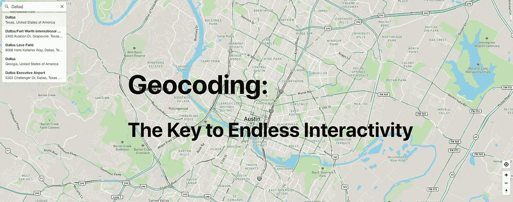
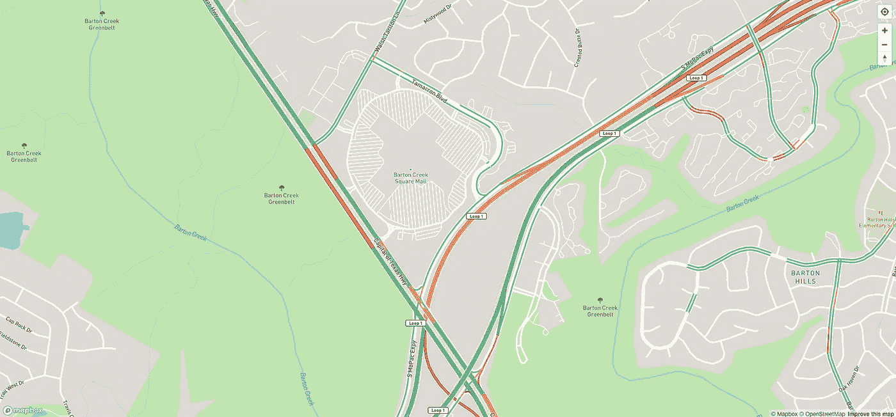
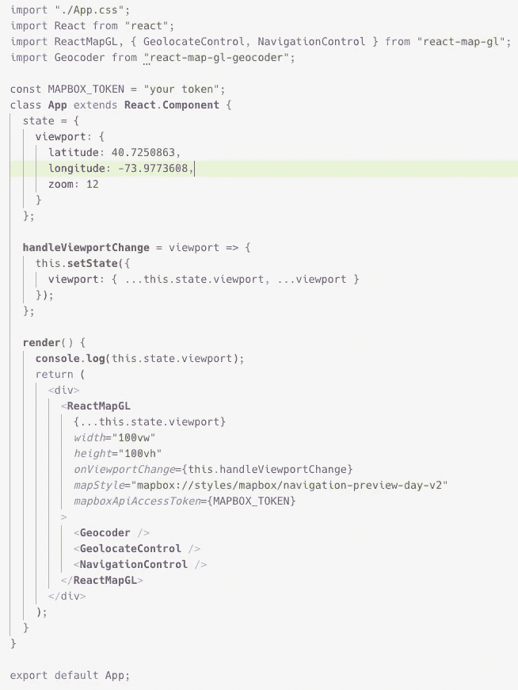
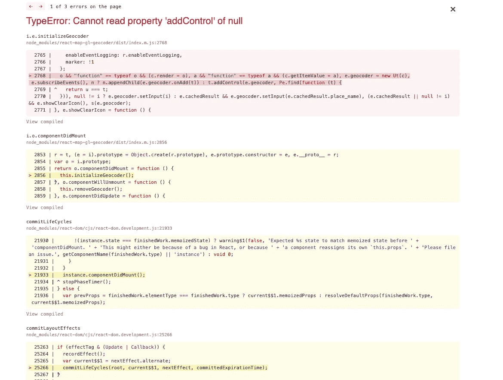
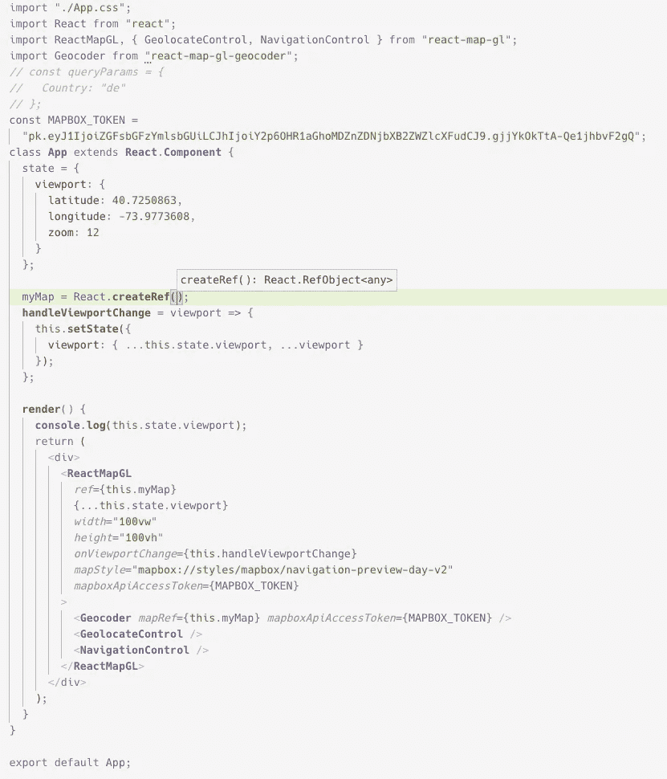
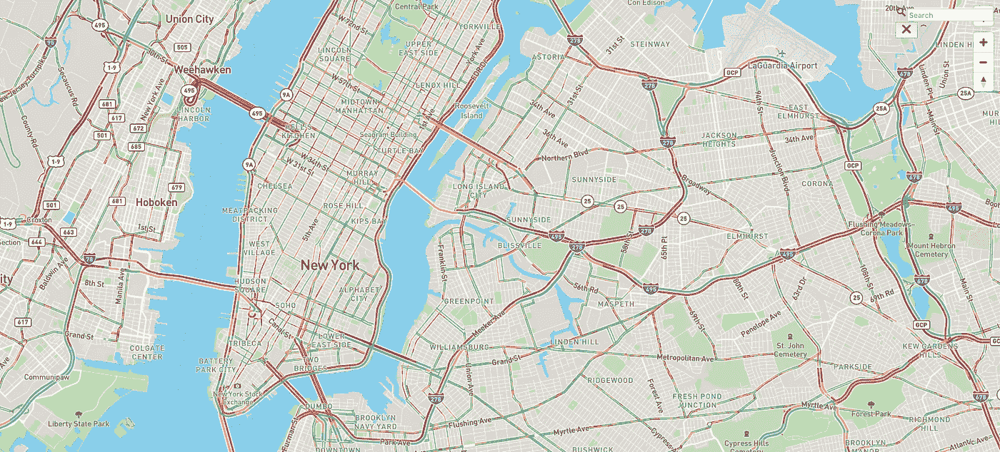
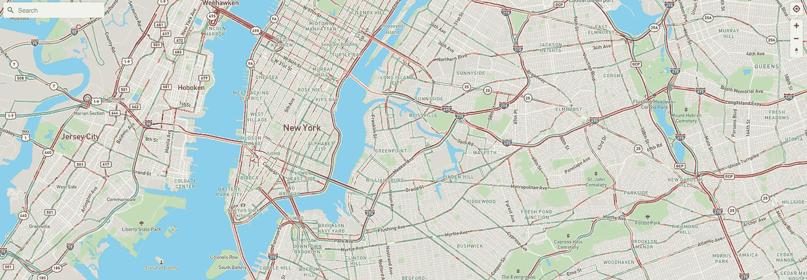
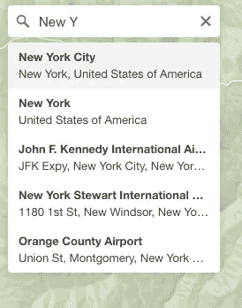

# React 地图框 GL JS 简介

> 原文：<https://betterprogramming.pub/intro-to-react-mapbox-gl-js-24a18255e7f5>

## 地理编码器入门



# 地理编码

我们将介绍一个极其强大的工具。它和其他的一样容易上手，但是它的力量是惊人的。互联网告诉我们地理编码是这样的:

> “地理编码是将物理地址描述转换为地球表面位置的计算过程。另一方面，反向地理编码将地理坐标转换为位置描述，通常是地名或可寻址位置的名称。”— [维基百科](https://en.wikipedia.org/wiki/Geocoding)

如果你曾经使用过谷歌地图、必应地图或任何其他地图软件，你很可能参与过地理编码。本质上是，“这个地址的纬度和经度是多少？”因此，它提供了从位置参考(例如，1060 W Addison St，Chicago，IL 60613)到其纬度和经度(41.947672，-87.656004)的链接，正如我们所知，这是我们地图功能的一部分。

地理编码的重要性不可低估。你能想象必须记住每个地址的纬度和经度吗？

# 步伐

如果你目前还没有一个 [MapBox](https://docs.mapbox.com/mapbox-gl-js/api/) 项目，那么按照[在这篇早期文章](https://medium.com/better-programming/into-to-react-mapbox-gl-js-b7d827f7d7d6)中概述的步骤进行。

否则，转到您的项目目录并:

1.  `npm install react-map-gl-geocoder`
2.  `npm start`

这就是你需要做的。坐下来好好捞一把。

开玩笑，我们实际上必须使用地理编码器组件。

这是您使用地理编码器之前的地图:



现在将它与我们的其他导入内容一起导入:

`import Geocoder from “react-map-gl-geocoder”;`

并将`Geocoder`放入`ReactMapGL`组件中。

现在我们的 App.js 应该是这样的。



所以现在我们的地图看起来像这样。



这相当于三页纸的错误，我花了大量的搜索才弄清楚这里发生了什么(以及令人尴尬的文档疏忽)，以及 ReactMapGL 和 Geocoder 需要什么才能工作。有了 NavigationControl 和 GeolocateControl，您不需要任何特殊的东西。

我会带你去找我的线人。说真的，看看这个。这家伙应该得到很多荣誉:

[地理编码器演示](https://codesandbox.io/s/l7p179qr6m)

[文档](https://www.npmjs.com/package/react-map-gl-geocoder)

如果您真的看了文档，您会注意到地理编码器组件所需的属性是`mapRef`和`mapboxApiAccessToken`。所以把这些加进去，你这个懒汉。

但是我们把`mapRef`设置成什么呢？

# 做出反应。CreateRef

所以为了让 Geocoder 工作，Geocoder 组件需要访问 ReactMapGL 组件。我们的方法是创建一个 ref，并在 ReactMapGL 和 Geocoder 组件中使用它。而且这个概念被一个比我聪明的人解释得好得多。查看文章“[如何使用 React Refs](https://medium.com/@rossbulat/how-to-use-react-refs-4541a7501663) ”以获得 React Refs 的更好解释。

# 怎么做

所以在我们的 App.js 类中，我们只需要像这样声明一个变量:

```
myMap = React.createRef()
```

然后在我们的地理编码器组件的必需的`mapRef`字段中使用它。

我们还需要在外部组件`ReactMapGL`上设置一个`ref`键。这就是创造信息流动路径的原因。

现在我们的 App.js 组件看起来是这样的:



我们的地图是这样的！



搜索栏！

但是它看起来像垃圾，所以让我们为`Geocoder` 导入 CSS 并把它放在左上角。

CSS: `import “react-map-gl-geocoder/dist/mapbox-gl-geocoder.css”;`

要将它放在左上角，在地理编码器组件中添加:`*position*=”top-left”`

现在我们有了这个:



如果我们在搜索栏中输入，我们会有有史以来最漂亮的界面。



按回车键，它会自动重定位到那个位置。

# 结论

这是一个极其重要的功能，非常容易设置。我不能强调这是一个多么强大的工具，而且是免费的。太疯狂了。

请务必通读地理编码器文档，了解更多定制选项。

# 大声喊出来

我使用了以下资源来帮助我的项目，请务必查看它们。

SamSamskies (我相信他构建/主要贡献了地理编码包，godly)。

[地理编码器演示](https://codesandbox.io/s/v0m14q5rly)

[地理编码器文档](https://www.npmjs.com/package/react-map-gl-geocoder)

[React Refs 文章](https://medium.com/@rossbulat/how-to-use-react-refs-4541a7501663)

# 参考

如果你对其他关于 React [MapBox](https://docs.mapbox.com/mapbox-gl-js/api/) 和如何做事的文章感兴趣，请参阅

*   "[React MapBox GL JS 简介 GeolocateControl 入门](https://medium.com/better-programming/react-mapbox-gl-js-getting-started-with-geolocatecontrol-18c08a5410d)"
*   "[MapBox GL JS 入门:带地理定位的用户位置](https://medium.com/better-programming/getting-started-with-mapbox-gl-js-user-location-with-geolocation-f32c3e323526)"
*   "【React 和 MapBox GL JS 入门—使用弹出组件"
*   [导航控制、缩放和指南针入门](https://medium.com/better-programming/into-to-react-mapbox-gl-js-b7d827f7d7d6)