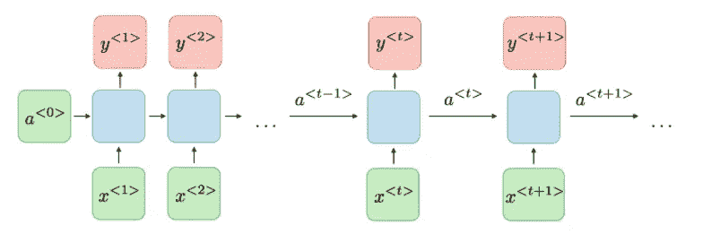
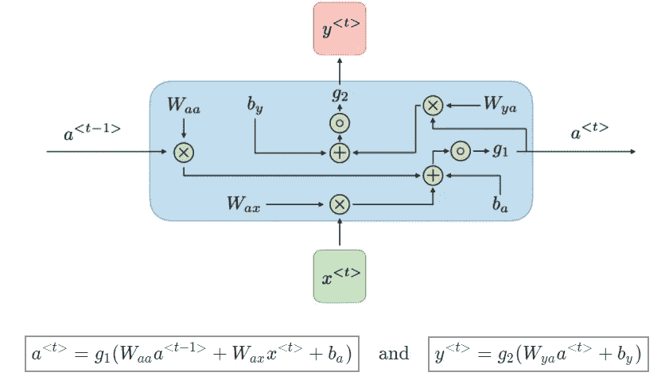
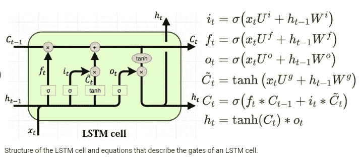
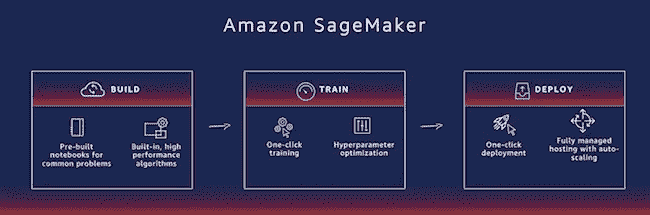

# RNN 简介:用 PyTorch 生成字符级文本

> 原文：<https://betterprogramming.pub/intro-to-rnn-character-level-text-generation-with-pytorch-db02d7e18d89>

## 在 Amazon SageMaker 中训练和部署 PyTorch 模型


克林特·王茂林在 [Unsplash](https://unsplash.com?utm_source=medium&utm_medium=referral) 上拍摄的照片

今天，我们将通过介绍递归神经网络的操作和使用来从一个小的初始文本生成文本，继续我们在自然语言处理(NLP)的迷人世界中的旅程。这种类型的问题被称为*语言建模*，当我们想要预测单词或字符输入序列中的下一个单词或字符时使用。

但是在语言建模问题中，单词的存在并不是唯一重要的事情，它们的顺序也很重要——例如，当出现在文本序列中时*。换句话说，围绕每个单词的上下文成为预测下一个单词的基础。*

在这种情况下，基于单词频率和概率的传统 NLP 方法不是很有效，因为它们基于单词相互独立的前提。

这就是 RNN 网络可以成为一个基本工具的地方，因为它们有能力记住一系列输入的不同部分，这意味着它们可以考虑句子的前面部分来解释上下文。

# RNN 简介

总之，在一个普通的神经网络中，一个层的输出是它的输入应用一些可学习的权重的函数或变换。

相比之下，在 RNN 中，不仅考虑输入，还考虑网络本身的上下文或先前状态。当我们在网络中向前传递时，它构建其状态的表示，旨在收集在先前步骤中获得的信息，这被称为*隐藏状态。*



[斯坦福 CS230 深度学习](https://cs230.stanford.edu/)课程

> 这里，对于每个时间步长 *t* ，我们有一个激活*a<t>和一个输出 *y < t >。*我们有一组权重将输入转换为隐藏层表示，第二组权重将信息从先前的隐藏状态带入下一个时间步，第三组权重控制有多少信息从实际状态传输到输出。”*
> 
> [3] [“递归神经网络简介](https://www.jeremyjordan.me/introduction-to-recurrent-neural-networks/)”作者杰瑞米·乔登



斯坦福 CS-230 深度学习课程的 RNN 操作

序列中的每个元素都对当前状态有贡献，输入和先前的隐藏状态为任意长的观察序列更新隐藏状态的值。rnn 可以记住以前的条目，但这种能力在时间或步骤上受到限制，这是这些网络首先要解决的挑战之一。

> “输入序列越长，网络‘遗忘’越多。随着时间的推移，不相关的数据积累起来，它会屏蔽掉网络对文本模式做出准确预测所需的相关数据。这被称为[消失梯度问题](https://en.wikipedia.org/wiki/Vanishing_gradient_problem)—维基百科

你可以通过这个[链接](https://towardsdatascience.com/the-vanishing-gradient-problem-69bf08b15484)更深入地了解这个问题。这是深度神经网络的常见问题。在 NLP 和 RNN 领域，为了解决这个问题，已经开发了一些高级架构，如 LSTM 和 GRUs。

# *长短期记忆* (LSTM)

LSTM 网络试图保留来自更早步骤的相关信息，为此它们包含多个门，这些门控制从输入和先前状态保留或删除多少信息:



摘自 [Savvas Varsamopoulos](https://scholar.google.com/citations?user=MIxOsDoAAAAJ&hl=en) 的“设计基于神经网络的表面码解码器”

*W* 是前一个隐藏层和当前隐藏层之间的递归连接。 *U* 是将输入连接到隐藏层的权重矩阵， *C* 是基于当前输入和先前隐藏状态计算的候选隐藏状态。 *C* 是本机的内部存储器。

*   忘记盖茨:现在应该考虑多少来自过去的信息？
*   输入门+细胞门:我们是否应该从输入中给状态增加信息，增加多少？
*   输出门:我们应该从前一个状态输出多少信息？

> **“以类似的方式，LSTM 工作如下:**
> 
> 它不仅记录短期记忆，还记录长期记忆
> 
> 在序列的每一步中，长时记忆和短时记忆会合并
> 
> 由此，我们获得了新的长期记忆、短期记忆和预测”
> 
> — [Peter Foy，“递归神经网络简介&lst ms”](http://Recurrent Neural Networks & LSTMs)

# 在 Amazon SageMaker 中创建和部署一个 ML 模型

首先，我们使用一个笔记本实例来列举 SageMaker 项目概要中的步骤(Amazon 的笔记本描述了这些步骤):

1.  下载或以其他方式检索数据。
2.  处理/准备数据。
3.  将处理后的数据上传到 S3。
4.  训练选定的模型。
5.  测试训练好的模型(通常使用批处理转换作业)。
6.  部署训练好的模型。
7.  使用部署的模型。

对于这个项目，您将按照概要中的步骤进行一些修改，我们将在部署的模型上测试模型。

源代码在[我的 github 库](https://github.com/edumunozsala/Character-Level-Text-Generation)公开，这是[链接](https://github.com/edumunozsala/Character-Level-Text-Generation/blob/master/char-level-text-generator-pytorch-SageMaker.ipynb)到完整的笔记本。这里我们将只显示更相关的部分。

## 下载并准备数据集

步骤 1 和 2 并不特定于 SageMaker 工具；不管平台如何，它们本质上都是一样的。所以我们不打算讨论它们。我们将只提及我们数据集的来源。

首先，我们将定义我们希望模型在输入第一个单词或前几个字符时输出的句子。我们的数据集是一个包含莎士比亚戏剧或书籍的文本文件，我们将从中提取一系列字符作为模型的输入。然后我们的模型将学习如何完成像“莎士比亚会做的”这样的句子这个数据集可以从[卡帕西的 GitHub 账户](https://github.com/karpathy/char-rnn/blob/master/data/tinyshakespeare/input.txt)下载。

然后，我们只需要将文本小写，并创建相应的字典:char2int 将单词转换为整数，int2char 进行相反的过程。

## 对文本进行编码，并创建输入和目标数据集

现在我们可以对文本进行编码，用字典中的整数值替换每个字符。当我们统一并准备好数据集后，我们应该做一个快速检查，看看我们的模型将要训练的数据的例子。这通常是一个好主意，因为它允许您看到每个进一步的处理步骤是如何影响审查的，并且它还确保数据已经被正确地加载。

因为我们要在每个时间步预测序列中的下一个字符，我们必须将每个句子分成:

*   **输入数据**:应排除最后一个输入字符，因为它不需要输入到模型中(它是最后一个输入字符的目标标签)
*   **目标/地面实况标签**:比输入数据超前一个时间步长。因为这将是模型在对应于输入数据的每个时间步长的正确答案。

# 将数据上传到亚马逊 S3

现在，我们需要将训练数据集上传到 S3，以便我们的训练代码能够访问它。事实上，我们将把它保存在本地，稍后在运行培训时，它将被上传到 S3。

**注意:**上面的单元格上传了我们数据目录的全部内容。这包括`char_dict.pkl` (char2int)和`int_dict.pkl` (int2char)文件。这很幸运，因为我们稍后在创建接受任意输入文本的端点时会用到它。现在，我们将只注意到它驻留在数据目录中的事实(因此也在 S3 培训桶中),并且我们将需要确保它被保存在模型目录中。



摘自沃纳·威格尔的《[用亚马逊 SageMaker 进行无限可扩展的机器学习](https://www.allthingsdistributed.com/2018/03/Infinitely-scalable-machine-learning-with-Amazon-SageMaker.html)

# 构建并训练 PyTorch 模型

特别地，SageMaker 框架中的模型包括三个对象:

*   模型人工制品，
*   培训代码
*   推理代码

这些都是相互作用的。

我们将从在 PyTorch 中实现我们自己的神经网络以及一个训练脚本开始。出于这个项目的目的，我们需要在`train`文件夹内的`model.py`文件中提供模型对象实现。

这个模型非常简单，只有几层:

*   充当编码器的 LSTM 层
*   减少过度拟合的脱落层
*   解码器或全连接或密集层，返回每个字符成为下一个字符的概率

# 在 SageMaker 上训练模型

当在 SageMaker 中构造 PyTorch 模型时，必须指定一个入口点。这是将在模型训练时执行的 Python 文件。在`train`目录中有一个名为`train.py`的文件，它包含了训练我们的模型所需的大部分代码。

**注意**:需要的地方必须将`train_main()`函数粘贴到`train/train.py`文件中。

SageMaker 将超参数传递给训练脚本的方式是通过参数。然后，这些参数可以被解析并在训练脚本中使用。要了解这是如何做到的，请看一下提供的`train/train.py`文件。

总之，`train.py file`中的主函数执行以下步骤:

*   加载数据集
*   创建批处理数据生成器
*   从以前的执行中创建或恢复模型
*   训练和评估模型
*   保存模型和字典用于推理

## **主列车算法**

一旦我们有了`train.py`文件，我们就可以在 SageMaker 中创建一个培训任务了。首先，我们需要设置哪种类型的实例将运行我们的培训:

*   我们没有启动一个真正的计算实例，只是一个运行脚本的容器。这个场景对于测试训练脚本是否工作正常非常有用，因为运行容器比运行计算实例更快。但是，最后，当我们确认一切正常时，我们必须为一个真实的训练实例更改实例类型。
*   `**ml.m4.4xlarge**` **:** 这是 CPU 实例
*   `**ml.p2.xlarge**` **:** 管理大量数据进行训练时使用的 GPU 实例。

此时，SageMaker 启动一个计算实例，在那里执行我们的训练代码，根据数据和模型的复杂性，通常需要几个小时或几天的时间(在我们的例子中，大约需要 45-60 分钟)。如果打印出来，你可以在亚马逊 CloudWatch 上跟踪训练进度。最后，模型工件被存储在 S3，它们将在部署步骤中被加载。


安德鲁·布坎南在 [Unsplash](https://unsplash.com/s/photos/text-prediction?utm_source=unsplash&utm_medium=referral&utm_content=creditCopyText) 上拍摄的照片

# 定义推理算法

现在是时候创建一些定制的推理代码了，这样我们就可以向模型发送一个未被处理的初始字符串，并确定字符串中的下一个字符。

默认情况下，我们创建的评估器在部署时，将使用我们在创建模型时提供的条目脚本和目录。然而，由于我们希望接受一个字符串作为输入，并且我们的模型需要一个经过处理的文本，所以我们需要编写一些定制的推理代码。

我们将把推理代码存储在`serve`目录中。这个目录中提供了我们用来构建模型的`model.py`文件，一个包含我们在初始数据处理过程中使用的`one-hot-encode`和`encode_text`预处理函数的`utils.py`文件，以及一个包含我们的定制推理代码的`predict.py`文件。还要注意`requirements.txt`的存在，它将告诉 SageMaker 我们的定制推理代码需要哪些 Python 库。

在 SageMaker 中部署 PyTorch 模型时，您需要提供 SageMaker 推理容器将使用的四个函数。

*   这个函数与我们在训练脚本中使用的函数相同，它告诉 SageMaker 如何加载我们的模型。这个函数必须被调用`model_fn()`,并将模型工件存储目录的路径作为唯一的参数。这个函数也必须存在于我们指定为入口点的 Python 文件中。它还读取保存的字典，因为它们应该在推理过程中使用。
*   `input_fn`:这个函数接收已经发送到模型端点的原始序列化输入，它的工作是反序列化输入并使其可用于推理代码。稍后我们会提到我们的`input_fn`函数在做什么。
*   `output_fn`:这个函数获取推理代码的输出，它的工作是序列化这个输出，并将其返回给模型端点的调用者。
*   `predict_fn`:推理脚本的核心，这是完成实际预测的地方，也是您需要完成的功能。

在亚马逊文档中可以找到详尽的解释。

对于我们在这个项目中构建的简单示例，`input_fn`和`output_fn`方法相对简单。我们需要接受一个字符串作为输入，由输出的期望长度和初始字符串组成。我们希望返回一个字符串作为输出，即生成的新文本。但是，您可能会想到，在一个更复杂的应用程序中，输入或输出可能是图像数据或其他一些需要序列化的二进制数据。

最后，我们必须构建一个`predict_fn`方法，它将接收输入字符串，对其进行编码(char2int)，一次性编码，并将其发送给模型。每个输出都将被解码(int2char)并附加到最终的输出字符串中。

确保将完成的文件作为`predict.py`保存在`serve`目录中。

简而言之，*推理过程*包括处理和编码输入字符串，初始化模型的状态，为每个字符执行模型的向前传递，以及更新模型的状态。每次迭代的输出返回每个字符成为下一个字符的概率。我们对这些概率进行采样以提取下一个字符，并将其加入到输出文本字符串中。

# 部署用于推理的模型

既然已经编写了定制推理代码，我们将创建并部署我们的模型。首先，我们需要构建一个新的`PyTorchModel`对象，它指向训练期间创建的模型工件，也指向我们希望使用的推理代码。然后我们可以调用 deploy 方法来启动部署容器。

**注意:**已部署 PyTorch 模型的默认行为是假设传递给预测器的任何输入都是一个`numpy`数组。在我们的例子中，我们想要发送一个字符串，所以我们需要围绕`RealTimePredictor`类构造一个简单的包装器来容纳简单的字符串。在更复杂的情况下，您可能希望提供一个序列化对象，例如，如果您希望发送图像数据。

现在，我们可以部署我们训练过的模型

**注意:**在部署模型时，您要求 SageMaker 启动一个计算实例，该实例将等待数据发送给它。因此，这个计算实例将继续运行，直到*您*将其关闭。了解这一点很重要，因为部署端点的成本取决于它运行的时间。

换句话说，如果您不再使用已部署的端点，请将其关闭！

测试我们模型的时候到了——非常简单:

```
init_text **=** sentences[963:1148]
test_text **=** str(len(init_text))**+**'-'**+**init_text
new_text **=** predictor.predict(test_text).decode('utf-8')
print(new_text)**Text**:  he did content to say it was for his country he did it to please his mother and to be partly proud; which he is, even till the altitude of his virtue. what he cannot help in his nature,**Init text**:  he did content to say it was for his country he did it to**Text predicted**: he did content to say it was for his country he did it to please his mother and to be partly proud which he is even till the altitude of his virtue what he cannot help in his nature of
```

正如我们所观察到的，预测文本实际上与原始文本相同，这意味着我们的网络能够生成它在训练阶段收到的文本——它的记忆工作正常！

最后，当服务不被使用时，您必须关闭它。

```
predictor.delete_endpoint()
```

# 参考

*   [1] [“使用 Python 和 TensorFlow/Keras 生成文本”](https://stackabuse.com/text-generation-with-python-and-tensorflow-keras/)，作者 Dan Nelson
*   [2] [“递归神经网络备忘单”斯坦福 CS-230 深度学习](https://stanford.edu/~shervine/teaching/cs-230/cheatsheet-recurrent-neural-networks)作者 [Afshine Amidi](https://twitter.com/afshinea) 和 [Shervine Amidi](https://twitter.com/shervinea)
*   [3] [“递归神经网络简介](https://www.jeremyjordan.me/introduction-to-recurrent-neural-networks/)”作者杰瑞米·乔登
*   [“递归神经网络的不合理有效性](http://karpathy.github.io/2015/05/21/rnn-effectiveness/)”作者 Andrej Karpathy
*   [《消失的渐变问题](https://towardsdatascience.com/the-vanishing-gradient-problem-69bf08b15484)》，作者池汪锋
*   [“用代码](https://hackernoon.com/understanding-architecture-of-lstm-cell-from-scratch-with-code-8da40f0b71f4)从零开始理解 LSTM 细胞的结构”，作者 Manik Soni
*   [“递归神经网络简介& LSTMs](https://www.mlq.ai/guide-to-recurrent-neural-networks-lstms/) ”作者彼得·福伊
*   [“设计基于神经网络的表面码解码器](https://www.researchgate.net/publication/329362532_Designing_neural_network_based_decoders_for_surface_codes)”，作者:Savvas Varsamopoulos、Koen Bertels 和 Carmen G. Almudever