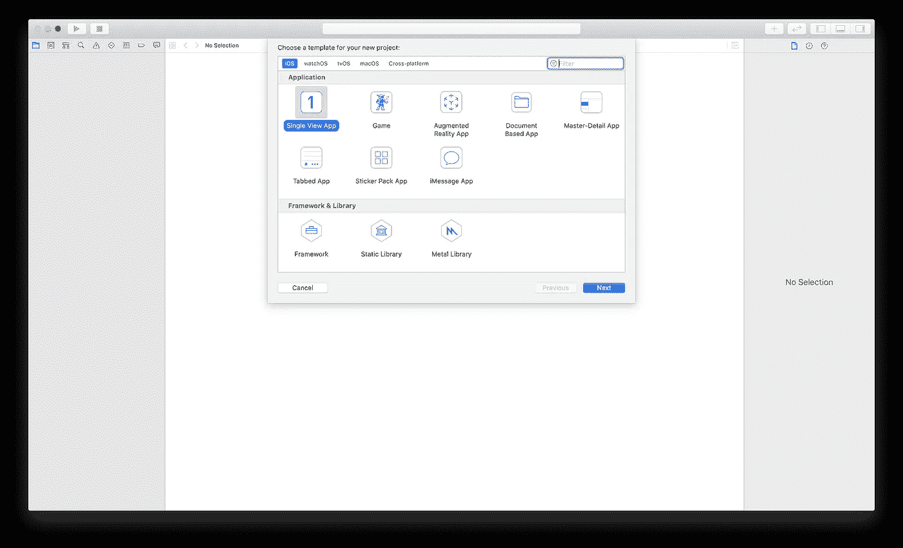
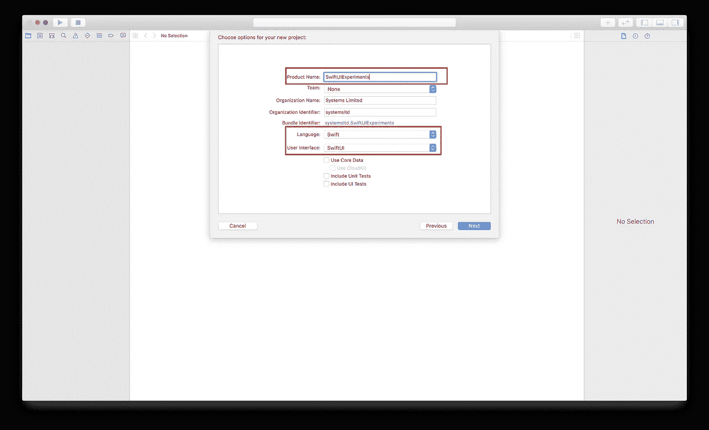
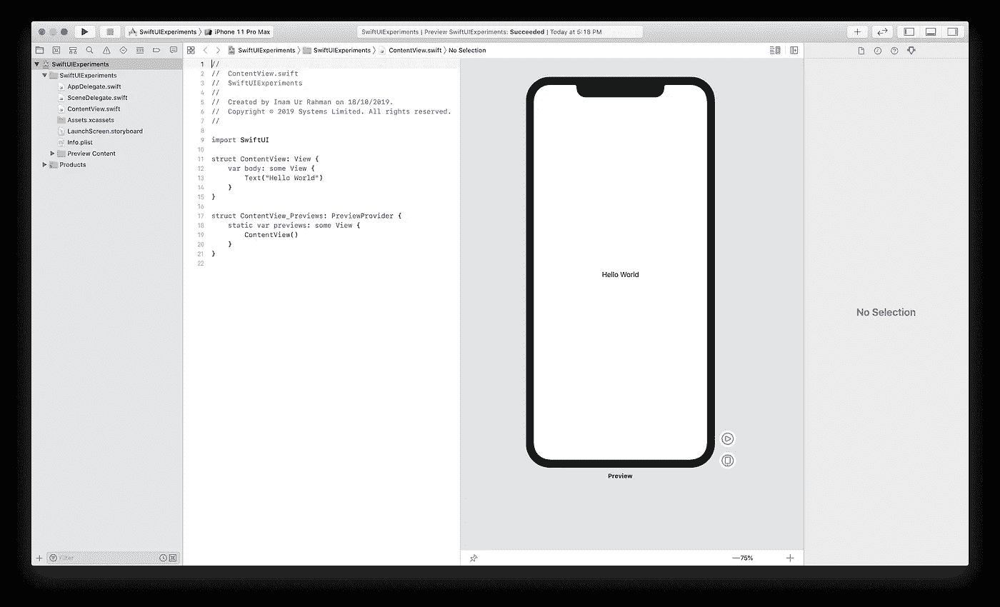
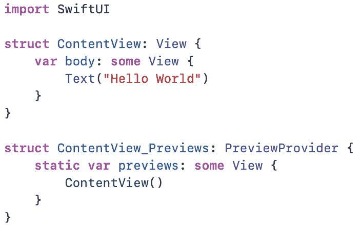
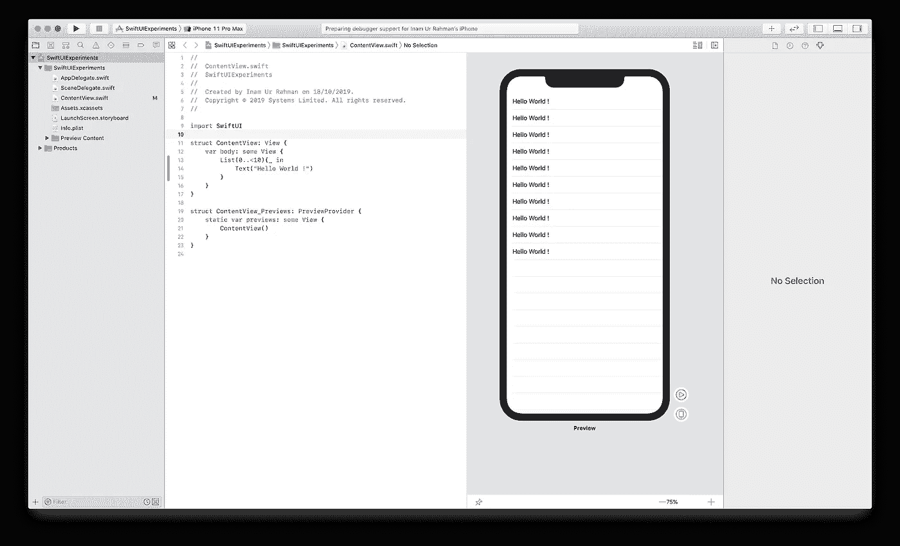
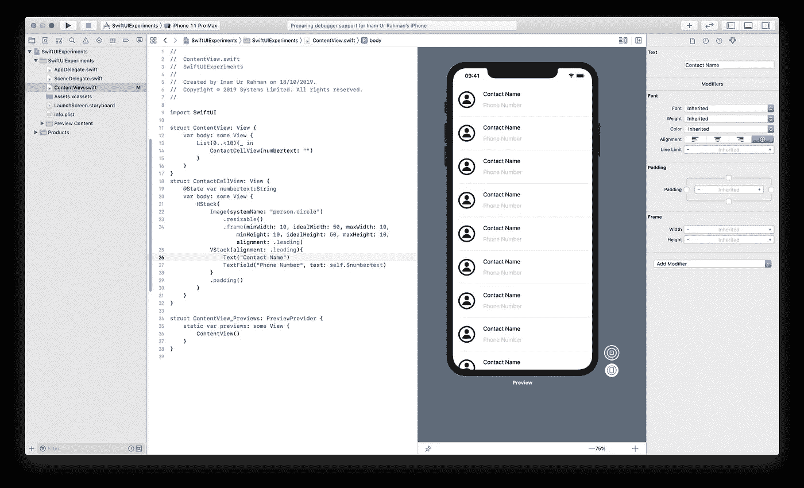

# SwiftUI 简介

> 原文：<https://betterprogramming.pub/intro-to-swiftui-a4301d0c91b9>

## 一个聚焦于最重要的事情的玩笑

丹尼尔·冯·阿彭在 Unsplash[拍摄的照片](https://unsplash.com/s/photos/word?utm_source=unsplash&utm_medium=referral&utm_content=creditCopyText)

# 介绍

SwiftUI 有什么新功能？几乎所有的事情！

SwiftUI 消除了在整个应用程序中管理数据依赖性的所有痛苦，并在幕后为您完成这项工作。该框架提供了各种各样的视图、布局和控件来帮助开发人员。在 SwiftUI 中开发会让你重新思考你以前开发 iOS 应用的方式。

SwiftUI 采用声明式方法进行开发，这意味着您所要做的就是告诉组件您希望它如何处理特定类型的数据，剩下的工作由框架本身负责。通过*其余的*，我的意思是它在不同的 iOS 设备大小和模式(例如，白天和夜晚模式)上呈现，并且它通过理解上下文来做到这一点。

# 建立我们的第一个 SwiftUI 项目

## 先决条件

*   先前的 Swift 知识
*   马科斯·卡塔利娜(10.15)
*   Xcode 11.0 或更高版本
*   iOS 13.0

## 步伐

1.  打开 Xcode。
2.  点击创建新项目。
3.  选择单视图应用程序。
4.  单击下一步。

5.输入项目名称。

6.确保选择的用户界面是 SwiftUI，语言是 Swift。

7.单击下一步。

8.选择保存项目的位置。

这是你开始学习 SwiftUI 的新石板。

有些东西肯定是新的，对吧？

肯定是的！编码视图右侧的面板称为全新的预览功能。它提供了编码时的实时渲染体验。您的视图将是 Swift 代码，并且您还可以利用可视化编辑器的强大功能，两者都可以同时进行。

您一定也注意到了`ContentView.swift`中的一些奇怪代码。

UIViewController 在哪里？

## **UIViewController 不见了，打 911**

在 SwiftUI 中，我们将告别我们的老朋友 UIViewController。在 SwiftUI 中，我们只剩下视图。ViewControllers 将不再拥有和管理属性。相反，视图将从这一点开始负责，只保留视图本身所需的属性。我们的屏幕现在将成为画布，构成在不同地方保存和管理的不同视图，所有视图都拥有自己的信息，彼此之间没有任何依赖关系。

# 玩 SwiftUI

假设您想在表格视图中显示十次“Hello World”。在 UIKit 中你会怎么做？

1.  创建一个 UIViewController。
2.  添加 UITableView。
3.  创建参考插座。
4.  为表视图设置委托。
5.  实现适当的委托。

上述步骤将生成大约 50-60 行代码。

让我们用 SwiftUI 仅仅用三行就满足了上面的要求。

我们决定在上面的设计中加入更多的趣味。让我们在单元格中添加一个图像、文本字段和一个标签，并使它看起来像一个电话簿条目。

在 UIKit 中，您将执行以下步骤:

1.  创建新的 UITableViewCell。
2.  设置单元标识符。
3.  根据规格设计视图。
4.  创建视图元素的出口。
5.  写一个单元格配置函数。
6.  更新控制器以显示自定义单元格。

这将生成大约 50-60 行代码，随之而来的是一个单独的单元文件和一个原型单元设计或一个 xib，随你喜欢。

现在让我们用 SwiftUI 的方式来做:

在 SwiftUI 中实现期望的视图只需要 14 行代码。这难道不令人惊讶吗？

# 结论

我知道有些代码你现在可能不理解，我打算一个主题一个主题地浏览 SwiftUI。这是 SwiftUI 提供的强大功能的概述和一些演示。更多还在后面！敬请期待！

我也强烈推荐你在 [WWDC19](https://developer.apple.com/videos/wwdc2019/) 观看与 SwiftUI 相关的会议。