# 印刷术介绍

> 原文：<https://betterprogramming.pub/intro-to-typography-74ed63303f1e>

## 了解如何选择字体，为什么某些字体在你的应用中看起来很棒，以及选择字体时需要考虑什么

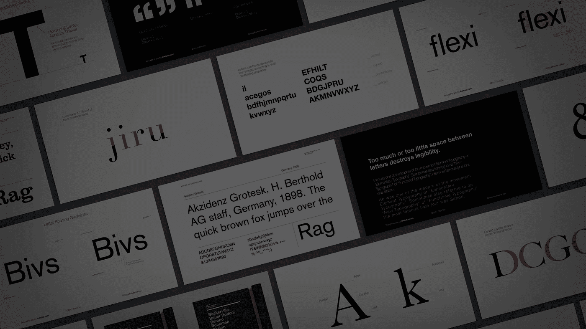

要设计用户界面，你需要对排版有详细的了解。这篇文章将涵盖这两个方面的基础知识，并让你准备好让你的界面变得生动。这篇文章将:

*   解释什么是排版，为什么它很重要
*   识别排版的各种元素来选择字体

# 学习

> 学习解释什么是排版，为什么它很重要

# 概观

如今，很容易找到有漂亮插图的不可思议的网站。这里有一个很好的例子。这是 Epicurrence 的网站，这是一个设计师的自然静修/非会议。

如果我们看一下这个没有任何内容的网站，那么它真的不是一个网站——它只是一张漂亮的图片。对于我们开发的每一个产品来说都是如此——我们用户体验中最重要的部分总是内容。我们设计内容的方式是用印刷术。

> 那么什么是印刷术呢？字体是文字的视觉组成部分。文本是一系列单词。无论如何渲染，文本都保持不变。

想想这句话“欢迎来到犹他州。”我可以把这些文字打印在一张纸上，或者大声读出来，或者保存在笔记本电脑的一个文件里。这将是相同的文本，只是以不同的方式呈现，视觉上，听觉上，数字上。

如果你以前没学过字体设计，可能会显得很神秘。但事实上，从我们会阅读开始，我们就被印刷术包围了。字体设计在表达情感、品牌识别和功能性方面起着重要的作用。

# 学习

> 学会识别排版的各种元素来选择字体

# 字体与字样

首先，我们来谈谈字体和字样的区别。我们可能经常互换使用这些术语，但还是有区别的。

字体是指字母的特定设计，如泰晤士报新罗马或 Helvetica。字体是指字体的特定风格或大小，例如，10 磅的常规字体或 24 磅的粗体字体。

你可以想象，我们采用了很多版画术语。因此，在那些日子里，font 指的是印刷机中使用的字面金属片，而 typeface 指的是更大的字体家族。今天，它们实际上是同义词，但是最好记住这个区别。

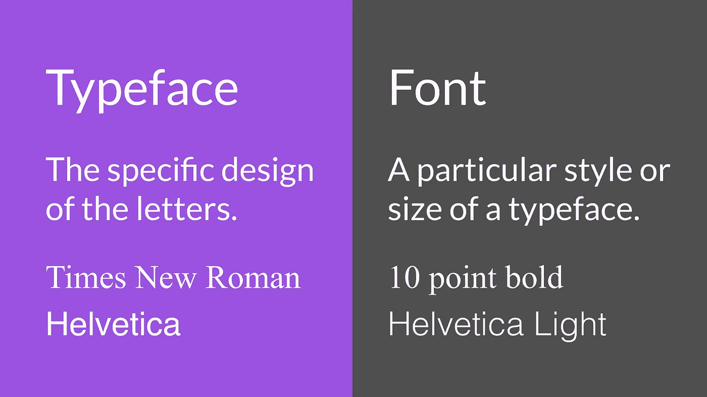

# 性格；角色；字母

字符是组成字样的全部字符集中的一个单独的符号。它可以采用字母、数字、标点符号等形式。

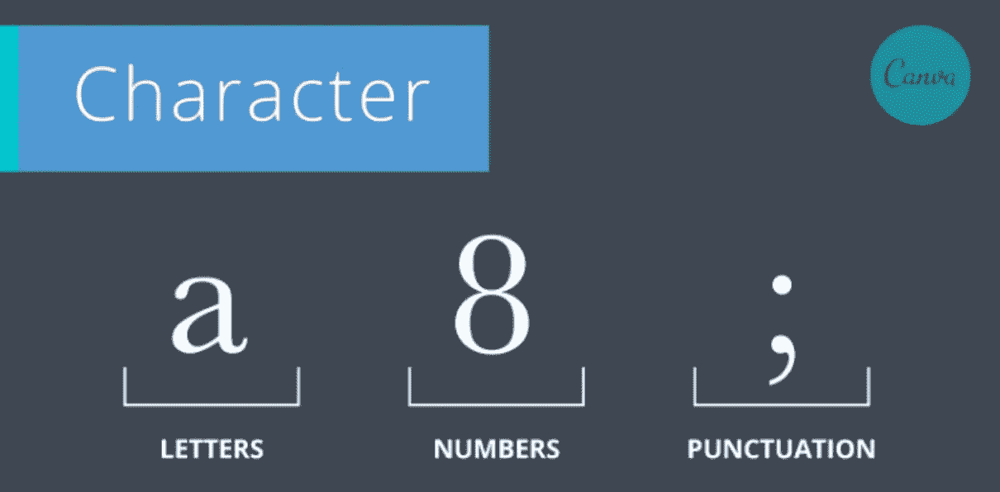

# 衬线

衬线是附在活字两端的短线或短线。它也指具有这种特征的字体的一般分类。

# 无衬线字体

无衬线字体是没有衬线设计的字体的总称。

当我们开始学习字体设计时，这是最容易发现的区别之一。我们通常使用无衬线字体。

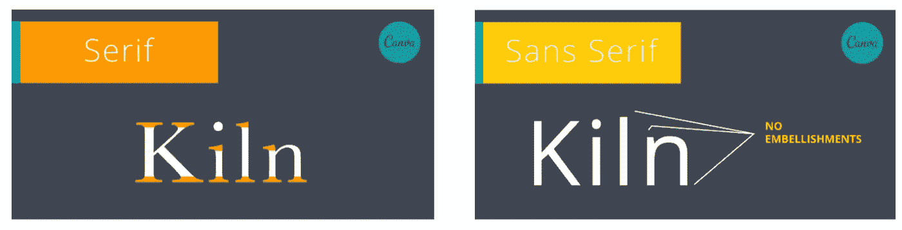

# 斜体字

斜体是指字体的倾斜形式(从左向右倾斜)。真正的斜体是独特设计的，不仅仅是直立字体(如罗马字体)的倾斜版本。因此，在左侧，我们可以看到一个标题字体，在右侧，我们有一个真正的斜体。

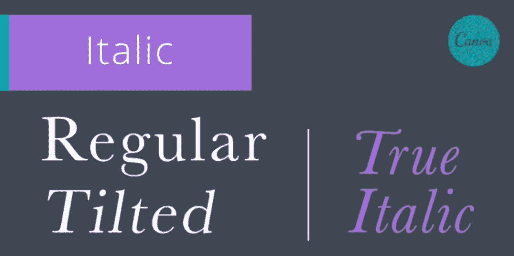

# 基线

转到一些与间距相关的术语，我们将从基线开始。基线是大多数字母和其他字符所在的假想线。

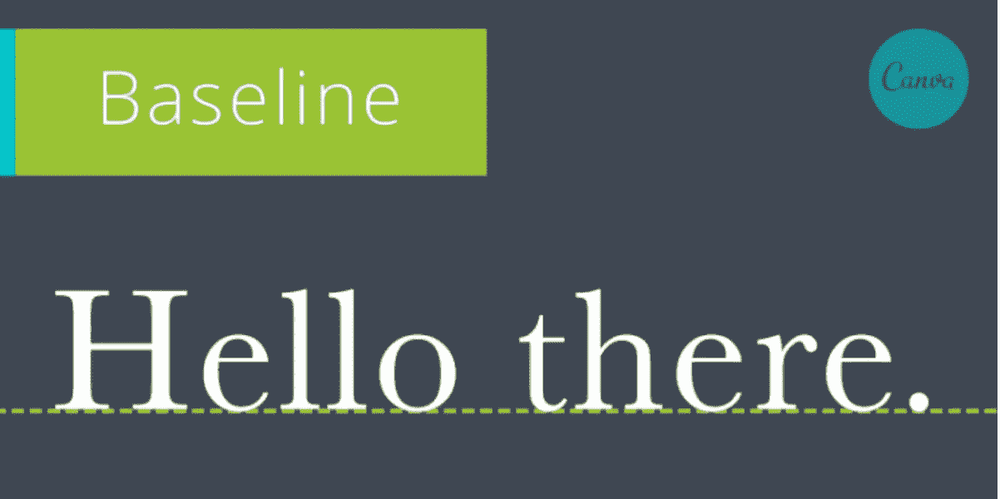

# 帽线

然后我们有帽线，这是一条假想的线，它标志着大写字母和一些小写字母的上行字母的上边界。我们一会儿将讨论上升器。

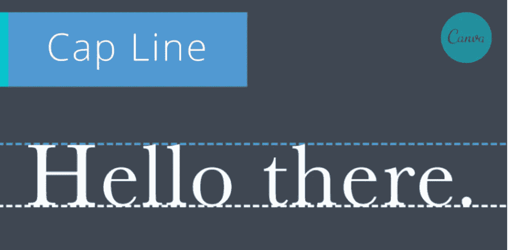

# x 高度

x 高度是指字体小写字母的高度。这也是我们用来区分上行和下行的。

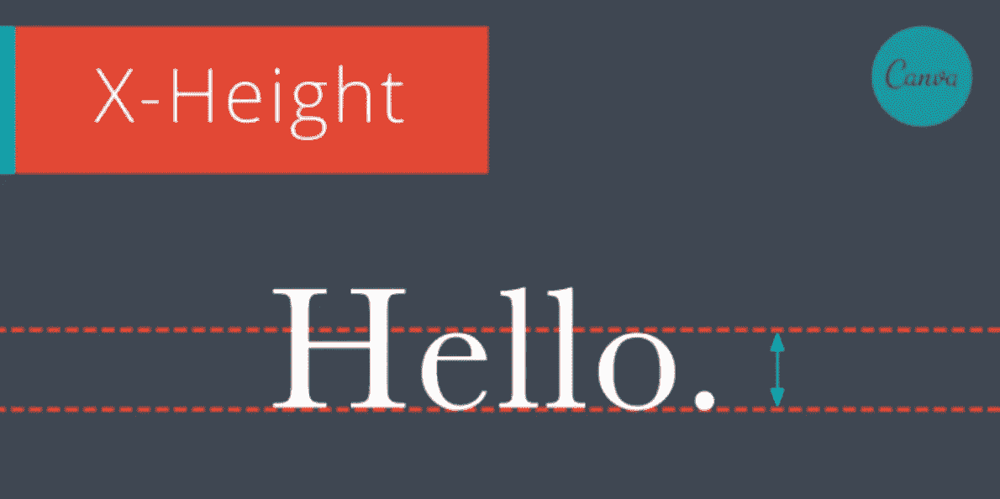

# 下行和上行

下行字母是字母中延伸到基线以下的一部分，而上行字母是小写字母中高出字母主体或 x 高度的一部分。

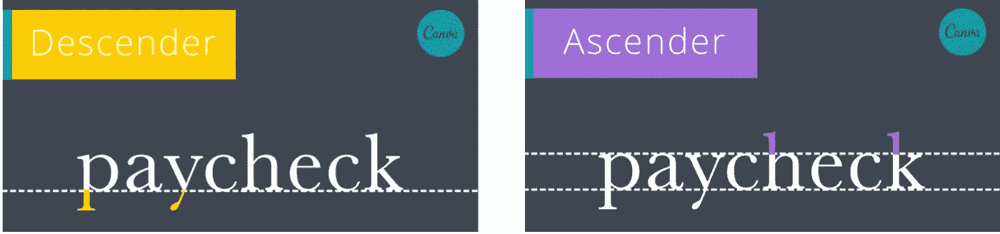

# 跟踪

字距是指文本的一个完整部分(句子、行、段落、页面等)中字符之间的间距保持一致。).

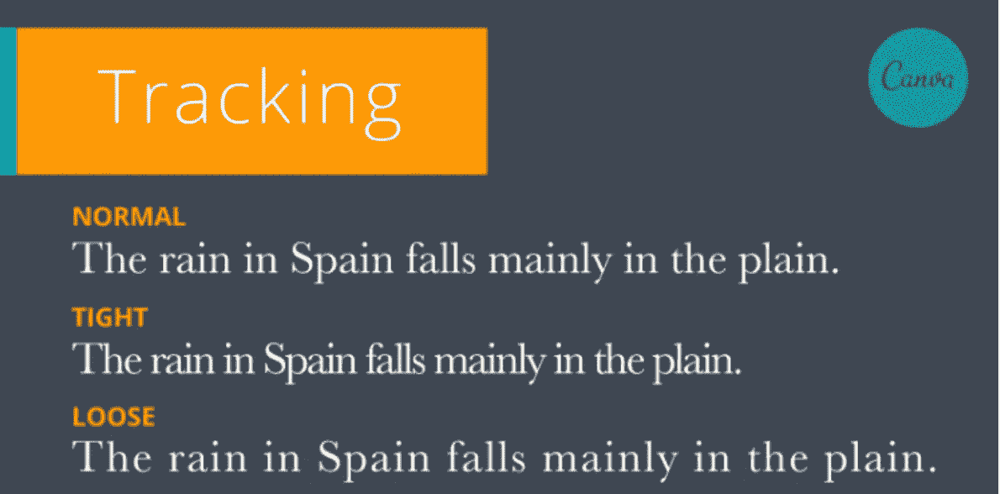

# 字距调整

字距是指两个连续字符之间的水平间距；调整字距可以创建统一的外观，并减少某些字母组合之间的空白间隙。

你不需要调整字距，因为字体设计者已经考虑到了。

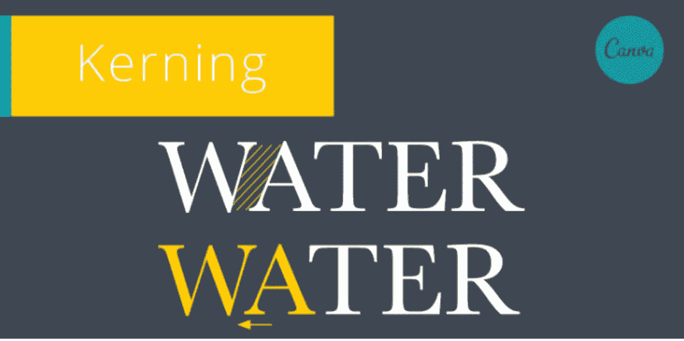

# 主要的

最后，行距是文本行之间从基线到基线的垂直间距。

虽然有更多的术语，但这些术语肯定会让你在排版方面走得更远。我不指望你一下子把它们都背下来。当你继续在设计中使用字体设计时，你会发现自己会用这些术语来描述你的想法。通过重复和练习，你很快就会掌握它们。

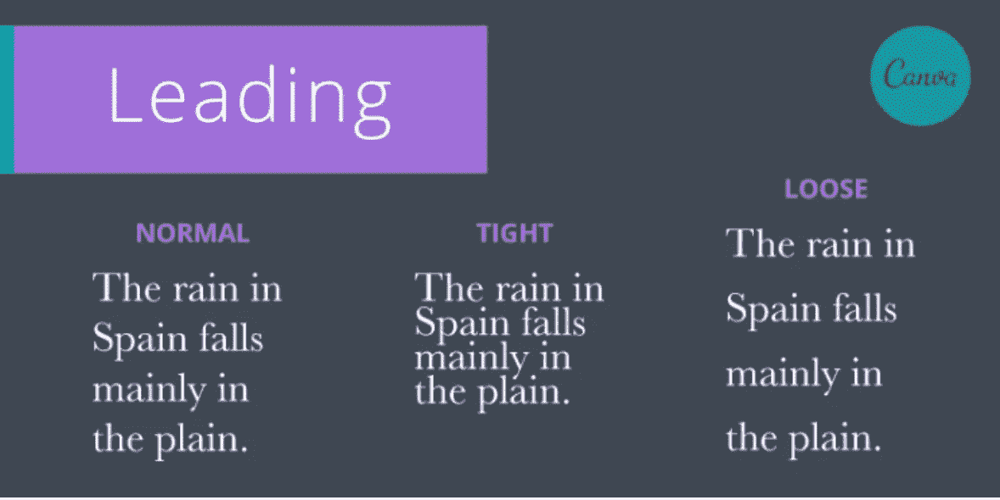

# 文本层次结构

虽然一个好的字体对改进你的排版有很大的帮助，但是你的内容最重要的方面是你的文本层次。

SparkBox 的创意总监杰里米·劳埃德解释道:

> 排版层次结构是一种用于组织类型的系统，它在数据中建立了重要性顺序，使读者能够轻松找到他们要找的内容并浏览内容。它有助于将读者的视线引导到一个章节的开始和结束，同时使用户能够根据整个文本中风格的一致使用来隔离某些信息。

你可能从来没有听说过文本层次这个术语，但是如果你读过报纸，那么你肯定对它很熟悉。如果您查看来自 Canva 的这个示例，您可以看到一个文本层次结构工作的经典示例。

正如你所看到的，威斯康星州立杂志明显使用了强大的文本层次结构来首先强调最重要的信息。起初，文本层次似乎并不重要，但正如 Canva 解释的那样，“增强可读性和可用性是建立清晰的排版层次的一些最重要的好处。”

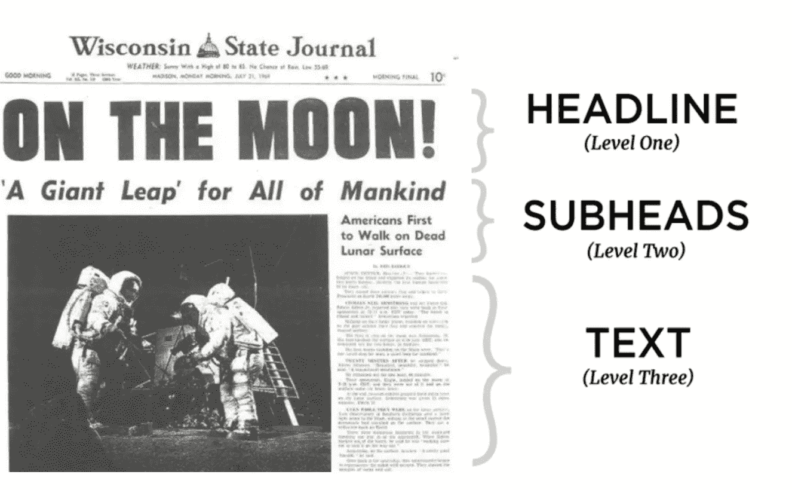

当您看到缺少一个层次的文本时，文本层次的重要性就变得非常明显。在前两个例子中，我们很难区分内容的不同部分、重要细节以及这些内容是关于什么的。然而，随着文本层次结构的改进，我们可以快速浏览文本并了解更多。

确保你的界面有一个强大的文本层次结构是设计过程中非常重要的一部分。没有文本层次结构，你的用户就不知道他们需要什么信息来使用你的体验或者与你的体验互动。

# 如何选择字体

*   想想你想要传达的个性。例如，Nunito 字体在大多数情况下看起来很专业，但更适合儿童应用程序。另一方面，Roboto 字体给人一种更专业、更严肃的个性。
*   在谷歌字体上查找字体。谷歌字体是供你探索的免费资源。
*   选择一种灵活的字体。它应该有多种重量和样式。
*   尝试多种字体，看看哪一种适合你的品牌。

# 排版技巧

*   全部大写的连续文本很难快速阅读。
*   坚持使用一种字体。一般来说，使用多种字体会导致设计的弱化。
*   不要改变字母间距。这使得你的文本更难阅读。
*   行长度最多应为 80 个字符。看看[中的](https://medium.com/)作为灵感。
*   左对齐最清晰。
*   标题应该有较短的行高，段落应该有较高的行高。

# 资源

*   [开始平面设计:排版](https://www.youtube.com/watch?v=sByzHoiYFX0)
*   [排版&设计](https://www.youtube.com/watch?v=DLeSPCTA9Wg&list=PLzKJi2GjpkEHaM3ViS4MfTpzoP5dqYQi1&index=2)

# 后续步骤

*   [人类思维设计简介](https://medium.com/@iampika/intro-to-designing-for-the-human-mind-4106ce7c291?)
*   [色彩理论介绍](https://levelup.gitconnected.com/intro-to-color-theory-dce1a63fba01)