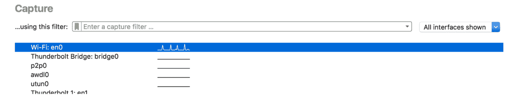
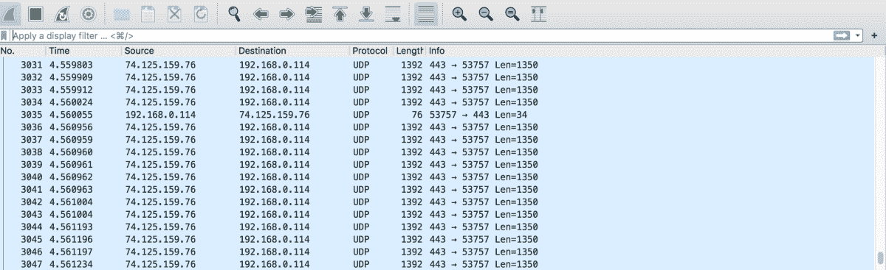
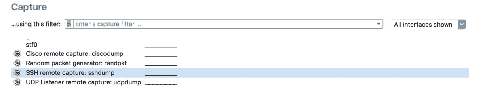
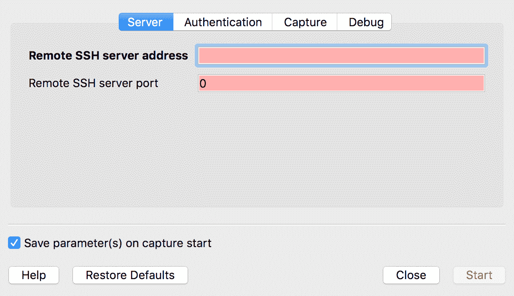
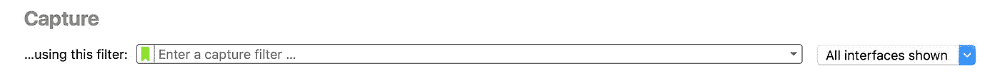

# Wireshark 简介

> 原文：<https://betterprogramming.pub/intro-to-wireshark-2abe7fb24f53>

## 使用 Wireshark 捕获网络流量


[月球](https://unsplash.com/@sir_moon?utm_source=medium&utm_medium=referral)在 [Unsplash](https://unsplash.com?utm_source=medium&utm_medium=referral) 拍摄的照片。

如果你是一个计算机网络或安全爱好者，你可能听说过 [Wireshark](https://www.wireshark.org/) 。Wireshark 是世界上最流行的网络协议分析器。它可以让您深入捕获的流量，并分析网络中正在发生的情况。您可以使用它来诊断网络问题和查找网络漏洞。

在本文中，我们将介绍使用 Wireshark 捕获流量的一些基础知识。因为我们将通过一些例子，请随意使用 PCAP 文件跟随！前往 Wireshark wiki 找到一些样本捕获文件。

# 使用 PCAP 文件

打开 Wireshark 后，它将开始捕获多个网络接口上的流量。您可以双击某个接口来查看流量详情:



您应该会看到 Wireshark 窗口中列出的数据包，如下所示:



您可以先单击顶部工具栏上的红色方形按钮来保存捕获的数据包:


这将告诉 Wireshark 停止捕获数据包。然后，转到“文件>保存”来保存 PCAP 文件。PCAP 代表“数据包捕获”，是 Wireshark 捕获文件使用的文件扩展名。您可能还会看到扩展名“PCAPNG”，它代表“PCAP 下一代”，是 PCAP 文件格式的新版本。

稍后当您想要重新访问流量捕获时，您可以进入“文件>打开”来导入保存的 PCAP 文件。

# 远程捕获

如果您想捕获并分析远程服务器上的流量，该怎么办？Wireshark 通常用于分析本地网络上的流量，因此您需要使用 tcpdump 之类的工具。

首先，使用具有 root 访问权限的帐户 SSH 到远程机器:

```
ssh remoteuser@remotehost
```

接下来，使用 tcpdump 捕获远程网络上的流量，并将其保存到 PCAP 文件中:

```
sudo tcpdump -i eth0 -w tcpdump.pcap
```

最后，使用`scp`命令将捕获文件复制到您的计算机上:

```
scp remoteuser@remotehost:tcpdump.pcap /some/local/directory
```

现在，您可以在计算机上使用 Wireshark 打开远程捕获文件。

或者，您可以使用 Wireshark 的远程捕获工具 sshdump。该命令在功能上等同于上面的命令:

```
sshdump --extcap-interface=sshdump --capture--remote-host remotehost --remote-username remoteuser--fifo=/some/local/directory/tcpdump.pcap
```

您也可以在 Wireshark 的 GUI 中直接使用 sshdump。通过向下滚动启动屏幕上的接口列表并双击“SSH remote capture: sshdump”来访问 sshdump:



在此对话框中，您可以指定远程服务器、端口、接口、用户名和密码:



您还可以指定捕获过滤器和捕获命令。确保选中“在远程机器上使用 sudo”选项！


# 捕获过滤器

您可以使用 Wireshark 的捕获过滤器来减小捕获文件的大小。捕获过滤器使您能够在捕获过程中忽略您不感兴趣的数据包。在 Wireshark 的启动窗口中，您可以在接口列表上方看到捕获过滤器:



您可以根据 IP 地址、端口号和协议等标准过滤数据包。例如，您可以使用“主机”过滤器来关注进出目标主机的流量:

```
host 74.125.5.4 (Captures all traffic to and from host.)
dst host 74.125.5.4 (Captures all traffic to host.)
src host 74.125.5.4 (Captures all traffic from host.)
```

您也可以根据源端口和目的端口进行过滤:

```
port 80 (Captures all traffic to and from port.)
dst port 80 (Captures all traffic to port.)
src port 80 (Captures all traffic from port.)
```

最后，您也可以使用过滤器来排除数据包:

```
not port 80 (Captures all packets that do not use port.)
```

你可以在维基上找到更多有用的捕获过滤器。

# 显示过滤器

另一方面，您可以使用显示过滤器来排除不想在 Wireshark 窗口中看到的数据包。显示过滤器不影响 PCAP 文件，但允许您在分析过程中仅查看某些数据包。您可以在数据包列表上方的 Wireshark 窗口中看到显示过滤器:


例如，您可以让 Wireshark 显示或排除具有特定来源和目标 IP 的数据包:

```
ip.src==74.125.5.4 and ip.dst==192.168.0.1
ip.src!=74.125.5.4
```

您还可以基于协议进行过滤:

```
udp or icmp
```

或者使用`contains`过滤器根据内容过滤数据包。此过滤器将在 UDP 头或有效负载的任何位置显示包含三字节序列 0x81、0x60、0x03 的数据包:

```
<host or protocol> contains <expression>
udp contains 81:60:03
```

最后，您可以使用像`and`或`or`这样的布尔表达式来组合过滤器:

```
tcp.port==80 or udp
```

你可以在维基上找到更多有用的显示过滤器。

# 结论

感谢阅读！本文只介绍了 Wireshark 的一小部分功能。这是一个多功能的工具，能够执行许多不同类型的分析。

如果您有兴趣了解 Wireshark 的更多信息，请访问下面的文档:

[](https://wiki.wireshark.org/) [## Wireshark Wiki

### 这是 Wireshark 网络协议分析器的 wiki 站点。如果您是编辑组的成员，您可以编辑…

wiki.wireshark.org](https://wiki.wireshark.org/)