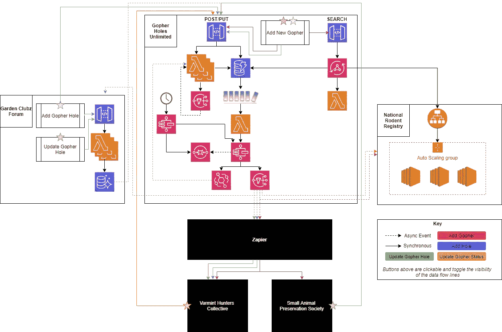
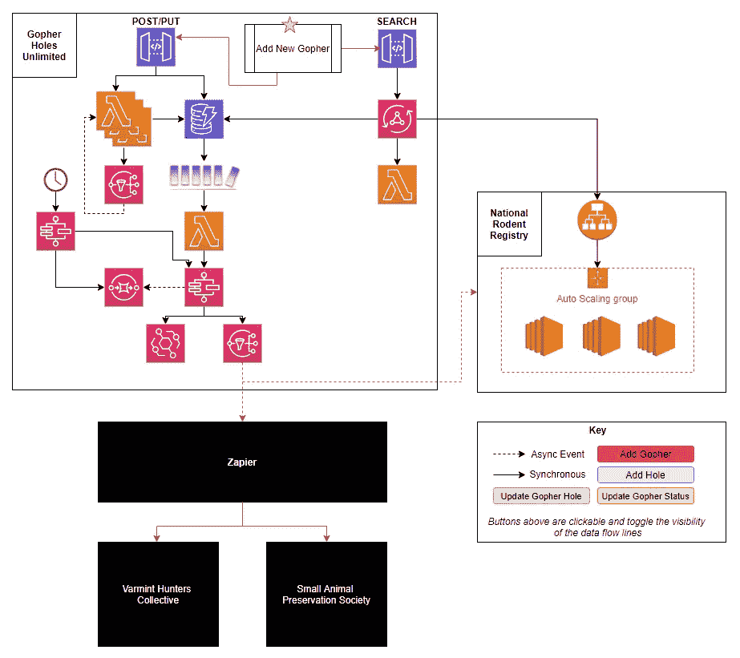

# 引入一个新的横切架构图:关键路径

> 原文：<https://betterprogramming.pub/introducing-a-new-cross-cutting-architecture-diagram-the-critical-path-62d75980bd1f>

## 这个新的体系结构图跨越了 C4 模型的 1-3 级，为您提供了最快的系统视图

由 [Unsplash](https://unsplash.com/s/photos/diagram?utm_source=unsplash&utm_medium=referral&utm_content=creditCopyText) 上 [charlesdeluvio](https://unsplash.com/@charlesdeluvio?utm_source=unsplash&utm_medium=referral&utm_content=creditCopyText) 拍摄的照片

架构图是一个奇迹。它们有助于在您和您的应用程序的利益相关者之间创建关于应用程序架构、业务流程和数据流的共同理解。

大约一年前，我写了一篇关于 [5 种架构图](/solutions-architect-tips-the-5-types-of-architecture-diagrams-eb0c11996f9e)的文章，描述了我们今天使用的许多图。它向您展示了您应该如何以及为什么创建类似于*流程*、*服务*、*角色*、*基础设施*和*开发人员*图表的图表。

它们松散地适应于用于绘制软件架构的 c4 模型。有细微的差异，两者都有助于以不同的方式推动你的应用程序的重要信息。

有一天，我正在为一个准备上线的应用程序准备桌面练习，我正在通读我的架构图列表。但是缺少了一些东西。

我需要一张显示系统关键路径的图表，这样我就可以准备一个真实的灾难场景。概括架构的东西，但也足够具体，给我足够的细节来知道我的应用程序中的断点在哪里。

我在另一篇文章中提到的图表都没有涵盖这种情况。我需要一种新的类型。

我需要关键路径图。

# 概观

关键路径图是你整个生态系统的地图。它从一个系统到另一个系统跟踪主要业务流程的数据流。所有的跳跃、扇出、网钩等都被记录下来，这样你就可以很容易地识别故障点。

*关键路径图示例*

有了这个图表，您可以跟踪整个系统的数据。它跟踪数据在应用程序内部是如何传输的，并跟踪系统之间的所有跳跃。如果一个主要的业务流程导致 3 或 4 个应用程序被更新，这是一个完美的图表来说明它。

## **观众**

这种类型的图表对每个人都有点意义。它从上到下都有细节，这对支持人员、您的产品团队和开发人员来说是无价的。

## **注意事项**

您不需要将每个 API 的所有细节都放在关键路径图中。您应该对相似的端点进行归纳和分组。如果您有一组端点在技术上遵循相同的流程(例如，*，API Gateway to Lambda to dynamo db to dynamo db streams*)，您可以一次性包含该模式。

# 数据流

当谈到数据流时，我指的是*业务流程在系统中遵循的路径。*如果我们以 [Gopher Holes Unlimited](https://github.com/allenheltondev/gopher-holes-unlimited) 为例，我们可以看到当一个新的 Gopher 被添加到系统中时会发生什么。

*添加新地鼠的数据流*

## 成分

*   **发起方** —业务流程或数据流开始的地方。在图中表示为*星*
*   **应用** —在生态系统中发挥作用的独特独立应用
    - **已知应用** —您拥有或知道其内部结构的应用。在图中表示为*空心框
    -*-**第三方应用**-你不拥有也不知道它们如何工作的应用。在图中表示为*黑盒*
*   **数据流** —一系列连接的线条，显示数据通过系统的进程。由用于异步调用的*虚线*和用于同步调用的*实线*表示。当显示多个数据流时，最好按颜色组织它们。
*   **基础设施** —对于已知的应用程序，这显示了关于应用程序如何构建以及当数据流经系统时哪些服务操纵数据的一般细节。由*所涉及的服务的图像*表示。
*   **UI 交互**——填写表格或执行搜索等通常会启动数据流的操作。由带有标签的*矩形表示*

在我们上面的例子中，数据流的*发起者*开始于“添加新的地鼠**”***UI 交互*。对于这个业务流程，交互是 UI 中的一个向导，引导用户为一个 gopher 添加所有必要的数据元素。当我们追踪箭头时，我们从星星开始。

该流程使用搜索机制来寻找现有的地鼠。该搜索端点使用 [AppSync](https://aws.amazon.com/appsync/) 从 DynamoDB(一个辅助 Lambda 函数)中查找地鼠，并调用国家啮齿动物登记处的 API。

一旦数据被提交，它将通过主要的数据接收流程，从 API Gateway 到 DynamoDB，再到 DynamoDB 流，再到 Step 函数(这种模式在本文的[中有所描述)。](/build-better-serverless-apis-by-going-storage-first-597784f8f399)

一旦完成，一个 SNS 主题就会发布一条消息，这条消息被[扎皮尔](https://zapier.com/)接收，然后将数据传递给*第三方应用*恶意猎人集体和小动物保护协会。它还向国家啮齿动物登记处发布数据，后者通过自动扩展的 EC2 车队上的 ALB 接收数据。

一旦数据通过社交网络到达集成商，我们的数据流就完成了。通过追踪箭头，我们看到当添加一个新的 gopher 时，四个系统被更新。*听起来像是一个重要的数据流！*

这个业务流程是为什么关键路径图很重要的一个很好的例子。它确保您可以看到最重要的数据流。还是最脆弱的。还是最忙的。构建关键路径图将向您展示每个服务数据经过的地方，从而更容易在问题变成问题之前隔离问题区域。

# 让它互动

将所有的主要数据流放在同一个图上会使它看起来密集而复杂。这会让你很难理解，并且显得过于复杂。这可能会让人们不再试图弄清楚到底发生了什么。

另一方面，它也有助于显示应用程序中复杂、高流量或[大爆炸半径](https://aws.amazon.com/getting-started/fundamentals-core-concepts/#Reliability)的区域。表明数据密度很重要，*但并不总是*。

也就是说，让你的关键路径图具有交互性是让它看起来更简单、更容易理解的关键。

我在一个名为[diagrams.net](https://www.diagrams.net/)(以前的 draw.io)的免费应用程序中绘制我所有的图表。当构建关键路径图时，我将每个数据流放在它自己的层中。然后，我在键中添加按钮来切换层的可见性，使得显示/隐藏整个流变得容易。

*关键路径图关键点*

这些按钮位于*键*中，因此它们被合并在一个地方。图表的使用者可以单击一个按钮来隐藏所有的数据流线，或者再次单击它来恢复。Diagrams.net 提供了一个[完整的一步一步的教程](https://www.diagrams.net/blog/interactive-diagram-layers)，教你如何创建图层以及制作显示和隐藏图层的按钮。

要查看互动版的地鼠洞无限关键路径图，[点击这里](https://readysetcloud.s3.amazonaws.com/GHU+-+Critial+Data+Paths.html)。

# 用例

关键路径图有几个用例。

*   **系统图** —列出您的生态系统中涉及的所有应用程序，以及它们是如何耦合的
*   **灾难规划** —如果发生灾难，识别潜在的瓶颈和高爆炸半径区域
*   **架构图 Lite** —显示了正在使用的架构类型。Gopher Holes Unlimited 是一个无服务器应用程序，国家啮齿动物登记处是一个容器化的自动缩放 ec2 应用程序，等等…

这些用例中的每一个对于构建生产准备计划都至关重要。有了关键路径图，所有的部分都摆在你面前，并以一种既概括又详述数据如何从 A 点到 b 点的方式呈现。

> 没有所有的碎片，你无法完成一个拼图。

与 C4 模型相比，这种类型的架构图包含了前三个层次的元素(*上下文*、*容器*和*组件*)。这提供了一个有趣的、交叉的细节组合，一目了然。但是关键路径图应该用其他类型的图来补充。袖手旁观本身并不能描绘出全貌。

你需要最后一层细节。您需要更详细的图表的细微差别来显示依赖关系或关于事物如何连接的细节。当你经历灾难场景时，如果你需要的话，一张[基础设施图](/solutions-architect-tips-the-5-types-of-architecture-diagrams-eb0c11996f9e#36df)提供了深入的细节。在 C4 模型中，这是第 4 级(*代码*)。

# 最后的想法

关键路径图是放在你背后口袋里的一个很好的工具。它是一个“集合”图，意味着它将其他类型的图中的重要部分组合成一个图。

它用于获得整个生态系统的全景。通过提供足够的细节来发现瓶颈和痛点，但将细节抽象到足够远以使您远离杂草，这对于与组织中的每个人共享来说是非常好的。关键路径图对于开发人员、支持人员、技术支持人员和您的 SRE 团队来说是非常宝贵的。

该图不会取代工具箱中的其他图，但在构建系统图时，它应该用作增强和起点。

如果你是一个解决方案架构师，你工作的一个重要部分就是[与你的应用程序的涉众建立一个共同的理解](/how-to-switch-from-software-developer-to-solutions-architect-5e0c12bdc4b1)。构建一个关键路径图或任何类型的图都会大大增加你理解的机会。

试试看，让我知道你的想法，并分享你的建设！

编码快乐！