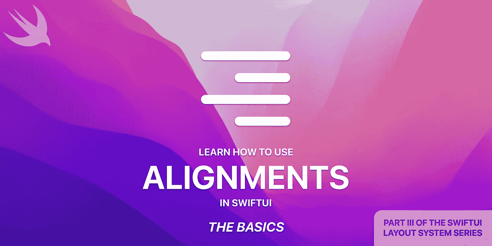
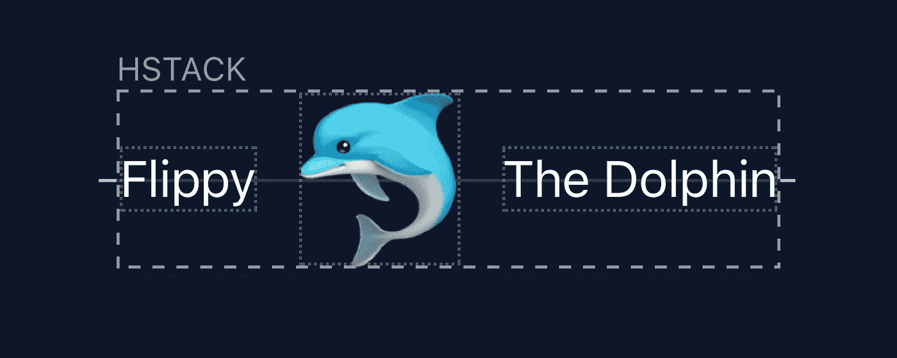
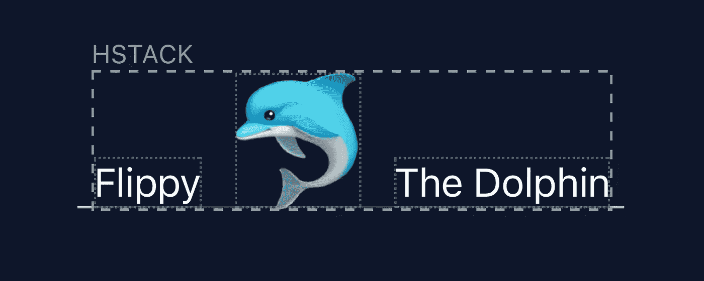
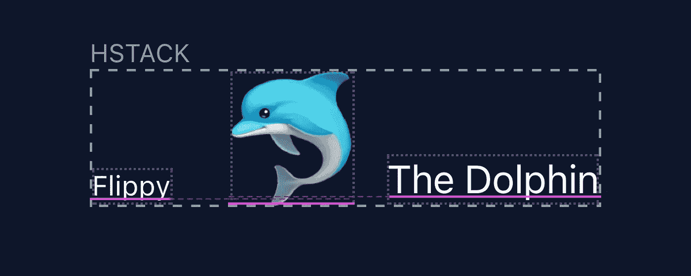
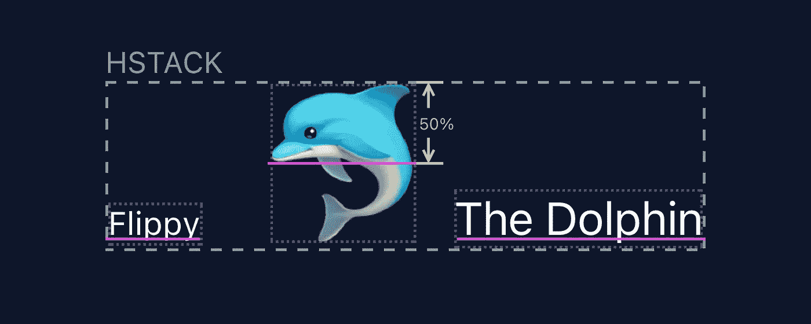
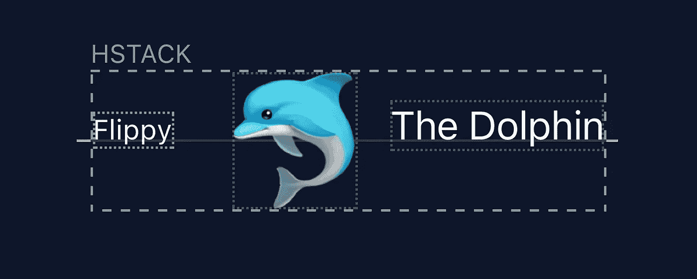
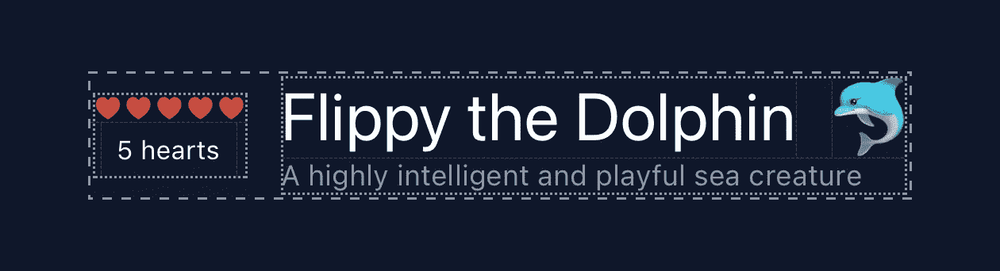
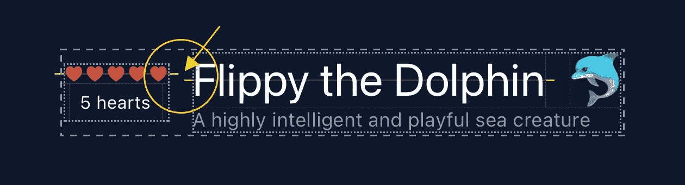
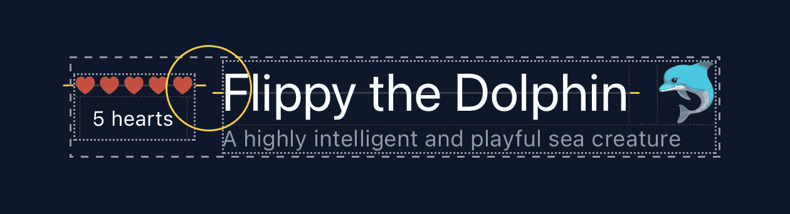
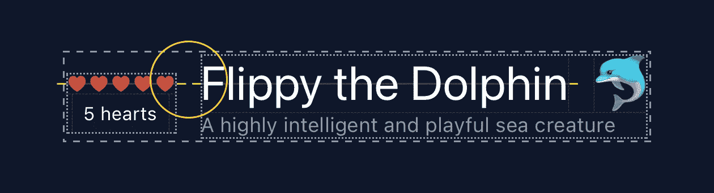

# 如何在 SwiftUI 中使用对齐—基础知识

> 原文：<https://betterprogramming.pub/introducing-alignments-in-swiftui-10d4f4ba252>

## 设置基本和自定义对齐



这是*‘swift ui 布局系统’*系列的第三部分，在这个系列中，我们将学习你需要知道的关于对齐的一切。像 Stacks 一样，理解 alignments 如何工作将为您的工具箱提供另一个强大的工具，用于在 SwiftUI 中构建优秀的布局。

# SwiftUI 布局系统

*   [如何使用 SwiftUI 布局系统](https://medium.com/@crystalminds/introducing-the-swiftui-layout-system-part-i-the-basics-42083aaaa5c7)
*   [如何在 SwiftUI 中使用堆栈](https://crystalminds.medium.com/introducing-stacks-in-swiftui-b616681c502a)
*   *如何在 SwiftUI 中使用对齐* –*基础知识*
    –[对齐过程](https://crystalminds.medium.com/introduction-to-alignments-the-alignment-process-1fc087a3f263)
    –[自定义对齐](https://medium.com/@crystalminds/how-to-use-alignments-in-swiftui-part-iii-custom-alignments-80da9305a4bd)
    –[容器扩展使用对齐](https://crystalminds.medium.com/how-to-use-alignments-in-swiftui-part-iv-container-expansion-using-alignments-3e9a88d1275e)
    –[Z 堆栈对齐](https://crystalminds.medium.com/how-to-use-alignments-in-swiftui-part-v-z-stack-alignment-478b4209d02d)

*(更多来……)*

# 基础知识

我们将使用 Stacks 教程中的吉祥物海豚 Flippy 来演示对齐的基础知识。


```
HStack {
    Text("Flippy")
    Image("54x60_dolphin")
    Text("the Dolphin")
}
```

在早期的故事中，我们走过了布局系统的步骤。视图的对齐将发生在该过程的第三步，在*“父元素将子元素放置在父元素的坐标空间”*中。

中心对齐是堆栈的默认设置，所以如果我们显式设置它，它不会改变任何视觉效果，因为它已经在父视图的中心对齐了视图。

```
HStack(**alignment: .center**) {
    Text(“Flippy”)
    Image(“54x60_dolphin”)
    Text(“the Dolphin”)
}
```



在 HStack 上居中对齐。

如果您将值从`.center`更改为`.bottom`，那么所有视图都将整齐地与父视图的底部对齐，这一点您不会感到惊讶。

```
HStack(alignment: **.bottom**) {
    Text(“Flippy”)
    Image(“54x60_dolphin”)
    Text(“the Dolphin”)
}
```



HStack 上的底部对齐。

这很简单，看起来很体面。当我们把文本`Flippy`的字体大小从`.body`改成`.caption`的时候，事情就不一样了。

```
HStack(alignment: .bottom) {
    Text(“Flippy”)**.font(.caption)**
    Image(“54x60_dolphin”)
    Text(“the Dolphin”)
}
```



各种基线。

正如你在上面的图片中看到的。所有的视图都是底部对齐的，但是视觉对齐都是乱的。

你得到了较小文本的基线`Flippy`，你得到了图像的底线，你得到了文本的基线`The Dolphin`，但它们都没有对齐。

幸运的是，SwiftUI 覆盖了我们，我们可以简单地使用`.lastTextBaseline`对齐来解决这个问题。

```
HStack(alignment: **.lastTextBaseline**) {
    Text(“Flippy”).font(.caption)
    Image(“54x60_dolphin”)
    Text(“the Dolphin”)
}
```


HStack 上的最后一个文本基线对齐

但是图像呢？请注意，图像中没有文本，但每个对齐都有默认值，最后一个文本基线的默认值就在视图的底部边缘。

现在你可以说，在图像上有一个视觉基线，从顶部起 50% (0.5)，就在他的鼻子周围。



我们可以通过告诉 SwiftUI 如何使用对齐指南根据图像的其他对齐方式计算图像的最后一个文本基线来处理这个问题。

```
HStack(alignment: .lastTextBaseline) {
    Text(“Flippy”).font(.caption)
    Image(“54x60_dolphin”)
 **.alignmentGuide(.lastTextBaseline) { d in
            d[.bottom] * 0.5
        }**
    Text(“the Dolphin”)
}
```



正如你所看到的，所有的视图现在整齐排列。

# 自定义对齐

让我们回到来自“[如何在 SwiftUI](https://crystalminds.medium.com/introducing-stacks-in-swiftui-b616681c502a) 中使用堆栈”的组合堆栈示例。



默认情况下，视图现在是垂直居中的，但是如果我们想要将心脏(在一个`VStack`中的视图)与标题*“海豚鳍”*(在另一个`VStack`中的视图)对齐呢？



```
HStack {
    VStack {
        Text("❤❤❤❤❤")
        Text("5 hearts")
    }    
    VStack {
        HStack {
            Text("Flippy the Dolphin")
            Spacer()
            Image("26x30_dolphin")
        }        
        Text("A highly intelligent and playful sea creature")
    }
}
```

我们需要一条线来标记心脏的中心。因此，要做到这一点，我们需要定义我们自己的(自定义)对齐。

```
**extension** VerticalAlignment {
    **private** **enum** MidHeartsAndTitle : AlignmentID {
        **static** **func** defaultValue(in d: ViewDimensions) -> CGFloat {
            **return** d[.bottom]
        }
    } **static** **let** midHeartsAndTitle =  
        VerticalAlignment(MidHeartsAndTitle.**self**)
}
```

我们用一个符合`AlignmentID`的枚举来扩展`VerticalAlignment`。它有一个要求，告诉 SwiftUI 如何计算默认值。我们简单地选择尺寸的`.bottom`作为缺省值，没有特别的原因。您可以将其设置为您喜欢的任何默认值。

最后，我们定义了一个静态实例`VerticalAlignment`，它将枚举类型作为它的参数。

现在，我们可以使用它来对齐堆栈，明确地将它设置为红心和标题的中心。

```
HStack(**alignment: .midHeartsAndTitle**) {
    VStack {
        Text("❤❤❤❤❤")
 **.alignmentGuide(.midHeartsAndTitle) { 
                d in d[.bottom] / 2 
            }** Text("5 hearts")
    }    
    VStack {
        HStack {
            Text("Flippy the Dolphin")
 **.alignmentGuide(.midHeartsAndTitle) { 
                    d in d[.bottom] / 2 
                }** Spacer()
            Image("26x30_dolphin")
        }        
        Text("A highly intelligent and playful sea creature")
    }
}
```



在指定自定义对齐之前。



指定自定义对齐后。

在下一部分[中，我们将详细讨论 SwiftUI 调整视图的步骤。](https://crystalminds.medium.com/introduction-to-alignments-the-alignment-process-1fc087a3f263)