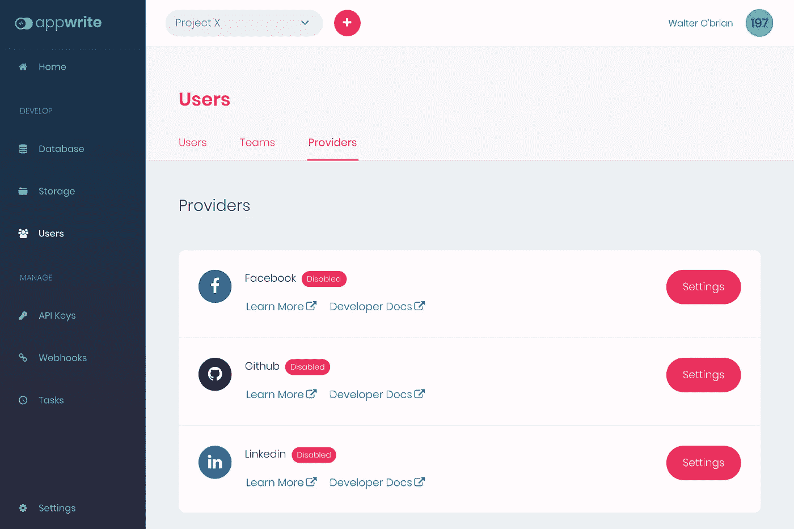
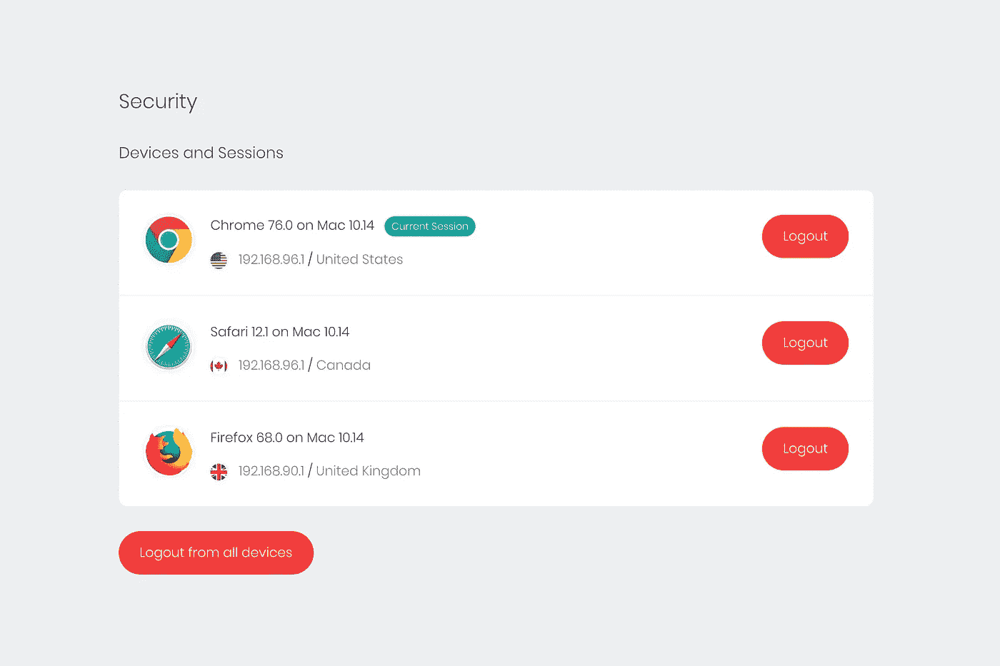
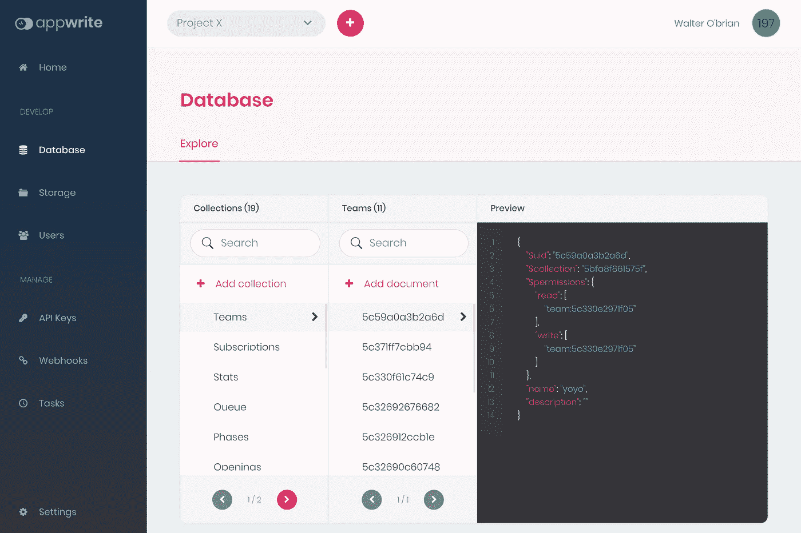
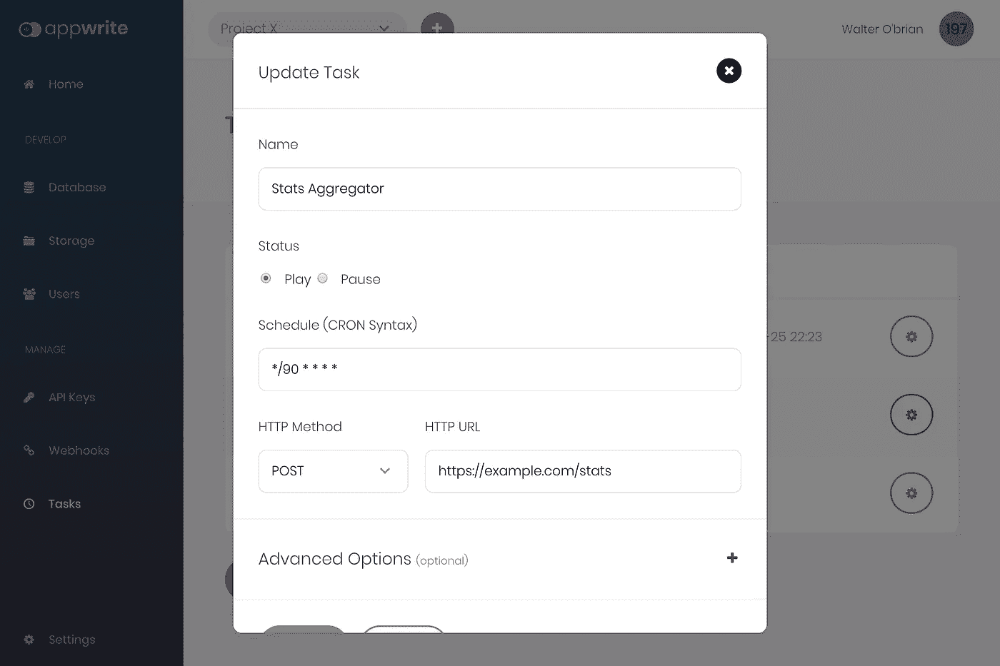
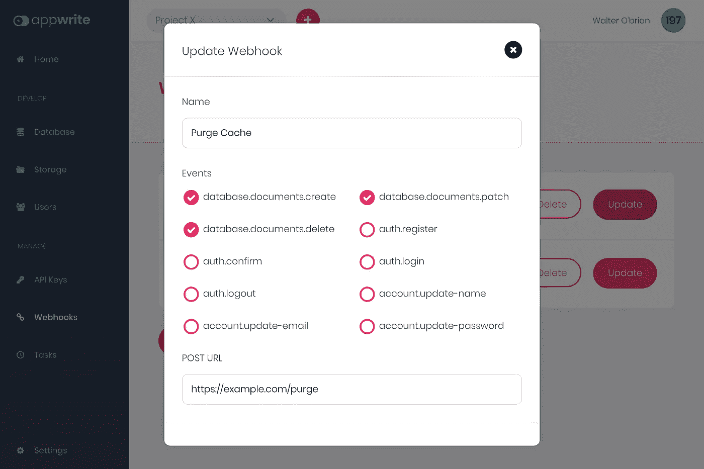

# 介绍 Appwrite:一个面向移动和 Web 开发人员的开源后端服务器

> 原文：<https://betterprogramming.pub/introducing-appwrite-an-open-source-backend-server-for-mobile-web-developers-4be70731575d>

## 更快地构建应用

由 [Rami Al-zayat](https://unsplash.com/@rami_alzayat?utm_source=unsplash&utm_medium=referral&utm_content=creditCopyText) 在 [Unsplash](https://unsplash.com/s/photos/apps?utm_source=unsplash&utm_medium=referral&utm_content=creditCopyText) 拍摄的照片

[Appwrite](https://appwrite.io) 是一款新的[开源](https://github.com/appwrite/appwrite)，面向前端和移动开发者的端到端后端服务器，让你可以更快地构建应用。它的目标是抽象和简化 REST APIs 和工具背后的常见开发任务，帮助开发人员更快地构建高级应用。

在这篇文章中，我将介绍一些主要的 Appwrite 服务。我将解释它们的主要特性，以及它们是如何被设计来帮助你更快地构建你的下一个项目，这比你必须从头开始编写所有的后端 API 要快得多。

Appwrite 服务器被打包成 Docker 容器，您可以在本地机器或云提供商的终端上使用简单的`docker-compose`命令轻松设置它。

安装就像从命令行终端运行一个命令一样简单。

# 证明

Appwrite 身份验证服务可让您轻松管理用户注册和应用程序登录。Auth 服务还提供与多个 OAuth 提供商的内置集成，如脸书、Github、LinkedIn 等。

您可以轻松地将 OAuth 提供者集成为应用程序的新登录方法

除了管理对应用及其各种资源的访问控制，Auth 服务还抽象出其他重复任务，如管理用户电子邮件确认和密码恢复。

Auth 服务节省了大量时间，并减少了构建稳定、安全的用户身份验证和授权系统时的顾虑，该系统必须与多种第三方登录方法集成。

# 账户

Appwrite 帐户服务向您的客户端公开一个 API，该 API 允许您与当前登录的用户帐户进行交互。

Appwrite 帐户服务允许您管理您的用户活动会话。

帐户服务允许您的用户更新他们的帐户相关信息，并保存他们的个人偏好，如用户界面语言、时区或最喜欢的主题。您可以根据自己的意愿为用户设置任何偏好。

您还可以使用 API 来获取用户活动会话的列表，包括关于会话位置、设备、操作系统和用户代理的信息。使用 API 安全日志端点，您可以让您的用户查看他们最近的登录、密码恢复和其他安全敏感事件。

# 数据库ˌ资料库

Appwrite Database dashboard 允许您轻松地浏览您的项目集合和文档。

Appwrite 数据库服务可让您直接从客户端应用集成用户和应用数据，无论是浏览器还是本机应用。数据库中的每个文档都能够嵌套其他子文档。使用 Appwrite 数据库过滤器，您可以应用高级查询并过滤嵌套的文档集合。

每个文档都可以为特定用户、一组用户、一个 API 键或一个用户角色设置读写权限。使用 Appwrite 数据库，一个简单而灵活的[权限机制](https://appwrite.io/docs/permissions)，你可以为你的应用管理复杂而精密的访问控制逻辑。

Appwrite 数据库还让您可以灵活地选择结构化数据集合或灵活的集合来随时管理您的数据。对集合中的每个文档实施数据结构和验证规则。

# 储存；储备

Appwrite 存储服务是让您或您的应用程序用户安全、简单地上传和管理其文件的最简单方法。

API 利用了数据库使用的相同的简单读写[权限机制](https://appwrite.io/docs/permissions)。这使您可以轻松地决定您的文件是否可以被所有用户、特定用户甚至用户组访问。

Appwrite 存储 API 允许您在应用程序中轻松集成安全文件上传。

Appwrite 存储服务还提供了与自动更新防病毒服务器的内置集成。所有上传到系统的新文件都经过扫描和验证，以确保您和您的用户的安全。

最有用的功能之一是能够预览文件内容，并在应用程序或网站中以缩略图的形式显示。你也可以动态地改变你的缩略图的大小，在不同的图像格式之间转换(支持 webp！)并改变它们的质量以提高网络性能。

# 组

Appwrite Teams 服务允许您和您的用户创建团队并共享对不同 API 资源(如文件或文档)的权限。这是为您的产品实现复杂的访问控制需求的一个伟大而简单的方法。

每个团队成员也可以被授予不同的角色，让你有更大的灵活性。

# 任务

Appwrite 任务服务是设置定期计划作业的好方法。

不用处理复杂的 crontabs 或长时间运行的守护进程，也不用担心容错、监控和错误日志之类的事情，您所需要做的就是提交一个表单，将您的任务作为 HTTP 端点，并使用一个类似 [cron 的语法](https://en.wikipedia.org/wiki/Cron)来指示它应该多长时间执行一次。就这么简单。

您还可以使用“任务”的“高级选项”向您的请求添加不同的 HTTP 头，或者使用基本的 HTTP 验证来保护它。不用说，所有敏感的 HTTP 密码都安全地加密在 Appwrite 内部数据库中。

# Webhooks

您可以从 Appwrite 控制台轻松注册一个新的 webhook。

Appwrite Webhooks 旨在允许您轻松方便地为后端集成自定义行为。

想在新用户注册到你的应用程序时收到短信吗？想要在您的某个应用程序文档获得更新时清除缓存吗？只需添加一个新的 webhook，当特定的 Appwrite 事件触发时，它会在您的一端触发一个 HTTP 端点。使用 Appwrite Webhooks，你只会受到想象力的限制。

# 下一步是什么？

在这篇文章中，我强调了一些更引人注目的 Appwrite 服务。在以后的文章中，我将更深入地探讨一些特性，并解释如何将它们集成到您的代码中。

与此同时，我鼓励您阅读 [Appwrite 官方文档和 API 参考文献](https://appwrite.io/docs)，以了解不同 Appwrite 工具为开发人员提供的更多信息。

如果你喜欢这个项目，并且想为它做贡献，可以在项目 [Github 库](https://github.com/appwrite/appwrite)中打开新的问题或者发送新的请求。