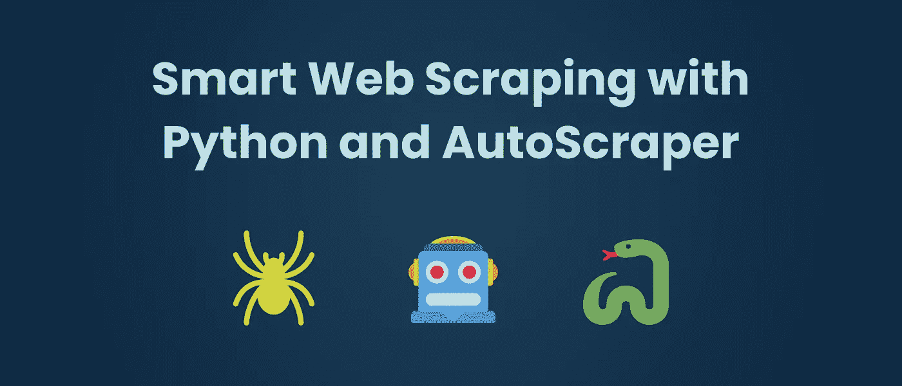
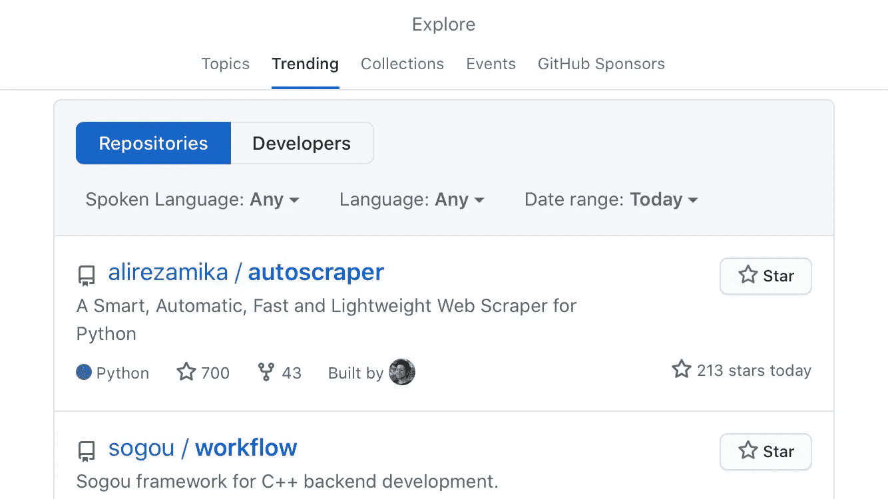

# 介绍 AutoScraper:一个智能、快速和轻量级的 Web Scraper

> 原文：<https://betterprogramming.pub/introducing-autoscraper-a-smart-fast-and-lightweight-web-scraper-for-python-20987f52c749>

## 抓取网页变得更加自动化了



在过去的几年里，网络抓取已经成为我日常工作中经常需要完成的任务之一。我想知道我是否能让它变得智能和自动，以节省大量时间。所以我做了自动刮板机！

项目代码可在[这里](http://github.com/alirezamika/autoscraper)获得。它成为 Github 上的头号热门项目。



Github 趋势库

这个项目是为自动网页抓取制作的，使抓取变得容易。它获取一个 URL 或一个网页的 HTML 内容，以及我们想要从该网页中获取的样本数据列表。这个数据可以是文本、URL 或者页面的任何 HTML 标签值。它学习刮取规则，返回相似元素。然后，您可以将这个学习到的对象与新的 URL 一起使用，以获得这些新页面的相似内容或完全相同的元素。

# 装置

它与 Python 3 兼容。

使用 pip 从 git 存储库中安装最新版本:

```
$ pip install git+https://github.com/alirezamika/autoscraper.git
```

# 如何使用

## 得到相似的结果

假设我们想在一个 StackOverflow 页面中获取所有相关的文章标题:

以下是输出结果:

现在您可以使用`scraper`对象来获取任何 StackOverflow 页面的相关主题:

```
scraper.get_result_similar('https://stackoverflow.com/questions/606191/convert-bytes-to-a-string')
```

## 获得准确的结果

假设我们想从 Yahoo Finance 获取实时股票价格:

```
from autoscraper import AutoScraperurl = 'https://finance.yahoo.com/quote/AAPL/'wanted_list = ["124.81"]scraper = AutoScraper()# Here we can also pass html content via the html parameter instead of the url (html=html_content)
result = scraper.build(url, wanted_list)
print(result)
```

你也可以传递任何自定义的`requests`模块参数。例如，您可能希望使用代理或自定义头:

```
proxies = {
    "http": 'http://127.0.0.1:8001',
    "https": 'https://127.0.0.1:8001',
}result = scraper.build(url, wanted_list, request_args=dict(proxies=proxies))
```

现在我们可以得到任何符号的价格:

```
scraper.get_result_exact('https://finance.yahoo.com/quote/MSFT/')
```

你可能还想获得其他信息。例如，如果你也想获得市值，你可以将它添加到通缉列表中。通过使用`get_result_exact`方法，它将按照通缉令中相同的顺序检索数据。

**另一个例子:**假设我们想要抓取关于 Github repo 页面的文本、星级数和拉请求的链接:

```
url = 'https://github.com/alirezamika/autoscraper'wanted_list = ['A Smart, Automatic, Fast and Lightweight Web Scraper for Python', '662', 'https://github.com/alirezamika/autoscraper/issues']scraper.build(url, wanted_list)
```

简单吧？

## 保存模型

我们现在可以保存构建的模型，以便以后使用。要保存:

```
# Give it a file path
scraper.save('yahoo-finance')
```

并加载:

```
scraper.load('yahoo-finance')
```

## 生成 scraper python 代码

我们还可以生成一个独立的代码，供有经验的铲运机在任何地方使用:

```
code = scraper.generate_python_code()
print(code)
```

它将打印生成的代码。有一个名为`GeneratedAutoScraper`的类，它有您可以使用的方法`get_result_similar`和`get_result_exact`。您也可以使用`get_result`方法来获得这两者。

**更高级的用法见本** [**要旨**](https://gist.github.com/alirezamika/72083221891eecd991bbc0a2a2467673) **。**

为了展示 AutoScraper 的强大功能，我写了一个教程，用不到 5 分钟和不到 20 行代码从任何网站创建一个 API。这里可以看[。](https://medium.com/better-programming/autoscraper-and-flask-create-an-api-from-any-website-in-less-than-5-minutes-3f0f176fc4a3)

## 谢了。

我希望这个项目对你有用，也能节省你的时间。如果你有任何问题，请在下面提问，我会回答你。我期待听到你的反馈和建议。

## 快乐编码❤️