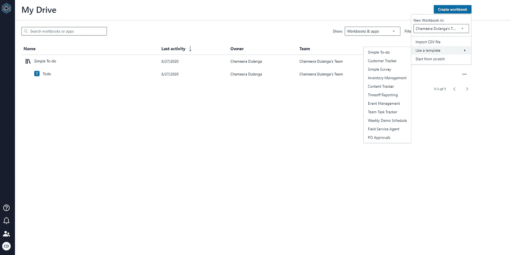
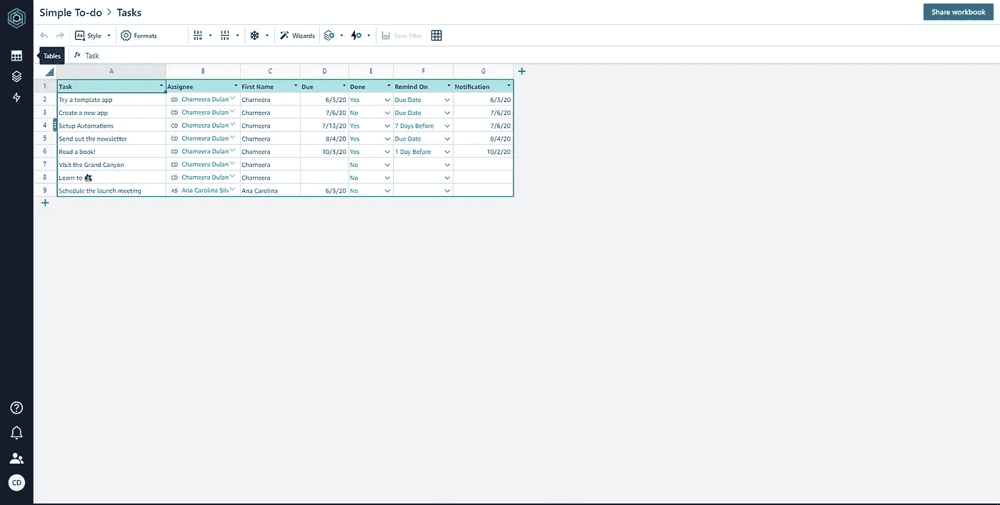
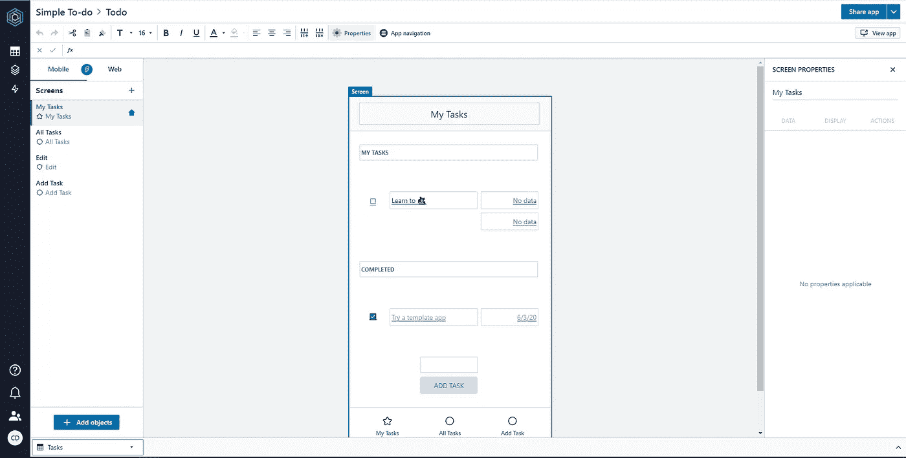
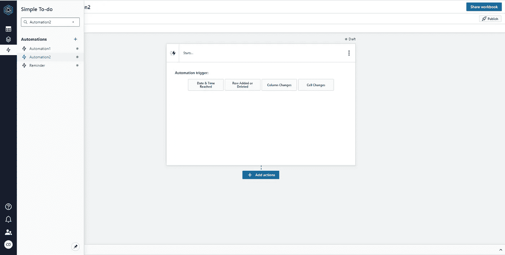

# AWS Honeycode 简介

> 原文：<https://betterprogramming.pub/introducing-aws-honeycode-2d96d2dea7dd>

## 亚马逊为网络和移动应用开发提供的无代码接口

照片由[陶黎黄](https://unsplash.com/@h4x0r3?utm_source=medium&utm_medium=referral)在 [Unsplash](https://unsplash.com?utm_source=medium&utm_medium=referral)

几天前，AWS 推出了它的最新服务——亚马逊蜜码。这项服务的主要目的是让用户无需编写代码就能构建 web 和移动应用。这种无代码环境是围绕一个类似于电子表格的界面构建的。据杰夫·巴尔(亚马逊网络服务公司(Amazon Web Services)高管)称，如果你已经熟悉电子表格和公式，这将是一个绝佳的机会，因为许多选项，如工作表、表格、值和公式，也可以在 Honeycode 中应用。

AWS Honeycode 仍处于测试版，仅支持 us-west-2、俄勒冈州地区。您可以通过 AWS 控制台轻松注册这个测试版。

作者截图

Honeycode 为一些常见的应用程序提供了各种模板，以帮助用户快速入门。这些包括待办事项列表、客户跟踪、简单调查、库存管理、内容跟踪、休假报告、事件管理、团队任务跟踪和休假报告。这些模板应用可轻松定制，并可快速部署。

作者截图

您可以从空表开始，也可以从 CSV 文件导入现有数据。根据杰夫·巴尔的说法，

> 在 Honeycode 中构建的应用程序可以利用丰富的用户界面对象，包括列表、按钮和输入字段

作者截图——honey code 表视图

Honeycode 中另一个重要的东西是它的拖放，界面生成器。由于该服务的主要目的是允许开发人员用更少的代码构建应用程序，因此界面构建器使这变得更容易。

作者截图——honey code builder 视图

Honeycode 还允许用户使用自动化触发器在服务中设置通知、提醒和批准工作流。

作者截屏——honey code 自动化屏幕视图

Honeycode 仍处于测试阶段，如上所述，仅在美国西部-2 地区可用，但它已经吸引了来自世界各地的客户，包括应用 Slack 和 SmugMug。Slack 发布了一份关于 Honeycode 的声明，称，

> *“我们将 Amazon Honeycode 视为对 Slack 的极大补充和扩展，我们很高兴有机会共同努力，为我们的共同客户创造更高效的工作方式，并利用他们的数据做比以往更多的事情。”*

尽管将 Honeycode 与任何其他具有类似功能的产品进行比较还为时过早，但随着 honeycode 之旅的继续，我们可以期待一些令人兴奋的功能。就我个人而言，我希望他们增加一些功能，更加注重用户体验和设计。AWS 为 Honeycode 开设了一个[论坛](https://honeycodecommunity.aws/)，在这里你可以分享你的想法和问题。

本文到此为止。我希望接下来能写一篇关于用 Honeycode 构建应用程序的文章。