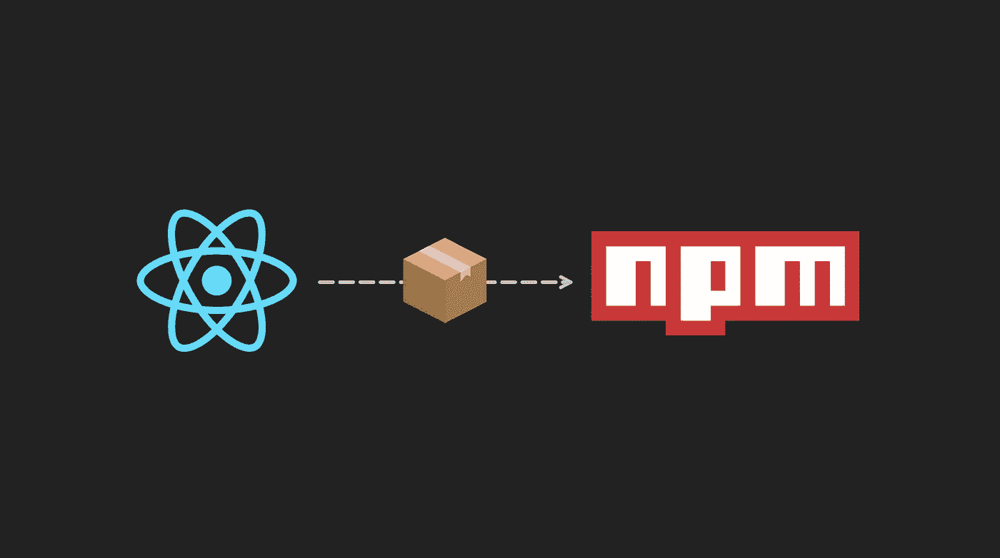
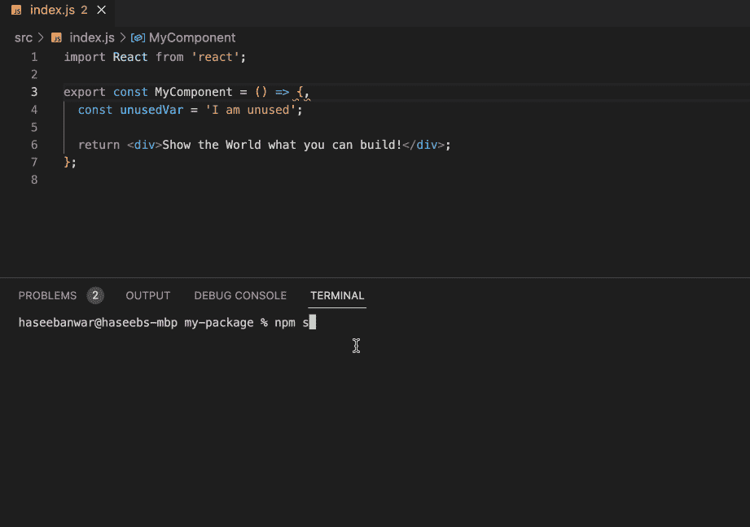
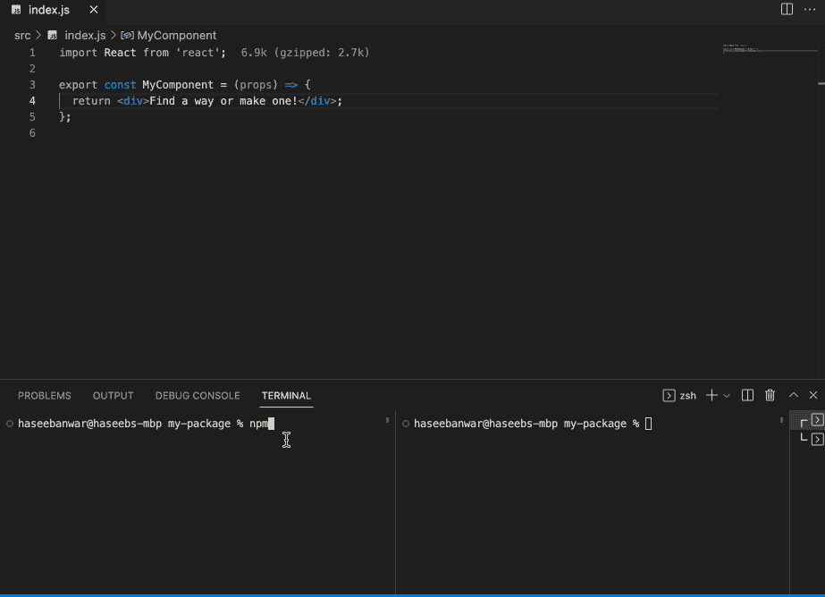

# 介绍 Create React Package——React 库的零配置工具

> 原文：<https://betterprogramming.pub/introducing-create-react-package-a79e6412be8d>

## 构建、测试和发布 React 库



今天我宣布[创建 React 包](https://github.com/haseebanwar/create-react-pkg)。一个新工具，它使得创建、构建、测试和发布 React 库变得非常容易。

尽管有许多工具可以用于 React 应用程序，但许多开发人员都在为安装和配置 React 构建库而努力。有了 Create React Package，就不需要担心配置捆绑器、编译器、测试运行器和其他工具。Create React Package 集成了这些工具，并为创建 React 包提供了无缝的构建管道。

# 为什么

*   学习更少:您不需要学习和配置各种构建工具。
*   可定制:CRP 不限制您使用默认配置。您可以随时根据需要配置所有的构建工具。
*   易于维护:由于只有一个依赖项，升级您的构建工具只需要一个命令。`npm install react-pkg-scripts@latest`

# 创建 React 包一览

*   几秒钟内开始，易于维护，只有一个依赖项
*   CJS、ESM 和 UMD 模块支持
*   预配置的汇总、Babel、Jest 和 ESLint
*   完全可定制
*   综合游乐场
*   摇树
*   代码分割
*   开发/生产版本
*   类型脚本支持
*   故事书支持
*   使用 ESLint 的编译时林挺
*   对 CSS、SASS 和 JSON 文件的现成支持
*   预配置的浏览器列表、源地图和缩小
*   VSCode 友好错误

# 入门指南

要创建名为`my-package`的项目，运行以下命令之一:

```
# npx
npx create-react-pkg my-package

# npm
npm create react-pkg my-package

# yarn
yarn create react-pkg my-package
```

***注意*** *:您可以指定* `*--ts*` *和* `*--sb*` *标志来分别创建一个带有 TypeScript 和 Storybook 的项目。*

这将创建一个新的 React 项目，其文件夹结构如下:

```
my-package/
  dist/
  node_modules/
  playground/
    index.html
    index.js
  src/
    index.js
  test/
    index.test.js
  .gitignore
  package.json
  README.md
```

*   `src/index.js`是你图书馆的入口。这是您编写 React 代码的地方。
*   `dist`是您的库的已编译和捆绑的可分发版本，可能包括 CJS 版本、ES 版本和 UMD 版本。
*   `playground`是一个集成的 React 应用程序，用于在浏览器中开发和预览您的库。

构建工具是预先配置和隐藏的，因此您可以专注于代码。

该项目在`package.json`中附带了一些脚本

`npm start`

以开发模式运行项目，监视文件更改，并根据更改进行重建。构建错误和 lint 警告会在操作过程中显示在控制台中。



`npm test`

用 Jest test runner 运行您的测试。

`npm run build`

以 CommonJS、es 和 UMD 模块格式创建库的优化生产版本。

`npm run preview`

它在浏览器中打开来自`playground/index.js`的集成游戏 React 应用程序，并实时重新加载。



# 用户化

创建 React 包是灵活的，允许您修改构建管道。例如，您可以通过在项目的根目录下创建一个文件`crp.config.js`来将默认的构建格式更改为 UMD 格式，如下所示:

```
// react-pkg-scripts is the package that encapsulates
// all build tools for Create React Package
const { defineConfig } = require('react-pkg-scripts');

module.exports = defineConfig({
  formats: ['umd'],
});
```

现在，当你运行`npm start`或`npm run build`时，只有你的库的 UMD 格式会被发送到`dist`目录。

而且，你并不局限于此；您可以修改底层的 Rollup 包，调整 Babel 编译，等等。点击阅读更多关于定制[的内容。](https://github.com/haseebanwar/create-react-pkg#customization)

# 出版

运行`npm run build`来创建一个优化的库包，现在就可以将 React 库发布到 NPM 了。

遵循[文档](https://github.com/haseebanwar/create-react-pkg#readme)从 Create React 包中获得更多信息。

我希望你会喜欢使用 Create React 包，就像我喜欢设计和构建它一样。我渴望读到你的经历。让我们用 Create React 包来构建令人敬畏的 React 库。