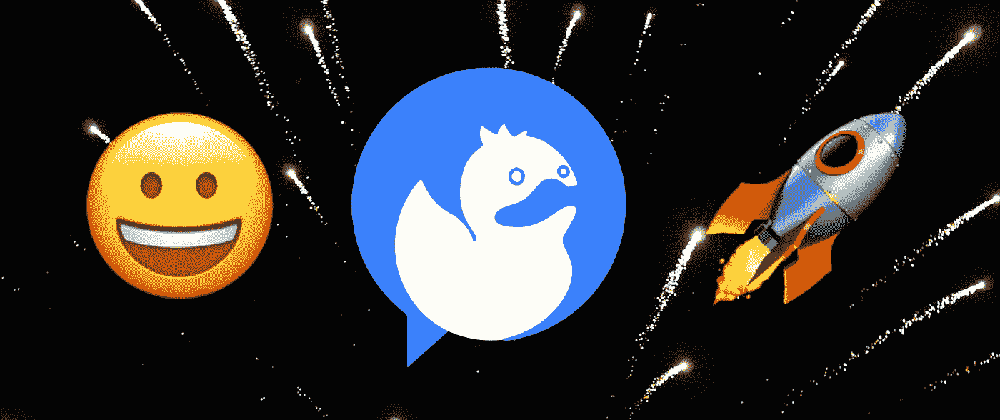
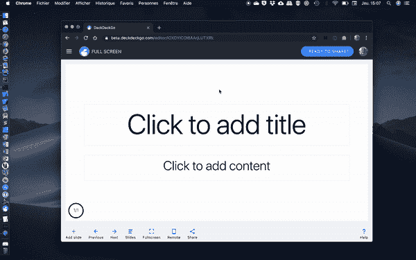
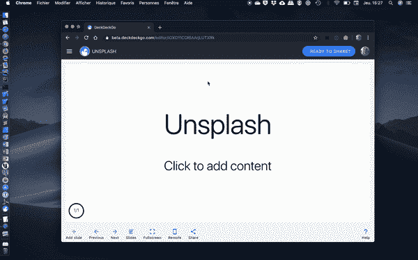
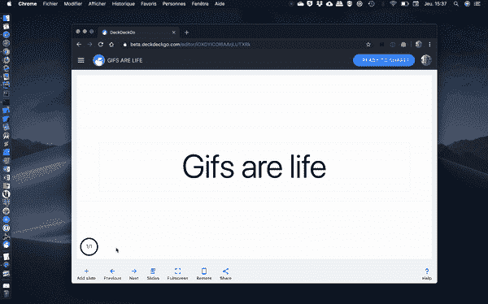
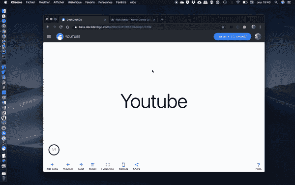

# 介绍 DeckDeckGo:用于演示的 Web 开源编辑器

> 原文：<https://betterprogramming.pub/introducing-deckdeckgo-the-web-open-source-editor-for-presentations-ac0f51fad711>

背景照片由 [wisconsinpictures](https://unsplash.com/@wisconsinpictures?utm_source=unsplash&utm_medium=referral&utm_content=creditCopyText) 在 [Unsplash](https://unsplash.com/?utm_source=unsplash&utm_medium=referral&utm_content=creditCopyText) 上拍摄

今天，我们非常高兴和激动地与您分享我们的开源 web 编辑器: [DeckDeckGo](https://deckdeckgo.com) 。

我仍然几乎不能相信我们设法达到这样一个里程碑。今年我们花了几个月的时间来开发它，只是为了在晚上和周末玩玩——但是是的，我们做到了。

在继续之前，我们首先要感谢我们所有的离线和在线朋友、社区、贡献者和早期测试者，他们总是给我们足够的动力来开发我们的，我喜欢称之为宠物项目。你真的很棒。

# 但是，为什么又是一个演示文稿的编辑呢？

我们充分意识到，没有人，绝对没有人，要求为演示文稿再找一个编辑，可能也没有这个必要。但是你知道吗？我们对此没意见。当然，我们希望我们的编辑器和概念对某些人有用，但是如果没有人使用它，即使我们可能会哭一场，我们也可以接受。

我们开发我们的项目，因为我们是书呆子，因为我们利用这种经验来提高我们的技能。此外，我们是工程师，你知道吗？我们喜欢从零开始实施产品，直到产品上市。

# 那么是什么让它与众不同呢？

绝对是一切。

当然，我是开玩笑的。并非一切都不同——这甚至成了我们之间的一个私下玩笑。只要有一点新的东西，我们就对彼此说，“但是我，这是未来。”

也就是说，正如我上面简单提到的，我们玩得很开心。我希望你也能找到一些有趣的想法。

## 云解决方案

DeckDeckGo 是一个云解决方案。它可以在任何地方和任何设备上运行:投影仪、台式机、手机或平板电脑，无需预先安装，也无需在本地保存数据。

顺便说一下，在我们的编辑器中没有保存按钮——当这些东西必须保存时，它会为您完成工作并保存您的数据。

## 使用应用程序来共享应用程序

没有导出到 PDF 的功能(至少现在还没有)，因此你可能会问自己，“天哪，大卫。我该如何分享我的演讲呢？”

好吧，这是一件很酷的事情:DeckDeckGo 将你想分享的每一个演示文稿打包并发布为一个独立的应用程序——更准确地说，是一个渐进式的网络应用程序。

基本上，你不会给你的朋友或同事发送 PDF，但你会给他们发送一个你的应用程序的链接——它将与任何设备的屏幕尺寸兼容，并且是 SEO 友好的。

## 在线订阅源

DeckDeckGo 不仅仅是一个编辑。它实际上也被开发成一个在线 feed:一个可以发现、分享演示文稿的地方，最终，如果我们让自己对未来有一点梦想，根据你的兴趣进行索引，甚至可以进行讨论。

# 特征

此外，除了能够用我们的编辑器开发幻灯片之外，我们还认为添加一些方便的功能会使用户体验更加愉快。

## 全屏版

在编辑下一个演示文稿的素材时，您是否经常在全屏和正常模式之间切换？还是不止一次地出现过你不得不在演讲前几秒钟纠正一个打字错误的情况？使用我们的编辑器，您的演示文稿即使在全屏模式下也是可编辑的。

根据设计，所有功能也可以在全屏模式下使用

## 不溅

我们已经将 [Unsplash](https://unsplash.com/) 集成到我们的工具中，让您可以轻松找到并使用库存照片。编辑器还会跟踪您可能会使用的最后 10 个媒体，以便更快地访问。

Unsplash 是集成的

## 男高音

gif 就是生活(大概)。与库存照片一样，集成了[功能](https://tenor.com/)，让您轻松找到并整合 gif。甚至有一个特殊的模板，可以让动画内容适合整个屏幕。

gif 就是生活

## 油管（国外视频网站）

我对整合 [YouTube](https://www.youtube.com) 视频有点懒惰。我们没有互连任何 API，但仍然可以很容易地将任何视频从该源添加到您的面板中。顶部的樱桃:你也可以用我们的应用程序远程启动和暂停视频。

将 YouTube 视频放到您的演示文稿中

## 遥控

开箱即用，无需任何特殊硬件，任何演示都可以通过我们的远程控制应用程序进行远程控制。它可以处理滑动幻灯片、显示笔记、在演示文稿上绘图等操作，甚至还提供倒计时功能。我们还利用 QR 码在控制器和甲板之间建立联系。

嘿！是我，大卫

# 技术趣闻

我不会过多地探究技术事实，因为我希望我们将来能找到时间来分享关于它们的文章，但总而言之，我们的应用程序是用 [Stencil.js](https://stenciljs.com/) web 组件开发的。另一方面，我们的发布引擎是用 [Haskell](https://www.haskell.org) 、 [Nix](https://nixos.org/nix/) 和 [Terraform](https://www.terraform.io) 开发的。

我们使用 [Google Firebase](https://firebase.google.com/) 进行认证和存储数据(你正在编辑和存储的数据),并使用[亚马逊 AWS](https://aws.amazon.com/) 在线部署你将分享的出版物。

# 开放源码

DeckDeckGo 是开源的。这是我们的基因——分享就是关怀。我们所有的库都是在 MIT 许可下发布的，我们的应用和基础设施都是在 AGPLv3 和上述许可下发布的。

当然，我们一直在寻找新的贡献者。我们很乐意收到你的来信，所以不要犹豫，加入我们的[休闲频道](https://join.slack.com/t/deckdeckgo/shared_invite/enQtNzM0NjMwOTc3NTI0LTBlNmFhODNhYmRkMWUxZmU4ZTQ2MDJiNjlmYWZiODNjMDU5OGRjYThlZmZjMTc5YmQ3MzUzMDlhMzk0ZDgzMDY)或 [GitHub](https://github.com/deckgo/deckdeckgo) 吧。

# 开发者心态

在我们的项目中，我特别喜欢的一点是编辑器和我们的开发人员初学者工具包都使用完全相同的 web 组件作为引擎。

这些库和应用程序中的任何改进都会自动反馈给任何人，无论您是使用图形编辑器还是使用 HTML 或 markdown 编写自己的演示文稿。有点像蛋糕上的樱桃。

# 现在就开始

一张图胜过千言万语——现在就开始制作你的下一个演示文稿:[https://deckdeckgo.com](https://deckdeckgo.com)。

到无限和更远的地方。