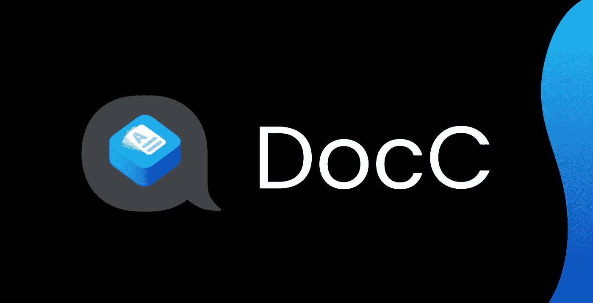
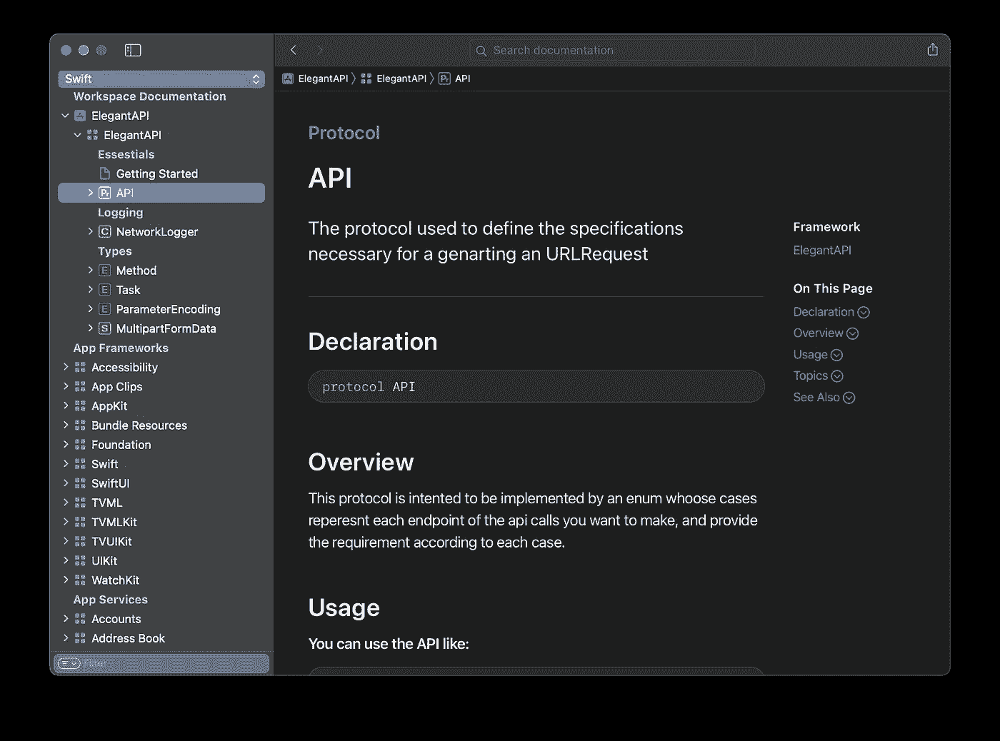
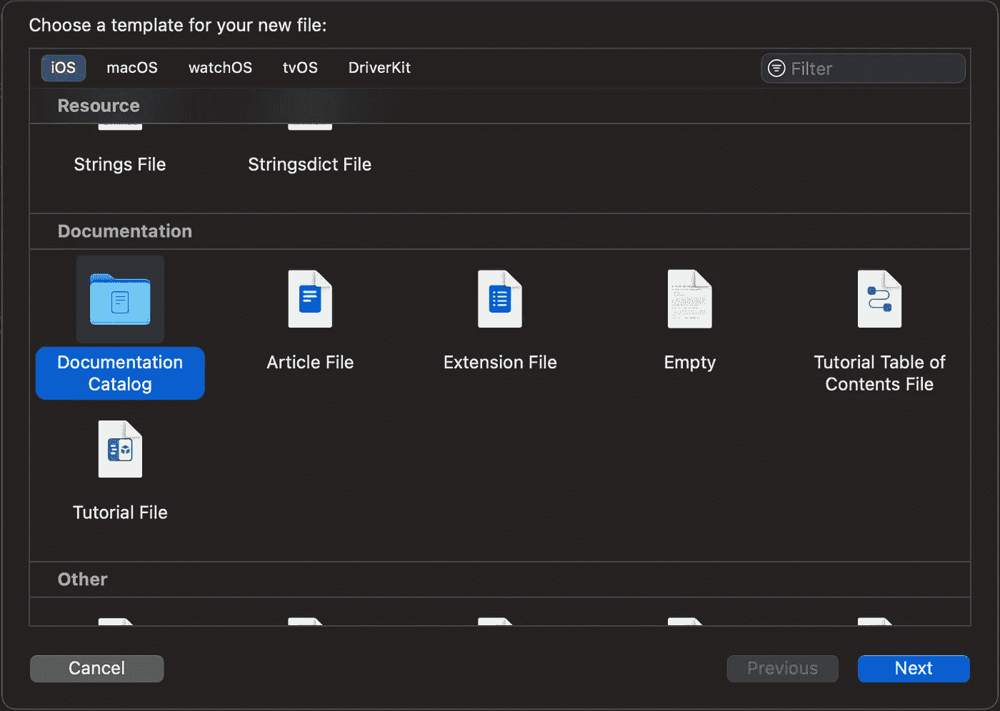
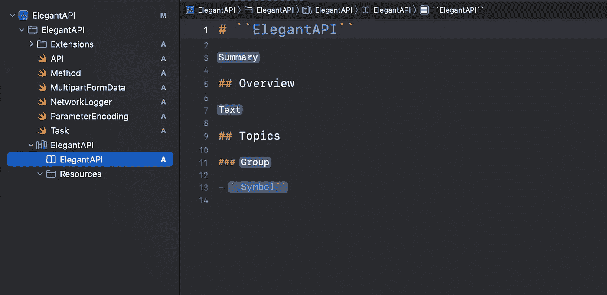
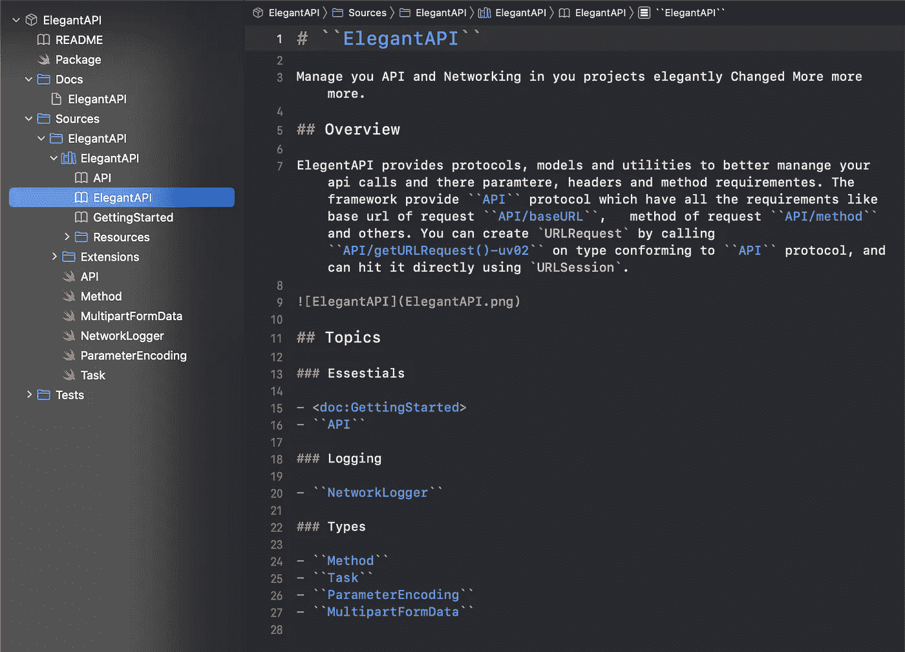
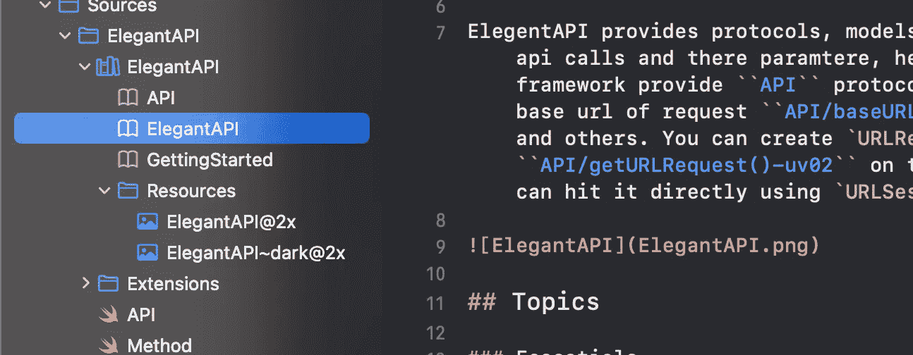
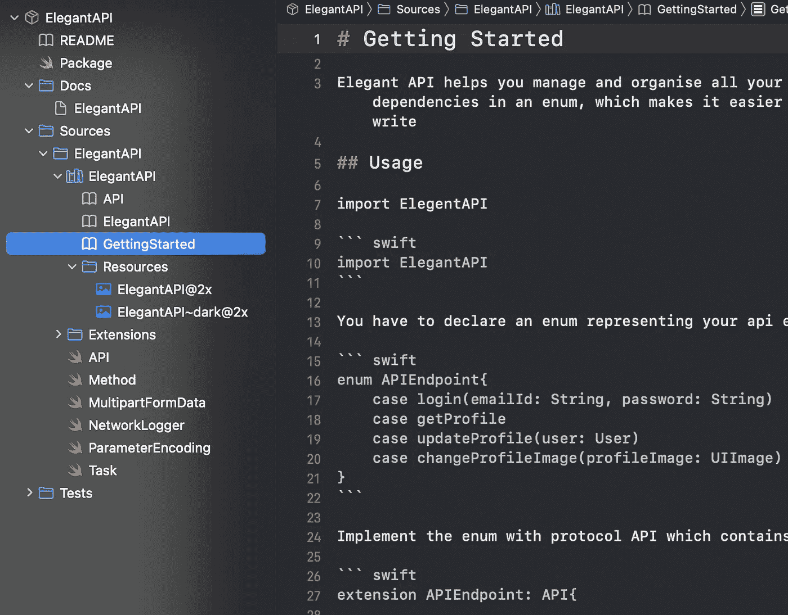
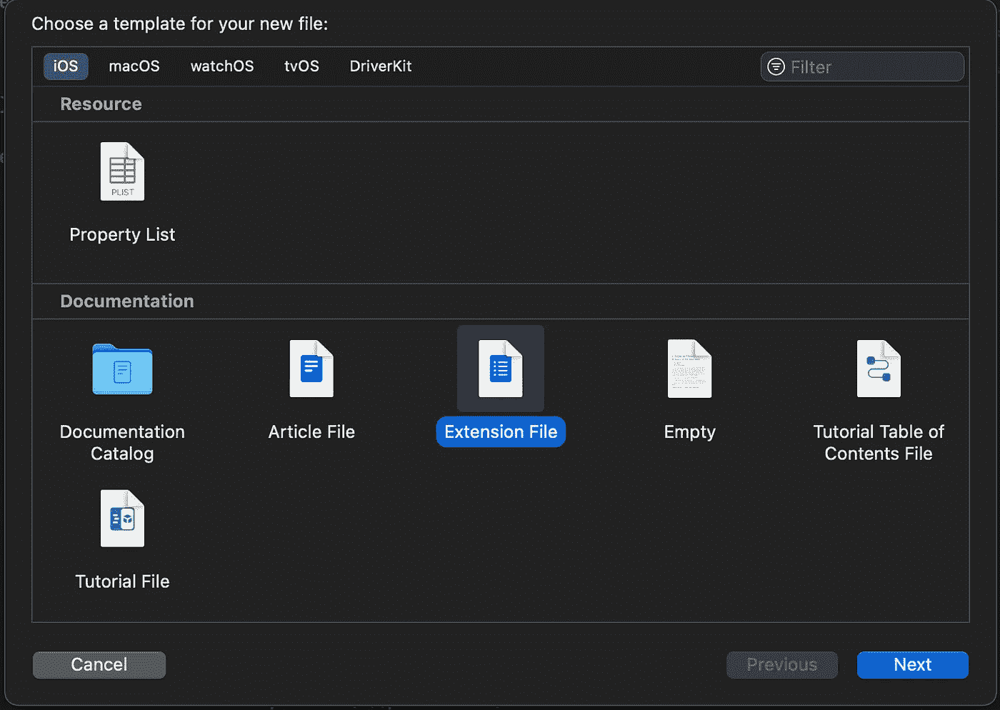
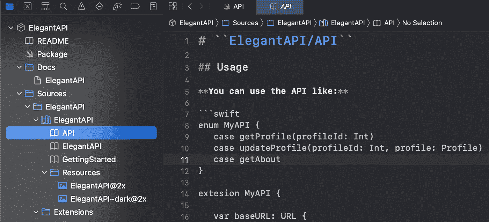

# 介绍 DocC:从 Xcode 编写文档的新工具

> 原文：<https://betterprogramming.pub/introducing-docc-a-new-tool-to-write-documentation-from-xcode-64d990d0a1c9>

## 苹果让文档写作变得容易多了



DocC 标志取自[developer.apple.com](https://developer.apple.com)——由作者编辑

## 介绍

今年 WWDC，苹果发布了一个新的开发者工具来为 swift 包和框架生成优秀的文档， [DocC](https://developer.apple.com/documentation/docc) 。

**DocC** ，顾名思义，是一个文档编译器，它与 Swift 编译器一起为我们的 Swift 框架和包生成文档，它深度集成在 Xcode 内部。它创建苹果风格的文档，你可以在 Xcode 的文档窗口中看到，更好的是，你可以将文档作为网站托管。

我们将分两部分学习 DocC。在本文的第一部分，我将向您展示如何使用 DocC 标记记录您的 Swift 框架和包，以及如何为 Xcode 文档窗口生成文档，在第二部分，我将向您展示如何将您的文档作为网站提供给全世界。

## 准备

DocC 与 Swift 编译器一起生成文档。在构建我们的框架之后，DocC 使用 Xcode 生成的公共 API，并使用该信息将文档编译成 Apple 为 docs 引入的新格式。文档存档

如果您已经使用 Xcode 中的文档语法对代码库进行了注释，那么您已经比创建 DocC 文档领先了一步。如果您的代码库中有注释，您可以通过选择**产品>构建文档，立即在 Xcode 中构建 DocC 文档。**


作者截图

这将构建您的文稿，并在 Xcode 的文稿窗口中打开它。



作者截图

**注:**截至目前，DocC 只支持 Swift 框架、Swift 静态库、Swift 包。它不支持 Objective-C 或应用程序级代码符号文档的文档生成。

如果您没有使用文档注释在代码中添加注释，或者想了解有关符号文档的更多信息，请访问下面的链接。这是苹果公司的一篇很棒的文章，展示了如何记录你的代码库。

 [## 在源文件中编写符号文档

### 向符号添加解释如何使用它们的参考文档。

developer.apple.com](https://developer.apple.com/documentation/xcode/writing-symbol-documentation-in-your-source-files) 

# **文件目录**

默认情况下，DocC 采用您的框架的公共 API 及其文档注释来生成文档归档，但是您可以使用 Xcode 13 **“文档目录”中引入的全新模板类型来使您的文档更加丰富**

要向您的项目添加文档目录，请转到**选择文件>新建>文件**以打开文件模板选择器并选择**文档目录**。



作者截图

您可以将其命名为与项目名称相同的名称。它附带了主文章页面和一个名为 resource 的文件夹。文章主页是一个 markdown 文件，显示为我们文档的第一页。


作者截图

文章模板 Xcode 提供了主 markdown 文件的基本结构，但是您可以根据 markdown 规则任意更改它。您不应该删除主题部分，因为 DocC 编译器对它的处理略有不同。



作者截图

主题部分通常包括一个分组列表，该列表包含一个深层符号列表或指向其他教程的链接。以下是如何组织文章主页的示例:



作者截图

## 标志

您可能已经注意到了````中的文本是如何以蓝色突出显示的；这在我们的代码库中表示一个**符号**。您可以通过将符号名称用````括起来来引用 markdown 文件中的任何函数或变量——但是由于函数和变量需要引用一些真实的代码——您必须提供符号的准确路径。正如你在上面看到的，为了引用 **baseURL** ，我写了```API/baseURL```，因为 baseURL 存在于协议 API 中。

但是不要担心，Xcode 会在你开始输入````的时候自动提示来帮助我们解决这个问题。Xcode 会在我们打字时提示符号，即使我们打错了，Xcode 也会在我们创建文档时发出警告。这将转换为指向文档中特定符号的文档页面的超链接。

## 链接文章

你也可以通过写`<Doc:GettingStarted>`来参考另一篇文章/markdown 文件，在这里你可以输入 doc 文件的相对路径来代替入门。

## 添加图像

你也可以更灵活地放置图像(就像你在 markdown 中做的那样),为黑暗和光明模式提供不同的图像。要在文章中添加图像，您可以使用特殊的命名系统将图像放在 resources 文件夹中，如下所示:

1.  `<filename>@<scale>.<image format>`
    例如 ElegantAPI@2x.png 为灯光模式。
2.  `<filename>~dark@<scale>.<image format>`如 ElegantAPI~dark@2x.png 为黑暗模式。

在文章中，虽然你不需要写刻度或者黑色的文字，你可以简单地写``

如``。



作者截图

## 添加附加文章

你可以在主页面之外添加多个文章页面，就像我在 [ElegantAPI](https://github.com/DominatorVbN/ElegantAPI) 中添加的一样。要添加文章页面，可以去**选择文件>新建>文件**打开文件模板选择器，勾选**文章文件**。请记住在创建文件时选择您的文档目录，以便在文档目录下创建文件。


作者截图

你想怎么命名都行，你可以在你的文章主页面引用这个文档，写 **< doc: Docname >** 。

例如:



作者截图

它基本上是一个 markdown 文件，所以你可以像在其他平台上一样写文章。

## 扩展ˌ扩张

您可以使用扩展文件进一步将更多信息添加到文档中。这是一种非常好的方法，可以提取出您希望在文档中提供的额外信息，但又不希望它扰乱您的实际代码文件。

在下面的示例中，您有一些代码的文档注释，您可以看到这些注释将占用大量空间，这可能会导致文件变得很大，难以阅读。

```
/// The protocol used to define the specifications necessary for a   generating an URLRequest
///
///  This protocol is intented to be implemented by an enum whoose cases represent each endpoint of the api calls you want to make, and provide the requirement according to each case.
///    ```swift
///    enum MyAPI {
///       case getProfile(profileId: Int)
///       case updateProfile(profileId: Int, profile: Profile)
///       case getAbout
///    }
///    ...
///    ```public** **protocol** API { ... }
```

为了避免这种情况，您可以通过选择您的文档目录并转到**文件>新文件>扩展文件**来创建一个扩展文件。你想叫它什么都可以。我建议用这个扩展链接到的 Swift 文件来命名它。



作者截图

您需要通过将文件添加到 markdown 标题中的路径来链接扩展名，如下所示。



作者截图

使用扩展，您可以随心所欲地编写代码，而不会弄乱您的代码库，并且在构建时，DocC 会将这个扩展与您的符号注释合并。


作者截图

# 互动教程

你也可以创建类似 [SwiftUI 教程](https://developer.apple.com/tutorials/SwiftUI)的教程。是的，太神奇了！

如果你想了解更多关于如何创建一个教程的信息，请观看苹果公司的这个精彩视频。

[](https://developer.apple.com/videos/play/wwdc2021/10235) [## 使用 DocC-wwdc 21-Videos-Apple Developer 创建交互式教程

### 了解如何使用 DocC 从头开始创作沉浸式教程。我们将演示如何将…

developer.apple.com](https://developer.apple.com/videos/play/wwdc2021/10235) 

这就是本文的全部内容。在下一篇文章中，我们将学习如何在 web 上托管 DocC 文档。**我还将向您展示如何将此文档导出为文档存档并与其他人共享。**

**感谢你阅读这篇文章，祝你学习愉快！**