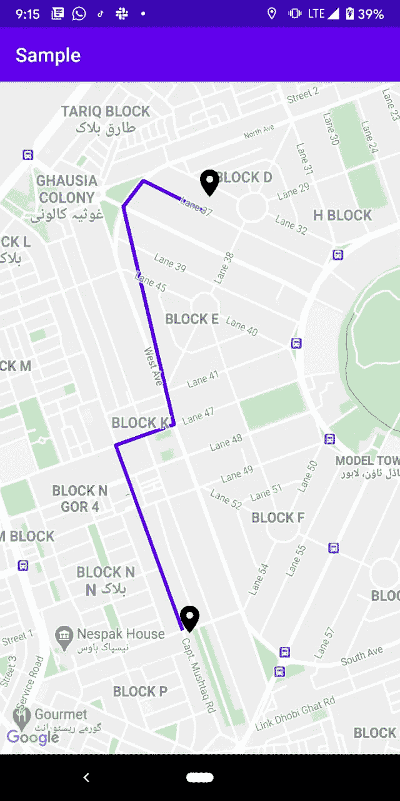

# 介绍 DrawRoute:一个用于在 Android 版谷歌地图上绘制路线的 Kotlin 库

> 原文：<https://betterprogramming.pub/introducing-drawroute-a-kotlin-library-for-drawing-routes-on-google-maps-for-android-5e6cc99d58f6>

## 在你的 Android 应用中绘制路线的简洁方式


亚历山大·斯莱特里在 [Unsplash](https://unsplash.com?utm_source=medium&utm_medium=referral) 上拍摄的[照片。](https://unsplash.com/@slatts?utm_source=medium&utm_medium=referral)

我很高兴分享 [DrawRoute](https://github.com/malikdawar/drawroute) ，这是一个开源的路线绘制库，将用于 Android 的[谷歌地图 API。](https://developers.google.com/maps/documentation/android-sdk/overview)

*技术栈:Kotlin、OkHttp、RxJava、AndroidX。*

# 在潜入之前

当在地图上绘制时，图书馆使用 [Google Directions API](https://developers.google.com/maps/documentation/directions/overview) 获取路线信息。它不是免费的，需要你有一个启用了这个 API 的项目，以及一个计费帐户。

参见[如何入门](https://developers.google.com/maps/documentation/directions/start)。

# 一个新的科特林图书馆

这个库完全是用 Kotlin 编写的，并使用反应式编程封装了使用 Google Directions API 所涉及的样板代码，以获得更多的控制和精度。它还公开了一个扩展函数，一旦地图准备就绪，就可以在 Google Maps 对象本身上使用该函数。

## 集成步骤

在您的`build.gradle`文件(项目级)中，在`allProjects`块中添加以下内容:

```
allprojects {
    repositories {
        maven { url 'https://jitpack.io' }
    }
}
```

然后在您的`build.gradle`(应用程序级)中，在依赖关系块中添加以下内容:

```
dependencies {
	implementation 'com.github.malikdawar:drawroute:1.1-rx'
}
```

一旦您成功集成了 [Google Maps API](https://developers.google.com/maps/documentation/android-sdk/overview) 并遵循了上面的集成步骤，您就可以调用`drawRouteOnMap`方法，该方法将在地图上绘制路线并作为 Rx-Disposable 返回，该方法应该用于处理已执行的订阅。

这里使用的库中还增加了一个助手`moveCameraOnMap` 方法在绘制路线之前对源位置进行聚焦和缩放。

## 订阅是什么？

订阅是对 Google Directions API 的同步网络调用:

按顺序完成上述步骤后，基于上述源位置和目的地位置绘制的路径的最终输出应如下所示:



## **为什么用这个？**

直接使用 Google Directions API 将需要添加相当多的业务逻辑来处理请求和响应。因此，您可以使用这个库，它将在顶层使用自己的预构建 API，以便维护一个明确的、可读的代码结构。

# 结论

我很高兴与社区分享[画线](https://github.com/malikdawar/drawroute)。回购包含一个完整的文件快速启动。敬请关注更多内容！此外，任何相关的改进建议都是受欢迎的，可以在 GitHub 上[报告。](https://github.com/malikdawar/drawroute/issues)