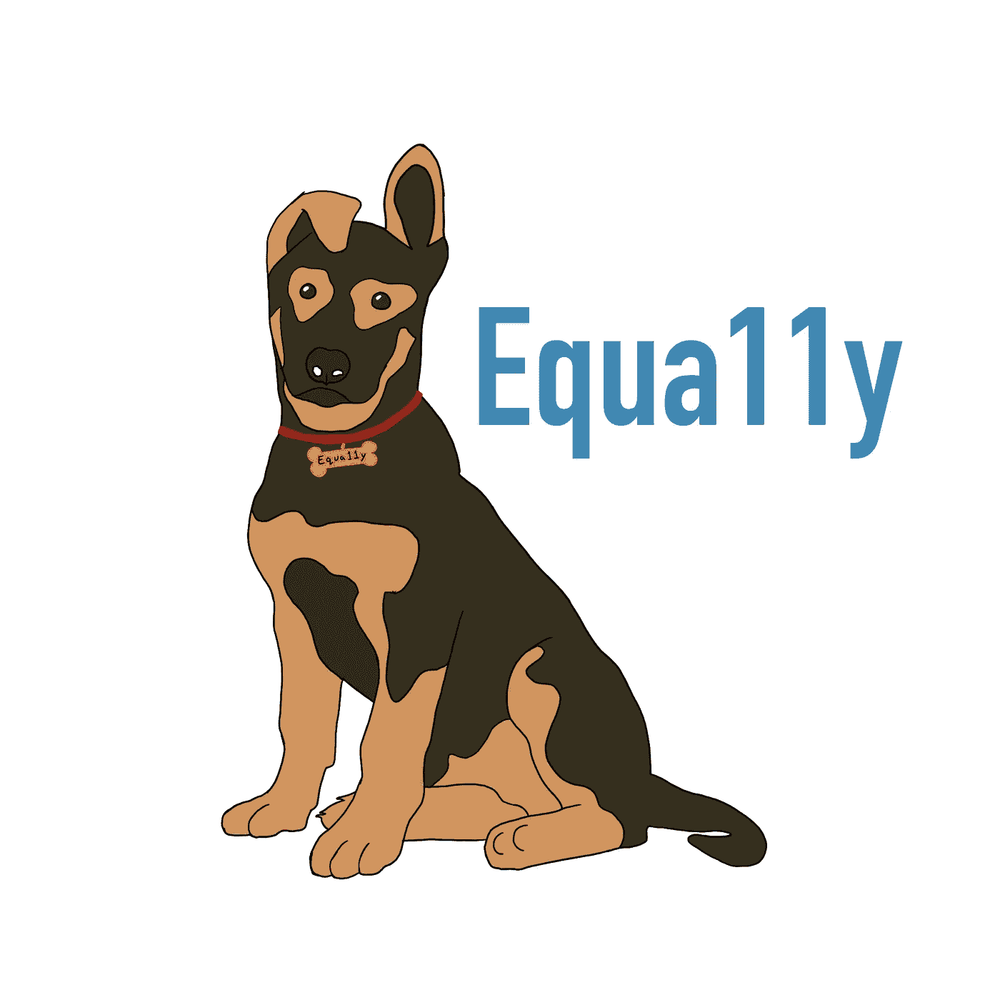
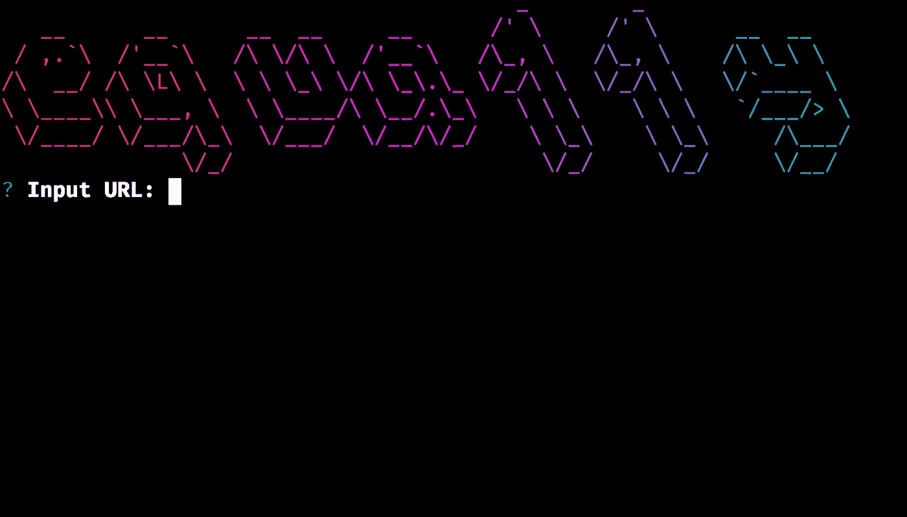
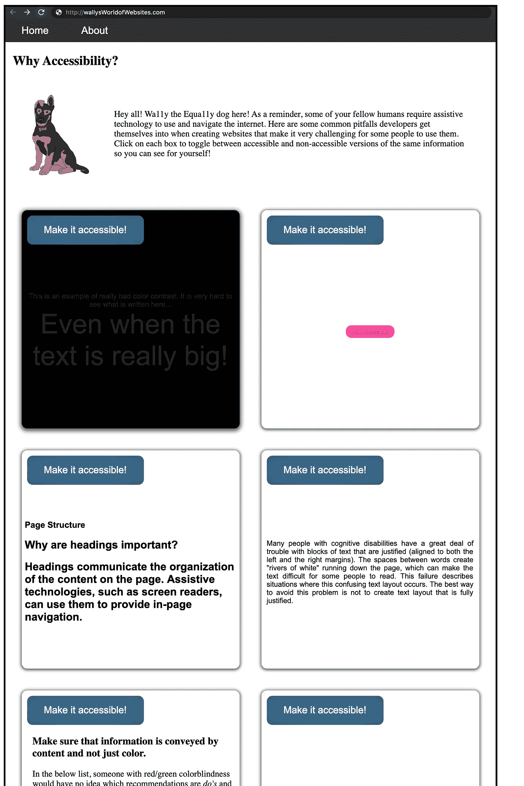

# 介绍 Equa11y:一个用于网页可访问性的命令行测试工具

> 原文：<https://betterprogramming.pub/introducing-equa11y-a-command-line-testing-tool-for-web-accessibility-aa29205eed55>

## 在部署之前，帮助开发人员找到并修复可访问性错误

图片来源:作者

你刚来到你最喜欢的咖啡店。在你和一份美味的早餐三明治和一杯你最喜欢的饮料之间只有六七步的距离。对大多数人来说，这只是一个普通的早晨。你下了车，走上台阶，走进商店。但是对于需要轮椅或其他辅助设备的身体残疾的人来说，这可能是不可能的。

现在想想互联网。大多数人可以毫不犹豫地浏览任何网站并与内容互动。但是，如果您有诸如失明或低视力之类的残疾，并且依靠屏幕阅读器来阅读，该怎么办呢？或者你有认知障碍，比如阅读障碍，这使得阅读内容很困难？

无论是在现实世界还是在网络上，可访问性通常都是事后才想到的。这就是为什么，希望把易访问性测试从事后的想法带到标准工作流程的一部分，我们为软件工程师开发了一个工具来轻松测试他们的应用程序的易访问性。

介绍**[equa1y](http://equa11y-website.herokuapp.com/)**(读作*等同于*)，这是一个命令行可访问性测试工具，可以在应用程序开发周期的任何一点使用！Equa11y 旨在帮助开发人员在部署 web 应用程序之前发现并修复可访问性错误，以减少需要返回到以前编写的代码的挫折感。****

********

****图片来源:作者****

****该界面易于使用，甚至为手动测试提供建议，以识别自动化 web 可访问性测试工具通常无法发现的问题。****

****只需输入您的网页的 URL，并使用 CLI 在您的代码库中找到常见的可访问性错误。****

****Equa11y 的网站提供了开发人员在创建 web 应用程序时经常陷入的常见陷阱的交互式示例。****

********

****图片来源:作者****

****我们认为您会喜欢这个工具，并很高兴听到您关于我们如何使您和您的团队更容易进行网页可访问性测试的意见！您也可以在 [GitHub](https://github.com/oslabs-beta/Equa11y) 上找到我们，并在 [npm](https://www.npmjs.com/package/equa11y) 上下载我们的工具。****

****撰稿人: [Tjolanda Sullivan](https://github.com/sull364) ，[泰勒·莱利·杜](https://github.com/taylordu)，[威尔·哈克](https://github.com/willhack)，以及[希瑟·弗里德曼](https://github.com/heatherfriedman)****