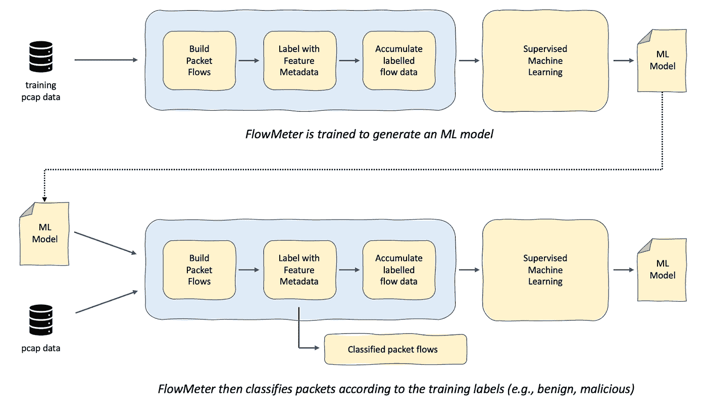
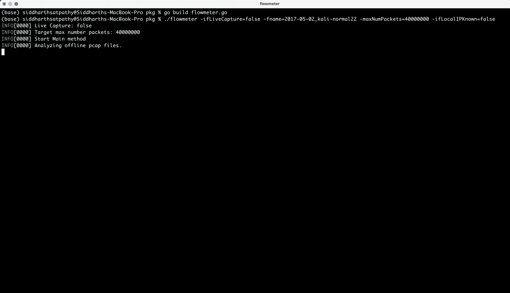
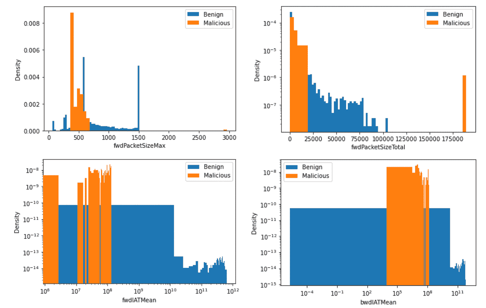

# 流量计简介

> 原文：<https://betterprogramming.pub/introducing-flowmeter-97e0507862b6>

## 轻松生成 ML 模型

流量计是一种开源工具，使用机器学习技术对数据包捕获进行分析和分类。

这是一个实验项目；我们在 Deepfence 使用它来评估我们如何有效地训练一个 ML 模型来区分不同类型的流量。

您可以从 GitHub:[https://github.com/deepfence/FlowMeter](https://github.com/deepfence/FlowMeter)构建和安装流量计

# 为什么是网络可观测性？

网络可观测性是运行时安全可观测性的重要组成部分。这对于理解更广泛的安全事件背景是必要的，并为使用[米特 ATT & CK 方法](https://attack.mitre.org)的攻击建模提供重要的输入。

主机上(和容器上)的可观察性提供了危害的指示—异常可能表明攻击者已经获得了对目标的一定程度的影响。这些都是现代安全可观察性解决方案的关键信号，但仅仅是危害指标并不能说明攻击行为的全部情况，而且可能为时已晚，无法主动应对攻击。

有效的网络可观察性提供了攻击指标，包括侦察、有针对性的武器化、横向传播和渗透活动。这些提供了攻击行为的基本背景，描述了企图利用之前的技术和之后的技术(发现、横向移动、命令和控制、渗透)。

例如，在 log4j 利用中，几乎所有的初始信号都是基于网络的。针对多个工作负载的初始 JNDI 侦察、随后触发对攻击者监听器的传出请求(信标)的 JNDI 请求、检索要运行的 Java 类的后续请求……所有这些都是基于网络的，不能仅通过主机上的方法来识别。您从主机上的可观察性获得的第一个信号可能是漏洞利用工具包(例如 crypto-miner)的文件系统安装。

# 流量计如何发挥作用？

在 [Deepfence ThreatStryker](https://deepfence.io/threatstryker/) 中，我们使用一系列先进的技术来捕获大范围的流量，重组交易，并根据攻击和渗透信号的大型知识库对第 7 层有效负载进行分类。当结合应用程序威胁图的知识和对危害指示器的额外观察时，这为 ThreatStryker 的攻击建模工具提供了有效和准确的警报流。

自然，随着基础设施的扩展，专用于流量分析的资源也必须相应扩展。除非如此，否则我们可以有效地对网络流量进行预分类，并在产生重组和第 7 层分类的成本之前，优先考虑异常风险较高的流量。

这是实验流量计项目的目标之一；为了更好地理解我们如何根据轻量级元数据(如到达时间、数据包大小和流长度)快速过滤流量。

上面是代码的输出示例。流量计提供了一组丰富的数据包数据流特征，并将数据包分为良性或恶意数据包。

# 早期迹象

流量计的早期指示很有希望。我们以监督的方式训练了流量计的 ML 引擎，使用几个公共数据集来区分良性和恶意流量捕获。项目[自述](https://github.com/deepfence/FlowMeter)分享了早期结果，如下图所示:

*流量计培训识别良性和恶意流量的不同特征*

您可以使用自述文件中引用的公共数据集，以及使用 [PacketStreamer](https://github.com/deepfence/PacketStreamer) 或其他 pcap 工具获得的您自己的数据包捕获，亲自试验流量计。

我们欢迎任何反馈、贡献和建议。请从[流量计 GitHub 库](https://github.com/deepfence/FlowMeter)开始。