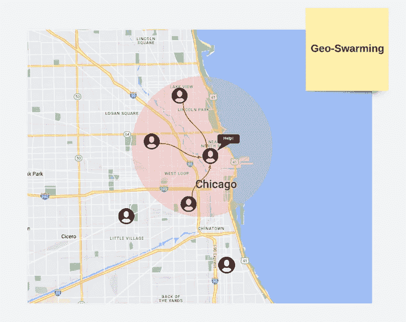
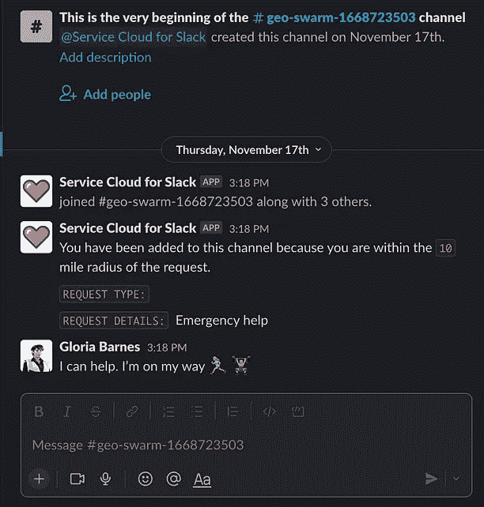
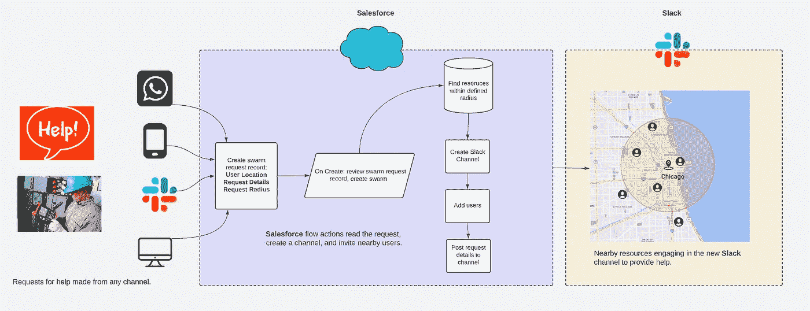
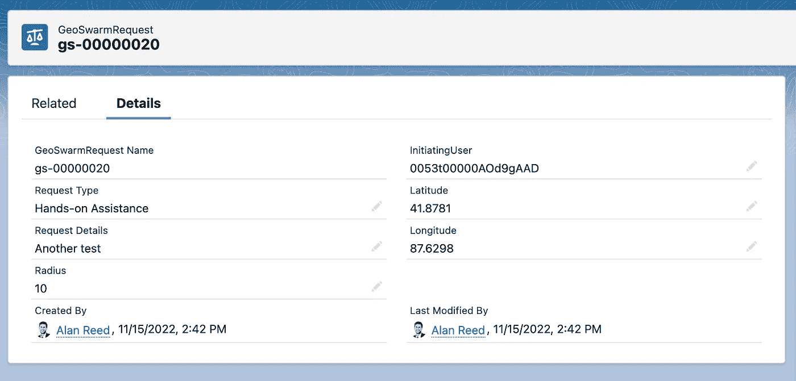
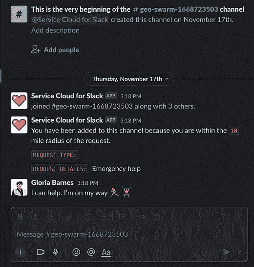
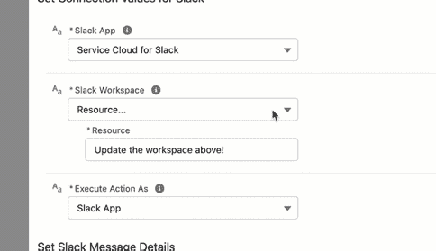

# 介绍地球变暖:野外通信的新领域

> 原文：<https://betterprogramming.pub/introducing-geoswarming-a-new-dimension-in-your-field-communications-4c5166352fbd>

## 如何轻松获得当地技术人员的帮助

第一张图片:上/下:unsplash/ewnews.co.uk 第二张:谷歌地图第三张:Slack 频道

# **什么是地暖？**

地理变暖是野外资源的一种新的空间感知形式，允许他们通过数字方式向附近的同事大声呼救。

今天，当现场技术人员需要帮助时，他们可能会给朋友打电话，结果却发现他们的同事还有几个小时才能完成任务。技术人员可能会联系调度员以帮助找到附近的资源，从而消耗调度员原本可以用来优化时间表的宝贵时间。GeoSwarming 使用位置数据将现场资源与附近的同事联系起来，为特定的任务或需求创建一个专门的小组或“群”。

现在有了全球变暖，技术人员可以与附近的团队成员聊天，帮助维修或安装，合作开展项目，协调紧急服务请求，甚至共享重要的安全信息。

在这篇文章中，我将向你展示地球变暖如何工作的一般架构，这样你就可以自己构建它。我还将提供一个示例，您可以下载并在您的沙箱中测试。

# 这是如何工作的？

在高层次上，全球变暖架构由三个部分组成:

*   Salesforce 现场服务-从现场工作人员处收集位置数据的一种方式。您可以将它与任何 lat/lon 提供者互换。
*   slack——消息平台。
*   Salesforce 流—用于收集群组请求信息、创建渠道和将用户添加到群组的引擎。

在上面的流程中，外业用户通过创建请求记录来请求地理温暖。请求记录包含关于用户位置、请求类型和细节以及地理温暖的半径的信息。

当一个请求被创建时，流将找到附近的资源，创建一个 swarm 通道，将用户添加到通道中，并将请求细节发布到新创建的 swarm 中！

## **为什么要创建一个请求对象呢？**

通过将此流程配置为在创建记录时运行，您可以从任何地方启动 swarm 来创建 Salesforce 记录，如移动流程、松弛流程、表单、桌面等。

# **自己试试**

该软件包允许用户从各种来源(如 Slack、桌面或现场服务移动应用程序)轻松创建和启动群组。

## **系统要求**

*   Salesforce 现场服务**
*   松弛的

## 先决条件

*如果您的组织已经启用了 Slack 服务云，请随意跳过这些步骤。*

1.  你必须有权使用 Slack。
2.  在您的 Slack 组织中安装 Slack 服务云。
3.  [为 Slack 设置服务云](https://help.salesforce.com/s/articleView?id=sf.slack_service_app.htm&type=5)。

## **设置步骤**

*   安装[地暖](https://login.salesforce.com/packaging/installPackage.apexp?p0=04t8a000000ktSf)组件。
*   更新流变量——为了更容易分发，打包的流在松弛工作区变量中附带了一些虚拟数据。在激活流之前，您需要更新这些变量以反映您的工作空间。

更新松弛工作空间变量。

*   授权用户—每个服务资源都需要登录 Slack，导航到 Slack 应用的服务云，并通过身份验证流程运行。
*   蜂拥而至！—创建一个群记录，以手动启动地理预警请求。将请求创建流程添加到您的 slack 应用程序、SFS mobile 或桌面，以允许用户从任何地方创建地理温暖！

现在，创建定制群组的工具已经准备好了，有无数种方法可以将通道和业务逻辑结合起来，从而创造业务价值。思考时间、技能和基于库存的渠道如何增强您的服务产品。

* [Slack Flow 核心动作](https://help.salesforce.com/s/articleView?id=sf.flow_ref_elements_actions_slack.htm&type=5)在发布时仍处于测试阶段。

* *在您的组织中构建 GeoSwarming 不需要 Salesforce Field Service，但运行此演示包需要它。