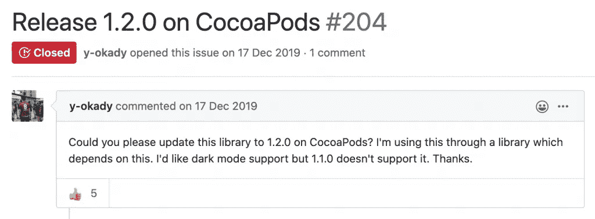
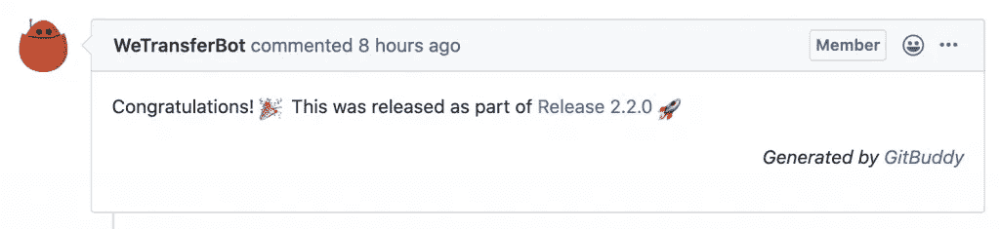
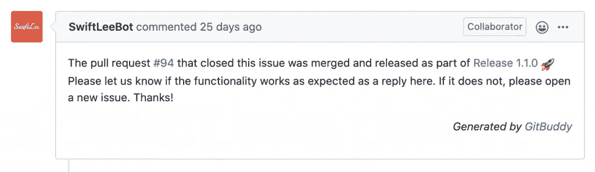
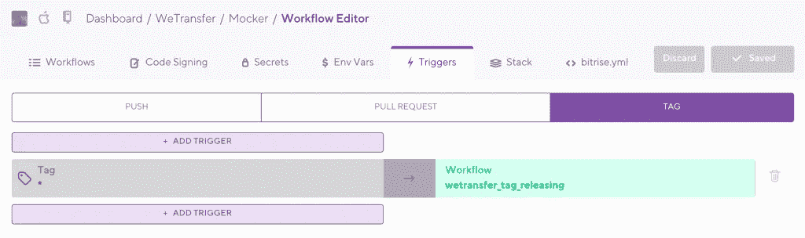

# GitBuddy 简介:GitHub 的变更日志和发布管理器

> 原文：<https://betterprogramming.pub/introducing-gitbuddy-a-changelog-and-release-manager-for-github-27edacea4adb>

## 轻松管理您的 GitHub 版本，更新您的变更日志，并尽快向您的贡献者提供更新


由[安库什·明达](https://unsplash.com/@an_ku_sh?utm_source=unsplash&utm_medium=referral&utm_content=creditCopyText)在 [Unsplash](https://unsplash.com/s/photos/release?utm_source=unsplash&utm_medium=referral&utm_content=creditCopyText) 拍摄的照片

距离我们发布最初版本的 [GitBuddy](https://github.com/WeTransfer/GitBuddy) 已经有几个月了，但是现在是时候告诉你关于我们新的好朋友的一切了。我们在 WeTransfer 的所有 iOS 相关的[开源项目中使用它来创建和管理我们的变更日志和发布，从而对它进行了密集的测试。](https://github.com/WeTransfer?q=&type=public&language=swift)

管理多个项目可能相当耗时。你要让你的`CHANGELOG.md`保持最新，你也要做清楚的发布说明，让你的关注者知道有什么变化。与此同时，你会看到一些项目，像[浪子](https://github.com/fastlane/fastlane/releases/tag/2.148.0)，它们有很好的自动化功能，通过在发布说明中列出来感谢贡献者。然而，直到今天还没有一种通用的方法将它集成到您自己的存储库中。

# 轻松管理多个开源项目版本

随着时间的推移，我们一直在努力使我们的开源项目保持最新。作为一个存储库所有者，你可能会意识到我们经常忘记为我们的开源项目创建一个新的带标签的版本。人们开始提出问题，抱怨某个特性在 CocoaPods 这样的依赖管理器上还不可用，他们说得有道理！



用户要求在 CocoaPods 上发布开源项目特性是很常见的

在一家允许管理开源项目的公司工作是很棒的，但是也需要很好的时间管理技巧。在 sprints 中，通常不计划审查来自社区的 PRs，这些 PRs 并没有真正实现定义的路线图中的任何东西。但是，有一个没有维护好的开源项目，真的是很不好的印象。

在 WeTransfer，我们决定是时候改变了。接下来，我们通常会思考如何将问题自动化，让自己免于挣扎。答案在这里:GitBuddy。

# 介绍 GitBuddy 作为我们管理变更日志和发布的朋友

GitBuddy 是一个完全用 Swift 编写的命令行工具。它利用了最新的可用 API，如苹果公司的 [ArgumentParser 框架](https://github.com/apple/swift-argument-parser)，并且有三个主要特性:

*   在两个标签之间生成一个 changelog，并将其更新到一个`CHANGELOG.md`文件中
*   用正确的 changelog 条目将标签转换成 GitHub 版本
*   当发布包含相关代码变更时，对问题和 PRs 进行评论

GitBuddy 的目标是解决几个具体问题:

*   我们手动更新我们的`CHANGELOG.MD`。我们甚至[要求社区贡献者](https://github.com/WeTransfer/WeScan/pull/159#pullrequestreview-267607990)用一个变更日志条目更新 PR。这对我们在 GitHub 上管理的开源项目和内部项目都很重要。GitBuddy 必须通过自动获取更改来解决这个问题。
*   浪子和自定义 Ruby 代码允许我们获取最新的`CHANGELOG.MD`条目，并将其包含在 GitHub 版本中。虽然它工作正常，但是需要 Ruby 知识来维护这些代码。因此，我们的目标是在 Swift 中编写一个解决方案，这样团队中的每个人都可以维护代码(再见[总线因素](https://en.wikipedia.org/wiki/Bus_factor))。
*   感谢我们的贡献者并在我们的发布说明中列出他们是我们的目标，因为我们很想感谢他们的努力。
*   由于我们喜欢开源我们的代码，GitBuddy 应该足够通用，对其他人也有用。

我很高兴地宣布，我们已经成功实现了上述所有目标。让我们一个一个地检查它们。

# 让变更记录档保持最新

GitBuddy 中的两个主要命令之一是 changelog 命令。在撰写本文时，它看起来如下:

```
$ gitbuddy changelog --help
OVERVIEW: Create a changelog for GitHub repositories

USAGE: gitbuddy changelog [--since-tag <since-tag>] [--base-branch <base-branch>] [--sections] [--verbose]

OPTIONS:
  -s, --since-tag <since-tag>
                          The tag to use as a base. Defaults to the latest tag. 
  -b, --base-branch <base-branch>
                          The base branch to compare with. Defaults to master. 
  --sections              Whether the changelog should be split into sections. Defaults to false. 
  --verbose               Show extra logging for debugging purposes 
  -h, --help              Show help information.
```

该命令采用一个输入标记和一个基本分支进行比较。这将生成自上次提交以来基本分支上的更改列表，该列表用于获取 changelog 条目，如下所示:

*   开始和结束日期从基本分支上的最近提交和标记创建日期获取。
*   GitHub API 用于获取这些日期之间的所有 PRs，这些日期以给定的基本分支为目标。
*   如果 PR 包含任何支持的[结束关键字](https://help.github.com/en/github/managing-your-work-on-github/linking-a-pull-request-to-an-issue#linking-a-pull-request-to-an-issue-using-a-keyword)来引用已修复的问题，则获取链接问题的标题并将其用作 changelog 条目。如果没有找到相关问题，则默认使用 PR 标题。
*   PR 作者在 changelog 条目中用作参考。

使用上述命令可能会产生以下示例输出:

```
$ gitbuddy changelog -s 2.1.0
- ignoring query example swap i/o url ([#54](https://github.com/WeTransfer/Mocker/pull/54)) via [@GeRryCh](https://github.com/GeRryCh)
- Update README.md ([#53](https://github.com/WeTransfer/Mocker/pull/53)) via [@mtsrodrigues](https://github.com/mtsrodrigues)
- mixing in the ability to send an explicit error from a mock response ([#52](https://github.com/WeTransfer/Mocker/pull/52)) via [@heckj](https://github.com/heckj)
- Update readme for Alamofire 5 ([#48](https://github.com/WeTransfer/Mocker/pull/48)) via [@AvdLee](https://github.com/AvdLee)
- Document that onRequest and completion must be set before calling register() ([#47](https://github.com/WeTransfer/Mocker/pull/47)) via [@marcetcheverry](https://github.com/marcetcheverry)
- Merge release 2.1.0 into master ([#46](https://github.com/WeTransfer/Mocker/pull/46)) via [@WeTransferBot](https://github.com/WeTransferBot)
```

正如您所看到的，生成的输出使用 Markdown 进行了样式化，这在 [GitHub](https://github.com/WeTransfer/Mocker/releases/tag/2.2.0) 上产生了很好的输出:


GitBuddy 生成的示例发布

GitHub release 由另一个主命令生成:release。

# 将标签转换成漂亮的 GitHub 版本

release 命令使用 changelog 命令获取给定标签的更改，并使用它们在 GitHub 上创建一个新版本。它还可选地更新`CHANGELOG.md`文件，这使得更新您的 changelog 条目更加容易。

在编写时，释放命令如下所示:

```
$ gitbuddy release --help
OVERVIEW: Create a new release including a changelog and publish comments on related issues.

USAGE: gitbuddy release [--changelog-path <changelog-path>] [--skip-comments] [--use-pre-release] [--target-commitish <target-commitish>] [--tag-name <tag-name>] [--release-title <release-title>] [--last-release-tag <last-release-tag>] [--base-branch <base-branch>] [--sections] [--verbose]

OPTIONS:
  -c, --changelog-path <changelog-path>
                          The path to the Changelog to update it with the latest changes. 
  -s, --skip-comments     Disable commenting on issues and PRs about the new release. 
  -p, --use-pre-release   Create the release as a pre-release. 
  -t, --target-commitish <target-commitish>
                          Specifies the commitish value that determines where the Git tag is created
                          from. Can be any branch or commit SHA. Unused if the Git tag already exists.
                          Default: the repository's default branch (usually master). 
  -n, --tag-name <tag-name>
                          The name of the tag. Default: takes the last created tag to publish as a GitHub
                          release. 
  -r, --release-title <release-title>
                          The title of the release. Default: uses the tag name. 
  -l, --last-release-tag <last-release-tag>
                          The last release tag to use as a base for the changelog creation. Default:
                          previous tag. 
  -b, --base-branch <base-branch>
                          The base branch to compare with for generating the changelog. Defaults to
                          master. 
  --sections              Whether the changelog should be split into sections. Defaults to false. 
  --verbose               Show extra logging for debugging purposes 
  -h, --help              Show help information.
```

如你所见，它有很多选项。这使得 GitBuddy 适用于许多用例以及创建版本的定制方式。值得指出的是，整个工具都是用 Swift 编写的，如果你有编写 Swift 代码的经验，应该可以添加缺失的功能。

释放命令的工作方式如下:

*   默认情况下，获取最新的标签并用于转换成 GitHub 版本。
*   如前所述，通过将输入标签与给定的基本分支进行比较来获取变更日志。
*   使用给定的标题创建一个新版本。
*   对所有引用的问题和 PRs 发布意见。

虽然注释是可选的，但是它们是开源发布的一个很好的补充。发布中包含的每个 PR 和问题都会得到一个注释，告诉作者他们的更改已经发布。



发布时在拉取请求上发布的注释



发布时在问题上发布的评论

# 用 GitBuddy 发布标签

一个示例版本可能如下所示:

```
$ gitbuddy release --changelog-path Changelog.md
```

这个命令将发布最新的标签，附加变更日志，并将其转换成看起来很棒的 [GitHub 版本](https://github.com/WeTransfer/Mocker/releases/tag/2.2.0):


GitBuddy 创建的示例版本

如您所见，我们包括了所有贡献者所做的工作。这可以激励他人做出贡献，但主要是我们表达感谢的一种方式。

另一个好处是与固定的问题。这些对于使用我们的变更日志的 QA 团队特别有用。他们可以使用我们的变更日志开始验证任何已修复的问题。

# 使用标签触发器自动发布

当我们用标签触发器自动创建新版本时，所有这些都汇集在一起。像 [Bitrise](https://www.bitrise.io/) 这样的工具允许我们设置一旦新标签被推送就会被触发的工作流:



Bitrise 提供触发器，以便在推送新标签时运行工作流

上面的例子展示了我们如何用我们的开源框架 [Mocker](https://github.com/WeTransfer/Mocker) 进行发布。如果你也在使用 Bitrise，你可以从查看我们的工作流中受益，因为这些都是开源的，并且包含在我们的 [WeTransfer-iOS-CI 资源库](https://github.com/WeTransfer/WeTransfer-iOS-CI/blob/master/Bitrise/tag_releasing_bitrise.yml)中。

最后，我们发布一个新版本所需要做的就是在 Git 上添加一个新标签。这将触发以下工作流:

*   通过使用标签作为新版本来更新我们的`.podspec`
*   用我们即将创建的最新版本更新`Changelog.md`
*   在每个问题上发表文章，并在公共关系中提及该版本
*   创建实际的 GitHub 版本

GitBuddy 完全符合这个工作流程，是做发布的好伙伴。我鼓励你从我们的[工作流程](https://github.com/WeTransfer/WeTransfer-iOS-CI/blob/master/Bitrise/tag_releasing_bitrise.yml)中获得灵感，让你更容易发布新的版本。

# 结论

我们将 GitBuddy 编写成一个快捷的命令行工具，帮助我们更容易地发布开源项目中的变更。发布不再是一项耗时的任务，我们所有的贡献者都不必等待很久，他们的更改就可以通过 CocoaPods 这样的依赖管理器获得。

谢谢！