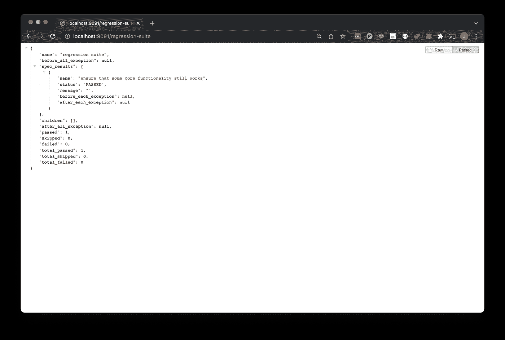
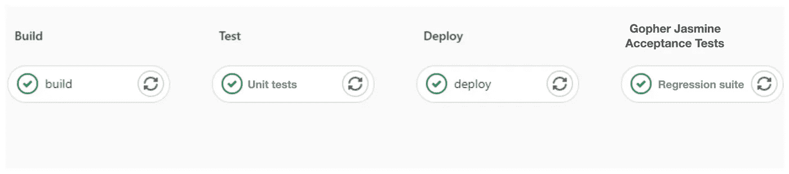

# Gopher Jasmine 简介——围棋测试框架

> 原文：<https://betterprogramming.pub/introducing-gopher-jasmine-a-testing-framework-for-go-a1636ab1d94f>

## 用 Golang 编写简单、快速、明显的验收测试


照片由[戴恩·托普金](https://unsplash.com/@dtopkin1?utm_source=medium&utm_medium=referral)在 [Unsplash](https://unsplash.com?utm_source=medium&utm_medium=referral) 上拍摄

关于测试软件，缓慢的测试和不存在的测试之间几乎没有区别。有人不知道如何运行的测试和不存在的测试没有区别。而且写一个脆弱的测试比根本不写测试更粗心。好吧，也许这些陈述缺乏某种细微差别，但总的来说，这是高质量测试的三个重要支柱:

*   测试应该快速运行
*   测试应该是健壮的
*   测试应该易于运行

# 快的

耐心是一种美德，但应该被编纂成法典。

测试*速度*是一个相对的术语。例如，提供 VM 的集成测试几乎肯定会比简单的初始测试花费更长的时间。

排除禁止性边缘情况，这并不是说前者比后者更差。每项测试都应该以理论上所需的最短时间为基准，并且应该尽最大努力达到这一点。

以下是一些简单的优化:

*   同时运行独立的测试。
*   仅配置所需的内容，例如，Spring Boot 测试应该仅配置所需的 Beans 子集。
*   仅当状态变脏时，才重新启动进程并重新初始化对象。

# 粗野的

> 您应该几乎可以肯定，测试失败是由于您的目标特性的中断。

脆弱的测试会很快侵蚀信心。脆性试验是一种易受间歇性故障影响的试验。理想情况下，测试失败的唯一原因是你在测试中针对的特性发生了重大变化，比如一段代码。

然而，在实践中，测试不仅会因为目标特性中的突破性变化而失败，还会因为系统环境差异和所需服务的中断以及大量其他原因而失败。

开发人员将不得不质疑每一个失败，并且需要特定的经验来诊断测试失败的原因。在这种情况下，我发现开发人员非常担心脆弱的测试套件，以至于他们选择完全不参与其中。

以下是一些简单的改进:

*   编写逻辑以确保环境为测试做好准备。如果环境没有准备好，那么这个测试应该被跳过而不是失败，并且应该有一个适当的错误消息来描述为什么环境没有准备好。
*   避免竞态条件。
*   在测试运行之前，保持警惕并清理现有状态。这种状态可能是由于之前的测试或一些手动干预而变脏的。
*   每次测试后，请细心清理脏污的状态。

# 缓解

测试应该将专业知识整理成文，并使其易于传播。

一个伟大的测试将专业知识整理成文，并将其分发给其他人。我的一个同事在一个项目中利用了多数据中心配置中的 Consul。当时，他是我们团队中唯一一个有在多个数据中心中引导 Consul 的经验的人。事实证明，我们不需要学习如何引导 Consul，因为他编写了过程并编写了一套优秀的测试。

整理专业知识的第二部分是让你的同事随时可以使用它，并确保他们可以轻松地运行它。例如，一个测试套件可能需要 Mongo。套件选择使用一些嵌入式 Mongo 了吗？如果有，安装可靠吗？或者该套件需要一个运行在 docker 中的真实 Mongo 实例。你的同事熟悉 Docker 吗？

测试依赖、工具和初始设置是不可避免的，这是有原因的——它们为套件提供了动力和能力。关键是应该仔细考虑每个需求，并很好地实现，这样您的套件才不会变得无法运行。

# 地鼠茉莉

[Gopher Jasmine](https://gopher-jasmine.io/) 是一个测试框架。511 行代码，很容易理解，可以在 GitHub [这里](https://github.com/hyperstripe50/gopher-jasmine)查看。它受 Jasmine 的显而易见的语法的启发，因此，测试以类似的格式编写。

查看官方网站获得更多详细的例子，并有机会运行自己的 Gopher Jasmine 测试套件。

 [## 地鼠茉莉

### 编辑描述

gopher-jasmine.io](https://gopher-jasmine.io/home) 

Gopher Jasmine 致力于上述三大支柱，即:

*   测试应该快速运行
*   测试应该是健壮的
*   测试应该易于运行

一个简单的套件如下所示:

## 测试应该快速运行

Gopher Jasmine 提供两种类型的套件

**1)顺序:**测试按顺序运行。

2)并发:测试并行运行

此外，由于库是用 Golang 编写的，所以性能很好。

## 测试应该是健壮的

Gopher Jasmine 为测试的设置和拆卸提供了入口点。

*   `BeforeAll`:在整个套件之前执行一次逻辑。
*   `BeforeEach`:每次测试前执行逻辑。
*   `AfterAll`:在整个组曲之后执行一次逻辑。
*   `AfterEach`:每次测试后执行逻辑。

有了这些入口点，您可以确保您的测试已经准备好运行，并在完成时被清理。这些入口点中的任何失败都很容易被识别为设置和清理中的失败，而不是测试本身的失败。

## 测试应该易于运行

还有很多类似的更强大的框架，比如 [Agouti](https://agouti.org/) 。Gopher Jasmine 不打算替代这些框架。相反，Gopher Jasmine 提供了一个微妙但有用的特性:

在运行时运行测试套件的能力。

该框架本质上允许您通过 API 公开单元/验收测试，这使得运行测试变得非常容易。我最喜欢的一个野外运行时测试方法的例子是我的三星电视。只需点击一个按钮，我就可以运行一套测试来检查网络连接，即使我不知道在引擎盖下发生了什么。

测试套件的 API 可以用一行代码创建。

第 14 行将引导一个服务器并公开端口`9091`。本地或远程托管此 API，并使用客户端来触发套件。例如，如果您在本地运行它，您可以通过以下调用来触发`regression suite`:

```
$ curl [http://localhost:9091/regression-suite](http://localhost:9091/parent-suite)
```

输出如下所示:



# 在野外使用地鼠茉莉

我成功地将 Gopher Jasmine 与 CICD 管道结合在一起。假设您的任务是开发一个 HTTP API，使用 GitLab 管道进行构建和部署。在部署了任何 HTTP API 更改之后，运行验收测试来验证它们是非常有用的。管道示例如下所示:



您可以在管道中配置一个作业，用 *cURL 触发 Gopher Jasmine 回归套件。*检查响应的顶层输出，如果`total_skipped`或`total_failed`不为零，则作业失败。