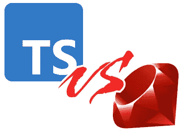
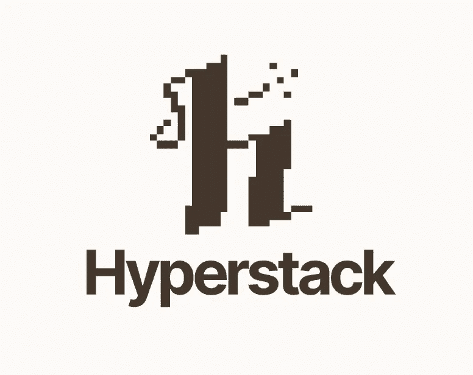
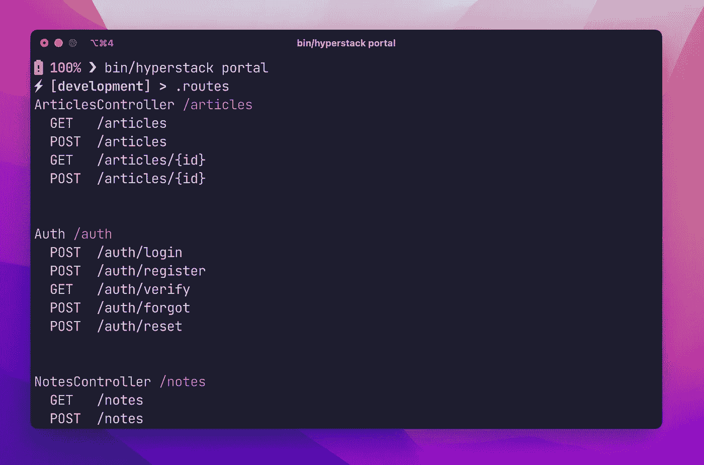

# Hyperstack 简介——面向构建者的实用 Node.js Web 框架

> 原文：<https://betterprogramming.pub/introducing-hyperstack-the-pragmatic-node-js-web-framework-for-builders-caed813c1902>

## 看看我们最新的面向程序员的开源工具


作者图片

[Hyperstack](https://github.com/hyperstackjs/hyperstack) 是一款面向构建者的全新开源 Node.js web 框架。这不是重新发明轮子，它只是把一堆好轮子和好部件包装在一个像 Rails 一样的包里供你使用。

好的软件是解决复杂问题的简单软件。构建简单的软件通常需要遵循一些原则、设计模式和强有力的观点，帮助我们穿越[选择悖论](https://en.wikipedia.org/wiki/The_Paradox_of_Choice)的危险。

当你没有这些原则和最佳实践来指导简单性时，我看到工程师们用年度趋势微服务 API 框架来取乐，在你知道它之前，他们正在为一个极其简单的 web 应用程序构建微服务架构。“*这就是我们应该做的，这就是如何构建可扩展的软件，”*他们想。

对许多人来说，构建复杂的软件变得容易，而开始做简单的事情变得困难。

# 用简单的软件解决简单的问题


作者图片

一个单一的应用程序，一个单一的关系数据库，几十年来一直是构建优秀软件的完美选择，现在仍然是为有趣的项目创建简单软件的良好开端。

Ruby on Rails 正是实现了这一点。你建造了一个 [*雄伟的庞然大物*](https://m.signalvnoise.com/the-majestic-monolith/) 来解决简单的*和*复杂的问题，直到你再也不能解决为止。

O *然后*，当你对所有事情都变得更聪明，当你用成堆的数据和经验整理出所有用例时——*然后*你开始拆分和构建微服务。

这种方法适用于:GitHub、Airbnb、Twitter。所有这些都是从一块巨石开始的。其中一些仍然是雄伟的巨石。他们中的大多数仍然使用 Ruby on Rails。

# Rails 世界中的 TypeScript 与 Ruby



作者图片

Rails 可以说是有史以来最好的 web 框架，而 Ruby 是你必须用来构建 Rails 应用程序的编程语言。不管你知不知道，它很可能影响了你今天在网络软件中接触到的一切。

虽然您仍然可以使用 Rails，但您可能更喜欢使用 Typescript 和 Node.js，而不是 Ruby。

有很多理由让后端开发更喜欢 Typescript 和 Node.js，而不是 Ruby:

*   **个人或团队**的先前经验，或者你试图现代化的先前代码库
*   服务器和客户端之间的代码共享是真实存在的
*   **与前端工具共享基础设施**(这么多！)是一件大事:开发工具、CI、代码质量，随着时间的推移导致整个团队的有效性
*   最后，Ruby 是一门伟大的语言，但是**不再像 typescript 那样流行**


图片:维基百科

# 在一个 TypeScript 世界里，创建一个 Rails 需要什么？

*   **模型**——一个强大的活动记录抽象，它神奇地知道如何连接和操作
*   **数据库处理**:迁移、播种——以及对多个数据库的支持，以提供更好的开发人员体验
*   **控制器**、路由、认证和安全最佳实践——允许轻松构建 API 并避免[常见安全陷阱](https://www.zdnet.com/home-and-office/networking/github-suspends-member-over-mass-assignment-hack/)
*   虽然你可以通过第三方 SaaS 发送电子邮件，但是在本地创建、测试和试验电子邮件会更有效率。你需要支持。
*   **后台作业**——因为使用像 SQS 这样的原始队列服务不像使用专用的后台作业框架那样符合人体工程学，或者测试友好。
*   **任务** —您需要修复记录、清理数据或向用户发送临时电子邮件。构建一个自定义任务，可以通过访问您的实时应用程序进行完全测试，并像使用`make`一样调用它
*   **交互式 REPL** —远程或本地轻松访问应用程序的实时对象和信息
*   **代码生成和搭建**——通过生成模型、控制器等加快构建速度
*   **作为一等公民进行测试**——框架的每一部分都适合干净、简单的测试
*   **配置和可操作性** —日志、监控和 app 控制平面等问题
*   **惯例和观点** —文件夹结构、命名、林挺、格式，都从你的背上拿下来，这样你就可以专注于构建产品
*   亲吻——当面临选择时，总是选择一条更简单的路。例如，ActiveRecord over Data Mapper 或任何其他实体映射魔术。ActiveRecord 有助于简化代码。
*   **视图**——一种自动的方式，从应用程序向客户端剪切格式化、序列化响应和错误状态的样板文件


如果您试图从零开始组装这样一个东西，特别是针对 Javascript 和 Node.js，这里有一些考验和磨难。当然有些听起来很熟悉:

*   建筑这个用快递你**需要**[记一下异步故障](https://stackoverflow.com/questions/61790224/node-js-middleware-wrap) 。是的， [Koa](https://koajs.com/) 和其他的都很棒，但是 Express 适用于绝大多数 API 用例，它也很简单并且被广泛采用，并且是人们通常期望在通用 API 项目中找到的。
*   **挑选和连接记录器**需要处理请求范围、进程范围等等，你必须在一个虚拟的世界中遍历全局和局部状态。
*   **从头开始构建后台工作基础设施会让你面临失败**。这里有太多的东西需要了解，以至于无法从头构建它，甚至无法选择正确的队列系统并在其上构建正确的抽象和基础设施。
*   **为了测试**，您需要生成一个 Express 应用程序，记得清理数据库、设置模式、加载数据并开始您的测试。所有这些都是你必须建立的基础设施，在它为你服务之前，你必须不断地试错。

而这只是冰山一角。幸运的是，我已经构建了 [Hyperstack](https://hyperstackjs.io/) ，所以你不必自己构建这个。

# 5 分钟内完成 Hyperstack 应用程序



作者图片

Hyperstack 是一个 TypeScript web 框架，它以 Rails 为北极星。它在有利于开发人员体验的地方紧跟 Rails，但在有利于用 Typescript 构建 Node.js 应用程序的实用主义的地方却完全不同。

让我们创建我们的第一个应用程序:

```
$ pnpm create hyperstack
$ cd my-hyper-app
$ pnpm install
$ bin/hyperstack start
```

我们完成了！


作者图片

Hyperstack 已经创建了数据库，进行了迁移，设置了您的工作开发环境，传输了 JavaScript，并为您配置了一个漂亮的 API 服务，具有很好的默认设置，如安全标题、静态服务、电子邮件预览和后台工作程序，这些都在进行中，但通过配置成为了一个完全可扩展的基于队列的后台作业处理器。

取消流程`CTRL-C`，让我们添加我们的博客`article`:

```
$ bin/hyperstack g scaffold article title:string body:text
```

```
Loaded templates: gen/dist/templates
       added: src/test/requests/articles/sanity.spec.ts
       added: src/app/controllers/articles.ts
       added: src/config/db/migrate/1337_article.js
       added: src/test/models/article.spec.ts
       added: src/app/models/article.ts
      inject: src/app/controllers/index.ts
      inject: src/app/controllers/index.ts
      inject: src/app/models/index.ts
✔      shell: running eslint
       shell: yarn eslint --fix src/app/models/*.ts src/app/controllers/*.ts src/test/models/*.spec.ts src/test/requests/articles/*.spec.ts src/config/db/migrate/*.js
```

您可以免费获得控制器、模型、迁移和自动编写的测试。

再次运行你的应用，让我们开始请求:

```
$ bin/hyperstack start
```

我用的是`[xh](https://github.com/ducaale/xh)`,但你也可以用类似的`[httpie](https://httpie.io/)`,或者你喜欢的任何东西:

**列表:**

```
$ xh -j -b localhost:5150/articles
{
    "articles": []
}
```

它是空的，所以让我们创建一个文章:

```
$ xh -j -b localhost:5150/articles title="hello hyperstack" body="EVH rocks"
{
    "article": {
        "title": "hello hyperstack",
        "body": "EVH rocks"
    }
}
```

再看一下列表:

```
$ xh -j -b localhost:5150/articles
{
    "articles": [
        {
            "title": "hello hyperstack",
            "body": "EVH rocks"
        }
    ]
}
```

我们完事了。

请随意在文档中进一步探索[。你可以用`hyperstack routes`和`hyperstack portal`玩互动 REPL，等等。](https://hyperstackjs.io/docs/getting-started/your-first-app)



作者图片

# 记住:复杂性总会找到自己的路

> 我们在复杂中挣扎，避免简单——诺曼·文森特·皮尔

您可以随时选择学习，从头开始构建完整的框架。您还可以投入时间从头开始构建可扩展的架构。

但有时，您只想构建一个产品，或者构建一些有趣的东西，而不需要预先进行数周的设置、基础架构和配置。

要快速构建产品，只需使用 [Hyperstack](https://hyperstackjs.io/) 。

# 如何参与


作者图片

可以从[网站](https://hyperstackjs.io/)入手，也可以跳转到 [Github repo](https://github.com/hyperstackjs/hyperstack) 通读源代码。如果您有需要改进的地方或需要报告的问题，我们也接受 PRs。