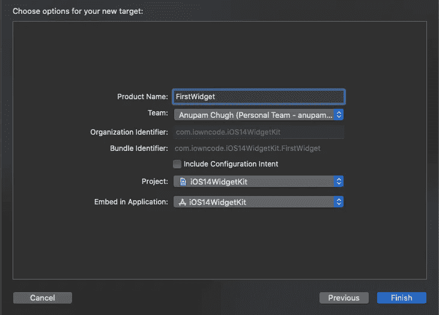
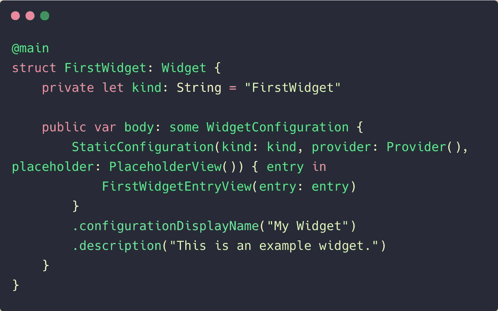
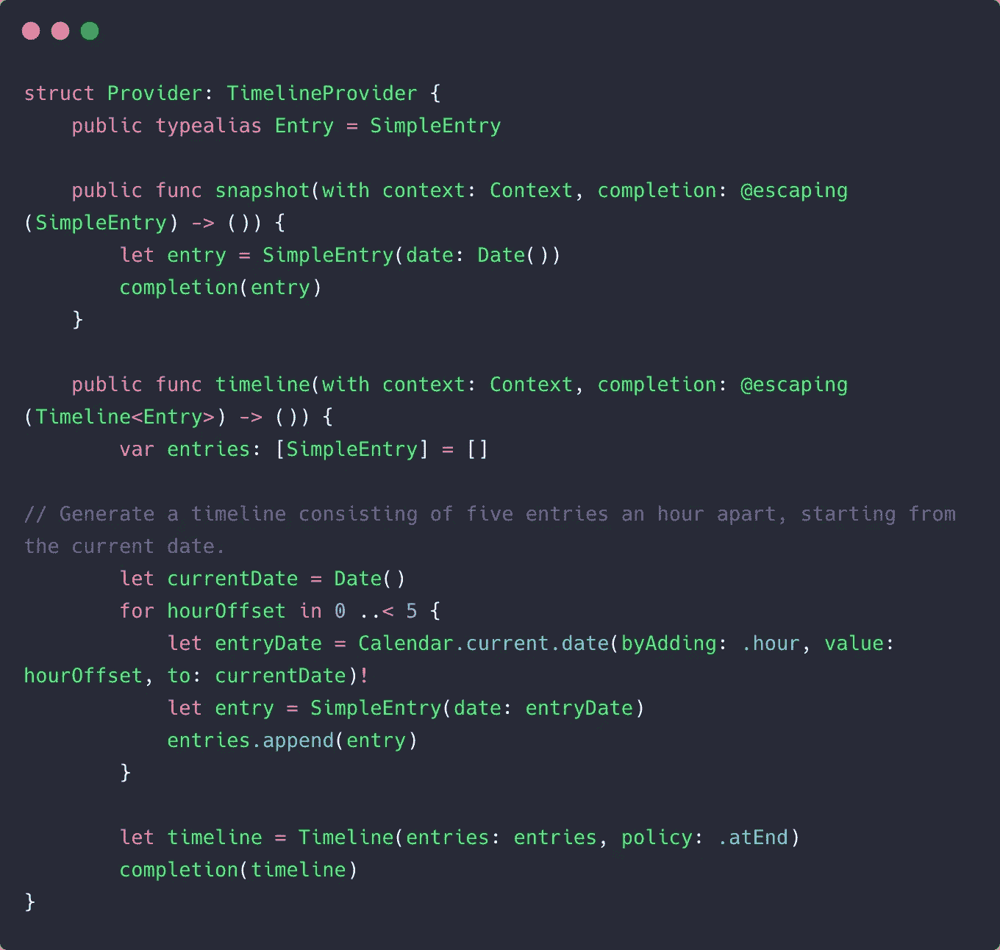
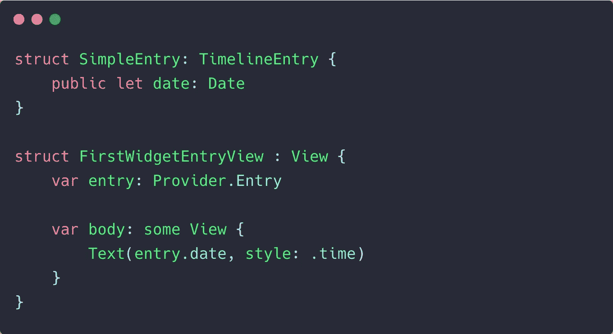
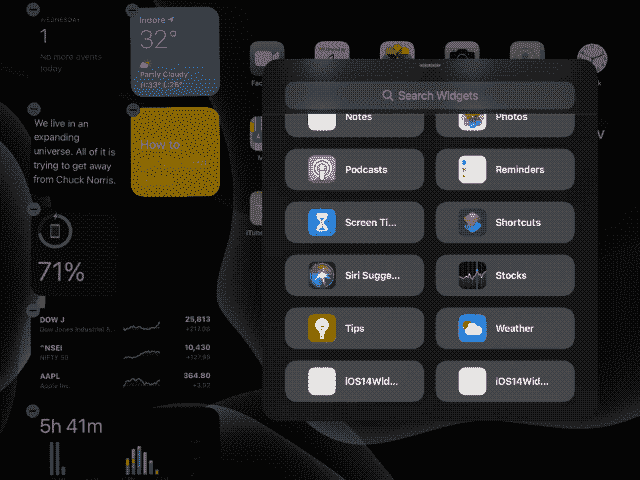

# 引入带 SwiftUI 的 iOS 14 WidgetKit

> 原文：<https://betterprogramming.pub/introducing-ios-14-widgetkit-with-swiftui-a9cc473caa24>

## 让我们在几分钟内学习如何为我们的主屏幕构建一些小部件


[巴格斯·赫纳万](https://unsplash.com/@bhaguz?utm_source=medium&utm_medium=referral)在 [Unsplash](https://unsplash.com?utm_source=medium&utm_medium=referral) 拍摄的照片。

WWDC 2020 给了我们很多增强和更新，但毫无疑问，引入了 [WidgetKit](https://developer.apple.com/widgets/) 框架。

iOS 14 引入了重新设计的主屏幕，其中包含的小工具是一个巨大的补充。对于我们的应用程序来说，小部件不仅仅是一个赏心悦目的 UI 快捷方式。它们还有助于不时地向用户提供有用的信息。

在某种程度上，它们是一种更平静的通知形式，为你提供来自应用程序的最新信息(如果开发者选择这样做的话)，而不会打扰你。此外，iOS 14 中还有一个新的智能堆栈功能，它将一组可以滑动的小部件分组。智能堆栈倾向于通过使用设备上的智能在顶部提供相关的小部件，该智能考虑了一天中的时间、位置和一些其他属性。

WidgetKit 完全是使用 SwiftUI 构建的，这为构建漂亮的小部件提供了无限的机会。需要注意的是，WidgetKit 并不是用来构建迷你应用的。

除了提供一个`Link`按钮让你设置一个深层链接 URL 来导航到应用程序的特定部分，你不能在小部件中添加任何动画或其他交互。

# 我们的目标

*   了解 WidgetKit 的结构。我们将探索这个框架，看看小部件是如何创建和更新的。
*   在 SwiftUI 中构建一个小时笑话小部件。
*   使用`WidgetBuilder`将我们的 SwiftUI 应用程序与两个小部件捆绑在一起。

事不宜迟，我们开始吧。

# WidgetKit 框架:引擎盖下

为了理解 WidgetKit 的结构，让我们创建一个新的 Xcode 12 SwiftUI 项目，并确保选择 SwiftUI 应用程序生命周期。

要创建我们的第一个小部件，转到文件→新建→目标并选择小部件扩展模板。确保您没有选中“包含配置意图”，因为在本文中我们将只讨论静态配置。



在添加小部件扩展目标时，您会看到一个文件，其中包含一些您可能觉得陌生的 SwiftUI 代码。别担心，我们会从头到尾走一遍。

以下代码片段是您的小部件的起点:



这些是从上面的代码中得出的推论:

*   `kind`是一个标识符，用于在 WidgetCenter 中将小部件与其他小部件区分开来。
*   在`WidgetConfiguration`中，我们设置了一个占位符视图，在小部件加载时显示。小部件的内容设置在`FirstWidgetEntryView`中，我们很快就会看到。
*   `Provider`是一个`TimelineProvider`类型的结构，这是小部件的核心引擎。它负责向小部件提供数据，并设置更新数据的时间间隔。同样，我们很快就会谈到这一点。
*   视图修改器`configurationDisplayName`和`description`在微件图库中显示各自的信息——微件图库是存放设备上所有微件的地方。

WidgetKit 框架还有另一个新的修饰符(`supportedFamilies`)，在这个修饰符中，我们可以为我们的应用程序传递不同大小的小部件。例如，`.supportedFamilies([.systemLarge])`只允许大尺寸的小部件。

# WidgetKit 时间轴提供程序

顾名思义，`Provider`结构旨在为小部件的内容提供数据。它符合`TimelineProvider`协议，该协议要求实现两种方法(`snapshot`和`timeline`)，如下面给出的默认示例所示:



*   `snapshot`函数用于立即呈现一个小部件视图，而时间轴提供者则希望加载数据。只使用虚拟数据设置快照方法很重要，因为这个视图也会显示在小部件图库中。
*   `SimpleEntry`结构实际上保存了单个`TimelineEntry`的数据，并最终显示在小部件的内容中。
*   另一方面，`timeline`函数用于创建一个或多个条目。我们可以设置`TimelineEntry`需要更新的时间间隔。
*   上面的代码基本上添加了五个时间轴条目，用于每小时更新小部件的内容。默认示例中的数据集是日期文本。
*   `Timeline`实例还包含一个`TimelineReloadPolicy`。系统将使用该策略来确定何时再次调用`timeline`函数，以加载下一组时间线条目。在上面的代码中，策略被设置为`atEnd`，这意味着在第五个`SimpleEntry`显示在 widget 上之后，系统将触发下一批的`timeline`函数。
*   除了`atEnd`，我们还有一个`after(Date:)`属性。它用于设置我们希望获取下一个时间轴的具体日期。请注意，系统可能不会在*确切的*日期触发`timeline`功能。此外，我们可以设置一个`never`作为重载策略，以确保时间轴不会再次触发。

此外，如果您想要触发小部件条目的重新加载，您可以使用`WidgetCenter` API。它让我们重新加载特定的时间线或所有的时间线。

`TimelineProvider`结构非常重要，因为您的动态内容将被提取到其中，以便按照您选择的特定时间间隔更新小部件的内容。

# SwiftUI 小部件视图

现在我们已经清楚 widget 是如何工作的了，让我们来看看将在屏幕上显示 widget 的 SwiftUI 视图。



上面的结构用`Provider.Entry`中的数据集填充小部件的视图。`Provider.Entry`是我们小部件视图的数据源，如果您回头看一下`TimelineProvider`，您会看到`SimpleEntry` struct 被设置为`Entry`的类型别名。

现在我们已经看到了 WidgetKit 是如何操作的——从显示占位符到用`TimelineProvider`中指定的时间线条目填充小部件视图——我们准备构建自己的定制小部件:一个每小时更新一次的笑话跟踪器(您可以定制时间间隔)。

# 在 iOS 14 中建立一个笑话小部件跟踪器

当显示`PlaceholderView`时，`TimelineProvider`允许我们从网络请求或数据库中获取数据。从 API 中为小部件获取数据的方法与为应用程序获取数据的方法相同。

下面的代码使用 Combine-powered `URLSession`来解码 API 响应，并将其传递给完成块:

请注意，SwiftUI 小部件视图不能也不应该使用像`Published`或`State`这样的属性包装器来更新。

使用以下可编码结构对响应进行解码:

# 创建我们的数据源

我们的小部件将笑话显示为一个字符串。因此，让我们在我们的`SimpleEntry`结构中添加字段，如下所示:

```
struct JokesEntry: TimelineEntry {public let date: Date
public let joke : String}
```

# 创建时间轴提供程序

下面的时间线提供者结构从`DataFetcher`获取数据，并将它们设置在以给定时间间隔配置的`TimelineEntries`数组上:

*注意:在生产应用程序中，不建议设置秒的时间间隔。上面的代码片段只是为了演示的目的。*

# 创建小部件 SwiftUI 视图

下面这段代码代表了我们的 SwiftUI 视图，将`SimpleEntry` struct 设置为其数据源:

在上面的代码中，通过使用 SwiftUI `@ViewBuilder`和使用`widgetFamily` enum 类型作为 EnvironmentObject，我们为各种小部件形状设置了不同的 SwiftUI 视图。

最后，让我们设置我们的`WidgetConfiguration`并在 iOS 14 设备上启动应用程序:

下面是小部件的实际输出:



如您所见，我们有两个不同大小和不同布局的小部件。您可以使用自己漂亮的 SwiftUI 视图进一步定制它们。

出于演示的目的，我将`TimelineProvider`间隔设置为一秒钟(尽管这在小部件中并不理想，并且会消耗大量电池)。

# 使用小部件构建器创建多个小部件

我们可以创建不同的小部件，并使用`WidgetBundleBuilder`将它们捆绑在一起:

# 结论

小工具既方便又赏心悦目。由于苹果在 iOS 的主屏幕上引入了新的 WidgetKit 框架和小部件，许多应用程序将会利用它。然而，看看它对用户隐私的影响有多大会很有趣。完整的源代码可以在 [GitHub 资源库](https://github.com/anupamchugh/iOS14WidgetKitStaticConfig)中找到。

在下一部分中，我们将使用意向配置和链接来构建一些方便的小部件。

这一次到此为止。感谢阅读。