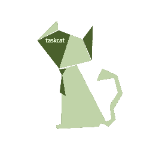
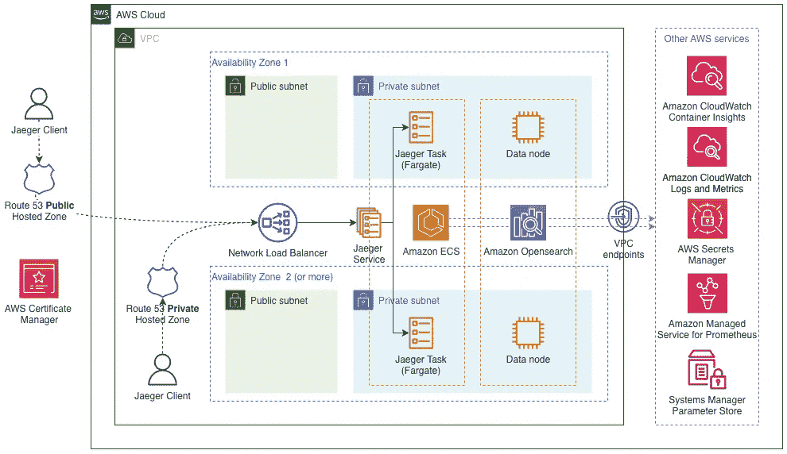

# Jaeger 快速入门介绍——在 AWS 上部署

> 原文：<https://betterprogramming.pub/introducing-jaeger-quick-start-deploying-on-aws-f0ee5d398e8a>

## [寻人的思考](https://medium.com/@dmitrykolomiets/list/musings-on-tracing-3d7bd0d2093c)

## 端到端分布式跟踪平台的研究

[鲁拜图·阿扎德](https://unsplash.com/@rubaitulazad?utm_source=unsplash&utm_medium=referral&utm_content=creditCopyText)在 [Unsplash](https://unsplash.com/@rubaitulazad?utm_source=unsplash&utm_medium=referral&utm_content=creditCopyText) 上的照片

# OpenTelemetry 和 X 射线的问题

[open telemetry events](/trace-context-propagation-with-opentelemetry-b8816f2f065e#logs)——这是一个非常有用的概念，在许多情况下可能会取代更传统的日志

*   x 射线不支持 [OpenTelemetry 链接](https://opentelemetry.io/docs/reference/specification/overview/#links-between-spans)——我们之前已经看到，链接对于表达跨度之间的因果关系非常有帮助*   X 射线对跨度种类有[限制](https://aws-otel.github.io/docs/getting-started/python-sdk/trace-manual-instr#creating-custom-spans)——只有种类`Server`的跨度被转换成 X 射线段

正如 OpenTelemetry world 中常见的情况，可以更改默认配置并将[跟踪导出到*不同的*跟踪后端。但是用哪个呢？](https://opentelemetry.io/docs/collector/configuration/#exporters)

# 贼鸥

您可能想为您的跟踪平台考虑许多跟踪后端——包括商业的和开源的。在这篇文章中，我想让大家关注一下[Jaeger](https://www.jaegertracing.io/)——一个来自[云原生计算基金会](https://www.cncf.io/) (CNCF)的[毕业项目](https://www.cncf.io/projects/jaeger/)。考虑到其他 CNCF 毕业的项目，这是一个值得尊敬的认可。仅举几个:[库伯内特斯](https://kubernetes.io/)、[赫尔姆](https://helm.sh/)、[普罗米修斯](https://prometheus.io/)、[弗鲁恩特](https://www.fluentd.org/)。

Jaeger 是一个开源的端到端分布式追踪平台。在真正的云原生方式中，Jaeger 可以以多种方式部署，例如:

*   [Docker 图像](https://www.jaegertracing.io/docs/1.33/deployment/)
*   [Kubernetes 操作员](https://github.com/jaegertracing/jaeger-operator#getting-started)
*   [舵图](https://github.com/jaegertracing/helm-charts)
*   [视窗服务](https://www.jaegertracing.io/docs/next-release/windows/)

Jaeger 团队创建了一个详细的[部署指南](https://www.jaegertracing.io/docs/next-release/deployment/)，它回答了许多关于不同 Jaeger 组件([代理](https://www.jaegertracing.io/docs/1.33/architecture/#agent)、[收集器](https://www.jaegertracing.io/docs/1.33/architecture/#collector)和[查询](https://www.jaegertracing.io/docs/1.33/architecture/#query)服务)的角色、与其他服务的集成点(Elasticsearch、Cassandra)以及伸缩性考虑的问题。然而，即使有这种水平的技术文档，部署一个生产就绪的 Jaeger 平台也不是一个小壮举。

对于大规模部署，尤其是在 AWS 环境中，我们对[架构良好的](https://aws.amazon.com/architecture/well-architected/)解决方案有很多期望，尤其是:

*   跳回
*   弹性
*   可观察性
*   与其他 AWS 服务的本机集成
*   可重复的全自动 IaC 部署

Jaeger Kubernetes operator 有助于实现这些特征，但话说回来，你需要一个 Kubernetes 集群作为起点。如果你没有呢？旋转起来(并保持！)托管跟踪平台的新集群可能非常困难和昂贵(无论是成本还是经验方面)。

这篇文章的主要问题是——Jaeger 的“快速启动”在 AWS 上是什么样子的？

# AWS 快速入门— 101

我在上面使用“快速启动”是有原因的——[AWS 快速启动](https://aws.amazon.com/quickstart/)是“*自动化参考部署……【它们】帮助你根据 AWS 最佳实践*在 AWS 上部署流行的技术”。这正是我和 Jaeger 在 AWS 上的目标。

AWS 甚至提供了[快速入门投稿指南](https://aws-quickstart.github.io/)来帮助创作新的快速入门。在不深入细节的情况下，让我说一个*快速入门是一组 CloudFormation 模板*。

而且我必须承认，这些模板必须**坚固**。引用文档，快速入门的[最低架构要求](https://aws-quickstart.github.io/reqs.html#min)如下:

*   多 AZ 架构([细节](https://aws-quickstart.github.io/best-practices.html#ha))
*   支持大多数 AWS 地区([详情](https://aws-quickstart.github.io/design.html#region-support))
*   新 VPC 和现有 VPC 部署选项([详情](https://aws-quickstart.github.io/design.html#deployment-options))
*   私有子网中的产品实例([详细信息](https://aws-quickstart.github.io/best-practices.html#security)
*   用于私有子网出站互联网访问的 NAT 网关([详情](https://aws-quickstart.github.io/templates-examples.html)
*   尽可能使用市场 AMIs 没有预烘焙的 ami([细节](https://aws-quickstart.github.io/use-amis.html))
*   AMI 映射；没有硬编码的 ami([细节](https://aws-quickstart.github.io/use-amis.html))
*   用户友好的参数标签和组([详情](https://aws-quickstart.github.io/naming-parms.html))
*   CIDR 封锁外部管理员访问([细节](https://aws-quickstart.github.io/best-practices.html#security)
*   具有最小特权原则的安全组([详情](https://aws-quickstart.github.io/best-practices.html#security))
*   没有部署的软件位([细节](https://aws-quickstart.github.io/design.html#handling-downloads))
*   无硬编码密码([详情](https://aws-quickstart.github.io/best-practices.html#security))
*   EC2 实例用户数据或其他明文中没有敏感数据([详细信息](https://aws-quickstart.github.io/best-practices.html#security))
*   开放式远程管理访问不使用 0 . 0 . 0 . 0/0([详情](https://aws-quickstart.github.io/best-practices.html#security))
*   堆栈外没有自动创建的资源([详细信息](https://aws-quickstart.github.io/design.html#error-handling))

确实是一份令人印象深刻的名单。如果你使用 *any* Quick Start 来部署你的基础设施，你可以肯定模板是相当不错的。

我特别喜欢快速启动生态系统的另一点是[模块化](https://aws-quickstart.github.io/design.html#modularity)。如果有一个快速入门工具部署了您想要在您的架构中使用的基础设施的一部分(例如 [VPC 快速入门](https://github.com/aws-quickstart/quickstart-aws-vpc)或 [Aurora PostgreSQL 快速入门](https://github.com/aws-quickstart/quickstart-amazon-aurora-postgresql))，您可以*参考*一个现有的实现。这就像在 Python 或 NodeJS 中引用一个库，只针对你的 CloudFormation 模板。这个特性本身就具有突破性，足以改变您使用 CloudFormation 处理 IaC 的方式。

老实说，您创建过多少次模板来配置 VPC、子网、路由表、互联网网关、NAT 网关、端点等等？不要告诉我你没有梦想过现成的实现，你可以重复使用，而不用重新发明这个轮子？现在你可以了。

关于快速起步的最后一点(承诺)。快速入门架构可能非常复杂，尤其是如果您考虑到我们上面提到的模块化方面。在没有可靠的自动化测试框架的情况下，为大型快速启动开发和维护 CloudFormation 模板可能是一项严肃的任务。AWS 快速启动团队认识到了这一挑战，并引入了 [TaskCat](https://github.com/aws-ia/taskcat) :

`TaskCat`跨多个 AWS 区域自动执行云信息模板的林挺和部署。这意味着您可以确保您的模板，无论它们有多复杂，都可以成功地部署在目标区域(并被删除——这一点在云形成开发过程中经常被忽略)

使用`TaskCat`可以定义“测试”，在部署时为云形成提供不同的参数。该工具还可以生成一个通过/失败报告，该报告可以集成到您的 CI/CD 工具中，因此您可以将测试作为 PR 验证流程的一部分来运行。

> 即使你不打算为你的 IaC 使用 AWS 快速入门，我也推荐将 [TaskCat](https://github.com/aws-ia/taskcat) 整合到你的工作流程中，以自动化测试你的 CloudFormation 模板。

# 耶格快速入门

> 注:这不是官方的 [AWS 快速入门](https://aws.amazon.com/quickstart/)。该项目是根据[快速启动贡献者指南](https://aws-quickstart.github.io/)构建的，但尚未获得 AWS 和 Jaeger 团队的批准。

现在，一旦我们定义了什么是 AWS 快速入门，让我最后介绍一下 [Jaeger 快速入门](https://github.com/kolomiets/quickstart-jaeger)！

Jaeger Quick Start 帮助您在亚马逊网络服务(AWS)云上部署一个[高度可用的](https://docs.aws.amazon.com/whitepapers/latest/real-time-communication-on-aws/high-availability-and-scalability-on-aws.html)Jaeger——开源的端到端分布式追踪平台。

您可以使用快速入门中包含的 AWS CloudFormation 模板，在大约 10-30 分钟内将 Jaeger 部署到您的 AWS 帐户中。

该快速入门适用于希望使用 [AWS CloudFormation](https://aws.amazon.com/cloudformation/) 为 Jaeger 进行可重复、可定制的参考部署的用户。您也可以使用提供的 AWS CloudFormation 模板作为您自己实现的起点。

这是快速入门的高级架构图:

Jaeger 无服务器架构(带弹性搜索后端)

主要亮点:

*   快速入门使用[AWS Fargate](https://aws.amazon.com/fargate/)——无服务器计算引擎，而不是在 Kubernetes 集群中运行 Jaeger 容器(伴随着相关的操作复杂性)
*   快速启动部署所有必需的 Jaeger 组件([收集器](https://www.jaegertracing.io/docs/1.33/architecture/#collector)、[查询](https://www.jaegertracing.io/docs/1.33/architecture/#query)、[依赖火花作业](https://github.com/jaegertracing/spark-dependencies)，并对它们进行适当的配置
*   快速入门支持两种不同的存储后端，即适用于大规模生产部署的 [Amazon OpenSearch](https://aws.amazon.com/opensearch-service/) 集群和适用于实验和概念验证工作负载的内存存储
*   快速入门在公共 VPC 子网中部署[网络负载平衡器](https://aws.amazon.com/elasticloadbalancing/network-load-balancer/)来分配流量并暴露必要的 Jaeger 端口。负载平衡器可以是面向互联网的，也可以是内部的，只有 VPC 客户端可以访问
*   快速入门提供了为 Jaeger 实例分配 DNS 名称的选项。支持公共和私有的 [Amazon Route 53](https://aws.amazon.com/route53/) 托管区域。
*   快速入门与 [AWS 证书管理器](https://aws.amazon.com/certificate-manager/)集成，将 TLS 添加到网络负载平衡器
*   快速入门支持与亚马逊普罗米修斯托管服务的集成
*   快速入门添加了一个与[cloud watch Container Insights](https://docs.aws.amazon.com/AmazonCloudWatch/latest/monitoring/ContainerInsights.html)的可选集成，以监控 Fargate 上运行的 Jaeger 容器的指标

在 [Jaeger 快速启动部署指南](https://kolomiets.github.io/quickstart-jaeger/)中可以找到关于特性、架构决策和完整参数参考的详细解释。

# 下一步是什么？

Jaeger Quick Start 是一个新项目——在最初的版本中，我专注于支持两个存储后端(OpenSearch 和 in-memory ),因此，架构略有不同。我已经整理了 [Jaeger 快速启动路线图](https://github.com/users/kolomiets/projects/1/views/1)并提出了一些 [GitHub 问题](https://github.com/kolomiets/quickstart-jaeger/issues)来指明我下一步要去哪里。我下一个里程碑的重点是性能评估、默认参数的微调和文档改进。最终，我计划添加对另一个流行的 Jaeger 存储后端的支持——Cassandra，或者在 AWS 的托管服务世界中, [Amazon Keyspaces](https://aws.amazon.com/keyspaces/) 。

如果您有在 AWS 上部署和运行 Jaeger 的经验，或者想以任何方式做出贡献，请联系我们。特别欢迎你遇到的趣闻轶事和任何痛点！

在我结束这篇文章之前，让我把 Jaeger Quick Start 放在本系列[的更广泛的背景中，即它如何对我们的事件驱动架构的 OpenTelemetry 之旅有用？](https://medium.com/@dmitrykolomiets/list/musings-on-tracing-3d7bd0d2093c)

通过一种简单的方法将 Jaeger 部署到 AWS 环境中，您可以*补充*(甚至*替换* ) AWS X-Ray 作为您的目标遥测后端，用于应用程序跟踪。事实上，你可以一起使用 Jaeger 和 AWS X-Ray，并排运行它们——事实上，我非常推荐这种方法来实际查看两个平台的运行情况，并做出明智的决定，确定哪一个最适合你的需求。

这正是我们将在下一篇文章中涉及的内容——并排运行两个平台，讨论支持 Jaeger 所需的 ADOT 配置更改，比较结果跟踪，并概述两个平台之间的主要差异。

# 资源

*   **我们上面讨论的 Jaeger 快速入门**项目在[**kolomiets/Quick Start-Jaeger**](https://github.com/kolomiets/quickstart-jaeger)GitHub 资源库中
*   [Jager 快速启动部署指南](https://kolomiets.github.io/quickstart-jaeger/)
*   [官方 AWS 快速入门](https://aws.amazon.com/quickstart/?solutions-all.sort-by=item.additionalFields.sortDate&solutions-all.sort-order=desc&awsf.filter-content-type=*all&awsf.filter-tech-category=*all&awsf.filter-industry=*all)注册表，即您可以使用的构建模块
*   [快速启动投稿人指南](https://aws-quickstart.github.io/) —关于如何创建新的快速启动的文档