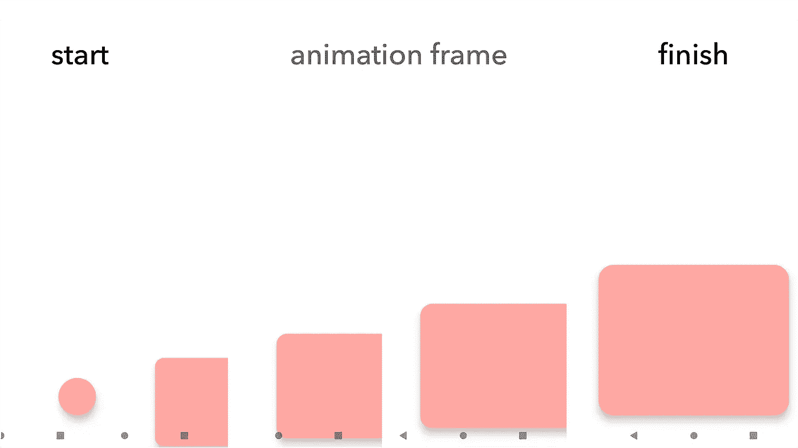
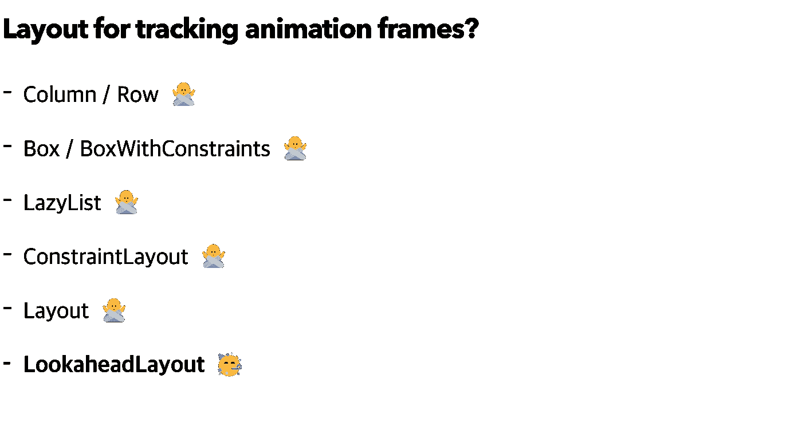
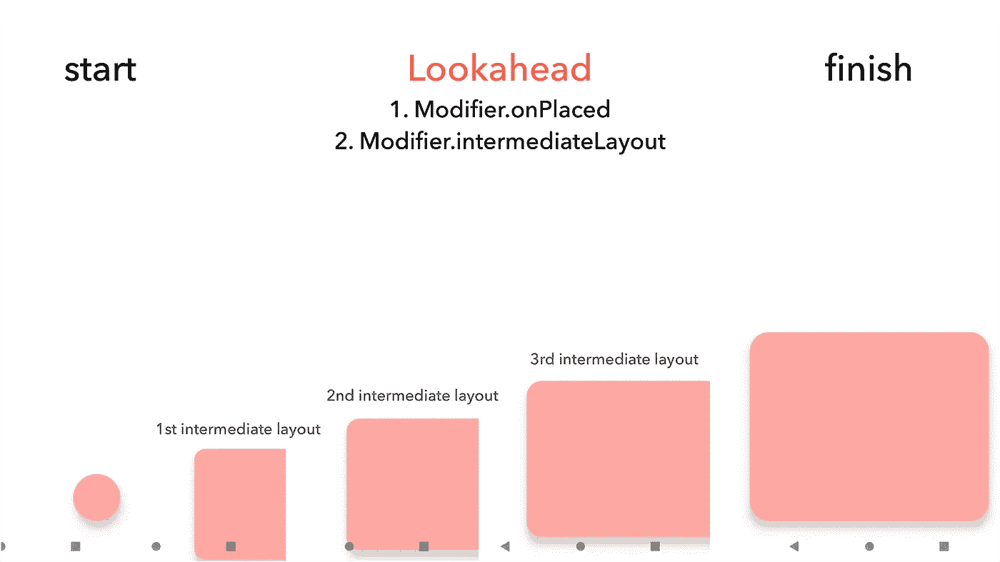
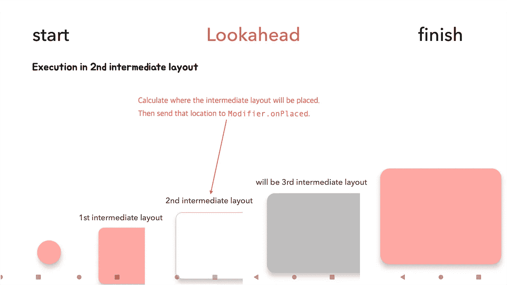
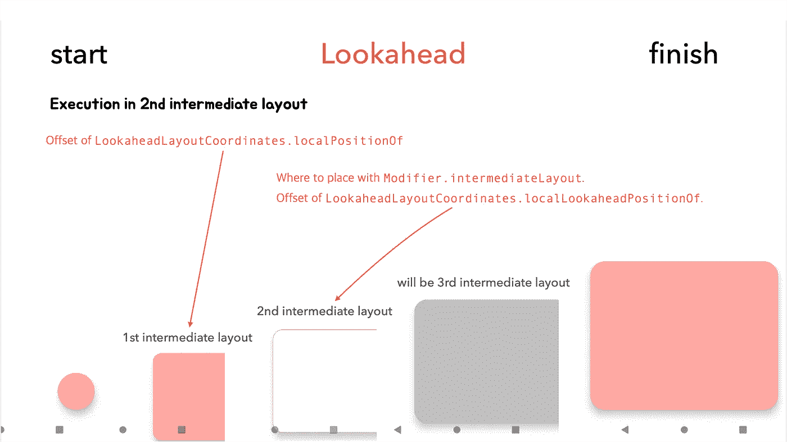
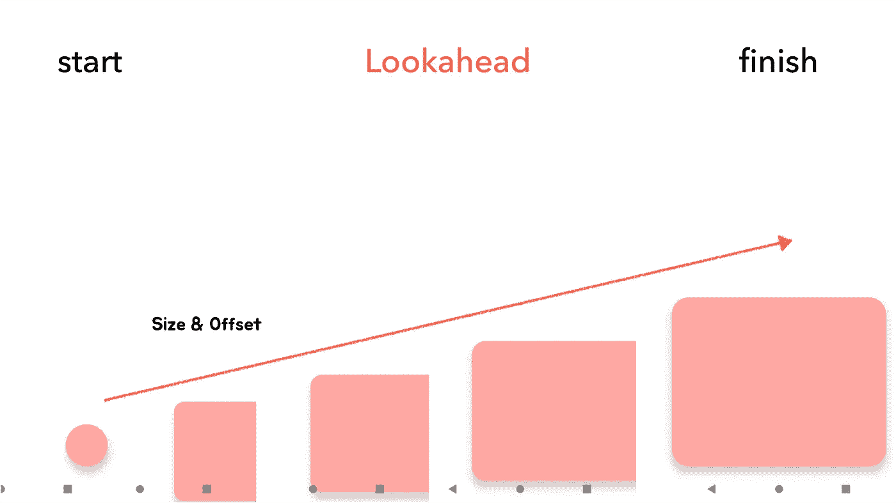
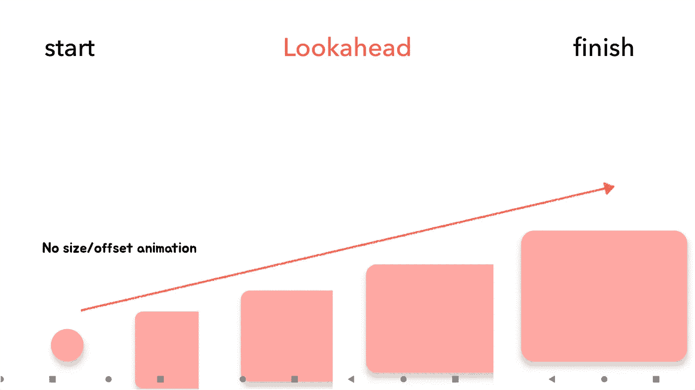

# 介绍 Jetpack Compose 的新布局:“LookaheadLayout”

> 原文：<https://betterprogramming.pub/introducing-jetpack-composes-new-layout-lookaheadlayout-eb30406f715>

## 创建最佳动画的布局


罗伯特·卡茨基在 [Unsplash](https://unsplash.com/?utm_source=medium&utm_medium=referral) 上拍摄的照片

6 月 29 日，随着 Jetpack Compose[1 . 3 . 0-alpha 01](https://developer.android.com/jetpack/androidx/releases/compose-animation#1.3.0-alpha01)的发布，一个新的布局`LookaheadLayout`被引入。为了理解`LookaheadLayout`的概念，让我们想象我们有一个如下的`ExpandableFab`。

与我们想象的相反，它并不漂亮，因为没有动画。让我们添加动画。

现在，我们想象中的`ExpandableFab`完成了。



动画，包括上面的`ExpandableFab`，按照起始帧(初始状态)、动画进行中的动画帧、结束帧(最终状态)进行绘制。

因此，要在 Compose 中实现这样的动画，看起来像是按照上面绘制动画的原理跟踪动画帧，并绘制一个适合每个帧的新的 composable。

但是，在 1.2.0 版本之前，没有任何布局可以跟踪这些动画帧。为克服这一点而出现的一种布局叫做`LookaheadLayout`。



应用 Toss 团队提供的 [Tossface](https://toss.im/tossface) (表情字体)

`LookaheadLayout`预览要在开始-结束帧之间绘制的帧，并根据预计要在该帧上绘制的信息(尺寸、位置)帮助在开始-结束帧之间绘制新的布局。



跟踪在开始-结束帧之间绘制的帧的步骤被称为前瞻步骤，并且根据在前瞻步骤中以这种方式计算绘制的信息在开始-结束之间放置的布局被称为中间布局。

前瞻阶段计算的信息可以用`Modifier.onPlaced`接收，中间布局可以通过`Modifier.intermediateLayout`实际布局。

到目前为止，我们已经了解了`LookaheadLayout`的概念。现在让我们实际使用它。

`LookaheadLayout`是处于实验阶段的 composable，它接收`LookaheadLayoutScope`作为内容的范围。

`LookaheadLayoutScope`实现`Modifier.onPlaced`和`Modifier.intermediateLayout`。

在前瞻步骤中计算放置中间布局的信息时，使用计算值作为参数调用`Modifier.onPlaced`。参数是`LookaheadLayout`使用的`LookaheadLayoutCoordinates`，这个修改器是可组合的。

调用`Modifier.onPlaced`的过程是:



其中用粉色填充的部分表示放置的内容

`LookaheadLayoutCoordinates`作为参数接收的是一个接口，它保存了前瞻阶段之前和之后的两个布局的`LayoutCoordinates`。这样，可以获得中间布局的计算偏移量和当前布局内容的偏移量。

`LookaheadLayoutCoordinates.localLookaheadPositionOf`和`LookaheadLayoutCoordinates.localPositionOf`都用于获得相对于特定坐标的转换后的偏移。唯一不同的是，与`localPositionOf`不同，`localLookaheadPositionOf`使用前瞻位置进行坐标计算。

现在我们来看看其余的`Modifier.intermediateLayout`。

可使用`Modifier.intermediateLayout`根据前瞻步骤中计算的信息放置一个中间布局。

`Modifier.onPlaced`和`Modifier.intermediateLayout`是:



其中用粉色填充的部分表示放置的内容

现在，让我们回到本文开头看到的`ExpandableFab`的帧过程来实际使用`LookaheadLayout`。



现在可以通过`LookaheadLayout`跟踪动画帧过程，并且该动画帧内的大小和偏移是变化的。我们可以使用`Modifier.onPlaced`和`Modifier.intermediateLayout`来实现。

要调整大小，通过 measure 参数变形中间布局，measure 参数是一个 lambda，它用`Modifier.imtermediateLayout`提供中间布局的大小。要调整偏移量，请根据使用`Modifier.onPlaced`计算的中间布局的偏移量来调整内容位置。

让我们先创建一个`Modifier.movement`来调整偏移量。

接下来，创建了用于调整大小的`Modifier.transformation`。

现在，为了应用以这种方式制作的修改器，现有的 Fab 用`LookaheadLayout`包裹，修改器连接。

结果是:

但是它并没有像我们希望的那样活跃起来。是因为只是放置了一个中间布局，却没有应用任何动画。所以结束的很快，看不出和之前有什么区别。



`Animatable`可用于动画处理。让我们制作大小和偏移变化的动画。

最后，它看起来是我们想要的样子。

# 结束了！

本文介绍`LookaheadLayout`。通过使用`LookaheadLayout`，你可以很容易地实现很多动画，比如共享元素过渡。

本文示例中使用的`ExpandableFab`的完整代码可以在下面的链接中找到。

*   [可扩展标签](https://gist.github.com/jisungbin/78c2eb9a183211d37243175dbdceb2b4)
*   [修改器](https://gist.github.com/jisungbin/f451771329b7d96117c93516abd0759a)

此外，随着这个 1.3.0-alpha01 的发布，Compose 开始向独立版本化系统转变。到目前为止，只有编译器是分离的，如果将 Compose 编译器版本设置为 1.3.0-alpha01，那么可以使用 Kotlin 1.7.0 版本。

感谢阅读。

```
[[View in Korean]](https://sungbin.land/jetpack-compose-%EC%9D%98-%EC%83%88%EB%A1%9C%EC%9A%B4-%EB%A0%88%EC%9D%B4%EC%95%84%EC%9B%83-lookaheadlayout-%EC%95%8C%EC%95%84%EB%B3%B4%EA%B8%B0-d4a98aac588e)
```