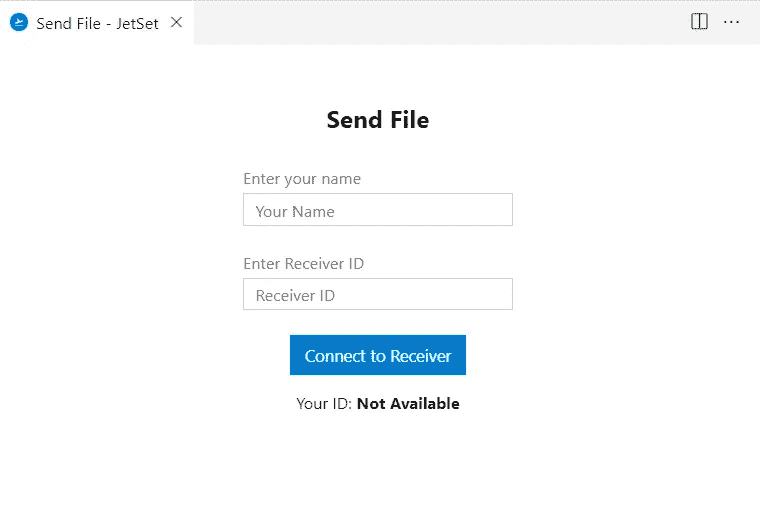
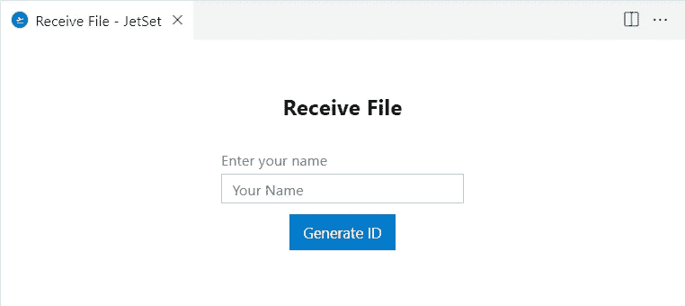
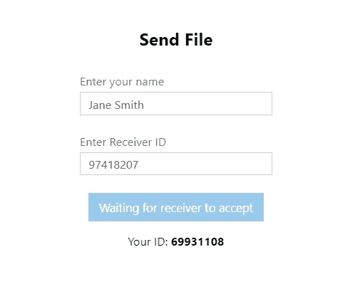
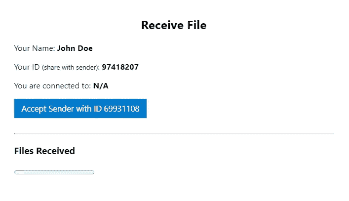
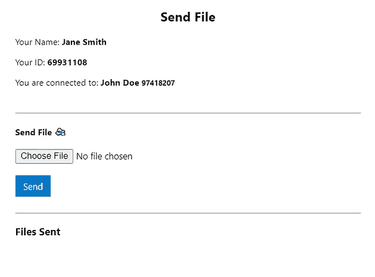
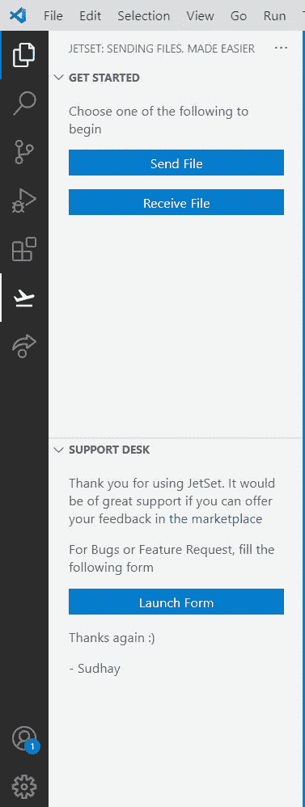
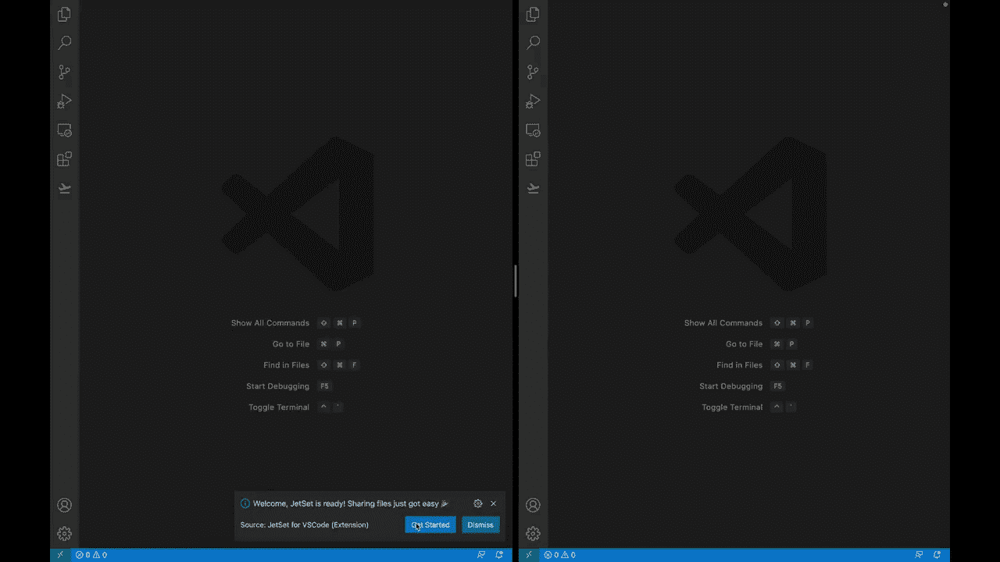

# vs code JetSet 简介——点对点文件共享扩展

> 原文：<https://betterprogramming.pub/introducing-jetset-for-vscode-a-peer-to-peer-file-sharing-extension-7da1a25676e9>

## 使用 JetSet for VSCode，从 Visual Studio 代码进行文件传输变得更加容易

照片由[穆罕默德·拉赫马尼](https://unsplash.com/@afgprogrammer?utm_source=medium&utm_medium=referral)在 [Unsplash](https://unsplash.com?utm_source=medium&utm_medium=referral) 上拍摄

开发人员就是喜欢使用 Visual Studio 代码，这要归功于它广泛的兼容性，更不用说它还保留了轻量级的特性。顶部的樱桃是扩展的力量，它增强了人们对它的喜爱。

大多数全栈开发人员通常倾向于使用`.env`文件来保护他们的敏感数据，如数据库连接字符串、散列秘密和各种其他环境变量，如果您猜对了，将它从版本控制系统(如 Git)中移除是非常必要的。但是这使得合作开发更加困难。

现在需要一个快速的解决方案来传输文件，无论敏感与否，并具有相当大的隐私。

这就是我为 VSCode 开发 [**JetSet 的原因，vs Code**](http://bit.ly/jetsetvscode)是一个首创的 Visual Studio 代码扩展，开发人员可以在 Visual Studio 代码内部相互传输文件。

VSCode 的 JetSet 在发送方和接收方之间发起对等连接，不需要预先注册。为发送方和接收方各生成一个 pin，他们可以就这样开始。

源代码文件和其他相关文件可以通过该扩展以最高的隐私和效率发送，并且该扩展与 VSCode 的深度集成确保了接收到的文件直接进入接收方当前打开的工作区，从而避免了繁琐的文件搜索过程，在该过程中，文件会在常见的目标文件夹中混淆。

作为一个附加组件，我利用 Visual Studio 代码组件来设计用户界面，使其与您选择的编辑器主题很好地融合在一起。

# 特征

简单的设置过程，并无缝集成到任何 Visual Studio 代码环境中，包括 web 版本

发送方和接收方之间的对等连接，保持隐私完整

能够发送任何格式的文件(多个文件或文件夹可以压缩成。zip 格式并发送)

在核实发送者的身份后，接收者可以自行决定批准发送者的连接请求

接收方接受发送方使用接收方 ID 发出的连接请求后的仪表板视图:

活动栏开始使用安装后的扩展

以下是如何开始使用扩展的方法:

对 VSCode 使用 JetSet 的快速演示

## **安装**

你现在可以从 [Visual Studio 市场](https://marketplace.visualstudio.com/items?itemName=Sudhay.jetset-for-vscode)试用。