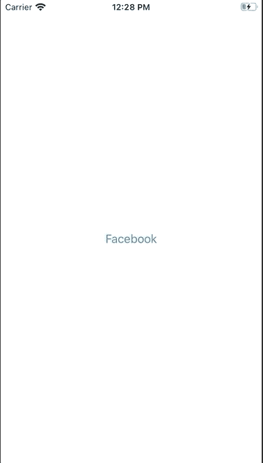
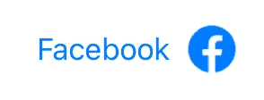

# SwiftUI 中的链接简介

> 原文：<https://betterprogramming.pub/introducing-link-in-swiftui-383076e335b8>

## 向用户展示链接的简单方法


照片由 [JJ 英](https://unsplash.com/@jjying?utm_source=unsplash&utm_medium=referral&utm_content=creditCopyText)在 [Unsplash](https://unsplash.com/s/photos/link?utm_source=unsplash&utm_medium=referral&utm_content=creditCopyText)

最近在 WWDC 2020 中引入的,`Link`是带有链接的文本。当您按下它时，您将被重定向到您在中附加的链接。

切记这只有 iOS 14 及以上版本支持，只能在 Xcode 12+中使用。

# 先决条件

要跟随本教程，您需要对 Swift 有一个基本的了解，并至少具备 Xcode 12+的一些基础知识。

# 环

`Link`的基本用法是声明它的标题和 URL，你就万事大吉了。

```
Link("Facebook", destination: URL(string: "https://www.facebook.com")!)
```

实际上，我希望它会弹出一个 WebView，但是它却退出并打开了 Safari 上的链接。



# 链接定制

定制`Link`相当容易，你可以用一些颜色甚至字体来调整它。


```
Link("Facebook", destination: URL(string: "https://www.facebook.com")!)
    .font(.largeTitle)
    .foregroundColor(.blue)
```

在文本中包含图像也是一个相当简单的过程。



```
Link(destination: URL(string: "https://www.facebook.com")!, label: {
    Text("Facebook")
    Image("facebook")
        .resizable()
        .frame(width: 30, height: 30)
})
```

如果你想要一个独立的图像，只需删除文本，你只会看到一个图像。通过点击图片，您将被重定向到该链接。

