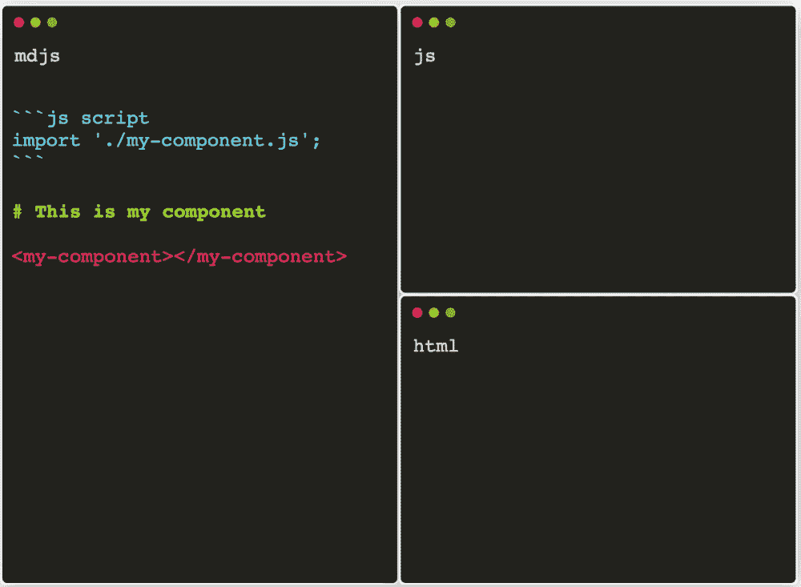
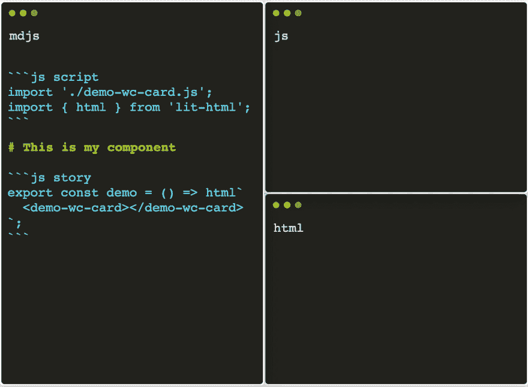
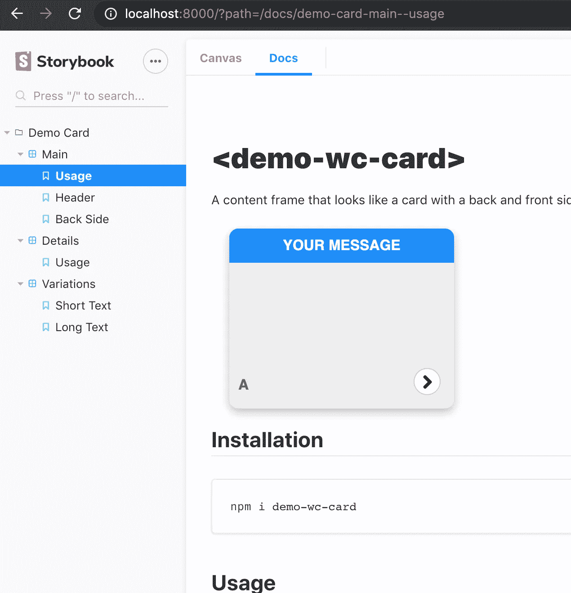
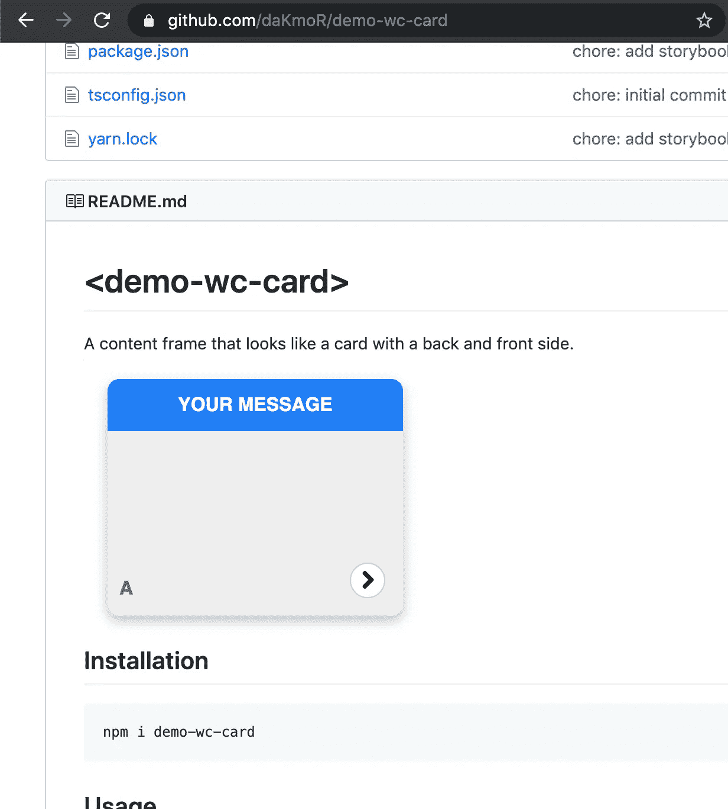
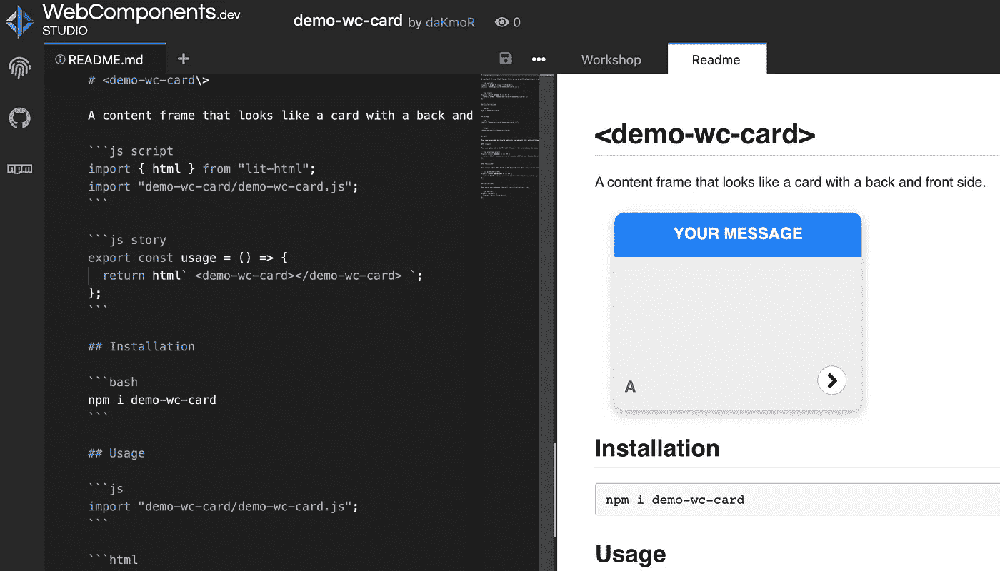
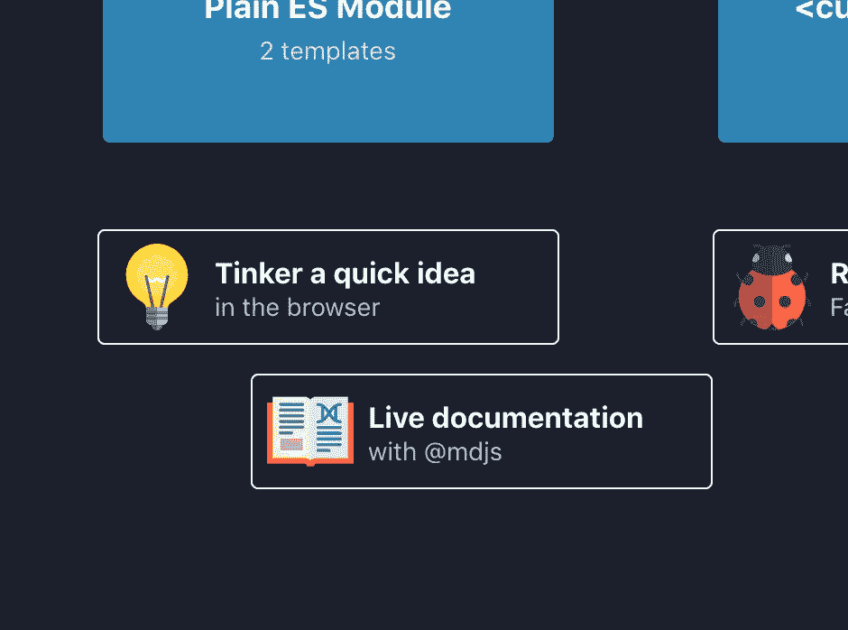

# mdj 简介

> 原文：<https://betterprogramming.pub/introducing-mdjs-6bedba3d7c6f>

## 使用 Markdown 和 JavaScript 编写交互式演示


在 [Unsplash](https://unsplash.com/s/photos/programming?utm_source=unsplash&utm_medium=referral&utm_content=creditCopyText) 上由 [Taskin Ashiq](https://unsplash.com/@taskinhoo?utm_source=unsplash&utm_medium=referral&utm_content=creditCopyText) 拍摄的照片

所有共享的代码都应该有书面的文档来显示它的用途和背后的想法。用户至少应该能够从高层次上理解他们在使用什么，他们使用它的目的是什么，以及为什么。

在网络上，我们有很多很多不同的方式来写文档。然而，他们几乎都有一个共同点，那就是他们依赖于[降价](https://en.wikipedia.org/wiki/Markdown)或它的某种变体。

这并不奇怪，因为 Markdown 几乎在任何地方都受支持(VS Code、Atom、GitHub、GitLab、Dev.to、npm 等等。)

# 不同工具的降价使用

## 对于不在浏览器中运行的工具

在这种情况下，你将主要分享人们将需要在他们自己的项目中运行的代码片段，在这种情况下，传统的静态站点生成器，如 [Docusaurus](https://docusaurus.io/) 、 [VuePress](https://vuepress.vuejs.org/) 、 [Gatsby](https://www.gatsbyjs.org/) 等，工作得很好。它们都完全支持 Markdown，并允许您轻松创建带有代码片段/突出显示的漂亮文档页面，等等。

坦率地说，如果这是你的用例，只要你对这个生态系统/框架感到满意，你需要的几乎所有东西都应该可以用这些工具来实现。

## 对于在浏览器中运行的(可视)组件

在这种情况下，用户可能希望有一个现场演示来查看组件的所有不同选项。因此，纯粹的降价通常是不够的，因为我们现在希望实际执行代码，并以某种方式将工作组件插入到文档中。这需要对每个框架进行专门的处理。

## 某视频剪辑软件

例如，对于 Vue，您可以使用 VuePress，它会自动注册某个文件夹中的所有 Vue 组件。然后你可以使用普通的 HTML 标签，因为 Markdown 支持 HTML。

```
.
└─ .vuepress
  └─ components
      ├─ demo-1.vue
```

*   支持 Vue 组件并对它们有“神奇的”导入
*   不支持通用 JavaScript 或向组件传递属性

## 反应

对于 React，您可以使用 [MDX](https://mdxjs.com/) ，它通过 JSX 支持扩展了 Markdown。MDX 可通过多种工具获得，如 [Gatsby](https://www.gatsbyjs.org/) 、 [Docz](https://www.docz.site/) 、 [Storybook](https://storybook.js.org/) 等。

*   支持导入/导出 JavaScript
*   通过 JSX 传递一切
*   在 GitHub 上看起来不太好；需要编辑器中的特殊工具来突出显示

## 限制

所有这些专用工具的共同点是它们需要特定的构建工具设置才能工作。对于 web 组件，实际上不需要这些。Markdown 已经允许 HTML。唯一缺失的部分是如何通过 JavaScript 加载 web 组件。

# JavaScript Markdown 简介(mdjs)

主要目标是:

*   最小化复杂性
*   遵循渐进增强
*   坚持使用有效的降价语法
*   在编辑器中突出显示代码，无需其他工具
*   在 GitHub/git lab/任何源代码管理工具上都好看

这个基本想法似乎太简单了，难以置信。我们用额外的元数据`js script`来增强代码栅栏块。

```
```js script
import './my-component.js';
```
# This is my component
<my-component></my-component>
```

就是这样！

好了，说够了，你可以在这里看到现场:[链接到可编辑的演示](https://webcomponents.dev/edit/aPQdZ4FtAiqJ7YXnRe2s?pm=1&sv=1)

## 它是如何工作的

mdjs 挂钩到[注释](https://remark.js.org/)并提取所有标记的`js`块。最终 HTML 和 JavaScript 是分开的。

然后，它可以被任何工具组合/处理，以创建实际的文档页面。

该过程如下所示:

1.  提取`js script`并将其从 Markdown 中分离出来。
2.  渲染降价。
3.  提供 HTML 和 JavaScript。



mdjs 脚本转换

这里有一个链接，链接到作为幻灯片的动画。

这已经足够强大，可以直接包含 JavaScript 并呈现带有属性的 web 组件。

## 使用演示格式增强 mdjs

既然我们可以在 Markdown 中执行 JavaScript，这就为更高级的特性打开了大门。

我们的第一步是创建另一个增强的 JavaScript 代码块，即`js story`。从这个代码块中，您可以导出一个按需执行的函数:

```
```js script
import './my-component.js';
```
# This is my component
```js preview-story
export const demo = () => `<my-component header="from attribute"></my-component>`
```
```

如果你想添加一个边框和一个按钮来显示/隐藏实际的源代码，你可以使用`js preview-story`。

你得到的看起来像这样:

在引擎盖下，这增加了额外的处理步骤:

1.  提取`js script`并与降价分离。
2.  抽出`js story`和`js preview-story`并与降价分离。
3.  在它的位置放一个占位符`<mdjs-story mdjs-story-name="demo"></mdjs-story>`或`mdjs-preview`。
4.  渲染降价。
5.  提供 HTML、JavaScript 和故事。

这是我们完全从 Markdown 创建完整的 JavaScrip 和演示页面所需的所有信息。

默认情况下，mdjs 通过支持一个实际的模板系统——即 [lit-html](https://lit-html.polymer-project.org/) ,更进一步。

```
```js script
import './demo-wc-card.js';
import { html } from 'lit-html';
```
# This is my component
```js story
export const demo = () => html`
  <demo-wc-card header="HEADER"></demo-wc-card>
`;
```
```



mdjs 故事转换

这里有一个链接，链接到作为幻灯片的动画。

这是另一个模仿完整文档页面的游乐场:[链接到可编辑演示](https://webcomponents.dev/edit/PqrQkg3abvFJ7vxyZuqa?pm=1&sv=1)。

## mdjs 默认文档页面

一旦所有这些元信息都可用，就可以呈现特定的文档页面。

它基本上归结为生成这段代码，这段代码将演示功能分配给实际的 web 组件:

所有这些都发生在你的引擎盖下。

# 哪里可以用 mdjs？

## 您可以通过 es-dev-server 在本地使用它

在这里，我将向您展示如何为您所有的本地 Markdown 文件创建一个类似 GitHub 的 Markdown 视图，包括现场演示。


es-dev-服务器截图

*   通过运行`npm i -D es-dev-server`将`es-dev-server`安装为依赖项。
*   将以下脚本添加到您的`package.json`中:

*   在你的回购根中创建一个`es-dev-server.config.js`。

执行完`npm run start`之后，你就可以愉快地通过[http://localhost:8000/readme . MD](http://localhost:8000/README.md)浏览你的 live 文档了。

你可以在[演示中看到一个设置示例——WC 卡回购](https://github.com/daKmoR/demo-wc-card)。

## 你可以通过故事书来使用它

如果你想在单个组件上工作或者得到所有演示的列表，你可以使用 Storybook。



故事书截图

*   安装依赖关系`npm i -D @open-wc/demoing-storybook`。
*   添加到您的`package.json`:

*   调整`.storybook/main.js`载入降价文件:

*   通过以下方式为 Storybook 中的每个降价文件添加一个名称:

就这样，你可以走了。不需要对任何文件进行额外的更改；一个插件将会通过转换你的降价文件来支持 Storybook 的 MDX 格式。

更多详细信息，请见[https://open-wc.org/demoing-storybook/](https://open-wc.org/demoing-storybook/)。

## 在 GitHub 上展示

由于 GitHub 支持现成的 Markdown，我们可以通过使用 mdjs 做得更好。



github 截图

由于 GitHub 不直接支持它，你将需要一个名为 [mdjs-viewer](https://chrome.google.com/webstore/detail/mdjs-viewer/ifkkmomkjknligelmlcnakclabgohafe) 的 Chrome 扩展。

*   您想在不打开不同页面的情况下观看演示吗？
    mdjs-viewer！
*   您想展示您遇到的问题的真实例子吗？
    mdjs-查看器！

几乎看起来像黑魔法，是吧？你所做的只是安装了一个 Chrome 扩展，GitHub 突然就有了超能力。

你所需要的只是一些带有正确代码栏的 Markdown 文件，并让你的代码在[unpkg.com](https://unpkg.com)上运行。

**它实际上是如何工作的？**

扩展检测你在哪个 GitHub 页面。如果它发现一个 Markdown 文件或 mdjs 代码的问题，那么它会添加一个 Show Demo 按钮来激活它。如果您单击该按钮，它将开始收集所有需要的信息:

*   找到最近的`package.json`。
*   阅读实际的降价文件/问题内容。
*   用`unpkg.com`导入替换所有裸导入。
*   用`unpkg.com`和它的 package.json +相对路径替换所有相对导入。
*   创建安全 iframe。
*   将 iframe absolute 定位为覆盖。
*   将 JavaScript 和 HTML 代码放在 iframe 中。
*   该按钮变成显示/隐藏 iframe 的开关。

有些任务更复杂，需要一些额外的工作来确保它的安全，但本质上就是这样。

有了它，你就可以把带有实例的文档放到 GitHub 上。甚至演示显示代码中的实际错误的问题也是可能的。

这听起来确实是一个改进文档和发行复制的好工具，不是吗？尤其是自述文件和问题内容即使没有扩展也仍然有用。

更多详细信息，请参见[https://github.com/open-wc/mdjs-viewer](https://github.com/open-wc/mdjs-viewer)。

## 受 webcomponents.dev 支持

它完全由这个令人敬畏的在线编辑器支持。



webcomponent.dev 截图

您可以在浏览器中直接编辑您的文档、演示和代码。



webcomponent.dev 截图

你可以直接从文档开始，就像上面的截图一样。更好的是，你可以在每个降价文件或`README.md`中使用它。

试一试，记录下你的组件的辉煌。

所有的演示链接都来自 [webcomponents.dev](https://webcomponents.dev/edit/collection/lsZ2eaviDNwy6pIBEDeL/tS7JYfymt6yeshma8Gn1?pm=1&sv=1) 。一定要去[看看](https://webcomponents.dev/)。

## 如何添加对 mdj 的支持

请在[https://open-wc.org/mdjs/](https://open-wc.org/mdjs/)查看官方文档页面。

# 摘要

现在你知道了——mdjs 是一种可以用多种不同方式显示的格式。这是您在任何地方都能找到好看文档的唯一来源。无论是本地出版的故事书，还是 GitHub 或 npm 上的故事书，看起来都很不错，即使没有对它的直接支持，但在可能的情况下，它会通过渐进的增强变得与演示互动。

现在出去为你的组件写好文档吧！

# 将来的

*   有一个单独的 GitHub repo(也可能是 group)
*   有专门的主页
*   默认的故事预览框应该看起来更好一点
*   支持多个渲染器—在[期](https://github.com/open-wc/open-wc/issues/1498)中讨论
*   突出显示代码片段
*   在故事中使用更多助手
*   …(请随意在相应的项目中打开问题)

# 感谢

感谢 [Pascal](https://twitter.com/passle_) 的反馈，并帮助将我的涂鸦变成一个可追随的故事。

想在 Markdown 中的介质上书写吗？试试[马克迪](https://markdium.dev/)！