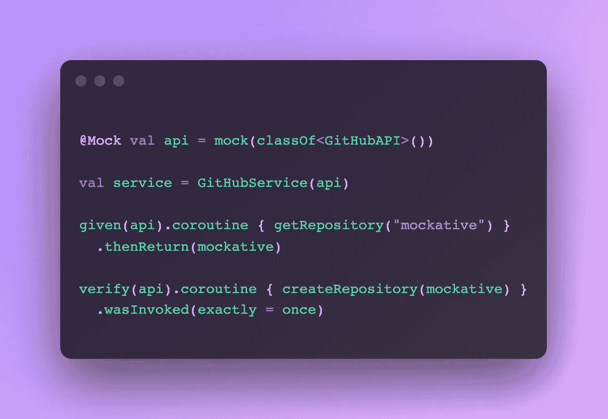

# meet mock ative——一个在 Kotlin 中模仿依赖关系的框架

> 原文：<https://betterprogramming.pub/introducing-mockative-mocking-for-kotlin-native-kotlin-multiplatform-31f5b076257b>

## 介绍 Kotlin/Native 和 Kotlin 多平台的模拟框架



作者图片

而大多数 Kotlin 的模仿框架使用运行时代理来拦截方法调用。Kotlin/Native 不支持运行时代理，因此需要不同的模拟方法。

在我的 Cardlay 团队中，我们在移动应用中使用 Kotlin Multiplatform，但非常缺乏一个模拟外部依赖的好解决方案，它不仅适用于 Android 或 JVM，也适用于使用 Kotlin/Native 的 iOS，因为我们觉得在所有支持的平台上运行测试套件非常重要，尤其是 iOS，因为 Kotlin/Native 的当前主线内存模型冻结了线程之间共享的对象。

有一天，我想了一会儿，决定接受挑战，使用 Kotlin 符号处理(KSP) API 开发一个模仿框架，通过在编译时而不是运行时生成模仿代理来克服 Kotlin/Native 的限制，从而实现对任何接口的模仿。这个新框架的名字是 [Mockative](https://github.com/mockative/mockative) ，在本文中，我将介绍如何使用它。

首先，您需要将依赖项添加到项目中。Mockative 发布为两个库:一个是名为`mockative`的运行时库，另一个是名为`mockative-processor`的符号处理器，这两个库都必须添加到您的项目的`build.gradle.kts`文件中:

```
plugins {
    id("com.google.devtools.ksp")
}kotlin {
    sourceSets {
        val commonTest by getting {
            dependencies {
                implementation("io.mockative:mockative:1.1.2")
            }
        }
    }
}

dependencies {
    ksp("io.mockative:mockative-processor:1.1.2")
}
```

一旦添加到您的项目中，使用 mock 进行测试就变得轻而易举，因为您可能已经习惯了流行的 mock 框架，如 Mockito 和 mock。要在测试中模拟一个依赖项，您所要做的就是:

```
class GitHubServiceTests {
    @Mock val api = mock(classOf<GitHubAPI>())
}
```

mockative 将负责为`GitHubAPI`接口生成一个 Mock，并将它的一个新实例分配给用 Mock 注释标注的属性。

# 嘲笑会员

模仿模仿既可以用于存根，也可以用于验证调用。要在类型上存根一个成员，只需使用`given(mock)`函数:

```
class GitHubServiceTests {
    @Mock val api = mock(classOf<GitHubAPI>()) val service = GitHubService(api) @Test fun givenRepositoryExists_thenRepositoryIsReturend() {
        // given
        val id = "mockative/mockative" 

        val repository = Repository(
            id = "mockative/mockative",
            name = "Mockative"
        ) given(api).invocation { getRepository(id) }
            .thenReturn(repository) // when
        val actual = service.getRepository(id) // then
        assertEquals(repository, actual)
    }
}
```

*given* builder 支持多种不同的方法来存根函数和属性，你可以在 [Mockative](https://github.com/mockative/mockative) 的 GitHub 页面上了解更多。

# 验证模拟调用

Mockative 还支持通过使用`verify(mock)`函数来验证对 mocks 的调用:

```
class GitHubServiceTests {
    @Mock val api = configure(mock(classOf<GitHubAPI>())) {
        // Enables the experimental feature where functions
        // returning Unit don't have to be explicitly stubbed.
        stubsUnitByDefault = true
    } val service = GitHubService(api) @Test fun repositoryIsCreated() {
        // given
        val repository = Repository(
            id = "mockative/mockative",
            name = "Mockative"
        ) // when
        service.createRepository(repository) // then
        verify(api).invocation { createRepository(repository) }
            .wasInvoked(exactly = once)
    }
}
```

# 最后的话

Mockative 旨在成为一个不折不扣的解决方案，用于模仿 Kotlin/Native 和 Kotlin 多平台中的依赖关系。使其区别于竞争对手的是其简洁的 API 和跨多线程工作的事实，例如当使用协程时。它既支持本文中展示的基于表达式的存根和验证，也支持基于匹配器的存根和验证。

这篇文章旨在对这个框架做一个简短的介绍，所以如果你想了解更多，通读一下文档并尝试一下 [Mockative](https://github.com/mockative/mockative) 。