# 介绍 Nyckel API:一个用于分类的无代码机器学习工具

> 原文：<https://betterprogramming.pub/introducing-nyckel-api-a-no-code-machine-learning-tool-for-classification-1df96099cc0a>

## 使用 Nyckel API 进行简单的文本和图像分类

[附身摄影](https://unsplash.com/@possessedphotography?utm_source=medium&utm_medium=referral)在 [Unsplash](https://unsplash.com?utm_source=medium&utm_medium=referral) 上拍照

[Nyckel](http://www.nyckel.com) 提供了一个机器学习平台来训练你的数据模型。如果你是图像/文本分类的新手，或者只是想快速教会你的模型，那么这个工具将会派上用场。当您对结果满意时，您可以通过 Nyckel 的 API 从应用程序中直接调用您的函数。

在本文中，我将介绍 Nyckel 的主要特性。通过创建示例项目，您将学习如何对图像和文本进行分类。

我们开始吧！

# Nyckel 概述

Nyckel 对个人项目是免费的——你每月可以获得 500MB 的数据和 100 次调用。如果您需要高级计划，请查看[定价](https://www.nyckel.com/)页面。

**目前支持的功能:**

*   图像分类(例如动物、汽车模型分类等。)
*   文本分类(例如垃圾邮件检测)

**训练模型的 2 种方式:**

*   通过用户界面控制台
*   如果你是 API 的粉丝，通过 API

# 图像分类功能

让我们创建第一个函数来对图像进行分类。对于这个例子，我准备了不同种类的化妆品图片。假设您正在构建一个化妆网站，您希望对图片进行分类以组织您的网站。

我们将通过 UI 控制台训练模型。

1.  首先，你需要注册一个免费账户。

2.接下来，创建一个类型为 **Image** 的新函数:

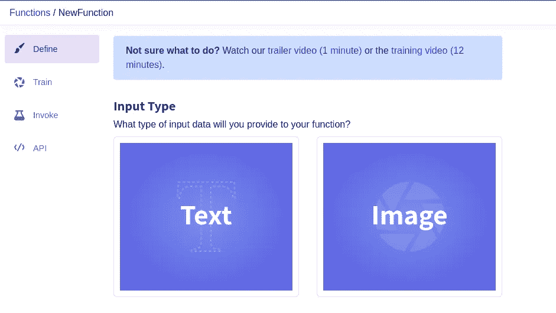

创建新的图像功能

3.创建一些标签来对数据进行分类:

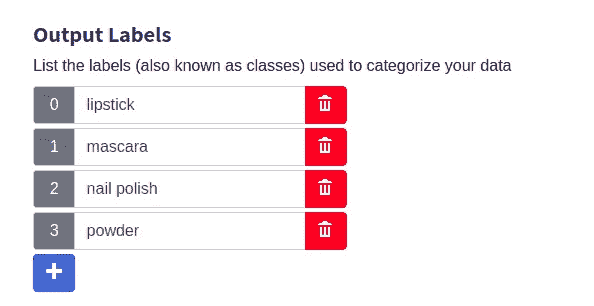

化妆品标签

4.点击**创建功能**按钮**。**

您也可以将默认名称更改为有意义的名称。例如，**化妆品分类器**。

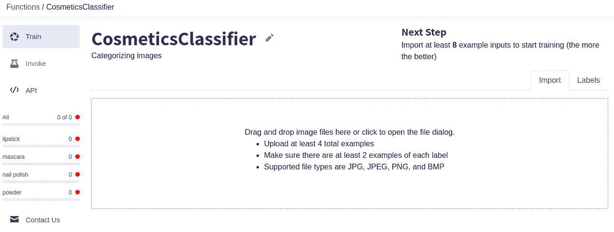

自定义图像功能

5.让我们导入一些数据。您提供的数据越多，模型就越精确。

上传图像时，您可以添加标签对其进行分类:

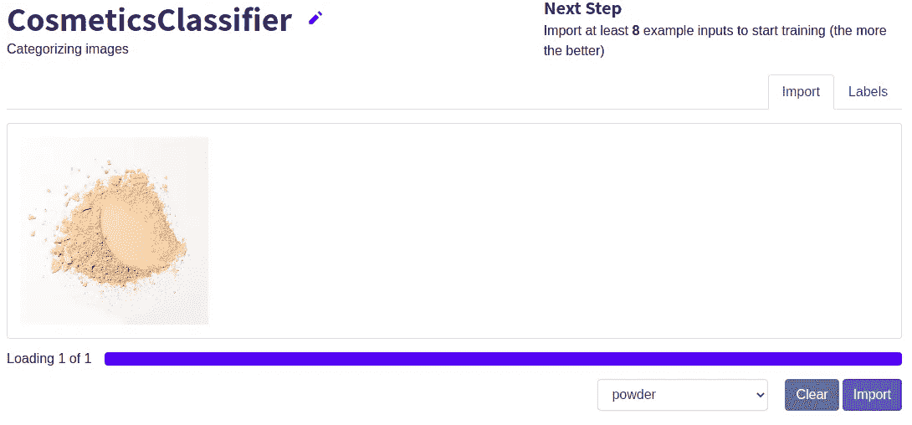

给扑面粉图像加标签

我导入了这样的图像:

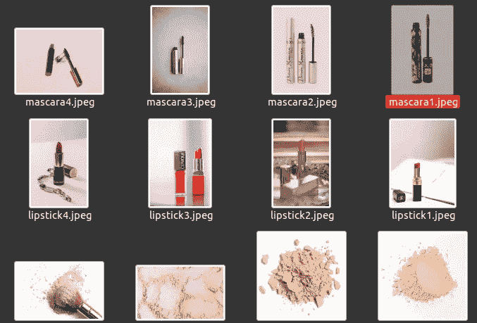

来自 unsplash.com 的化妆图片

在导入了所有照片并添加了预期的标签后，您应该会看到模型已经训练好了。这将需要一些时间，具体取决于数据的大小。

6.让我们测试一下功能。点击**调用**按钮，上传数据集中不存在的新图像:

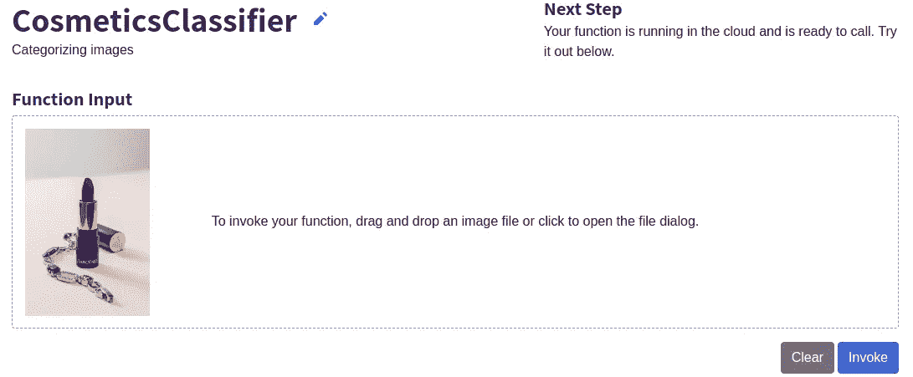

调用该函数后，我收到了以下结果:

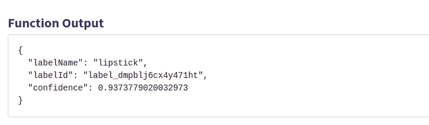

这是准确的！

这是一个包含更多图像的演示:

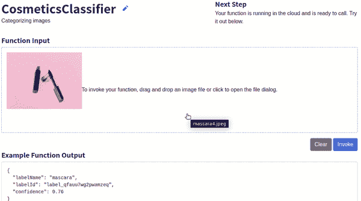

用新图像测试图像分类器功能

太好了，评价没错！

您可以在**训练**部分修改和排序您的结果:

修改已训练的数据分类

您还可以纠正错误分类的图像。Nyckel 会自动重新训练你的模型。

要提高功能的准确性，请查看[改进提示](https://www.nyckel.com/docs/improve-function)。

# 文本分类功能

现在，让我们创建一个文本分类函数来确定一首诗的创作时期。

遵循与图像分类相同的步骤。只需选择**文本**作为类型。

我已经从 Kaggle 下载了一个公开的数据集。它包含两个年龄类别— *文艺复兴*和*现代*。数据集如下所示:

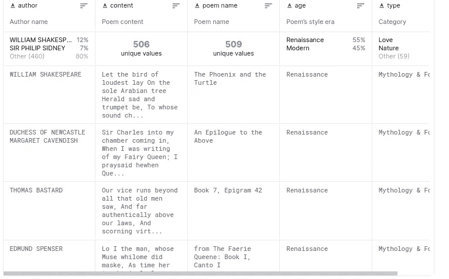

分类诗歌数据集

导入后，您必须选择**输入**和**输出**列。在我们的例子中，*诗歌内容*列是我们的输入，而*诗歌风格年龄*作为预期的输出:

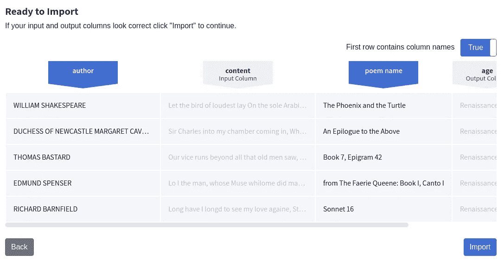

等待培训结束。

让我们调用这个函数，用数据集中不存在的一首诗来试一试。例如，*加拿大人*来自*艾弗·格尼*(1890–1937):

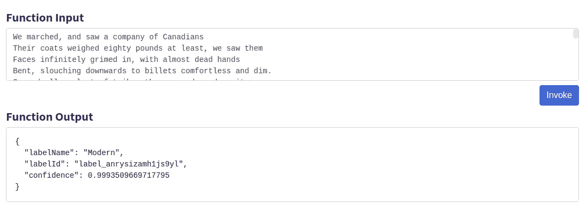

艾弗·格尼的《加拿大人》

果然类别是*现代*。

这次，让我们试试威廉·莎士比亚的第 117 首十四行诗:

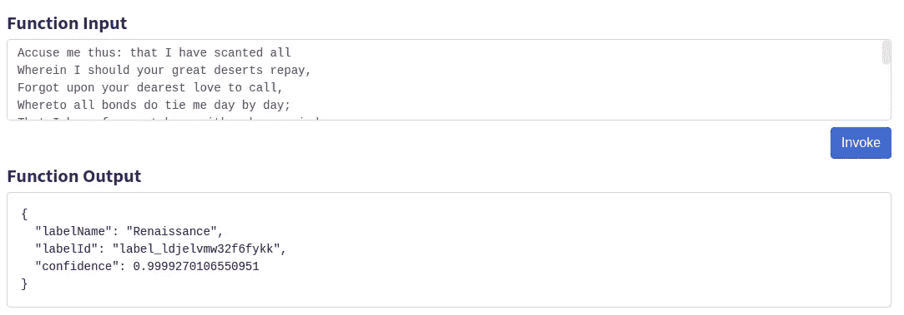

威廉·莎士比亚十四行诗集 117

太好了，它认出了这首诗的风格年代是*文艺复兴*！

# 结论

在本文中，您熟悉了 Nyckel 的 ML 培训平台。现在你知道如何通过几个简单的步骤对图像和文本进行分类。

如果您想将这些功能与您的应用程序集成，请查看[文档](https://www.nyckel.com/docs/api-quickstart)以了解如何设置 API。

我希望你已经从这篇文章中受益。

如果您对类似的数据科学主题感兴趣，您可能会喜欢我的另一篇相关文章:

 [## 如何在数据科学项目中使用 Tagtog

### 一个简单但功能强大的文本注释工具

better 编程. pub](/how-to-use-tagtog-for-your-data-science-projects-dcdb9dddf442) 

感谢您的阅读，并快乐分类！