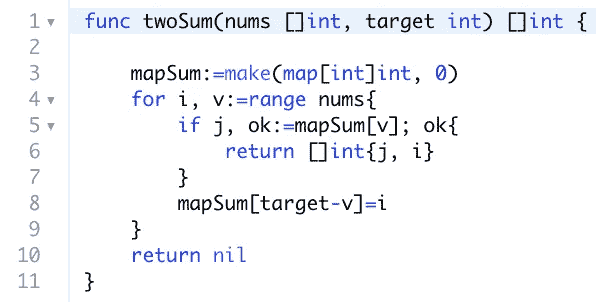
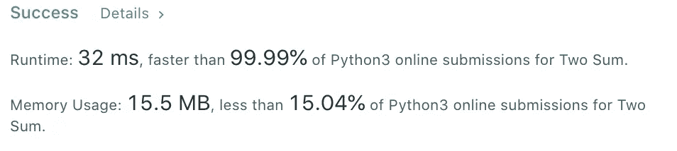
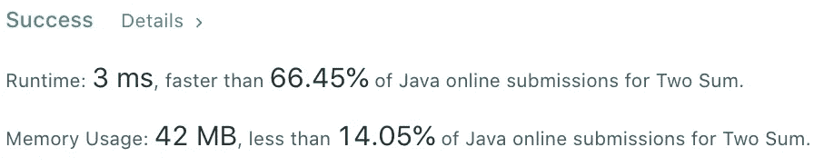
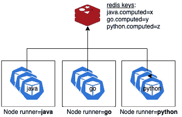

# Rainbow 简介:比较不同编程语言的性能

> 原文：<https://betterprogramming.pub/introducing-rainbow-compare-the-performance-of-different-programming-languages-f08a67453cd4>

## 速度就是一切

设计者[贝利·K](http://www.baileykass.com/)

最近，我在找工作。对于一名软件工程师来说，这意味着回顾算法并决定面试时重点关注哪种编程语言。我用一个叫做 [LeetCode](https://leetcode.com/) 的平台来练习我生疏的编码技能。

LeetCode 是如何工作的？对于每个问题，它允许你编码一个解决方案并提交它。然后针对一组测试用例运行它，以验证实现是正确的。它还提供了一些关于运行时和内存的信息，以及您的解决方案与其他解决方案的比较。这些是非常流行的指标，许多用户在 LeetCode 讨论中提到了他们算法的统计数据。

*“Python 易解，速度击败 99.32%，内存击败 99.78%。”*

如果您碰巧用不同的语言解决了这些练习，您可能会对一些输出感到惊讶。

我们来做一个通俗的练习:[二和](https://leetcode.com/problems/two-sum/)。使用哈希表可以有效地解决这个问题。这是一个有效的解决方案。

使用 Go 的两和解

现在让我们提交这个解决方案。

使用 Go 的两和输出

听起来很快！让我们用 Python3 编写一个类似的实现并提交它:

有点慢，但在某种程度上是意料之中的，因为 Python 是一种解释型语言。

接下来让我们试试 Java:

使用 Java 的两和输出

OMG！Java 好快啊！

让我们回顾一下结果:

总结一下:

*   Java 比 Go 快 7 倍，比 Python 快 10 倍。
*   Java 使用的内存比 Python 多 3 倍，比 Go 多 6 倍。

Java 真的有那么快吗？原始结果可能有点令人惊讶，不是吗？我们正在进入一个有趣的领域:编程语言之间的表现如何？

让我们后退一步。假设您有一个 PaaS 来计算两个和，并且您每年在云计算上花费数百万，并且您在 Python 上运行您的服务。这是否意味着，如果您改用 Java，您的账单将减少 10 倍？存储或网络之类的东西是一样的，但你可以节省计算成本(AWS EC2、GCE、Azure VM)。如果您尝试不同的语言来满足您的计算需求，您也许能够做出一个选择来显著降低您的 VM 成本。

但是你如何收集数据来做决定呢？

# 编程语言和容器

比较编程语言的性能并不是什么新鲜事。但是通常的做法是不使用 Docker 容器，以免因容器化而影响结果。

但是，如果一种语言在容器中运行时异常快速和健壮，但又缓慢和不可靠，该怎么办呢？如果目标基础设施是 Kubernetes 呢？

在容器中运行应用程序时，有许多参数会影响性能:

*   **启动时间**:副本的数量可以根据流量进行增减调整。如果集装箱启动缓慢，将会影响吞吐量。
*   **镜像大小**:对于每个版本，一个新节点至少需要下载一次镜像。下载图像的时间并不花费在处理请求上。
*   **弹性**:如果一个容器崩溃了，需要创建一个新的来替换它。
*   **CPU/内存占用**:容器越轻，在同一个节点上执行的可能性就越大。
*   **语言类型**:编译型或解释型。运行机器代码比一行一行地运行程序要快。

这个列表并不详尽，这使得评估容器中编程语言的性能成为一个很难回答的问题。

# **介绍彩虹**

如果容器化应用程序的每个特征都由一种颜色定义，那么 [rainbow](https://github.com/RemyDeWolf/rainbow) 的思想就是查看整个光谱，并且只比较输出。rainbow 是一个可扩展的框架，用于测试和比较运行在容器上的类似实现。这些实现可以用不同的语言编写。rainbow 在类似的基础设施上运行容器，并且只关注吞吐量。

[rainbow](https://github.com/RemyDeWolf/rainbow) 是一个在 MIT 许可下托管在 GitHub 上的开源项目。

# 彩虹是如何工作的？

这个想法很简单。对于每种语言，都有一个主类来调用函数进行无限循环测试。设置批处理大小 X，并且在每次调用 X 时，Redis 计数器增加 X，以跟踪每种语言完成的计算次数。

每个映像都部署在相似的节点(相同的虚拟机类型)上，并且可以运行所需数量的副本，以最大化吞吐量。

图片来源:作者

这种架构提供了一个公平的基础，并奖励了一种可以最大化容器化属性的语言。

有关测试方法的更多信息，请查看项目的自述文件。

# 假设

让我们回过头来看看我们用于两个和的三种编程语言。

*   Java:这是 LeetCode 上最快的语言。因为需要 Java 虚拟机(JVM)，Docker 镜像应该更大。这可能会影响性能。
*   **Go** :这种语言产生二进制可执行文件，所以我们可以最小化 Docker 镜像。轻量级可能会缩小与 Java 的差距。
*   **Python**:Docker 中的 Python 是出了名的大。默认映像使用 Linux buster (Debian)。此外，它是一种解释型语言，因此很可能在竞争中表现不佳。其他的都是惊喜。

# 在彩虹中实现两个和

既然我们想测试两和算法的性能，我们如何编写一个程序来最大化执行该计算的运行时间呢？

让我们保持简单:

1.  完全按照 LeetCode 中的定义实现 two-sum 函数。
2.  用相同的测试用例为每种语言调用这个函数。我们可以重用 LeetCode 使用的最复杂的测试用例之一。

参见[围棋](https://github.com/RemyDeWolf/rainbow/blob/master/base/go/twosum.go)、 [Python](https://github.com/RemyDeWolf/rainbow/blob/master/base/python/twosum.py) 、 [Java](https://github.com/RemyDeWolf/rainbow/blob/master/base/java/src/main/java/compute/twosum.java) 的二和代码。

# 构建 Docker 图像

现在我们有了源代码，让我们将它们打包到 Docker 映像中并构建它们。让我们花点时间看看生成的图像。

*   **Go 映像:4.49 MB** 由于 Go 会生成一个二进制文件，所以我们可以使用多阶段构建将该二进制文件复制到 alpine 映像中。(参见[文档文件](https://github.com/RemyDeWolf/rainbow/blob/master/base/go/Dockerfile))
*   **Java 镜像:64.6 MB** 在 Alpine 上安装 JDK 需要 61 MB。(参见[文档文件](https://github.com/RemyDeWolf/rainbow/blob/master/base/java/Dockerfile))
*   **Python 镜像:325.04 MB** 默认的 Python 基础镜像是 320 MB。有一张阿尔卑斯山的图片，但不推荐，因为它会导致[怪异的生产缺陷](https://pythonspeed.com/articles/base-image-python-docker-images/)。(参见 [Dockerfile](https://github.com/RemyDeWolf/rainbow/blob/master/base/python/Dockerfile)

# Kubernetes 的基准测试

现在我们有了 Docker 映像，我们可以将它们部署到 Kubernetes 集群中。为了简单和负担得起，我们将使用 Google Kubernetes 引擎(GKE)并使用相同的机器类型创建三个节点:e2-standard-2 (2xCPU，8GB)。每个 pod 被分配给一个节点(使用节点标签)。

让我们尝试工作人员/副本的多种组合，对每种组合运行基准测试 10 分钟。 *Count* 是两和方法被调用的次数。

一些评论:

*   这显然是一个 CPU 密集型操作。内存不影响整体吞吐量。
*   Python 受到 [Python 全局解释器锁的限制，该锁防止容器使用超过 1 个 CPU](https://realpython.com/python-gil/) 。不幸的是，当在两个副本上运行时，它使用了更多的 CPU，但是吞吐量并没有提高。
*   Go 在使用 workers 时效果最好。这可能是因为 Goroutines(轻量级线程)的开销较低。
*   使用两个副本时，Java 的性能稍好。

# 与 LeetCode 结果比较

在 LeetCode 上运行时，Java 性能似乎有点膨胀，但总体而言，趋势得到了验证。对于 two-sum 这样的计算，Java 大大优于 Go 和 Python。我们可以注意到，Go 缩小了与 Java 的差距，可能是因为 Docker 映像更轻，以及 Goroutines 的使用。

# Java 真的有那么快吗？

没那么…快。正如我们在这个练习中看到的，Go 的内存占用比 Java 低得多。如果内存是限制因素，我们将能够在同一个节点上运行更多的 Go 容器，并有可能超越 Java。根据计算机语言基准游戏的[，最快的语言通常是 C++和 Rust。](https://benchmarksgame-team.pages.debian.net/benchmarksgame/index.html)

使用 rainbow，我运行了一些基准测试，在 Hashtable、File IO、Sort 和 N-square 等通用实现上比较了几种语言(Go、Java、Python、Ruby、Rust ),得到了各种结果。Rust 和 Java 表现非常好。围棋下得不错，但也有一些弱点。编译语言每次都胜过解释语言。所有的结果都可以在[的自述](https://github.com/RemyDeWolf/rainbow#implementations)中看到。

这个框架是可扩展的。如果您有一个特定的实现，并且想要比较不同语言的性能，请随意实现 compute 函数，并从中获得乐趣。参见此处的[说明](https://github.com/RemyDeWolf/rainbow#how-to-add-an-implementation)。

进一步阅读:

 [## 雷米德沃尔夫/彩虹

### 比较不同编程语言的性能。你如何比较编程语言的效率，当…

github.com](https://github.com/RemyDeWolf/rainbow)  [## 哪种编程语言最快？

### 现实一点很重要:大多数人大多数时候并不关心程序性能。通过检测…

benchmarksgame-team.pages.debian.net](https://benchmarksgame-team.pages.debian.net/benchmarksgame/index.html)