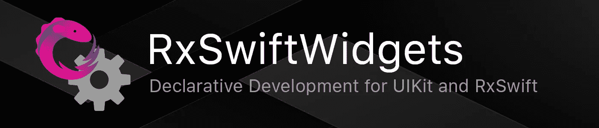
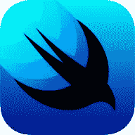
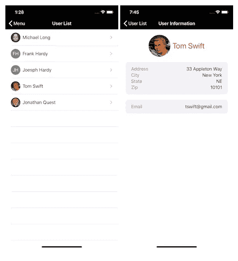

# RxSwiftWidgets:ui kit 的声明式开发

> 原文：<https://betterprogramming.pub/introducing-rxswiftwidgets-f7a81bc54fe1>

## 当您现在就可以在应用中获得声明式开发的好处时，为什么还要等待 SwiftUI 呢？



RxSwiftWidgets 允许您使用类似于 SwiftUI 和 Flutter 使用的简单声明格式来定义基于 UIKit 的用户界面。RxSwiftWidgets 也是基于 RxSwift 的，这意味着您拥有这种结合所期望的所有反应式数据绑定、用户界面控制和功能。

使用 RxSwiftWidgets，在构建器模式中使用*小部件*和*修饰符*来组合和描述接口。

```
LabelWidget($title)
   .color(.red)
   .font(.title1)
```

呈现时，给定类型的每个小部件构建一个相应的 UIView，然后根据需要用所需的属性和行为对其进行修改。

只需组合几个小部件，您就可以快速轻松地实现一些动态用户界面:


使用 RxSwiftWidgets 的声明式编程消除了对界面构建器故事板、Segues、nib 甚至自定义 UIViewControllers 的需要。当然，所有这些东西都还在，等待着真正需要定制功能的时候。

像 SwiftUI 一样，RxSwiftWidgets 背后的目标是消除创建和开发用户界面背后的许多麻烦。

但与 SwiftUI 不同的是，使用 RxSwiftWidgets，您还可以在任何时间点深入底层，直接处理生成的视图和界面元素，并根据您的需要调整它们。

[RxSwiftWidgets 在 GitHub](https://github.com/hmlongco/RxSwiftWidgets) 上有售。

# 为什么选择 RxSwiftWidgets？



## 为什么不是 SwiftUI？

SwiftUI 和 Combine 即将推出，为什么还要使用 RxSwiftWidgets 和 RxSwift？答案就在问题本身中:“SwiftUI 和 Combine 即将问世…”

SwiftUI 即将推出，但尚未发布。联合收割机也是如此。

也许更确切地说，SwiftUI 和 Combine 都至少需要 iOS 13。不支持 iOS 12 或 iOS 11。

没有太多的开发者可以在他们的应用程序中放弃对早期版本 iOS 的支持，而只使用 iOS 13。这反过来意味着，我们大多数人在接下来的几年**内看不到进行声明式、反应式编程的任何好处。**

**这实在是太长了，这也是我决定让开发社区能够访问 RxSwiftWidgets 的原因之一。**

**请注意，我在我的文章 [SwiftUI 和 UIStackView 问题](https://medium.com/better-programming/swiftui-and-the-uistackview-problem-34381ffaa71f)中对此进行了更深入的探讨。**

## **cwl 视图**

**还有一些其他的声明性框架，其中最著名的是马特·加拉格尔的 [CwlViews](https://www.cocoawithlove.com/blog/introducing-cwlviews.html) 。**

**虽然 CwlViews 有一些很酷很有趣的特性，但是它最大的缺点在于它的反应式框架的实现。我坚信 RxSwift，也许更重要的是，RxSwift 拥有大量忠实的用户，以及大量关于它的可用资源、书籍和文章。**

**我想要声明式开发，我想要我的 RxSwift。我能说什么呢？我很贪婪。**

## **颤动，自然反应，等等。**

**还有其他“跨平台”框架，但我本质上是一名 iOS Swift 开发人员。用 Dart 或者 JavaScript 做 iOS 开发，目前根本引不起我的兴趣。**

**本文的其余部分是对核心概念的简要解释和足够的示例代码，让您对在 RxSwiftWidgets 中设计声明性接口有所了解。**

**如前所述，如果您想查看项目并运行以下示例，可以在 GitHub 上找到 [RxSwiftWidgets。](https://github.com/hmlongco/RxSwiftWidgets)**

**足够的序言…让我们开始吧！**

# **RxSwiftWidgets**

**在 RxSwiftWidgets 中，屏幕由 Widgets 组成，widgets 由 widgets 组成…**

**让我们来看一个在 RxSwiftWidgets 中实现的简单表格视图，它链接到一个细节视图。您知道，您的基本主列表或详细视图场景。**

****

## **示例代码**

**让我们浏览一下生成上面显示的数据驱动用户列表所需的*表视图*代码。**

```
struct UserListWidget: WidgetView { var viewModel = UserListViewModel() func widget(_ context: WidgetContext) -> Widget {          
        TableWidget([
            DynamicTableSectionWidget(viewModel.$users) {
                TableCellWidget(
                    HStackWidget([
                        UserPhotoWidget(
                            initials: $0.initials, 
                            size: 35
                        ),
                        LabelWidget($0.name)
                    ])
                    )
                    .accessoryType(.disclosureIndicator)
                }
                .onSelect { (context, path, user) in
                    let details = UserDetailsWidget(user: user) 
                    context.navigator?.push(widget: details)
                    let table = context.tableView
                    table?.deselectRow(at: path, animated: true)
                }
            ])
            .onRefresh(initialRefresh: true, handler: { _ in
                self.viewModel.reload()
            })
            .navigationBar(title: "User List", hidden: false)
            .safeArea(false)
    }
}
```

**我们的`UserListWidget`是一个`WidgetView`，它的工作是返回一个小部件容器，该容器定义了视图的接口。**

```
struct UserListWidget: WidgetView {
    func widget(_ context: WidgetContext) -> Widget {          
        ...
    }
}
```

**`WidgetView` s 可以代表整个屏幕，如下图所示；或者它们可以用来渲染屏幕的一部分，如下面的`UserPhotoWidget`所示。**

**几乎我们使用 RxSwiftWidgets 在应用程序中创建的每个屏幕和自定义视图都将是某种形式的`WidgetView`。**

## **WidgetContext**

**您会注意到 widget 函数是用`WidgetContext`调用的。上下文是在构建小部件时提供给它们的，它包含关于视图层次结构的当前状态的信息，以及对当前视图控制器、当前视图和父视图的引用。**

**它们还提供对系统服务(如导航器)、主题、样式信息和其他属性的访问。您还可以将自己的信息或对象添加到当前上下文中，该信息将对该小部件的任何子部件可见。**

**最后，每个上下文都包含一个 RxSwift `DisposeBag`,用于管理该小部件或其子部件所做的任何订阅或绑定。**

## **表格小部件**

**继续，你会注意到我们的 WidgetView 的`widget`函数返回了一个`TableWidget`，正如你从名字中所料，它将最终生成我们的`UITableView`。**

```
TableWidget([ … ])
```

**`TableWidget`反过来，可以包含多个静态和动态部分小部件。这里我们只有一个传入小部件初始化器的数组，一个`DynamicTableSectionWidget`。**

## **DynamicTableSectionWidget**

**动态表格部分只是:d *动态*。在我们的视图模型中，这个小部件被绑定到一个基于 RxSwift 的可观察用户数组。**

```
DynamicTableSectionWidget(viewModel.$users) { … }
```

**每当 RxSwift observable 发送一个包含新用户数组的事件时，都会动态地重新生成表行，列表中的每个用户对应一行。根据需要调用尾随闭包，将每个用户映射到用于显示该用户信息的小部件(或多个小部件)。**

**闭包基本上回答了这个问题:我们如何显示这个用户？**

## **TableCellWidget**

**在这种情况下，返回的小部件是一个简单的`TableCellWidget`，它在`HStackWidget`中显示用户的照片和姓名。**

```
TableCellWidget(
    HStackWidget([
         UserPhotoWidget(initials: $0.initials, size: 35),
         LabelWidget($0.name)
         ])
    )
    .accessoryType(.disclosureIndicator)
```

**请注意，虽然您可以在 RxSwiftWidgets 中使用标准的基于文本的表格单元格，但是这些单元格的内容也是使用小部件定义和构建的！**

## **容器**

**上面显示的`TableWidget`、`TableCellWidget`和`HStackWidget`都是*容器*小部件的例子。`TableCellWidget` 包装单个小部件，而`TableWidget` 和`HStackWidget`包装小部件数组。**

**另一方面，`LabelWidget`直接产生单个`UILabel`。**

**容器是 RxSwiftWidgets 背后的基本架构构建块。**

## **修饰语**

**小部件的属性和行为可以使用小部件修改器来设置和修改。这里，我们的动态部分小部件有一个`onSelect`修饰符，每当用户点击一个单元格时就会调用这个修饰符。**

```
.onSelect { (context, path, user) in
    let details = UserDetailsWidget(user: user) 
    context.navigator?.push(widget: details)
    let table = context.tableView
    table?.deselectRow(at: path, animated: true)
}
```

**如图所示，它使用一个`navigatior`实例来构造一个新的`UserDetailsWidget`并将其推送到导航堆栈上。**

**`TableWidget`本身有一个`onRefresh`修改器。**

```
.onRefresh(initialRefresh: true, handler: { _ in
    self.viewModel.reload()
})
```

**在这里，当最初创建视图时，以及每当用户执行拉式刷新时，我们都会重新加载数据。像 RxSwiftWidgets 中的许多东西一样，只需使用修饰符就可以自动嵌入并启用拉至刷新功能。**

**除了通知约束系统我们希望表格视图填满整个屏幕并忽略安全区域之外，表格小部件还有一些控制导航栏标题和外观的修饰符。**

```
.navigationBar(title: “User List”, hidden: false)
.safeArea(false)
```

**与 SwiftUI 一样，修改者可以直接修改他们所附加的小部件的属性(即字体、颜色、安全区域)，或者他们可以修改和/或观察当前状态。**

## **完成的**

**就是这样。返回并再次查看完整的代码示例，您将看到定义用户表视图所需的所有代码(不包括视图模型中的数据加载代码)。您没有手动创建和配置一个`UITableViewController`。没有代表。没有数据源。没有故事板。**

**一个完整的表格视图，包含导航、自定义表格视图单元格、动态数据和拉式刷新，大约 30 行代码。感兴趣吗？**

# **想要更多细节？**

**为了更好的测量，这里是`UserDetailsWidget` 屏幕的代码。**

```
struct UserDetailsWidget: WidgetView { var user: User func widget(_ context: WidgetContext) -> Widget {
        ScrollWidget(
            VStackWidget([
                ContainerWidget(
                    HStackWidget([
                        UserPhotoWidget(
                           initials: user.initials, 
                           size: 80
                        ),
                        LabelWidget(user.name)
                            .font(.title1)
                            .color(.red)
                        ])
                        .position(.centerHorizontally)
                    ), 
                DetailsSectionWidget(widgets: [
                    DetailsNameValueWidget(
                        name: "Address", 
                        value: user.address
                    ),
                    DetailsNameValueWidget(
                        name: "City",
                        value: user.city
                    ),
                    DetailsNameValueWidget(
                        name: "State", 
                        value: user.state
                    ),
                    DetailsNameValueWidget(
                        name: "Zip", 
                        value: user.zip
                    ),
                    ]),
                DetailsSectionWidget(widgets: [
                    DetailsNameValueWidget(
                        name: "Email", 
                        value: user.email
                    )
                    ]),
                ])
                .spacing(20)
            ) 
            .backgroundColor(.systemBackground)
            .safeArea(false)
            .padding(20)
            .navigationBar(title: "User Information", hidden: false)
    }
}
```

**在我们的第一次演练之后，这段代码应该同样容易理解。一辆`ScrollWidget`造一辆`UIScrollView`。一个`HStackWidget`造一个横`UIStackView`，以此类推。**

**但是，可能有一些小部件看起来不太明显…**

# **作文**

**像 SwiftUI 和 Flutter 一样，RxSwiftWidgets 鼓励合成。您可能已经注意到，我们的细节示例使用了一个`DetailsSectionWidget`和一个`DetailsNameValueWidget`，并且列表和细节屏幕都使用了一个`UserPhotoWidget`。**

**那么它们是什么呢？干脆更`WidgetView` s。**

**这里是`UserPhotoWidget`。**

```
struct UserPhotoWidget: WidgetView { var initials: String?
    var size: CGFloat func widget(_ context: WidgetContext) -> Widget {
        ZStackWidget([
            LabelWidget(initials)
                .font(size > 40 ? .title1 : .body)
                .alignment(.center)
                .backgroundColor(.gray)
                .color(.white),
            ImageWidget(named: "User-\(initials ?? "")")
            ])
            .height(size)
            .width(size)
            .cornerRadius(size/2)
    }}
```

**同样，事情应该看起来很熟悉。我们的 photo 小部件由一个 image 小部件组成，直接放置在 z-stack 中的 label 小部件上，用于让您可视化地将元素堆叠在另一个之上。**

**使用`height`和`width`修改器将 z 堆栈限制为所需的大小，并使用`cornerRadius`修改器将其变成一个圆。**

**注意，label 小部件根据字体本身的大小来调整所用字体的大小。这让我们可以在列表和细节屏幕上使用相同的用户定义的小部件，以及我们可能希望使用它的任何其他地方。**

**那就是界面构成。**

**界面构成的坏处？实际上，一个都没有。**

**RxSwiftWidgets 是高性能和非资源密集型的。与 SwiftUI 一样，小部件/视图“定义”通常是基于结构的值类型，许多修饰符只不过是基于键路径的赋值。**

**生成实际对应的 UIViews **确实比**更耗费资源，但是无论如何都需要创建这些视图，不管您是否使用 RxSwiftWidgets，手动构建它们，或者从故事板生成它们。**

**好的一面？不像使用故事板和笔尖，用几十个 IBOUtlets 把它们绑定到`UIViewControllers`和`UIViews`上，这种方法积极地鼓励把你的界面分解成小的、独立的、容易理解的、容易测试的界面元素。**

# **RxSwift 属性包装器和 Observables**

**像 SwiftUI 一样，RxSwiftWidgets 定义了状态和绑定属性包装器。**

```
 @State var username: String = "Michael Long"
 @State var password: String = ""
 @State var authenticated: Bool = false
 @State var error: String = ""
```

**这些属性包装器包装 RxSwift observables，这样，当绑定到特定小部件的属性时，任何状态更改都会自动更新小部件生成的 UIView。**

**在某些情况下，绑定是双向的，比如上面的密码字符串被绑定到一个`TextFieldWidget` …**

```
TextFieldWidget($password)
```

**您还可以使用`onEvent`修饰符“监听”状态变化。**

```
.onEvent($authenticated.filter { $0 }) { (_, context) in
    context.navigator?.dismiss()
}
```

**上面的例子直接取自 RxSwiftWidgets 的[登录表单演示](https://github.com/hmlongco/RxSwiftWidgets/blob/master/RxSwiftWidgetsDemo/Application/Login/LoginFormWidget.swift)。**

# **综合**

**由于 RxSwiftWidgets 是基于 UIKit 的，因此很容易将 RxSwiftWidgets 集成到现有的应用程序中。**

**只需将一个 RxSwiftWidget 包装在一个`UIWidgetHostController`中，并将其推送到导航堆栈上。RxSwiftWidgets 将从那里接管。**

```
let vc = UIWidgetHostController(MyWidget())
navigationController?.pushViewController(vc, animated: true)
```

**也可以在现有的布局中使用小部件，您还可以在 RxSwiftWidget 布局中翻转和使用您自己的自定义 UIViews 和控件。**

**只需实例化视图，将其包装在一个`UIViewWidget`中，并将其插入到布局中所需的位置。**

```
VStackWidget([
   …
   UIViewWidget(MyCustomUIView())
       .hidden(viewModel.customViewIsHidden),
   …
])
```

**如图所示，您还可以使用标准的 RxSwiftWidget 修饰符来操作自定义视图上的属性。毕竟你的观点是`UIView`。**

**使用 RxSwiftWidgets，还可以使用`with`修饰符直接操作视图的属性。这里我们设置 UITextField 的`keyboardAppearance`,因为该属性还不能作为 RxSwiftWidget 修饰符直接使用。**

```
TextFieldWidget($username)
    .placeholder("Username / Email Address")
    .with { textField, _ in
       textField.keyboardAppearance = .dark
    }
```

**创建自己的完全集成的小部件类型也很容易。你的选择。**

# **正在进行的工作**

**RxSwiftWidgets 是一个测试版。**

**当前版本相当稳定，大部分内部核心功能都已就绪。**

**这意味着，到目前为止，重点是内部稳定性和架构，而不是简单地添加尽可能多的开关、滑块和其他相对容易实现的控件和视图。**

**别担心，他们马上就来了。**

**不过，如果您对实现一两个小部件感兴趣，请告诉我。**

# **要求**

**RxSwiftWidgets 需要 Xcode 11，因为它使用了 Swift 5.1 的几个功能。**

**还要看 RxSwift 和 RxCocoa 的当前版本。**

**也就是说，如上所述，RxSwiftWidgets 目前运行在 iOS 11、12 和 13 上。(很可能会更低，但我在这里和那里使用了几个 iOS 11 和 up UIKit 依赖项。)**

# **完成块**

**从今年年初开始，我就一直在开发 RxSwiftWidgets，后来 WWDC 来了，苹果发布了 SwiftUI，我就停下了工作。**

**我再次选择它有三个原因，其中一个我已经详细讨论过了:SwiftUI 只支持 iOS 13。**

**第二个动机是观察 SwiftUI 的发展和演变，并意识到 SwiftUI 在很大程度上仍处于 alpha 阶段。**

**当每个 Xcode 版本都通过更改和废弃的 API 破坏现有代码时，人们开始质疑 SwiftUI 多久才能稳定到足以用于生产应用程序。事实上，有几个关键领域(比如导航)我很确定我不能在 SwiftUI 中实现我当前的商业应用。**

**我只是不确定它是否会在黄金时间准备好。**

**第三个也是最后一个原因只是为了好玩。人们通过编码和扩展自己的思维来改进自己的代码，RxSwiftWidgets 的很大一部分是使用从苹果 SwiftUI 实现中学到的概念重建的。**

**这是一次很棒的经历。**