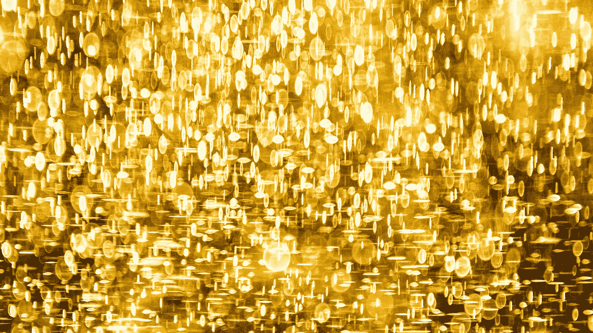
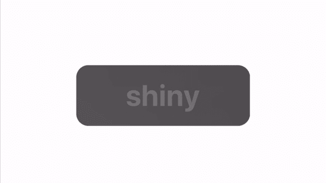

# SwiftUI 闪亮登场

> 原文：<https://betterprogramming.pub/introducing-shiny-for-swiftui-7fe4567af77>

## 通过在视图中添加一个单词，提供有趣的用户体验

卢卡斯·本杰明在 [Unsplash](https://unsplash.com?utm_source=medium&utm_medium=referral) 上的照片。

今天，我很兴奋地分享我最新的 SwiftUI 包:[闪亮](https://github.com/maustinstar/shiny)。

# 闪亮登场

只需一句话，你就可以为你的应用添加有意义的运动效果。

Shiny 使用您的 iOS 设备的陀螺仪来模拟颜色上的灯光和运动效果。它几乎适用于所有本地 SwiftUI 视图。

受苹果现金卡的启发，Shiny 让您快速建立有趣的用户体验。晃动你的 iPhone 来查看闪亮的效果，如彩虹、彩虹色、哑光、光泽等等！

# 闪亮入门

 [## 紫色/闪亮

### 将基于动作的纹理添加到 SwiftUI 视图中，通过吸引对重要界面元素的注意。闪亮()。闪亮的用途…

github.com](https://github.com/maustinstar/shiny) 

## 添加包

将 Swift 包添加到您的 Xcode 项目非常简单:文件> Swift 包>添加包依赖性。

然后，粘贴这个网址:[https://github.com/maustinstar/shiny](https://github.com/maustinstar/shiny)。

## 使用闪亮

入门只需要一个字:`.shiny()`。首先，给像`Text`、`Toggle`或`VStack`这样的视图添加`shiny`视图修改器。

闪亮的文字

Shiny 几乎适用于所有本地 SwiftUI 视图。

*注意:Shiny 需要一个陀螺仪来模拟灯光效果。Xcode 预览和模拟器没有陀螺仪，所以请在真实设备上测试您闪亮的视图。*

# 演示:光泽和哑光纹理

我最喜欢的纹理组合是哑光黑和亮泽黑。使用 Shiny 的各种渐变纹理，我们可以创建两个对模拟光有不同反应的黑色表面。

该卡为哑光黑色。这意味着模拟光源扩散到整个纹理。文字是有光泽的黑色，光源更强烈、更集中。

颜色组合(都基于黑色)看起来截然不同，因为它们对 iPhone 的运动反应不同。

是不是让你想起了苹果的太空灰？

哑光黑色卡片上的光滑黑色文本

有了 Shiny，添加自定义灯光效果真的很容易。函数`.matte()`和`.glossy()`从任何 UIColor 生成渐变，因此效果与您的原生调色板相匹配。

参见 GitHub 上的[更多示例。](https://github.com/maustinstar/shiny/blob/master/Docs/examples.md)

# 更多想法

使用 Shiny 只需要一个词就可以开始了。借助这些理念，快速将您的应用提升到新的水平:

*   一个闪亮的金色“升级”按钮，用于应用内购买
*   闪亮的彩虹条形图
*   耀眼的头衔
*   游戏的黑色加载屏幕上有一个光滑的黑色标志
*   内容背后微妙的哑光效果

发挥创造力，分享你闪亮的想法！

# 资源

*   GitHub 上闪亮:【https://github.com/maustinstar/shiny 
*   演示要点:

*   [更多例子](https://github.com/maustinstar/shiny/blob/master/Docs/examples.md)